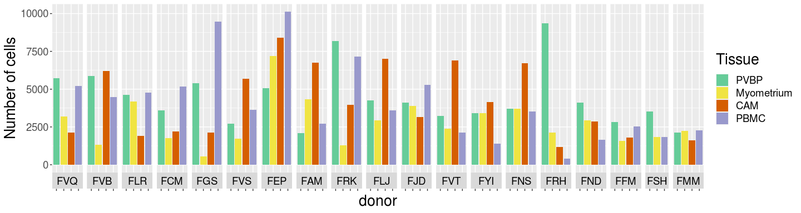
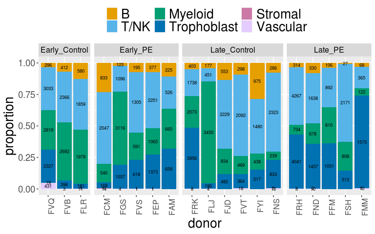
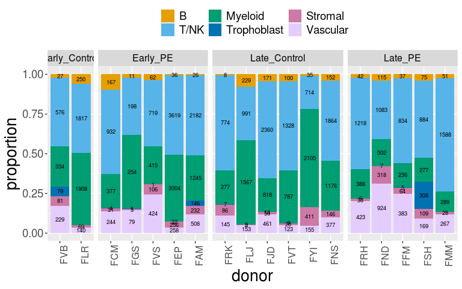
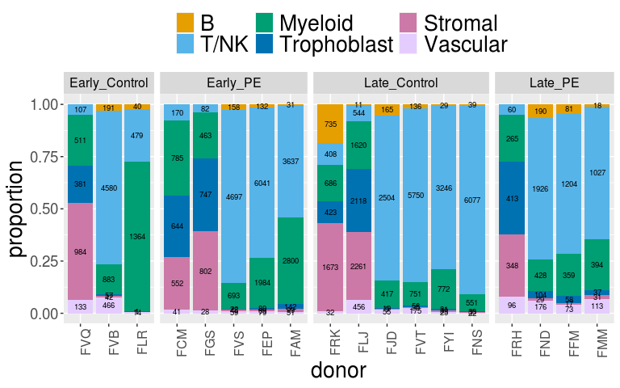
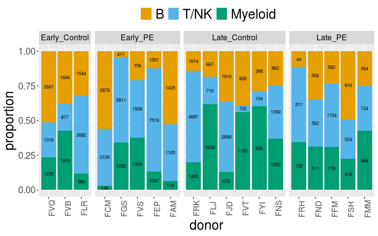

Single-cell FMI: Demographics - number of patients in early and late
================

Author: Yara E. Sanchez Corrales

# Introduction

Here I plot some of demographics for supplementary figure. This notebook
is based on the Rmd:
single-cell-annotation/sc-FMI-all-cellproportion-per-patient-v2.Rmd and
used to make the figure on demographics.

# Read the single-cell object

``` r
# Read the single cell
data.1 <- readRDS(file = "~/Projects/FMI-all-singlecell-20230308/outputs/objects/FMI-all-20patients-20240827.rds")
data.1
```

    ## An object of class Seurat 
    ## 36601 features across 292773 samples within 1 assay 
    ## Active assay: RNA (36601 features, 2000 variable features)
    ##  3 dimensional reductions calculated: pca, harmony, umap

``` r
unique(data.1@meta.data$Tissue)
```

    ## [1] "PVBP"       "CAM"        "PBMC"       "Myometrium"

``` r
unique(data.1@meta.data$CellTypeManual.l1)
```

    ## [1] "B"           "T/NK"        "Myeloid"     "Trophoblast" "Vascular"    "Stromal"

``` r
data <- data.1@meta.data
unique(data$CellTypeManual.l1)
```

    ## [1] "B"           "T/NK"        "Myeloid"     "Trophoblast" "Vascular"    "Stromal"

# Number of cells per patient

``` r
f1 <- data %>% group_by(origin) %>%
  summarise(n = n()) %>%
  ungroup() 

f1 <- f1 %>% separate(origin, c('donor', 'Tissue')) 
f1 <- f1 %>% inner_join(donor.order.condition)
```

    ## Joining, by = "donor"

``` r
# change order of patient
f1$donor <- factor(f1$donor, levels = donor.order.condition$donor)

# change the name of the donor, to make it annomymised
f1$donor2 <- paste0("F", str_sub(f1$donor, start= -2))
f1$donor2 <- factor(f1$donor2, levels = paste0("F", str_sub(donor.order.condition$donor, start= -2)))
f1$donor_Tisue <- paste0(f1$donor,"_", f1$Tissue)
f1$donor_Tisue <- factor(f1$donor_Tisue, levels = donor.order.tissue, ordered = TRUE)

# change the name of the placenta and order the tissues
f1$Tissue <- ifelse(f1$Tissue == "Placenta","PVBP", f1$Tissue)
f1$Tissue <- factor(f1$Tissue, levels = tissue.order, ordered = TRUE)
```

``` r
p1 <- f1 %>% ggplot(aes(x=donor_Tisue, y=n, fill=Tissue)) +
  geom_col() + 
  scale_fill_manual(values = colours_tissue) +
  labs(y = "Number of cells", x = "donor")  + 
  facet_grid(. ~ donor2, switch = "x"  , scales = "free",space = "free") +
  theme(
    axis.text.x = element_text(angle = 90, size = 0),
    axis.text.y = element_text(size = 14),
    legend.text = element_text(size = 14),
    legend.title = element_text(size = 20),
    axis.title.x = element_text(size = 20),
    axis.title.y = element_text(size = 20),
    strip.text = element_text(size = 14, color = "black"))

p1
```

<!-- -->

``` r
# ggsave(p1, filename = paste0(dir,"barplot-cellnumber-per_patient_20240830.png"),  width=15,height=4, bg = "white", units = 'in', dpi = 300)
```

# Proportions per patients at level 1 (new colours and facets)

``` r
# Function to make a barplot

df_cellgroup_donor <- function(tissue, metadata) {
  
a1 <- metadata %>% 
  filter(Tissue == tissue) %>% 
  group_by(donor,CellTypeManual.l1) %>%
  summarise(n = n()) %>%
  mutate(proportion = n / sum(n)) %>%
  ungroup() 


a1 <- a1 %>% inner_join(donor.order.condition)
a1$donor = factor(a1$donor, levels = donor.order, ordered = TRUE)
a1$CellTypeManual.l1 = factor(a1$CellTypeManual.l1, levels = celltype.order.l1, ordered = TRUE)

("debug")
print(unique(a1$CellTypeManual.l1))
# # change the name of the donor, to make it annomymised
a1$donor2 <- paste0("F", str_sub(a1$donor, start= -2))
a1$donor2 <- factor(a1$donor2,levels = paste0("F", str_sub(donor.order, start= -2)) )

return(a1)
}

df_cellgroup_condition <- function(tissue, metadata) {
  
a1 <- metadata %>% 
  filter(Tissue == tissue) %>% 
  group_by(GA_Condition,CellTypeManual.l1) %>%
  summarise(n = n()) %>%
  mutate(proportion = n / sum(n)) %>%
  ungroup() 


# a1 <- a1 %>% inner_join(donor.order.condition)
# a1$donor = factor(a1$donor, levels = donor.order, ordered = TRUE)
a1$CellTypeManual.l1 = factor(a1$CellTypeManual.l1, levels = celltype.order.l1, ordered = TRUE)
a1$Tissue <- tissue


return(a1)
}
```

# Placenta

``` r
tissue = "PVBP"
donor_placenta <- df_cellgroup_donor(tissue, data)
```

    ## `summarise()` has grouped output by 'donor'. You can override using the `.groups` argument.
    ## Joining, by = "donor"

    ## [1] B           Myeloid     T/NK        Trophoblast Vascular    Stromal    
    ## Levels: B < T/NK < Myeloid < Trophoblast < Stromal < Vascular

``` r
donor_placenta$Tissue <- "PVBP"
```

``` r
b1 <- donor_placenta %>% ggplot(aes(x=donor2, y=proportion, fill=CellTypeManual.l1)) +
  geom_col() + 
   scale_fill_manual(values = colors_cellgroups) +
  geom_text(aes(label = n), position = position_stack(vjust = 0.5),size=2.5)  + 
   facet_grid(. ~ condition, scales = "free",space = "free") + 
  theme(
    axis.text.x = element_text(angle = 90, size = 12),
    axis.text.y = element_text(size = 14),
    axis.title.x = element_text(size = 20),
    axis.title.y = element_text(size = 20),
    strip.text = element_text(size = 12, color = "black"),
    legend.position = "top",
    legend.text = element_text(size = 20),
    legend.title= element_blank()) +
labs(y = "proportion", x = "donor")  


b1
```

<!-- -->

``` r
# ggsave(paste0(dir,"barplot-celltype-proportion_per_patient_", tissue ,"_20240830.png"), b1, width=8,height=5, bg = "white",  units = 'in', dpi = 300)
```

# Myometrium

``` r
tissue = "Myometrium"
donor_myo <- df_cellgroup_donor(tissue, data)
```

    ## `summarise()` has grouped output by 'donor'. You can override using the `.groups` argument.
    ## Joining, by = "donor"

    ## [1] B           Myeloid     Stromal     T/NK        Trophoblast Vascular   
    ## Levels: B < T/NK < Myeloid < Trophoblast < Stromal < Vascular

``` r
donor_myo$Tissue <- "Myometrium"
```

``` r
c1 <- donor_myo  %>% ggplot(aes(x=donor2, y=proportion, fill=CellTypeManual.l1)) +
  geom_col() + 
   scale_fill_manual(values = colors_cellgroups) +
  geom_text(aes(label = n), position = position_stack(vjust = 0.5),size=2.5)  + 
   facet_grid(. ~ condition, scales = "free",space = "free") + 
  theme(
    axis.text.x = element_text(angle = 90, size = 12),
    axis.text.y = element_text(size = 14),
    axis.title.x = element_text(size = 20),
    axis.title.y = element_text(size = 20),
    strip.text = element_text(size = 12, color = "black"),
    legend.position = "top",
    legend.text = element_text(size = 14),
    legend.title= element_blank()) +
labs(y = "proportion", x = "donor")  

c1
```

<!-- -->

``` r
# ggsave(paste0(dir,"barplot-celltype-proportion_per_patient_", tissue ,"_20240830.png"), c1, width=8,height=5, bg = "white",  units = 'in', dpi = 300)
```

# CAM

``` r
tissue = "CAM"
donor_cam <- df_cellgroup_donor(tissue, data)
```

    ## `summarise()` has grouped output by 'donor'. You can override using the `.groups` argument.
    ## Joining, by = "donor"

    ## [1] B           Myeloid     Stromal     T/NK        Trophoblast Vascular   
    ## Levels: B < T/NK < Myeloid < Trophoblast < Stromal < Vascular

``` r
donor_cam$Tissue <- "CAM"
```

``` r
d1 <- donor_cam  %>% ggplot(aes(x=donor2, y=proportion, fill=CellTypeManual.l1)) +
  geom_col() + 
   scale_fill_manual(values = colors_cellgroups) +
  geom_text(aes(label = n), position = position_stack(vjust = 0.5),size=2.5)  + 
   facet_grid(. ~ condition, scales = "free",space = "free") + 
  theme(
    axis.text.x = element_text(angle = 90, size = 12),
    axis.text.y = element_text(size = 14),
    axis.title.x = element_text(size = 20),
    axis.title.y = element_text(size = 20),
    strip.text = element_text(size = 12, color = "black"),
    legend.position = "top",
    legend.text = element_text(size = 20),
    legend.title= element_blank()) +
labs(y = "proportion", x = "donor")  

d1
```

<!-- -->

``` r
# ggsave(paste0(dir,"barplot-celltype-proportion_per_patient_", tissue ,"_20240830.png"), d1, width=8,height=5, bg = "white",  units = 'in', dpi = 300)
```

# PBMC

``` r
tissue = "PBMC"
donor_pbmc <- df_cellgroup_donor(tissue, data)
```

    ## `summarise()` has grouped output by 'donor'. You can override using the `.groups` argument.
    ## Joining, by = "donor"

    ## [1] B       Myeloid T/NK   
    ## Levels: B < T/NK < Myeloid < Trophoblast < Stromal < Vascular

``` r
donor_pbmc$Tissue <- "PBMC"
```

``` r
e1 <- donor_pbmc  %>% ggplot(aes(x=donor2, y=proportion, fill=CellTypeManual.l1)) +
  geom_col() + 
   scale_fill_manual(values = colors_cellgroups) +
  geom_text(aes(label = n), position = position_stack(vjust = 0.5),size=2.5)  + 
   facet_grid(. ~ condition, scales = "free",space = "free") + 
  theme(
    axis.text.x = element_text(angle = 90, size = 12),
    axis.text.y = element_text(size = 14),
    axis.title.x = element_text(size = 20),
    axis.title.y = element_text(size = 20),
    strip.text = element_text(size = 12, color = "black"),
    legend.position = "top",
    legend.text = element_text(size = 20),
    legend.title= element_blank()) +
labs(y = "proportion", x = "donor")  

e1
```

<!-- -->

``` r
# ggsave(paste0(dir,"barplot-celltype-proportion_per_patient_", tissue ,"_20240830.png"), e1, width=8,height=5, bg = "white",  units = 'in', dpi = 300)
```

# All tissues per condition

``` r
# concatenate the data
con_placenta <- df_cellgroup_condition("PVBP", data)
```

    ## `summarise()` has grouped output by 'GA_Condition'. You can override using the `.groups` argument.

``` r
con_myo <- df_cellgroup_condition("Myometrium", data)
```

    ## `summarise()` has grouped output by 'GA_Condition'. You can override using the `.groups` argument.

``` r
con_cam <- df_cellgroup_condition("CAM", data)
```

    ## `summarise()` has grouped output by 'GA_Condition'. You can override using the `.groups` argument.

``` r
con_pbmc <- df_cellgroup_condition("PBMC", data)
```

    ## `summarise()` has grouped output by 'GA_Condition'. You can override using the `.groups` argument.

``` r
sampling <- rbind(con_placenta, con_myo, con_cam, con_pbmc)

sampling$Tissue = factor(sampling$Tissue, levels = tissue.order, ordered = TRUE)
head(sampling)
```

    ## # A tibble: 6 × 5
    ##   GA_Condition  CellTypeManual.l1     n proportion Tissue
    ##   <chr>         <ord>             <int>      <dbl> <ord> 
    ## 1 Early_Control B                  1641   0.0754   PVBP  
    ## 2 Early_Control Myeloid            8168   0.375    PVBP  
    ## 3 Early_Control Stromal              20   0.000919 PVBP  
    ## 4 Early_Control T/NK               8454   0.388    PVBP  
    ## 5 Early_Control Trophoblast        3012   0.138    PVBP  
    ## 6 Early_Control Vascular            478   0.0220   PVBP

``` r
plot <-sampling %>% ggplot(aes(x=GA_Condition, y=proportion, fill=CellTypeManual.l1)) +
  geom_col() + 

   scale_fill_manual(values = colors_cellgroups) +
  theme(
     panel.background = element_blank(),
    axis.text.x = element_text(angle = 90, size = 12),
    axis.text.y = element_text(size = 14),
    axis.title.x = element_text(size = 20),
    axis.title.y = element_text(size = 20),
    strip.text = element_text(size = 12, color = "black"),
    legend.position = "top",
    legend.text = element_text(size = 22),
    legend.title= element_blank()) + NoLegend() +
  scale_x_discrete(labels=c("Early_Control" = "Early Control", "Early_PE" = "Early PE",
                            "Late_Control" = "Late Control", "Late_PE" = "Late PE")) +
    facet_wrap(.~ Tissue, scales = "free_x", ncol = 4) + # Facet by tissue 
labs(y = "proportion", x = "condition")  + guides(fill = guide_legend(nrow = 1)) +
    theme(strip.background =element_rect(fill="white"))


# ggsave(paste0(dir,"sampling_cellgroup_per_condition_barplots_20250225.png"), plot, width=8,height=5, bg = "white",  units = 'in', dpi = 300)
plot
```

<!-- -->

``` r
sessionInfo()
```

    ## R version 4.1.1 (2021-08-10)
    ## Platform: x86_64-pc-linux-gnu (64-bit)
    ## Running under: Red Hat Enterprise Linux Server 7.6 (Maipo)
    ## 
    ## Matrix products: default
    ## BLAS:   /apps/R/4.1.1/lib64/R/lib/libRblas.so
    ## LAPACK: /apps/R/4.1.1/lib64/R/lib/libRlapack.so
    ## 
    ## locale:
    ##  [1] LC_CTYPE=en_US.UTF-8       LC_NUMERIC=C               LC_TIME=en_US.UTF-8        LC_COLLATE=en_US.UTF-8     LC_MONETARY=en_US.UTF-8    LC_MESSAGES=en_US.UTF-8    LC_PAPER=en_US.UTF-8      
    ##  [8] LC_NAME=C                  LC_ADDRESS=C               LC_TELEPHONE=C             LC_MEASUREMENT=en_US.UTF-8 LC_IDENTIFICATION=C       
    ## 
    ## attached base packages:
    ## [1] stats     graphics  grDevices utils     datasets  methods   base     
    ## 
    ## other attached packages:
    ##  [1] ggpubr_0.4.0       tidyr_1.1.4        stringr_1.4.0      cowplot_1.1.1      harmony_0.1.0      Rcpp_1.0.8         ggplot2_3.3.5      SeuratObject_4.1.3 Seurat_4.2.1       dplyr_1.0.7       
    ## 
    ## loaded via a namespace (and not attached):
    ##   [1] Rtsne_0.15             colorspace_2.0-2       ggsignif_0.6.3         deldir_1.0-6           ellipsis_0.3.2         ggridges_0.5.3         rstudioapi_0.13        spatstat.data_3.0-0   
    ##   [9] farver_2.1.0           leiden_0.3.9           listenv_0.8.0          ggrepel_0.9.1          fansi_1.0.2            codetools_0.2-18       splines_4.1.1          knitr_1.45            
    ##  [17] polyclip_1.10-0        jsonlite_1.7.3         broom_0.7.11           ica_1.0-2              cluster_2.1.2          png_0.1-7              uwot_0.1.14            shiny_1.7.1           
    ##  [25] sctransform_0.3.5      spatstat.sparse_3.0-0  compiler_4.1.1         httr_1.4.2             backports_1.4.1        assertthat_0.2.1       Matrix_1.5-4.1         fastmap_1.1.1         
    ##  [33] lazyeval_0.2.2         cli_3.6.1              later_1.3.0            htmltools_0.5.8.1      tools_4.1.1            igraph_1.2.11          gtable_0.3.0           glue_1.6.1            
    ##  [41] RANN_2.6.1             reshape2_1.4.4         carData_3.0-5          scattermore_0.7        vctrs_0.6.5            spatstat.explore_3.0-5 nlme_3.1-155           progressr_0.10.0      
    ##  [49] lmtest_0.9-39          spatstat.random_3.0-1  xfun_0.41              globals_0.14.0         mime_0.12              miniUI_0.1.1.1         lifecycle_1.0.4        irlba_2.3.5           
    ##  [57] rstatix_0.7.0          goftest_1.2-3          future_1.23.0          MASS_7.3-55            zoo_1.8-9              scales_1.1.1           promises_1.2.0.1       spatstat.utils_3.0-1  
    ##  [65] parallel_4.1.1         RColorBrewer_1.1-2     yaml_2.2.2             reticulate_1.24        pbapply_1.5-0          gridExtra_2.3          stringi_1.7.6          highr_0.9             
    ##  [73] rlang_1.1.1            pkgconfig_2.0.3        matrixStats_0.61.0     evaluate_0.23          lattice_0.20-45        ROCR_1.0-11            purrr_1.0.2            tensor_1.5            
    ##  [81] labeling_0.4.2         patchwork_1.1.1        htmlwidgets_1.5.4      tidyselect_1.1.1       parallelly_1.30.0      RcppAnnoy_0.0.19       plyr_1.8.6             magrittr_2.0.1        
    ##  [89] R6_2.5.1               generics_0.1.1         DBI_1.1.2              pillar_1.6.5           withr_2.5.0            fitdistrplus_1.1-6     survival_3.2-13        abind_1.4-5           
    ##  [97] sp_1.5-1               tibble_3.1.6           future.apply_1.8.1     car_3.0-12             crayon_1.4.2           KernSmooth_2.23-20     utf8_1.2.2             spatstat.geom_3.0-3   
    ## [105] plotly_4.10.0          rmarkdown_2.25         grid_4.1.1             data.table_1.14.2      digest_0.6.29          xtable_1.8-4           httpuv_1.6.5           munsell_0.5.0         
    ## [113] viridisLite_0.4.0
