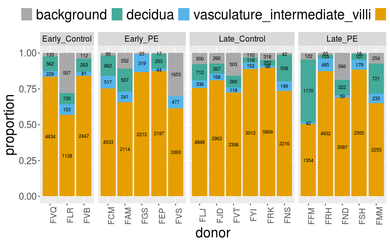
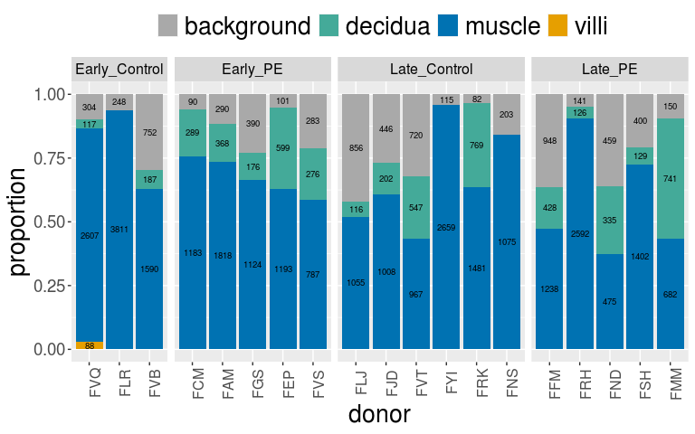
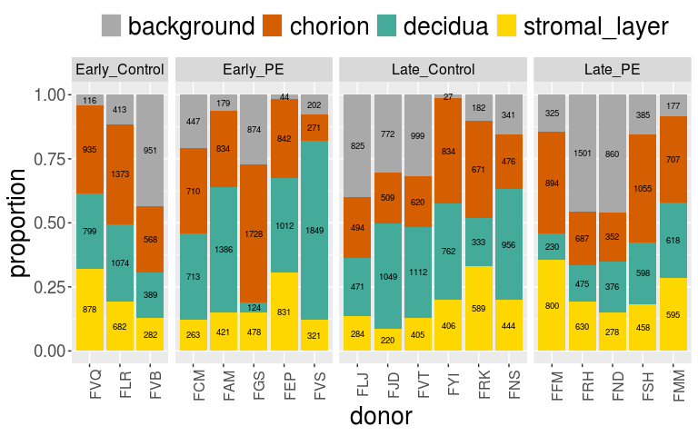

Spatial transcriptomics: number of spots per spatial domain per donor
================

Author: Yara E. Sanchez Corrales

# Introduction

We have annotated regions manually. Here I am plotting the number of
spots per region for Supplementary figure.

`scripts/spatial\_QC/spatial-number-of-spots-region-all-tissues-for-figure.Rmd`

# Load libraries and object

``` r
# Call the function to create a dataframe
df_placenta <- df_cellgroup_donor("PVBP",spatial.placenta@meta.data) 
```

    ## `summarise()` has grouped output by 'donor2'. You can override using the `.groups` argument.
    ## Joining, by = "donor2"

``` r
df_myo <- df_cellgroup_donor("Myometrium",spatial.myo@meta.data) 
```

    ## `summarise()` has grouped output by 'donor2'. You can override using the `.groups` argument.
    ## Joining, by = "donor2"

``` r
df_cam <- df_cellgroup_donor("CAM",spatial.cam@meta.data) 
```

    ## `summarise()` has grouped output by 'donor2'. You can override using the `.groups` argument.
    ## Joining, by = "donor2"

``` r
# Placenta
tissue = "PVBP"
p1 <- barplot_cellgroup_proportions("PVBP",df_placenta)
p1
```

<!-- -->

``` r
# ggsave(paste0(dirsave,tissue,"_number-of-spots_spatial_domain_20250226.png"), p1, width=8,height=5, bg = "white",  units = 'in', dpi = 300)
```

``` r
tissue <- "Myometrium"

p2 <- barplot_cellgroup_proportions("Myometrium",df_myo)
p2
```

<!-- -->

``` r
# ggsave(paste0(dirsave,tissue,"_number-of-spots_spatial_domain_20250226.png"), p2, width=8,height=5, bg = "white",  units = 'in', dpi = 300)
```

``` r
tissue <- "CAM"

p3 <- barplot_cellgroup_proportions("CAM",df_cam)
p3
```

<!-- -->

``` r
# ggsave(paste0(dirsave,tissue,"_number-of-spots_spatial_domain_20250226.png"), p3, width=8,height=5, bg = "white",  units = 'in', dpi = 300)
```

``` r
sessionInfo()
```

    ## R version 4.1.1 (2021-08-10)
    ## Platform: x86_64-pc-linux-gnu (64-bit)
    ## Running under: Red Hat Enterprise Linux Server 7.6 (Maipo)
    ## 
    ## Matrix products: default
    ## BLAS:   /apps/R/4.1.1/lib64/R/lib/libRblas.so
    ## LAPACK: /apps/R/4.1.1/lib64/R/lib/libRlapack.so
    ## 
    ## locale:
    ##  [1] LC_CTYPE=en_US.UTF-8       LC_NUMERIC=C               LC_TIME=en_US.UTF-8        LC_COLLATE=en_US.UTF-8     LC_MONETARY=en_US.UTF-8    LC_MESSAGES=en_US.UTF-8   
    ##  [7] LC_PAPER=en_US.UTF-8       LC_NAME=C                  LC_ADDRESS=C               LC_TELEPHONE=C             LC_MEASUREMENT=en_US.UTF-8 LC_IDENTIFICATION=C       
    ## 
    ## attached base packages:
    ## [1] stats     graphics  grDevices utils     datasets  methods   base     
    ## 
    ## other attached packages:
    ##  [1] forcats_0.5.1      stringr_1.4.0      purrr_1.0.2        readr_2.1.1        tidyr_1.1.4        tibble_3.1.6       tidyverse_1.3.1    ggExtra_0.10.0     ggplot2_3.3.5     
    ## [10] knitr_1.45         patchwork_1.1.1    SeuratObject_4.1.3 Seurat_4.2.1       dplyr_1.0.7        Matrix_1.5-4.1    
    ## 
    ## loaded via a namespace (and not attached):
    ##   [1] Rtsne_0.15             colorspace_2.0-2       deldir_1.0-6           ellipsis_0.3.2         ggridges_0.5.3         fs_1.5.2               rstudioapi_0.13       
    ##   [8] spatstat.data_3.0-0    farver_2.1.0           leiden_0.3.9           listenv_0.8.0          ggrepel_0.9.1          lubridate_1.8.0        fansi_1.0.2           
    ##  [15] xml2_1.3.3             codetools_0.2-18       splines_4.1.1          polyclip_1.10-0        jsonlite_1.7.3         broom_0.7.11           ica_1.0-2             
    ##  [22] dbplyr_2.1.1           cluster_2.1.2          png_0.1-7              uwot_0.1.14            shiny_1.7.1            sctransform_0.3.5      spatstat.sparse_3.0-0 
    ##  [29] compiler_4.1.1         httr_1.4.2             backports_1.4.1        assertthat_0.2.1       fastmap_1.1.1          lazyeval_0.2.2         cli_3.6.1             
    ##  [36] later_1.3.0            htmltools_0.5.8.1      tools_4.1.1            igraph_1.2.11          gtable_0.3.0           glue_1.6.1             RANN_2.6.1            
    ##  [43] reshape2_1.4.4         Rcpp_1.0.8             scattermore_0.7        cellranger_1.1.0       vctrs_0.6.5            spatstat.explore_3.0-5 nlme_3.1-155          
    ##  [50] progressr_0.10.0       lmtest_0.9-39          spatstat.random_3.0-1  xfun_0.41              globals_0.14.0         rvest_1.0.2            mime_0.12             
    ##  [57] miniUI_0.1.1.1         lifecycle_1.0.4        irlba_2.3.5            goftest_1.2-3          future_1.23.0          MASS_7.3-55            zoo_1.8-9             
    ##  [64] scales_1.1.1           hms_1.1.1              promises_1.2.0.1       spatstat.utils_3.0-1   parallel_4.1.1         RColorBrewer_1.1-2     yaml_2.2.2            
    ##  [71] reticulate_1.24        pbapply_1.5-0          gridExtra_2.3          stringi_1.7.6          highr_0.9              rlang_1.1.1            pkgconfig_2.0.3       
    ##  [78] matrixStats_0.61.0     evaluate_0.23          lattice_0.20-45        ROCR_1.0-11            tensor_1.5             labeling_0.4.2         htmlwidgets_1.5.4     
    ##  [85] cowplot_1.1.1          tidyselect_1.1.1       parallelly_1.30.0      RcppAnnoy_0.0.19       plyr_1.8.6             magrittr_2.0.1         R6_2.5.1              
    ##  [92] generics_0.1.1         DBI_1.1.2              haven_2.4.3            withr_2.5.0            pillar_1.6.5           fitdistrplus_1.1-6     survival_3.2-13       
    ##  [99] abind_1.4-5            sp_1.5-1               future.apply_1.8.1     modelr_0.1.8           crayon_1.4.2           KernSmooth_2.23-20     utf8_1.2.2            
    ## [106] spatstat.geom_3.0-3    plotly_4.10.0          tzdb_0.2.0             rmarkdown_2.25         readxl_1.3.1           grid_4.1.1             data.table_1.14.2     
    ## [113] reprex_2.0.1           digest_0.6.29          xtable_1.8-4           httpuv_1.6.5           munsell_0.5.0          viridisLite_0.4.0
