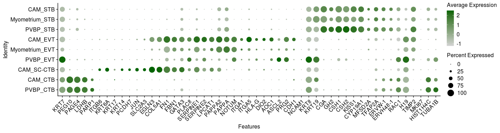
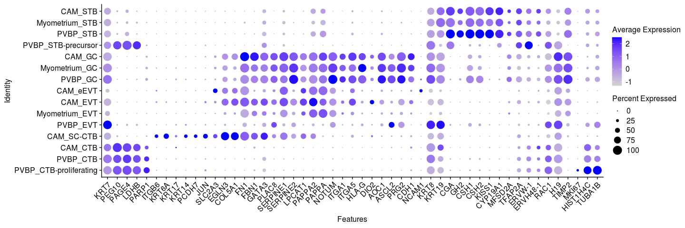
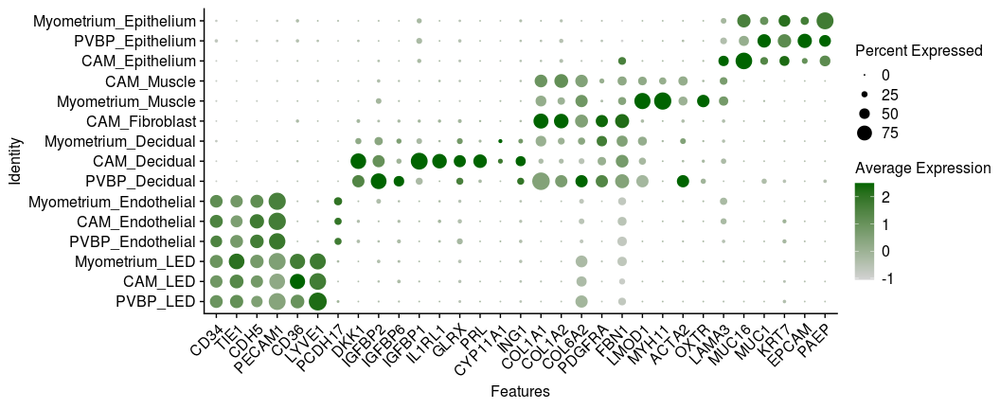
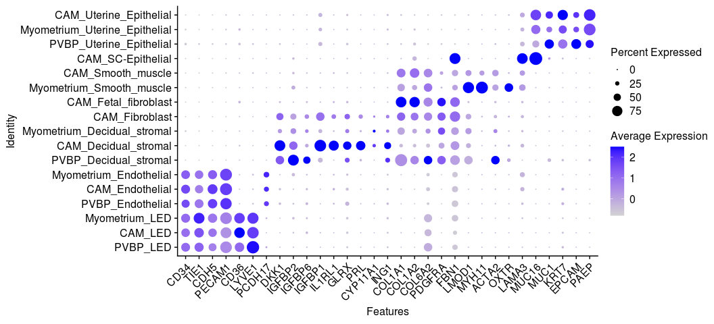
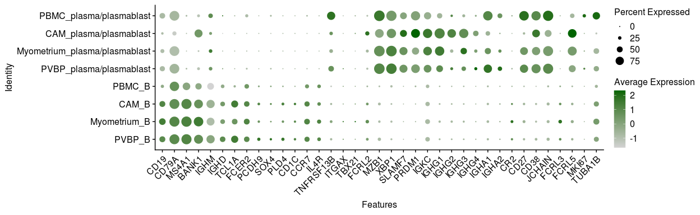
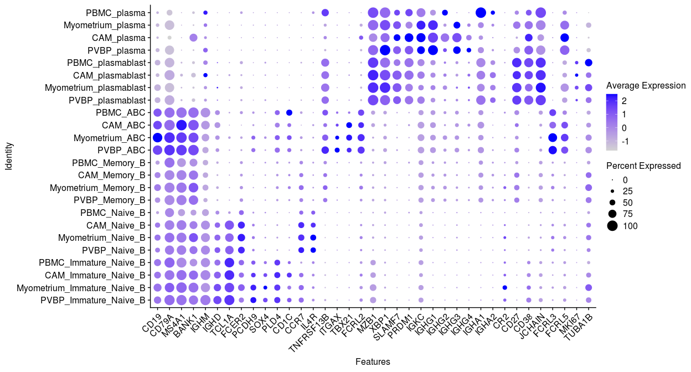
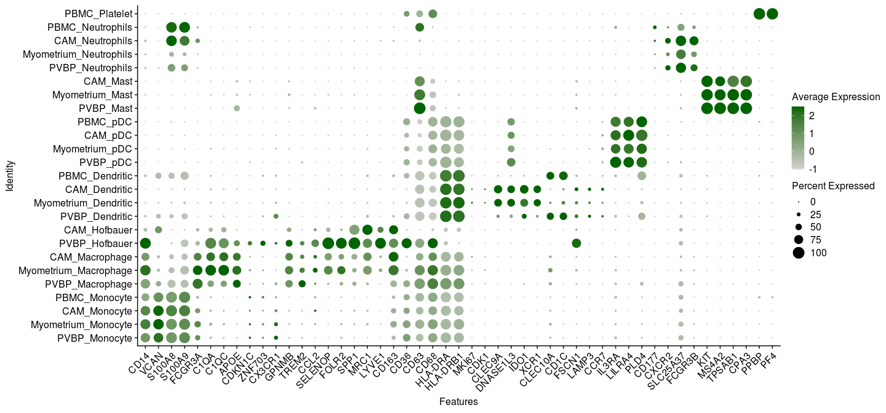
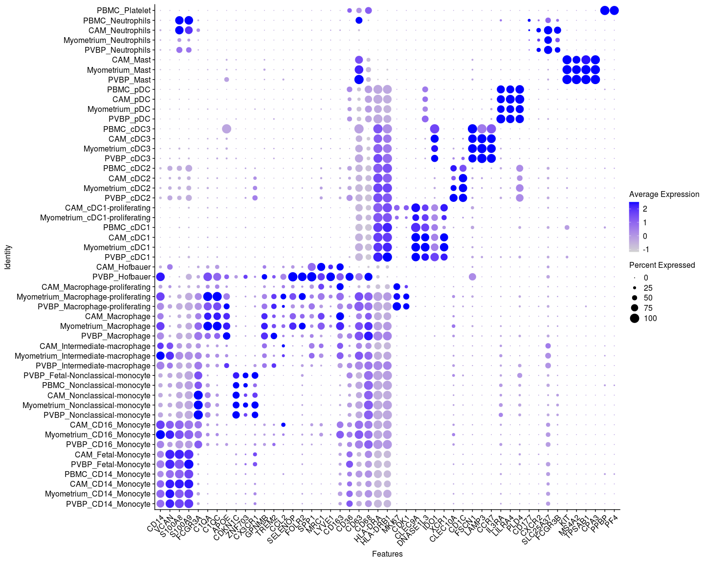
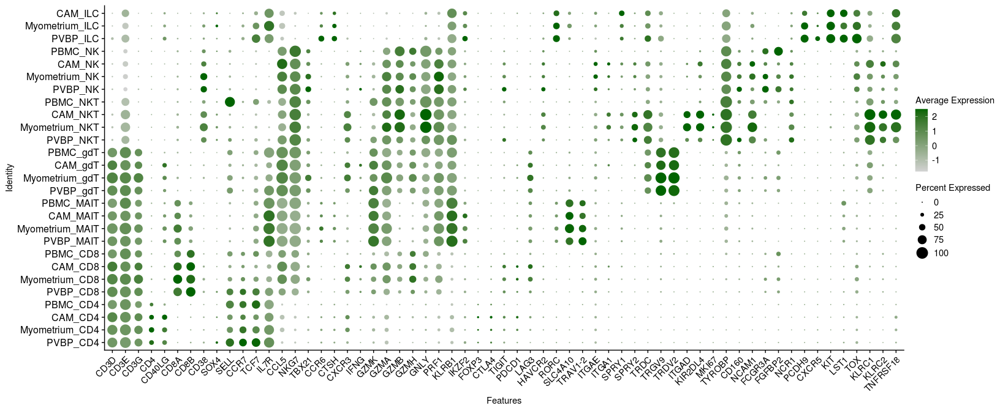
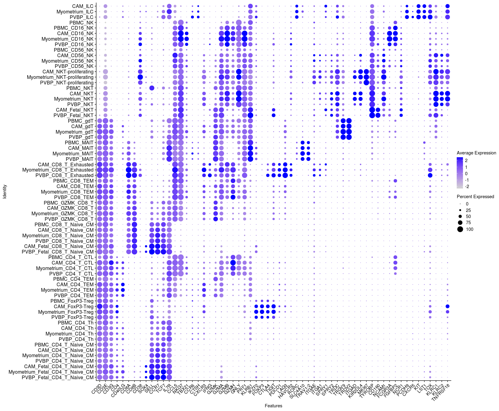

Single-cell FMI: all cells - dotplots
================

Author: Yara E. Sanchez-Corrales

# Introduction

Update on annotations at single cell level (August 2024). Here I make
Dotplots at annotation level 2 and 3 per tissue for the supplementary
figure.

# Read the single-cell object

``` r
# Read the single cell
data.1 <- readRDS(file = "~/Projects/FMI-all-singlecell-20230308/outputs/objects/FMI-all-20patients-20240827.rds")
data.1
```

    ## An object of class Seurat 
    ## 36601 features across 292773 samples within 1 assay 
    ## Active assay: RNA (36601 features, 2000 variable features)
    ##  3 dimensional reductions calculated: pca, harmony, umap

``` r
unique(data.1@meta.data$Tissue)
```

    ## [1] "PVBP"       "CAM"        "PBMC"       "Myometrium"

``` r
unique(data.1@meta.data$CellTypeManual.l1)
```

    ## [1] "B"           "T/NK"        "Myeloid"     "Trophoblast" "Vascular"    "Stromal"

# Dotplots per cell group

``` r
table(data.1@meta.data$CellTypeManual.l1)
```

    ## 
    ##           B     Myeloid     Stromal        T/NK Trophoblast    Vascular 
    ##       31627       78415        9129      137610       27803        8189

# Markers for for cell type annotation (dotplots)

``` r
# TROPHOBLAST
# Figure for paper - revised October 2023 - 52 markers
alltropho2 <- c("KRT7","PEG10","PAGE4","LDHB","PARP1","ITGB6","KRT6A","KRT17","KRT14","PCDH7","JUN","SLC2A3","EGLN3","COL5A1","FN1","FBN1","GATA3","PLAC8","SERPINE1","SERPINE2","LPCAT1","PAPPA2","PAPPA","NOTUM","ITGA1", "ITGA5","HLA-G","DIO2","AOC1","ASCL2","PRG1","PRG2","CDH1","NCAM1","KRT8","KRT19","CGA", "GH2","CSH1","CSH2","KISS1","CYP19A1","MFSD2A","TFAP2A","ERVW-1","ERVH48-1","RAC1","H19","TIMP2","MKI67","HIST1H4C","TUBA1B")

# STROMAL - 32 markers
allstromal4 <-c("CD31", "CD34", "TIE1","CDH5","PECAM1","CD36", "LYVE1","PCDH17","DKK1","IGFBP2","IGFBP6","IGFBP1","IL1RL1","GLRX","PRL","CYP11A1","ING1","COL1A1","COL1A2", "COL6A2","PDGFRA","FBN1","LMOD1","MYH11","ACTA2","OXTR","LAMA3","MUC16","MUC1","KRT7","EPCAM","PAEP")


# BCELLS - 37 markers
Bcellspaper2 <- c("CD19","CD79A","MS4A1","BANK1", "IGHM","IGHD","TCL1A","FCER2","PCDH9","SOX4","PLD4","CD1C","CCR7","IL4R","TNFRSF13B","ITGAX","TBX21","FCRL2","MZB1","XBP1","SLAMF7","PRDM1", "IGKC","IGHG1","IGHG2","IGHG3","IGHG4","IGHA1","IGHA2","CR2","CD27","CD38","JCHAIN","FCRL3","FCRL5","MKI67","TUBA1B")

# MYELOID - 49 markers
myeloidpaper2 <-c("CD14","VCAN","S100A8","S100A9","FCGR3A","C1QA","C1QC","APOE","CDKN1C","ZNF703","CX3CR1","GPNMB","TREM2","CCL2","SELENOP","FOLR2","SPP1","MRC1","LYVE1","CD163","CD36","CD63","CD68","HLA-DRA","HLA-DRB1","MKI67","CDK1","CLEC9A","DNASE1L3","IDO1","XCR1","CLEC10A","CD1C","FSCN1","LAMP3","CCR7","IL3RA", "LILRA4","PLD4","CD177","CXCR2","SLC25A37","FCGR3B","KIT","MS4A2","TPSAB1","CPA3","PPBP","PF4")

# T & NK CELLS - 63 markers
# For paper, ordered as: CD4, CD8, Mait, gamma-delta,NK
lymphoidpaper4 <- c("CD3D","CD3E","CD3G","CD4","CD40LG","CD8A","CD8B","CD38","SOX4", "SELL","CCR7","TCF7","IL7R","CCL5","NKG7","TBX21","CCR6","CTSH","CXCR3","IFNG","GZMK","GZMA","GZMB","GZMH","GNLY","PRF1","KLRB1","IKZF2","FOXP3","CTLA4","TIGIT","PDCD1","LAG3","HAVCR2","RORC","SLC4A10","TRAV1-2","CXC3CR1","ITGAE","ITGA1","SPRY1","SPRY2","TRDC","TRGV9", "TRDV2","ITGAD","KIR2DL4","MKI67","TYROBP","CD160","NCAM1","FCGR3A","FGFBP2","NCR1","PCDH9","CXCR5","KIT","LST1","TOX","TIGID","KLRC1","KLRC2","TNFRSF18")
```

## TROPHOBLAST

``` r
# subset the trophoblast
tropho <- subset(data.1, subset = CellTypeManual.l1 %in% "Trophoblast")
tropho
```

    ## An object of class Seurat 
    ## 36601 features across 27803 samples within 1 assay 
    ## Active assay: RNA (36601 features, 2000 variable features)
    ##  3 dimensional reductions calculated: pca, harmony, umap

``` r
table(tropho@meta.data$CellTypeManual.l2, tropho@meta.data$CellTypeManual.l3)
```

    ##         
    ##            CTB CTB-proliferating  eEVT   EVT    GC SC-CTB   STB STB-precursor
    ##   CTB      962               323     0     0     0      0     0            52
    ##   EVT        0                 0    38  2026   486      0     0             0
    ##   SC-CTB     0                 0     0     0     0   3182     0             0
    ##   STB        0                 0     0     0     0      0 20734             0

``` r
table(tropho@meta.data$CellTypeManual.l2.Tissue, tropho@meta.data$Tissue)
```

    ##                 
    ##                    CAM Myometrium  PVBP
    ##   CAM_CTB           20          0     0
    ##   CAM_EVT         1707          0     0
    ##   CAM_SC-CTB      3182          0     0
    ##   CAM_STB          458          0     0
    ##   Myometrium_EVT     0        587     0
    ##   Myometrium_STB     0         24     0
    ##   PVBP_CTB           0          0  1317
    ##   PVBP_EVT           0          0   256
    ##   PVBP_STB           0          0 20252

``` r
Idents(tropho) <- "CellTypeManual.l2.Tissue"
levels(tropho) <- manual_labels.l2.Tissue.tropho

dp1 <- DotPlot(tropho, features = alltropho2, cols = c("lightgrey", "darkgreen")) +  RotatedAxis() + 
        theme(axis.text.x=element_text(angle=45, hjust=1, size=12),
        axis.title = element_text(size=12),
        axis.title.y.right = element_text(size = 08),
        legend.text=element_text(size=12),
        legend.title=element_text(size=12),
        axis.line = element_line(size=0.5))
```

    ## Warning in FetchData.Seurat(object = object, vars = features, cells = cells): The following requested variables were not found: PRG1

``` r
dp1
```

<!-- -->


``` r
table(tropho@meta.data$CellTypeManual.l3.Tissue, tropho@meta.data$Tissue)
```

    ##                         
    ##                            CAM Myometrium  PVBP
    ##   CAM_CTB                   20          0     0
    ##   CAM_eEVT                  38          0     0
    ##   CAM_EVT                 1259          0     0
    ##   CAM_GC                   410          0     0
    ##   CAM_SC-CTB              3182          0     0
    ##   CAM_STB                  458          0     0
    ##   Myometrium_EVT             0        541     0
    ##   Myometrium_GC              0         46     0
    ##   Myometrium_STB             0         24     0
    ##   PVBP_CTB                   0          0   942
    ##   PVBP_CTB-proliferating     0          0   323
    ##   PVBP_EVT                   0          0   226
    ##   PVBP_GC                    0          0    30
    ##   PVBP_STB                   0          0 20252
    ##   PVBP_STB-precursor         0          0    52

``` r
Idents(tropho) <- "CellTypeManual.l3.Tissue"
levels(tropho) <- manual_labels.l3.Tissue.tropho

dp2 <- DotPlot(tropho, features = alltropho2) +  RotatedAxis() + 
        theme(axis.text.x=element_text(angle=45, hjust=1, size=12),
        axis.title = element_text(size=12),
        axis.title.y.right = element_text(size = 08),
        legend.text=element_text(size=12),
        legend.title=element_text(size=12),
        axis.line = element_line(size=0.5))
```

    ## Warning in FetchData.Seurat(object = object, vars = features, cells = cells): The following requested variables were not found: PRG1

``` r
dp2
```

<!-- -->


## VASCULAR AND STROMAL

``` r
# subset the Stromal
stromal <- subset(data.1, subset = CellTypeManual.l1 %in% c("Stromal", "Vascular"))
stromal
```

    ## An object of class Seurat 
    ## 36601 features across 17318 samples within 1 assay 
    ## Active assay: RNA (36601 features, 2000 variable features)
    ##  3 dimensional reductions calculated: pca, harmony, umap

``` r
unique(stromal@meta.data$CellTypeManual.l3.Tissue)
```

    ##  [1] "PVBP_Endothelial"              "PVBP_LED"                      "PVBP_Decidual_stromal"         "Myometrium_Endothelial"       
    ##  [5] "Myometrium_LED"                "Myometrium_Uterine_Epithelial" "Myometrium_Decidual_stromal"   "PVBP_Uterine_Epithelial"      
    ##  [9] "Myometrium_Smooth_muscle"      "CAM_LED"                       "CAM_Uterine_Epithelial"        "CAM_Endothelial"              
    ## [13] "CAM_Smooth_muscle"             "CAM_Fetal_fibroblast"          "CAM_SC-Epithelial"             "CAM_Decidual_stromal"         
    ## [17] "CAM_Fibroblast"

``` r
table(stromal@meta.data$CellTypeManual.l2, stromal@meta.data$CellTypeManual.l3)
```

    ##              
    ##               Decidual_stromal Endothelial Fetal_fibroblast Fibroblast  LED SC-Epithelial Smooth_muscle Uterine_Epithelial
    ##   Decidual                1875           0                0          0    0             0             0                  0
    ##   Endothelial                0        2864                0          0    0             0             0                  0
    ##   Epithelium                 0           0                0          0    0           391             0               1616
    ##   Fibroblast                 0           0             3872        502    0             0             0                  0
    ##   LED                        0           0                0          0 5325             0             0                  0
    ##   Muscle                     0           0                0          0    0             0           873                  0

``` r
table(stromal@meta.data$CellTypeManual.l2.Tissue, stromal@meta.data$Tissue)
```

    ##                         
    ##                           CAM Myometrium PVBP
    ##   CAM_Decidual           1202          0    0
    ##   CAM_Endothelial        1233          0    0
    ##   CAM_Epithelium          977          0    0
    ##   CAM_Fibroblast         4374          0    0
    ##   CAM_LED                 874          0    0
    ##   CAM_Muscle              495          0    0
    ##   Myometrium_Decidual       0        663    0
    ##   Myometrium_Endothelial    0       1375    0
    ##   Myometrium_Epithelium     0       1009    0
    ##   Myometrium_LED            0       4136    0
    ##   Myometrium_Muscle         0        378    0
    ##   PVBP_Decidual             0          0   10
    ##   PVBP_Endothelial          0          0  256
    ##   PVBP_Epithelium           0          0   21
    ##   PVBP_LED                  0          0  315

``` r
Idents(stromal) <- "CellTypeManual.l2.Tissue"
levels(stromal) <- manual_labels.l2.Tissue.stromal 
dp3 <- DotPlot(stromal, features = allstromal4, cols = c("lightgrey", "darkgreen")) +  RotatedAxis() + 
        theme(axis.text.x=element_text(angle=45, hjust=1, size=12),
        axis.title = element_text(size=12),
        axis.title.y.right = element_text(size = 08),
        legend.text=element_text(size=12),
        legend.title=element_text(size=12),
        axis.line = element_line(size=0.5))
```

    ## Warning in FetchData.Seurat(object = object, vars = features, cells = cells): The following requested variables were not found: CD31

``` r
dp3
```

<!-- -->

``` r
# ggsave(paste0(dir, "Dotplot-FMI-20patients-manual_labels.l2.Tissue.stromal-20240828.png"), dp3, width=11,height=4.5, bg = "white")
```

``` r
table(stromal@meta.data$CellTypeManual.l3.Tissue, stromal@meta.data$Tissue)
```

    ##                                
    ##                                  CAM Myometrium PVBP
    ##   CAM_Decidual_stromal          1202          0    0
    ##   CAM_Endothelial               1233          0    0
    ##   CAM_Fetal_fibroblast          3872          0    0
    ##   CAM_Fibroblast                 502          0    0
    ##   CAM_LED                        874          0    0
    ##   CAM_SC-Epithelial              391          0    0
    ##   CAM_Smooth_muscle              495          0    0
    ##   CAM_Uterine_Epithelial         586          0    0
    ##   Myometrium_Decidual_stromal      0        663    0
    ##   Myometrium_Endothelial           0       1375    0
    ##   Myometrium_LED                   0       4136    0
    ##   Myometrium_Smooth_muscle         0        378    0
    ##   Myometrium_Uterine_Epithelial    0       1009    0
    ##   PVBP_Decidual_stromal            0          0   10
    ##   PVBP_Endothelial                 0          0  256
    ##   PVBP_LED                         0          0  315
    ##   PVBP_Uterine_Epithelial          0          0   21

``` r
Idents(stromal) <- "CellTypeManual.l3.Tissue"
levels(stromal) <- manual_labels.l3.Tissue.stromal
dp4 <- DotPlot(stromal, features = allstromal4) +  RotatedAxis() + 
        theme(axis.text.x=element_text(angle=45, hjust=1, size=12),
        axis.title = element_text(size=12),
        axis.title.y.right = element_text(size = 08),
        legend.text=element_text(size=12),
        legend.title=element_text(size=12),
        axis.line = element_line(size=0.5))
```

    ## Warning in FetchData.Seurat(object = object, vars = features, cells = cells): The following requested variables were not found: CD31

``` r
dp4
```

<!-- -->

``` r
# ggsave(paste0(dir, "Dotplot-FMI-20patients-manual_labels.l3.Tissue.stromal-20240828.png"), dp4, width=11,height=5, bg = "white")
```

## BCELLS

``` r
# subset the B
Bcells <- subset(data.1, subset = CellTypeManual.l1 %in% "B")
Bcells
```

    ## An object of class Seurat 
    ## 36601 features across 31627 samples within 1 assay 
    ## Active assay: RNA (36601 features, 2000 variable features)
    ##  3 dimensional reductions calculated: pca, harmony, umap

``` r
table(Bcells@meta.data$CellTypeManual.l2, Bcells@meta.data$CellTypeManual.l3)
```

    ##                     
    ##                        ABC Immature_Naive_B Memory_B Naive_B plasma plasmablast
    ##   B                    187             2266     6562   21112      0           0
    ##   plasma/plasmablast     0                0        0       0   1009         491

``` r
table(Bcells@meta.data$CellTypeManual.l2.Tissue, Bcells@meta.data$Tissue)
```

    ##                                
    ##                                   CAM Myometrium  PBMC  PVBP
    ##   CAM_B                          1172          0     0     0
    ##   CAM_plasma/plasmablast          788          0     0     0
    ##   Myometrium_B                      0       1512     0     0
    ##   Myometrium_plasma/plasmablast     0        141     0     0
    ##   PBMC_B                            0          0 20812     0
    ##   PBMC_plasma/plasmablast           0          0   271     0
    ##   PVBP_B                            0          0     0  6631
    ##   PVBP_plasma/plasmablast           0          0     0   300

``` r
Idents(Bcells) <- "CellTypeManual.l2.Tissue"
levels(Bcells) <- manual_labels.l2.Tissue.Bcells
# Level 2 annotation
dp5<- DotPlot(Bcells, features = Bcellspaper2, cols = c("lightgrey", "darkgreen")) +  RotatedAxis() + 
        theme(axis.text.x=element_text(angle=45, hjust=1, size=12),
        axis.title = element_text(size=12),
        axis.title.y.right = element_text(size = 08),
        legend.text=element_text(size=12),
        legend.title=element_text(size=12),
        axis.line = element_line(size=0.5))
dp5
```

<!-- -->


``` r
table(Bcells@meta.data$CellTypeManual.l3.Tissue, Bcells@meta.data$Tissue)
```

    ##                              
    ##                                 CAM Myometrium  PBMC  PVBP
    ##   CAM_ABC                        10          0     0     0
    ##   CAM_Immature_Naive_B          226          0     0     0
    ##   CAM_Memory_B                  346          0     0     0
    ##   CAM_Naive_B                   590          0     0     0
    ##   CAM_plasma                    767          0     0     0
    ##   CAM_plasmablast                21          0     0     0
    ##   Myometrium_ABC                  0         39     0     0
    ##   Myometrium_Immature_Naive_B     0         30     0     0
    ##   Myometrium_Memory_B             0        604     0     0
    ##   Myometrium_Naive_B              0        839     0     0
    ##   Myometrium_plasma               0        124     0     0
    ##   Myometrium_plasmablast          0         17     0     0
    ##   PBMC_ABC                        0          0    85     0
    ##   PBMC_Immature_Naive_B           0          0    52     0
    ##   PBMC_Memory_B                   0          0  3888     0
    ##   PBMC_Naive_B                    0          0 16787     0
    ##   PBMC_plasma                     0          0     6     0
    ##   PBMC_plasmablast                0          0   265     0
    ##   PVBP_ABC                        0          0     0    53
    ##   PVBP_Immature_Naive_B           0          0     0  1958
    ##   PVBP_Memory_B                   0          0     0  1724
    ##   PVBP_Naive_B                    0          0     0  2896
    ##   PVBP_plasma                     0          0     0   112
    ##   PVBP_plasmablast                0          0     0   188

``` r
Idents(Bcells) <- "CellTypeManual.l3.Tissue"
levels(Bcells) <- manual_labels.l3.Tissue.Bcells
# Level 3 annotation
dp6<- DotPlot(Bcells, features = Bcellspaper2) +  RotatedAxis() + 
        theme(axis.text.x=element_text(angle=45, hjust=1, size=12),
        axis.title = element_text(size=12),
        axis.title.y.right = element_text(size = 08),
        legend.text=element_text(size=12),
        legend.title=element_text(size=12),
        axis.line = element_line(size=0.5))
dp6
```

<!-- -->


## MYELOID

``` r
# subset the Myeloid
myeloid <- subset(data.1, subset = CellTypeManual.l1 %in% "Myeloid")
myeloid
```

    ## An object of class Seurat 
    ## 36601 features across 78415 samples within 1 assay 
    ## Active assay: RNA (36601 features, 2000 variable features)
    ##  3 dimensional reductions calculated: pca, harmony, umap

``` r
table(myeloid@meta.data$CellTypeManual.l2, myeloid@meta.data$CellTypeManual.l3)
```

    ##              
    ##               CD14_Monocyte CD16_Monocyte  cDC1 cDC1-proliferating  cDC2  cDC3 Fetal-Monocyte Fetal-Nonclassical-monocyte Hofbauer
    ##   Dendritic               0             0   562                 77   609   138              0                           0        0
    ##   Hofbauer                0             0     0                  0     0     0              0                           0      432
    ##   Macrophage              0             0     0                  0     0     0              0                           0        0
    ##   Mast                    0             0     0                  0     0     0              0                           0        0
    ##   Monocyte            34850          5524     0                  0     0     0           1120                         210        0
    ##   Neutrophils             0             0     0                  0     0     0              0                           0        0
    ##   pDC                     0             0     0                  0     0     0              0                           0        0
    ##   Platelet                0             0     0                  0     0     0              0                           0        0
    ##              
    ##               Intermediate-macrophage Macrophage Macrophage-proliferating  Mast Neutrophils Nonclassical-monocyte   pDC Platelet
    ##   Dendritic                         0          0                        0     0           0                     0     0        0
    ##   Hofbauer                          0          0                        0     0           0                     0     0        0
    ##   Macrophage                     4583      23070                      400     0           0                     0     0        0
    ##   Mast                              0          0                        0   507           0                     0     0        0
    ##   Monocyte                          0          0                        0     0           0                  3771     0        0
    ##   Neutrophils                       0          0                        0     0        2154                     0     0        0
    ##   pDC                               0          0                        0     0           0                     0   236        0
    ##   Platelet                          0          0                        0     0           0                     0     0      172

``` r
table(myeloid@meta.data$CellTypeManual.l2.Tissue, myeloid@meta.data$Tissue)
```

    ##                         
    ##                            CAM Myometrium  PBMC  PVBP
    ##   CAM_Dendritic            441          0     0     0
    ##   CAM_Hofbauer             419          0     0     0
    ##   CAM_Macrophage         11582          0     0     0
    ##   CAM_Mast                 204          0     0     0
    ##   CAM_Monocyte            3307          0     0     0
    ##   CAM_Neutrophils          107          0     0     0
    ##   CAM_pDC                   34          0     0     0
    ##   Myometrium_Dendritic       0        384     0     0
    ##   Myometrium_Macrophage      0       9926     0     0
    ##   Myometrium_Mast            0        288     0     0
    ##   Myometrium_Monocyte        0       5104     0     0
    ##   Myometrium_Neutrophils     0        751     0     0
    ##   Myometrium_pDC             0         30     0     0
    ##   PBMC_Dendritic             0          0   370     0
    ##   PBMC_Monocyte              0          0 19284     0
    ##   PBMC_Neutrophils           0          0  1077     0
    ##   PBMC_pDC                   0          0   135     0
    ##   PBMC_Platelet              0          0   172     0
    ##   PVBP_Dendritic             0          0     0   191
    ##   PVBP_Hofbauer              0          0     0    13
    ##   PVBP_Macrophage            0          0     0  6545
    ##   PVBP_Mast                  0          0     0    15
    ##   PVBP_Monocyte              0          0     0 17780
    ##   PVBP_Neutrophils           0          0     0   219
    ##   PVBP_pDC                   0          0     0    37

``` r
Idents(myeloid) <- "CellTypeManual.l2.Tissue"
levels(myeloid) <- manual_labels.l2.Tissue.Myeloid

dp7 <- DotPlot(myeloid, features = myeloidpaper2, cols = c("lightgrey", "darkgreen")) +  RotatedAxis() + 
        theme(axis.text.x=element_text(angle=45, hjust=1, size=12),
        axis.title = element_text(size=12),
        axis.title.y.right = element_text(size = 08),
        legend.text=element_text(size=12),
        legend.title=element_text(size=12),
        axis.line = element_line(size=0.5))
dp7
```

<!-- -->


``` r
table(myeloid@meta.data$CellTypeManual.l3.Tissue, myeloid@meta.data$Tissue)
```

    ##                                      
    ##                                         CAM Myometrium  PBMC  PVBP
    ##   CAM_CD14_Monocyte                    2157          0     0     0
    ##   CAM_CD16_Monocyte                     888          0     0     0
    ##   CAM_cDC1                              285          0     0     0
    ##   CAM_cDC1-proliferating                 32          0     0     0
    ##   CAM_cDC2                               46          0     0     0
    ##   CAM_cDC3                               78          0     0     0
    ##   CAM_Fetal-Monocyte                    103          0     0     0
    ##   CAM_Hofbauer                          419          0     0     0
    ##   CAM_Intermediate-macrophage           976          0     0     0
    ##   CAM_Macrophage                      10403          0     0     0
    ##   CAM_Macrophage-proliferating          203          0     0     0
    ##   CAM_Mast                              204          0     0     0
    ##   CAM_Neutrophils                       107          0     0     0
    ##   CAM_Nonclassical-monocyte             159          0     0     0
    ##   CAM_pDC                                34          0     0     0
    ##   Myometrium_CD14_Monocyte                0       3174     0     0
    ##   Myometrium_CD16_Monocyte                0       1462     0     0
    ##   Myometrium_cDC1                         0        222     0     0
    ##   Myometrium_cDC1-proliferating           0         45     0     0
    ##   Myometrium_cDC2                         0         82     0     0
    ##   Myometrium_cDC3                         0         35     0     0
    ##   Myometrium_Intermediate-macrophage      0        613     0     0
    ##   Myometrium_Macrophage                   0       9144     0     0
    ##   Myometrium_Macrophage-proliferating     0        169     0     0
    ##   Myometrium_Mast                         0        288     0     0
    ##   Myometrium_Neutrophils                  0        751     0     0
    ##   Myometrium_Nonclassical-monocyte        0        468     0     0
    ##   Myometrium_pDC                          0         30     0     0
    ##   PBMC_CD14_Monocyte                      0          0 17397     0
    ##   PBMC_cDC1                               0          0    13     0
    ##   PBMC_cDC2                               0          0   356     0
    ##   PBMC_cDC3                               0          0     1     0
    ##   PBMC_Neutrophils                        0          0  1077     0
    ##   PBMC_Nonclassical-monocyte              0          0  1887     0
    ##   PBMC_pDC                                0          0   135     0
    ##   PBMC_Platelet                           0          0   172     0
    ##   PVBP_CD14_Monocyte                      0          0     0 12122
    ##   PVBP_CD16_Monocyte                      0          0     0  3174
    ##   PVBP_cDC1                               0          0     0    42
    ##   PVBP_cDC2                               0          0     0   125
    ##   PVBP_cDC3                               0          0     0    24
    ##   PVBP_Fetal-Monocyte                     0          0     0  1017
    ##   PVBP_Fetal-Nonclassical-monocyte        0          0     0   210
    ##   PVBP_Hofbauer                           0          0     0    13
    ##   PVBP_Intermediate-macrophage            0          0     0  2994
    ##   PVBP_Macrophage                         0          0     0  3523
    ##   PVBP_Macrophage-proliferating           0          0     0    28
    ##   PVBP_Mast                               0          0     0    15
    ##   PVBP_Neutrophils                        0          0     0   219
    ##   PVBP_Nonclassical-monocyte              0          0     0  1257
    ##   PVBP_pDC                                0          0     0    37

``` r
Idents(myeloid) <- "CellTypeManual.l3.Tissue"
levels(myeloid) <- manual_labels.l3.Tissue.Myeloid

dp8 <- DotPlot(myeloid, features = myeloidpaper2) +  RotatedAxis() + 
        theme(axis.text.x=element_text(angle=45, hjust=1, size=12),
        axis.title = element_text(size=12),
        axis.title.y.right = element_text(size = 08),
        legend.text=element_text(size=12),
        legend.title=element_text(size=12),
        axis.line = element_line(size=0.5))
dp8
```

<!-- -->


## T/NK

``` r
# subset the T/NK
Tcells <- subset(data.1, subset = CellTypeManual.l1 %in% "T/NK")
Tcells
```

    ## An object of class Seurat 
    ## 36601 features across 137610 samples within 1 assay 
    ## Active assay: RNA (36601 features, 2000 variable features)
    ##  3 dimensional reductions calculated: pca, harmony, umap

``` r
table(Tcells@meta.data$CellTypeManual.l2, Tcells@meta.data$CellTypeManual.l3)
```

    ##       
    ##        CD16_NK CD4_T_CTL CD4_T_Naive_CM CD4_TEM CD4_Th CD56_NK CD8_T_Exhausted CD8_T_Naive_CM CD8_TEM Fetal_CD4_T_Naive_CM
    ##   CD4        0      1030          15549    8151   8448       0               0              0       0                 5911
    ##   CD8        0         0              0       0      0       0             960           7678   18914                    0
    ##   gdT        0         0              0       0      0       0               0              0       0                    0
    ##   ILC        0         0              0       0      0       0               0              0       0                    0
    ##   MAIT       0         0              0       0      0       0               0              0       0                    0
    ##   NK     19442         0              0       0      0   16579               0              0       0                    0
    ##   NKT        0         0              0       0      0       0               0              0       0                    0
    ##       
    ##        Fetal_CD8_T_Naive_CM Fetal_NKT FoxP3-Treg   gdT GZMK_CD8_T   ILC  MAIT    NK   NKT NKT-proliferating
    ##   CD4                     0         0       3415     0          0     0     0     0     0                 0
    ##   CD8                  2235         0          0     0       4432     0     0     0     0                 0
    ##   gdT                     0         0          0  2133          0     0     0     0     0                 0
    ##   ILC                     0         0          0     0          0   332     0     0     0                 0
    ##   MAIT                    0         0          0     0          0     0  4176     0     0                 0
    ##   NK                      0         0          0     0          0     0     0   745     0                 0
    ##   NKT                     0       346          0     0          0     0     0     0 15739              1395

``` r
table(Tcells@meta.data$CellTypeManual.l2.Tissue, Tcells@meta.data$Tissue)
```

    ##                  
    ##                     CAM Myometrium  PBMC  PVBP
    ##   CAM_CD4          8782          0     0     0
    ##   CAM_CD8          9474          0     0     0
    ##   CAM_gdT           615          0     0     0
    ##   CAM_ILC           148          0     0     0
    ##   CAM_MAIT          473          0     0     0
    ##   CAM_NK          11137          0     0     0
    ##   CAM_NKT         11931          0     0     0
    ##   Myometrium_CD4      0       6937     0     0
    ##   Myometrium_CD8      0       5793     0     0
    ##   Myometrium_gdT      0        314     0     0
    ##   Myometrium_ILC      0        164     0     0
    ##   Myometrium_MAIT     0        180     0     0
    ##   Myometrium_NK       0       6452     0     0
    ##   Myometrium_NKT      0       4032     0     0
    ##   PBMC_CD4            0          0 12248     0
    ##   PBMC_CD8            0          0  8918     0
    ##   PBMC_gdT            0          0   239     0
    ##   PBMC_MAIT           0          0   239     0
    ##   PBMC_NK             0          0 13855     0
    ##   PBMC_NKT            0          0   354     0
    ##   PVBP_CD4            0          0     0 14537
    ##   PVBP_CD8            0          0     0 10034
    ##   PVBP_gdT            0          0     0   965
    ##   PVBP_ILC            0          0     0    20
    ##   PVBP_MAIT           0          0     0  3284
    ##   PVBP_NK             0          0     0  5322
    ##   PVBP_NKT            0          0     0  1163

``` r
# Combined markers for the paper

Idents(Tcells) <- 'CellTypeManual.l2.Tissue'
levels(Tcells) <- manual_labels.l2.Tissue.Tcells

dp9 <- DotPlot(Tcells, features = lymphoidpaper4, cols = c("lightgrey", "darkgreen")) +  RotatedAxis() +
        theme(axis.text.x=element_text(angle=45, hjust=1, size=11),
        axis.title = element_text(size=11),
        axis.title.y.right = element_text(size = 08),
        legend.text=element_text(size=11),
        legend.title=element_text(size=11),
        axis.line = element_line(size=0.5))
```

    ## Warning in FetchData.Seurat(object = object, vars = features, cells = cells): The following requested variables were not found:
    ## CXC3CR1, TIGID

``` r
dp9
```

<!-- -->


``` r
table(Tcells@meta.data$CellTypeManual.l3.Tissue, Tcells@meta.data$Tissue)
```

    ##                                  
    ##                                     CAM Myometrium  PBMC  PVBP
    ##   CAM_CD16_NK                      2067          0     0     0
    ##   CAM_CD4_T_CTL                      89          0     0     0
    ##   CAM_CD4_T_Naive_CM               1788          0     0     0
    ##   CAM_CD4_TEM                      3830          0     0     0
    ##   CAM_CD4_Th                       1113          0     0     0
    ##   CAM_CD56_NK                      9070          0     0     0
    ##   CAM_CD8_T_Exhausted               378          0     0     0
    ##   CAM_CD8_T_Naive_CM                888          0     0     0
    ##   CAM_CD8_TEM                      7227          0     0     0
    ##   CAM_Fetal_CD4_T_Naive_CM          865          0     0     0
    ##   CAM_Fetal_CD8_T_Naive_CM          301          0     0     0
    ##   CAM_Fetal_NKT                      19          0     0     0
    ##   CAM_FoxP3-Treg                   1097          0     0     0
    ##   CAM_gdT                           615          0     0     0
    ##   CAM_GZMK_CD8_T                    680          0     0     0
    ##   CAM_ILC                           148          0     0     0
    ##   CAM_MAIT                          473          0     0     0
    ##   CAM_NKT                         10837          0     0     0
    ##   CAM_NKT-proliferating            1075          0     0     0
    ##   Myometrium_CD16_NK                  0       1578     0     0
    ##   Myometrium_CD4_T_CTL                0        144     0     0
    ##   Myometrium_CD4_T_Naive_CM           0       1898     0     0
    ##   Myometrium_CD4_TEM                  0       2286     0     0
    ##   Myometrium_CD4_Th                   0       2191     0     0
    ##   Myometrium_CD56_NK                  0       4874     0     0
    ##   Myometrium_CD8_T_Exhausted          0        225     0     0
    ##   Myometrium_CD8_T_Naive_CM           0       1119     0     0
    ##   Myometrium_CD8_TEM                  0       3860     0     0
    ##   Myometrium_Fetal_CD4_T_Naive_CM     0         29     0     0
    ##   Myometrium_FoxP3-Treg               0        389     0     0
    ##   Myometrium_gdT                      0        314     0     0
    ##   Myometrium_GZMK_CD8_T               0        589     0     0
    ##   Myometrium_ILC                      0        164     0     0
    ##   Myometrium_MAIT                     0        180     0     0
    ##   Myometrium_NKT                      0       3751     0     0
    ##   Myometrium_NKT-proliferating        0        281     0     0
    ##   PBMC_CD16_NK                        0          0 12552     0
    ##   PBMC_CD4_T_CTL                      0          0   520     0
    ##   PBMC_CD4_T_Naive_CM                 0          0  8732     0
    ##   PBMC_CD4_TEM                        0          0   192     0
    ##   PBMC_CD4_Th                         0          0  1858     0
    ##   PBMC_CD56_NK                        0          0   558     0
    ##   PBMC_CD8_T_Naive_CM                 0          0  3195     0
    ##   PBMC_CD8_TEM                        0          0  5081     0
    ##   PBMC_FoxP3-Treg                     0          0   946     0
    ##   PBMC_gdT                            0          0   239     0
    ##   PBMC_GZMK_CD8_T                     0          0   642     0
    ##   PBMC_MAIT                           0          0   239     0
    ##   PBMC_NK                             0          0   745     0
    ##   PBMC_NKT                            0          0   354     0
    ##   PVBP_CD16_NK                        0          0     0  3245
    ##   PVBP_CD4_T_CTL                      0          0     0   277
    ##   PVBP_CD4_T_Naive_CM                 0          0     0  3131
    ##   PVBP_CD4_TEM                        0          0     0  1843
    ##   PVBP_CD4_Th                         0          0     0  3286
    ##   PVBP_CD56_NK                        0          0     0  2077
    ##   PVBP_CD8_T_Exhausted                0          0     0   357
    ##   PVBP_CD8_T_Naive_CM                 0          0     0  2476
    ##   PVBP_CD8_TEM                        0          0     0  2746
    ##   PVBP_Fetal_CD4_T_Naive_CM           0          0     0  5017
    ##   PVBP_Fetal_CD8_T_Naive_CM           0          0     0  1934
    ##   PVBP_Fetal_NKT                      0          0     0   327
    ##   PVBP_FoxP3-Treg                     0          0     0   983
    ##   PVBP_gdT                            0          0     0   965
    ##   PVBP_GZMK_CD8_T                     0          0     0  2521
    ##   PVBP_ILC                            0          0     0    20
    ##   PVBP_MAIT                           0          0     0  3284
    ##   PVBP_NKT                            0          0     0   797
    ##   PVBP_NKT-proliferating              0          0     0    39

``` r
# Combined markers for the paper

Idents(Tcells) <- 'CellTypeManual.l3.Tissue'
levels(Tcells) <- manual_labels.l3.Tissue.Tcells

dp10 <- DotPlot(Tcells, features = lymphoidpaper4) +  RotatedAxis() +
        theme(axis.text.x=element_text(angle=45, hjust=1, size=11),
        axis.title = element_text(size=11),
        axis.title.y.right = element_text(size = 08),
        legend.text=element_text(size=11),
        legend.title=element_text(size=11),
        axis.line = element_line(size=0.5))
```

    ## Warning in FetchData.Seurat(object = object, vars = features, cells = cells): The following requested variables were not found:
    ## CXC3CR1, TIGID

``` r
dp10
```

<!-- -->


``` r
sessionInfo()
```

    ## R version 4.1.1 (2021-08-10)
    ## Platform: x86_64-pc-linux-gnu (64-bit)
    ## Running under: Red Hat Enterprise Linux Server 7.6 (Maipo)
    ## 
    ## Matrix products: default
    ## BLAS:   /apps/R/4.1.1/lib64/R/lib/libRblas.so
    ## LAPACK: /apps/R/4.1.1/lib64/R/lib/libRlapack.so
    ## 
    ## locale:
    ##  [1] LC_CTYPE=en_US.UTF-8       LC_NUMERIC=C               LC_TIME=en_US.UTF-8        LC_COLLATE=en_US.UTF-8    
    ##  [5] LC_MONETARY=en_US.UTF-8    LC_MESSAGES=en_US.UTF-8    LC_PAPER=en_US.UTF-8       LC_NAME=C                 
    ##  [9] LC_ADDRESS=C               LC_TELEPHONE=C             LC_MEASUREMENT=en_US.UTF-8 LC_IDENTIFICATION=C       
    ## 
    ## attached base packages:
    ## [1] stats     graphics  grDevices utils     datasets  methods   base     
    ## 
    ## other attached packages:
    ## [1] stringr_1.4.0      cowplot_1.1.1      ggplot2_3.3.5      SeuratObject_4.1.3 Seurat_4.2.1       dplyr_1.0.7       
    ## 
    ## loaded via a namespace (and not attached):
    ##   [1] Rtsne_0.15             colorspace_2.0-2       deldir_1.0-6           ellipsis_0.3.2         ggridges_0.5.3        
    ##   [6] rstudioapi_0.13        spatstat.data_3.0-0    farver_2.1.0           leiden_0.3.9           listenv_0.8.0         
    ##  [11] ggrepel_0.9.1          fansi_1.0.2            codetools_0.2-18       splines_4.1.1          knitr_1.45            
    ##  [16] polyclip_1.10-0        jsonlite_1.7.3         ica_1.0-2              cluster_2.1.2          png_0.1-7             
    ##  [21] uwot_0.1.14            shiny_1.7.1            sctransform_0.3.5      spatstat.sparse_3.0-0  compiler_4.1.1        
    ##  [26] httr_1.4.2             assertthat_0.2.1       Matrix_1.5-4.1         fastmap_1.1.1          lazyeval_0.2.2        
    ##  [31] cli_3.6.1              later_1.3.0            htmltools_0.5.8.1      tools_4.1.1            igraph_1.2.11         
    ##  [36] gtable_0.3.0           glue_1.6.1             RANN_2.6.1             reshape2_1.4.4         Rcpp_1.0.8            
    ##  [41] scattermore_0.7        vctrs_0.6.5            spatstat.explore_3.0-5 nlme_3.1-155           progressr_0.10.0      
    ##  [46] lmtest_0.9-39          spatstat.random_3.0-1  xfun_0.41              globals_0.14.0         mime_0.12             
    ##  [51] miniUI_0.1.1.1         lifecycle_1.0.4        irlba_2.3.5            goftest_1.2-3          future_1.23.0         
    ##  [56] MASS_7.3-55            zoo_1.8-9              scales_1.1.1           promises_1.2.0.1       spatstat.utils_3.0-1  
    ##  [61] parallel_4.1.1         RColorBrewer_1.1-2     yaml_2.2.2             reticulate_1.24        pbapply_1.5-0         
    ##  [66] gridExtra_2.3          stringi_1.7.6          highr_0.9              rlang_1.1.1            pkgconfig_2.0.3       
    ##  [71] matrixStats_0.61.0     evaluate_0.23          lattice_0.20-45        ROCR_1.0-11            purrr_1.0.2           
    ##  [76] tensor_1.5             labeling_0.4.2         patchwork_1.1.1        htmlwidgets_1.5.4      tidyselect_1.1.1      
    ##  [81] parallelly_1.30.0      RcppAnnoy_0.0.19       plyr_1.8.6             magrittr_2.0.1         R6_2.5.1              
    ##  [86] generics_0.1.1         DBI_1.1.2              withr_2.5.0            pillar_1.6.5           fitdistrplus_1.1-6    
    ##  [91] survival_3.2-13        abind_1.4-5            sp_1.5-1               tibble_3.1.6           future.apply_1.8.1    
    ##  [96] crayon_1.4.2           KernSmooth_2.23-20     utf8_1.2.2             spatstat.geom_3.0-3    plotly_4.10.0         
    ## [101] rmarkdown_2.25         grid_4.1.1             data.table_1.14.2      digest_0.6.29          xtable_1.8-4          
    ## [106] tidyr_1.1.4            httpuv_1.6.5           munsell_0.5.0          viridisLite_0.4.0
