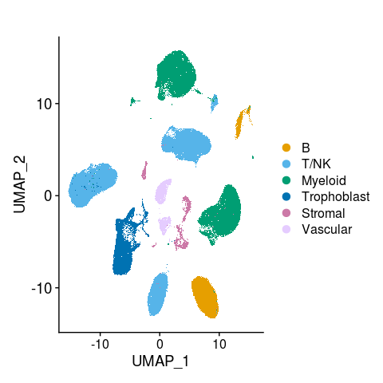
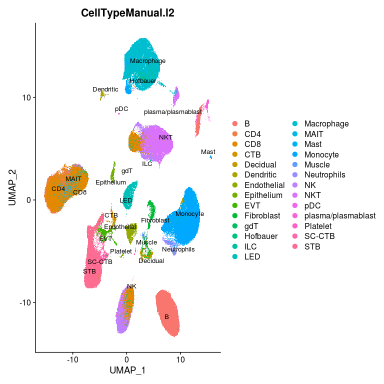
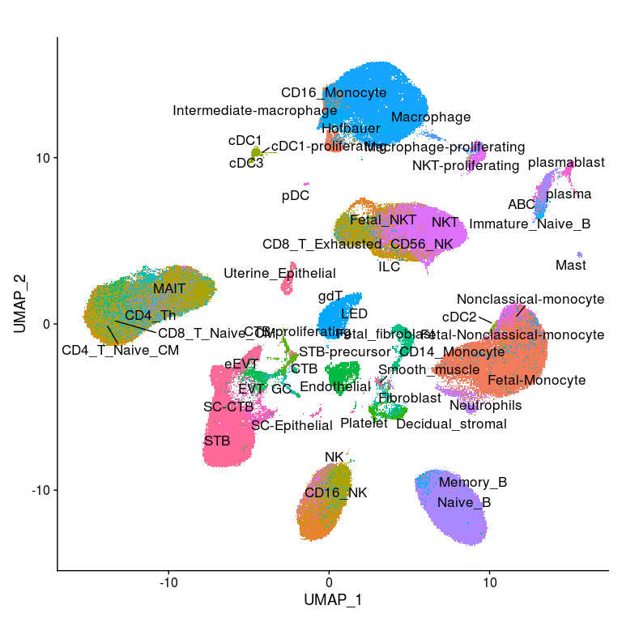
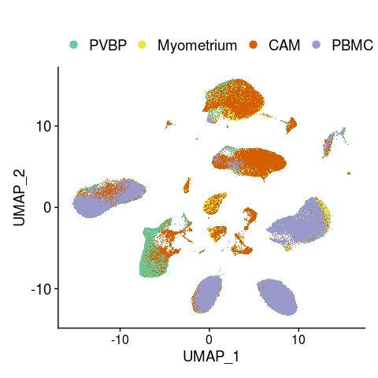
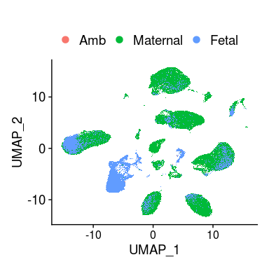
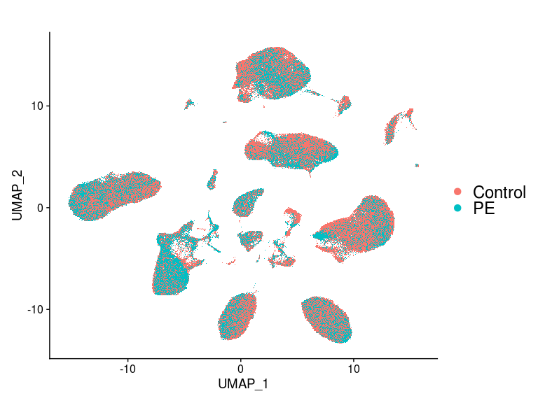
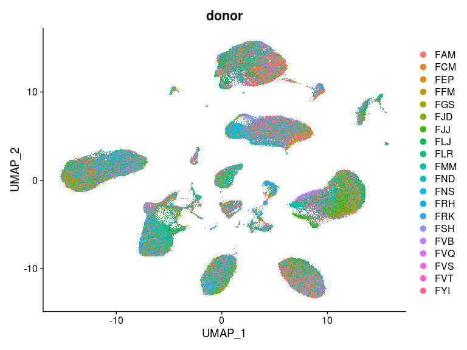
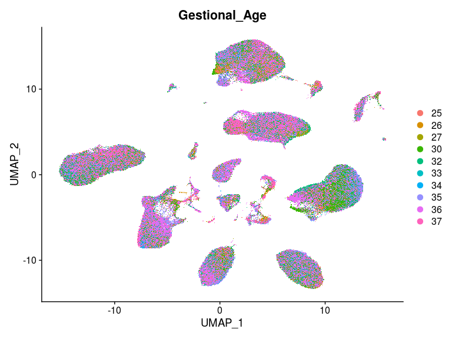
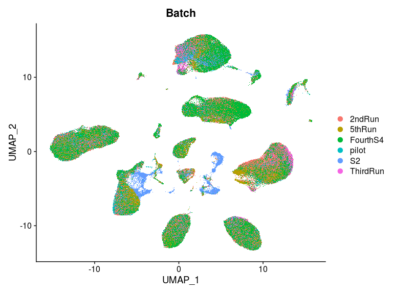
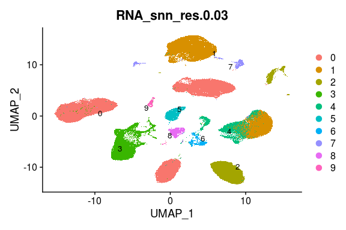

Single-cell FMI: all cells - UMAP with updated annotations
================

Author: Yara E. Sanchez Corrales. 
email: y.sanchez-corrales@ucl.ac.uk

# Introduction

In this plot we plot several UMAPs with cell type annotations, following
the colour scheme for main figure 1.

# Read the single-cell object

``` r
# Read the single cell
data.1 <- readRDS(file = "~/Projects/FMI-all-singlecell-20230308/outputs/objects/FMI-all-20patients-20250516.rds")
data.1
```

    ## An object of class Seurat 
    ## 36601 features across 292773 samples within 1 assay 
    ## Active assay: RNA (36601 features, 2000 variable features)
    ##  3 dimensional reductions calculated: pca, harmony, umap

``` r
head(data.1@meta.data)
```

    ##                     orig.ident nCount_RNA nFeature_RNA          sample_id percent.mt percent.hb percent.rbp donor Tissue
    ## CCATGTCTCAGTTGAC-1         FMI       8871         3124 F1676VQ-AB2-Sc-4-1 3.37053320 0.02254537  22.9286439   FVQ   PVBP
    ## CAGCCGAAGCCTTGAT-51        FMI       6453         2575     F1758LJ-CAM-sn 0.00000000 0.01549667   2.1230435   FLJ    CAM
    ## GCATGCGCAGCTCGAC-51        FMI       2131         1329     F1758LJ-CAM-sn 2.76865321 0.00000000   4.5518536   FLJ    CAM
    ## GGACGTCAGCGTGTCC-51        FMI       1927         1253     F1758LJ-CAM-sn 0.05189414 0.00000000   0.9340944   FLJ    CAM
    ## CAGTAACTCTTCTGGC-51        FMI       1564         1074     F1758LJ-CAM-sn 0.44757033 0.06393862   0.2557545   FLJ    CAM
    ## AGCGTATAGAGACGAA-51        FMI       1518         1037     F1758LJ-CAM-sn 0.00000000 0.00000000   1.1857708   FLJ    CAM
    ##                               origin Condition Gestional_Age GA_Category  GA_Condition Tissue_Condition Fetal.sex Batch
    ## CCATGTCTCAGTTGAC-1  F1676VQ_Placenta   Control            26       Early Early_Control Placenta_Control         M pilot
    ## CAGCCGAAGCCTTGAT-51      F1758LJ_CAM   Control            35        Late  Late_Control      CAM_Control         F    S2
    ## GCATGCGCAGCTCGAC-51      F1758LJ_CAM   Control            35        Late  Late_Control      CAM_Control         F    S2
    ## GGACGTCAGCGTGTCC-51      F1758LJ_CAM   Control            35        Late  Late_Control      CAM_Control         F    S2
    ## CAGTAACTCTTCTGGC-51      F1758LJ_CAM   Control            35        Late  Late_Control      CAM_Control         F    S2
    ## AGCGTATAGAGACGAA-51      F1758LJ_CAM   Control            35        Late  Late_Control      CAM_Control         F    S2
    ##                              Method          Method_Tissue      clono has.clonotype RNA_snn_res.0.03 CellTypeManual.l1
    ## CCATGTCTCAGTTGAC-1    single-cell-5 single-cell-5_Placenta clonotype0            No                2                 B
    ## CAGCCGAAGCCTTGAT-51 single-nuclei-5    single-nuclei-5_CAM clonotype0            No                2                 B
    ## GCATGCGCAGCTCGAC-51 single-nuclei-5    single-nuclei-5_CAM clonotype0            No                0                 B
    ## GGACGTCAGCGTGTCC-51 single-nuclei-5    single-nuclei-5_CAM clonotype0            No                0                 B
    ## CAGTAACTCTTCTGGC-51 single-nuclei-5    single-nuclei-5_CAM clonotype0            No                0                 B
    ## AGCGTATAGAGACGAA-51 single-nuclei-5    single-nuclei-5_CAM clonotype0            No                0                 B
    ##                      CellTypeManual.l2 CellTypeManual.l3 genotype_two_libraries
    ## CCATGTCTCAGTTGAC-1  plasma/plasmablast       plasmablast                  Fetal
    ## CAGCCGAAGCCTTGAT-51 plasma/plasmablast            plasma               Maternal
    ## GCATGCGCAGCTCGAC-51 plasma/plasmablast            plasma               Maternal
    ## GGACGTCAGCGTGTCC-51 plasma/plasmablast            plasma               Maternal
    ## CAGTAACTCTTCTGGC-51 plasma/plasmablast            plasma               Maternal
    ## AGCGTATAGAGACGAA-51 plasma/plasmablast            plasma               Maternal

``` r
unique(data.1@meta.data$Tissue)
```

    ## [1] "PVBP"       "CAM"        "PBMC"       "Myometrium"

``` r
unique(data.1@meta.data$CellTypeManual.l1)
```

    ## [1] "B"           "T/NK"        "Myeloid"     "Trophoblast" "Vascular"    "Stromal"

# Make a new UMAP

``` r
# DefaultAssay(data.1) <- "RNA"
# # #This is global-scaling normalization method "LogNormalize" that normalizes the feature expression measurements for each cell by the total expression, multiplies this by a scale factor (10,000 by default), and log-transforms the result
 data.1 <- NormalizeData(data.1,normalization.method = "LogNormalize", scale.factor = 10000)
#
# #Calculate a subset of features that exhibit high cell-to-cell variation in the dataset
 data.1 <- FindVariableFeatures(data.1, selection.method = "vst", nfeatures = 2000)
#
# #Scale the data so that the mean expression across cells is 0 and the variance across cells is 1
 data.1 <- ScaleData(data.1,vars.regress = "percent.mt")
```

    ## Warning: The following arguments are not used: vars.regress

    ## Centering and scaling data matrix

``` r
 # PCA calculation
 data.1 <- RunPCA(data.1, verbose = FALSE)
 #Harmony integration
 data.1 <- data.1 %>%
    RunHarmony(group.by.vars="Method",reduction.save="harmony")
```

    ## Warning: Quick-TRANSfer stage steps exceeded maximum (= 14638650)

    ## Warning: Quick-TRANSfer stage steps exceeded maximum (= 14638650)

    ## Warning: Quick-TRANSfer stage steps exceeded maximum (= 14638650)

    ## Warning: Quick-TRANSfer stage steps exceeded maximum (= 14638650)

    ## Harmony 1/10

    ## Harmony 2/10

    ## Harmony 3/10

    ## Harmony 4/10

    ## Harmony 5/10

    ## Harmony 6/10

    ## Harmony 7/10

    ## Harmony converged after 7 iterations

    ## Warning: Invalid name supplied, making object name syntactically valid. New object name is Seurat..ProjectDim.RNA.harmony; see
    ## ?make.names for more details on syntax validity

``` r
  # calculate umap
 data.1 <- data.1 %>%
    RunUMAP(reduction = "harmony", dims = 1:25) %>%
    FindNeighbors(reduction = "harmony", dims = 1:25)
```

    ## 11:36:35 UMAP embedding parameters a = 0.9922 b = 1.112

    ## 11:36:35 Read 292773 rows and found 25 numeric columns

    ## 11:36:35 Using Annoy for neighbor search, n_neighbors = 30

    ## 11:36:35 Building Annoy index with metric = cosine, n_trees = 50

    ## 0%   10   20   30   40   50   60   70   80   90   100%

    ## [----|----|----|----|----|----|----|----|----|----|

    ## **************************************************|
    ## 11:37:27 Writing NN index file to temp file /tmp/RtmpeS6iqr/file2bdf430e9dbfe
    ## 11:37:27 Searching Annoy index using 1 thread, search_k = 3000
    ## 11:39:26 Annoy recall = 92.28%
    ## 11:39:27 Commencing smooth kNN distance calibration using 1 thread with target n_neighbors = 30
    ## 11:39:38 Initializing from normalized Laplacian + noise (using irlba)
    ## 11:42:06 Commencing optimization for 200 epochs, with 13955438 positive edges
    ## 11:49:28 Optimization finished
    ## Computing nearest neighbor graph
    ## Computing SNN

``` r
    # FindClusters(resolution = 0.09)
    # identity()
```

``` r
Idents(data.1) <- "CellTypeManual.l1"
# celltype.order.l1 
data.1@active.ident <- factor(x = data.1@active.ident, levels = celltype.order.l1 )

p1 <- DimPlot(data.1 , reduction = 'umap', group.by = 'CellTypeManual.l1', label = TRUE, repel = TRUE, label.size = 0, order = rev(celltype.order.l1) ,cols =  colors_cellgroups)   +
  ggtitle("") + 
   # scale_fill_manual(values = colors_cellgroups) +
   theme(
    axis.text.y = element_text(size = 14),
    axis.title.x = element_text(size = 14),
    axis.title.y = element_text(size = 14))
```

    ## Rasterizing points since number of points exceeds 100,000.
    ## To disable this behavior set `raster=FALSE`

``` r
p1
```

<!-- -->

``` r
# ggsave(paste(dir, "UMAP-CellTypeManual_l1_20240904.png",sep=""), p1, width=5,height=5, bg = "white",units = 'in', dpi = 300)
```

``` r
p2 <- DimPlot(data.1 , reduction = 'umap', group.by = 'CellTypeManual.l2', label = TRUE, repel = TRUE, label.size = 3.5) 
```

    ## Rasterizing points since number of points exceeds 100,000.
    ## To disable this behavior set `raster=FALSE`

``` r
p2
```

<!-- -->

``` r
# ggsave("/home/ssd/ysanchez/Projects/FMI-all-singlecell-20230308/plots/20231220-plots-for-talk/UMAP-FMI-20patients-CellTypeManual-l2-20230110.png", p2, width=6,height=4, bg = "white")
```

``` r
p3 <- DimPlot(data.1 , reduction = 'umap', group.by = 'CellTypeManual.l3', label = TRUE, repel = TRUE, label.size = 4.5) + NoLegend() +
   theme(legend.text=element_text(size=15),
        legend.title=element_text(size=15),
        axis.line = element_line(size=0.5)) + ggtitle("")
```

    ## Rasterizing points since number of points exceeds 100,000.
    ## To disable this behavior set `raster=FALSE`

``` r
p3
```

    ## Warning: ggrepel: 7 unlabeled data points (too many overlaps). Consider increasing max.overlaps

<!-- -->

``` r
# ggsave(paste(dir, "UMAP-MRC-PE-CellTypeManual_l3.png",sep=""), p3, width=8,height=6, bg = "white")
```

``` r
Idents(data.1) <- "Tissue"
# celltype.order.l1 
data.1@active.ident <- factor(x = data.1@active.ident, levels = tissue.order)

p4 <- DimPlot(data.1 , reduction = 'umap', group.by = 'Tissue', label = FALSE, repel = TRUE, label.size = 3.5,order = rev(tissue.order), cols =  colours_tissue)  +
  ggtitle("") +  
   # scale_fill_manual(values = colors_cellgroups) +
   theme(
    axis.text.y = element_text(size = 14),
    axis.title.x = element_text(size = 14),
    axis.title.y = element_text(size = 14),
    # strip.text = element_text(size = 12, color = "black"),
    legend.position = "top",
    legend.text = element_text(size = 14),
    legend.title= element_blank()) +
  guides(fill = guide_legend(nrow = 1))
```

    ## Rasterizing points since number of points exceeds 100,000.
    ## To disable this behavior set `raster=FALSE`

``` r
p4
```

<!-- -->

``` r
# ggsave(paste(dir, "UMAP-MRC-PE-Tissue_20240904.png", sep=""), p4, width=3,height=3, bg = "white",units = 'in', dpi = 300)
```

``` r
p5 <- DimPlot(data.1 , reduction = 'umap', group.by = 'genotype_two_libraries', label = TRUE, repel = TRUE, label.size = 0,order = c("Fetal","Maternal","Amb"))  +
  ggtitle("") +  
   # scale_fill_manual(values = colors_cellgroups) +
   theme(
    axis.text.y = element_text(size = 14),
    axis.title.x = element_text(size = 14),
    axis.title.y = element_text(size = 14),
    # strip.text = element_text(size = 12, color = "black"),
    legend.position = "top",
    legend.text = element_text(size = 14),
    legend.title= element_blank()) +
  guides(fill = guide_legend(nrow = 1))
```

    ## Rasterizing points since number of points exceeds 100,000.
    ## To disable this behavior set `raster=FALSE`

``` r
p5
```

<!-- -->

``` r
# ggsave(paste(dir, "UMAP-PE-genotype_two_libraries.png",sep=""), p5, width=3,height=3, bg = "white",units = 'in', dpi = 300)
```

``` r
p6 <- DimPlot(data.1 , reduction = 'umap', group.by = 'Condition', label = FALSE, repel = TRUE, label.size = 4.5) +
   theme(legend.text=element_text(size=18),
        legend.title=element_text(size=18),
        axis.line = element_line(size=0.5)) + ggtitle("")
```

    ## Rasterizing points since number of points exceeds 100,000.
    ## To disable this behavior set `raster=FALSE`

``` r
p6
```

<!-- -->

``` r
# ggsave(paste(dir, "UMAP-MRC-PE-Condition.png",sep=""), p6, width=8,height=6, bg = "white")
```

``` r
p6 <- DimPlot(data.1 , reduction = 'umap', group.by = 'donor', label = FALSE, repel = TRUE, label.size = 3.5) 
```

    ## Rasterizing points since number of points exceeds 100,000.
    ## To disable this behavior set `raster=FALSE`

``` r
p6
```

<!-- -->

``` r
# ggsave("/home/ssd/ysanchez/Projects/FMI-all-singlecell-20230308/plots/20231220-plots-for-talk/UMAP-FMI-20patients-donor-20231220.png", p6, width=8,height=6, bg = "white")
```

``` r
p7 <- DimPlot(data.1 , reduction = 'umap', group.by =  "Gestional_Age", label = FALSE, repel = TRUE, label.size = 3.5) + ggtitle("Gestional_Age")
```

    ## Rasterizing points since number of points exceeds 100,000.
    ## To disable this behavior set `raster=FALSE`

``` r
p7
```

<!-- -->

``` r
# ggsave("/home/ssd/ysanchez/Projects/FMI-all-singlecell-20230308/plots/20231220-plots-for-talk/UMAP-FMI-20patients-Gestional_Age-20230110.png", p7, width=8,height=6, bg = "white")
```

``` r
p8 <- DimPlot(data.1 , reduction = 'umap', group.by = 'Batch', label = FALSE, repel = TRUE, label.size = 3.5) 
```

    ## Rasterizing points since number of points exceeds 100,000.
    ## To disable this behavior set `raster=FALSE`

``` r
p8
```

<!-- -->

``` r
# ggsave("/home/ssd/ysanchez/Projects/FMI-all-singlecell-20230308/plots/20231220-plots-for-talk/UMAP-FMI-20patients-Batch-20230110.png", p8, width=8,height=6, bg = "white")
```

``` r
DimPlot(data.1 , reduction = 'umap', group.by = 'RNA_snn_res.0.03', label = TRUE, repel = TRUE, label.size = 3.5) 
```

    ## Rasterizing points since number of points exceeds 100,000.
    ## To disable this behavior set `raster=FALSE`

<!-- -->

``` r
sessionInfo()
```

    ## R version 4.1.1 (2021-08-10)
    ## Platform: x86_64-pc-linux-gnu (64-bit)
    ## Running under: Red Hat Enterprise Linux Server 7.6 (Maipo)
    ## 
    ## Matrix products: default
    ## BLAS:   /apps/R/4.1.1/lib64/R/lib/libRblas.so
    ## LAPACK: /apps/R/4.1.1/lib64/R/lib/libRlapack.so
    ## 
    ## locale:
    ##  [1] LC_CTYPE=en_US.UTF-8       LC_NUMERIC=C               LC_TIME=en_US.UTF-8        LC_COLLATE=en_US.UTF-8    
    ##  [5] LC_MONETARY=en_US.UTF-8    LC_MESSAGES=en_US.UTF-8    LC_PAPER=en_US.UTF-8       LC_NAME=C                 
    ##  [9] LC_ADDRESS=C               LC_TELEPHONE=C             LC_MEASUREMENT=en_US.UTF-8 LC_IDENTIFICATION=C       
    ## 
    ## attached base packages:
    ## [1] stats     graphics  grDevices utils     datasets  methods   base     
    ## 
    ## other attached packages:
    ##  [1] ggpubr_0.4.0       tidyr_1.1.4        stringr_1.4.0      cowplot_1.1.1      harmony_0.1.0      Rcpp_1.0.8        
    ##  [7] ggplot2_3.3.5      SeuratObject_4.1.3 Seurat_4.2.1       dplyr_1.0.7       
    ## 
    ## loaded via a namespace (and not attached):
    ##   [1] Rtsne_0.15             colorspace_2.0-2       ggsignif_0.6.3         deldir_1.0-6           ellipsis_0.3.2        
    ##   [6] ggridges_0.5.3         rstudioapi_0.13        spatstat.data_3.0-0    farver_2.1.0           leiden_0.3.9          
    ##  [11] listenv_0.8.0          ggrepel_0.9.1          fansi_1.0.2            codetools_0.2-18       splines_4.1.1         
    ##  [16] cachem_1.0.6           knitr_1.45             polyclip_1.10-0        jsonlite_1.7.3         broom_0.7.11          
    ##  [21] ica_1.0-2              cluster_2.1.2          png_0.1-7              uwot_0.1.14            shiny_1.7.1           
    ##  [26] sctransform_0.3.5      spatstat.sparse_3.0-0  compiler_4.1.1         httr_1.4.2             backports_1.4.1       
    ##  [31] assertthat_0.2.1       Matrix_1.5-4.1         fastmap_1.1.1          lazyeval_0.2.2         cli_3.6.1             
    ##  [36] later_1.3.0            htmltools_0.5.8.1      tools_4.1.1            igraph_1.2.11          gtable_0.3.0          
    ##  [41] glue_1.6.1             RANN_2.6.1             reshape2_1.4.4         carData_3.0-5          scattermore_0.7       
    ##  [46] jquerylib_0.1.4        vctrs_0.6.5            spatstat.explore_3.0-5 nlme_3.1-155           progressr_0.10.0      
    ##  [51] lmtest_0.9-39          spatstat.random_3.0-1  xfun_0.41              globals_0.14.0         mime_0.12             
    ##  [56] miniUI_0.1.1.1         lifecycle_1.0.4        irlba_2.3.5            rstatix_0.7.0          goftest_1.2-3         
    ##  [61] future_1.23.0          MASS_7.3-55            zoo_1.8-9              scales_1.1.1           promises_1.2.0.1      
    ##  [66] spatstat.utils_3.0-1   parallel_4.1.1         RColorBrewer_1.1-2     yaml_2.2.2             reticulate_1.24       
    ##  [71] pbapply_1.5-0          gridExtra_2.3          sass_0.4.9             stringi_1.7.6          highr_0.9             
    ##  [76] rlang_1.1.1            pkgconfig_2.0.3        matrixStats_0.61.0     evaluate_0.23          lattice_0.20-45       
    ##  [81] ROCR_1.0-11            purrr_1.0.2            tensor_1.5             labeling_0.4.2         patchwork_1.1.1       
    ##  [86] htmlwidgets_1.5.4      tidyselect_1.1.1       parallelly_1.30.0      RcppAnnoy_0.0.19       plyr_1.8.6            
    ##  [91] magrittr_2.0.1         R6_2.5.1               generics_0.1.1         DBI_1.1.2              pillar_1.6.5          
    ##  [96] withr_2.5.0            fitdistrplus_1.1-6     survival_3.2-13        abind_1.4-5            sp_1.5-1              
    ## [101] tibble_3.1.6           future.apply_1.8.1     car_3.0-12             crayon_1.4.2           KernSmooth_2.23-20    
    ## [106] utf8_1.2.2             spatstat.geom_3.0-3    plotly_4.10.0          rmarkdown_2.25         grid_4.1.1            
    ## [111] data.table_1.14.2      digest_0.6.29          xtable_1.8-4           httpuv_1.6.5           munsell_0.5.0         
    ## [116] viridisLite_0.4.0      bslib_0.7.0
