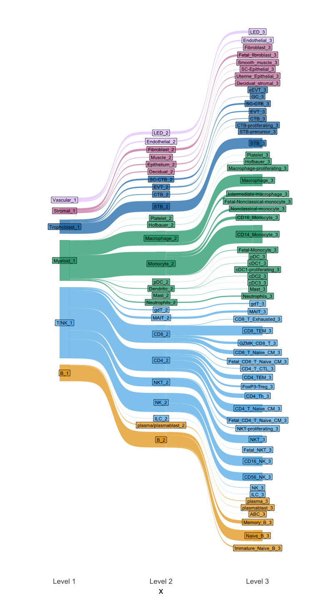
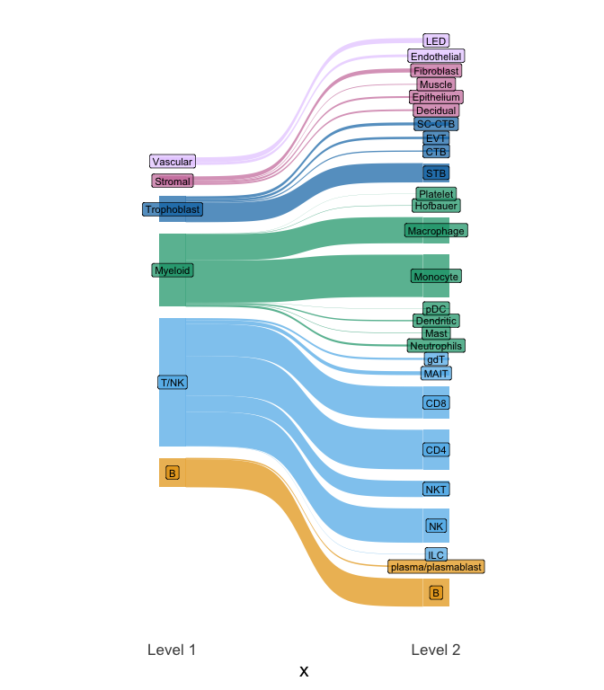

FMI paper - Sankey plot 
================

Author: Yara E. Sanchez Corrales

# Introduction

Here, we reproduce the code by Jose Moreno on plotting a sankey plot,
one per level of annotation. Cell annotations are stored as columns in
the metadata slot of the seurat object.

``` r
#install.packages("remotes")
#remotes::install_github("davidsjoberg/ggsankey")
library(ggsankey)
library(dplyr)
library(ggplot2)
library(tidyr)
```

``` r
# Open the object
all_fmi <- readRDS(file = "/Users/ysanchez/Documents/Projects-analysis/FMI-sc-all/objects/FMI-all-20patients-20240827.rds")
```

``` r
# Define the order for CellTypeManual.l1, CellTypeManual.l2, and CellTypeManual.l3
l1_order <- c("B", "T/NK", "Myeloid", "Trophoblast", "Stromal", "Vascular")


l2_order <- c("B", "plasma/plasmablast", "ILC", "NK", "NKT", "CD4", "CD8", "MAIT", "gdT", "Neutrophils", "Mast",
              "Dendritic", "pDC", "Monocyte", "Macrophage", "Hofbauer", "Platelet", "STB", "CTB", "EVT",
              "SC-CTB", "Decidual", "Epithelium", "Muscle", "Fibroblast","Endothelial", "LED")

l3_order <- c("Immature_Naive_B", "Naive_B", "Memory_B", "ABC", "plasmablast", "plasma", "ILC", "NK", "CD56_NK", "CD16_NK",
              "Fetal_NKT", "NKT", "NKT-proliferating", "Fetal_CD4_T_Naive_CM", "CD4_T_Naive_CM", "CD4_Th", "FoxP3-Treg",
              "CD4_TEM", "CD4_T_CTL", "Fetal_CD8_T_Naive_CM", "CD8_T_Naive_CM", "GZMK_CD8_T", "CD8_TEM", "CD8_T_Exhausted",
              "MAIT", "gdT", "Neutrophils", "Mast", "cDC3", "cDC2", "cDC1-proliferating", "cDC1", "pDC", "Fetal-Monocyte",
              "CD14_Monocyte", "CD16_Monocyte", "Nonclassical-monocyte", "Fetal-Nonclassical-monocyte",
              "Intermediate-macrophage", "Macrophage", "Macrophage-proliferating", "Hofbauer", "Platelet", "STB","STB-precursor",
              "CTB-proliferating", "CTB", "EVT", "SC-CTB", "GC", "eEVT",  "Decidual_stromal",
              "Uterine_Epithelial", "SC-Epithelial", "Smooth_muscle", "Fetal_fibroblast","Fibroblast","Endothelial","LED")
```

``` r
# Check labels are correct. 
setdiff(l1_order, unique(all_fmi@meta.data$CellTypeManual.l1))
```

    ## character(0)

``` r
setdiff(l2_order, unique(all_fmi@meta.data$CellTypeManual.l2))
```

    ## character(0)

``` r
setdiff(l3_order, unique(all_fmi@meta.data$CellTypeManual.l3))
```

    ## character(0)

``` r
setdiff(unique(all_fmi@meta.data$CellTypeManual.l3),l3_order)
```

    ## character(0)

``` r
# Append suffixes to differentiate levels
l1_order <- paste0(l1_order, "_1")
l2_order <- paste0(l2_order, "_2")
l3_order <- paste0(l3_order, "_3")

# Combine all levels for factors
all_levels <- unique(c(l1_order, l2_order, l3_order))

# Define a custom color palette with alpha for transparency
my_colors <- c("#1b9e77", "#d95f02", "#7570b3", "#e7298a", "#66a61e")
my_colors_transparent <- alpha(my_colors, 0.7) 


# Adjust alpha (transparency) here
cellgroups <- c("#E69F00", "#56B4E9", "#009E73", "#0072B2","#CC79A7","#E5CCFF")
cellgroups_transparent <- alpha(cellgroups, 0.7) 

# Define a pastel color palette
pastel_colors <- c("#FFB6C1", "#FFD700", "#87CEFA", "#66a61e", "#FFA07A","#E5CCFF")  # Adjust as needed

colors_groups <- c("#C43E96", "#F2B342", "#95AA46", "#925A44")

colours_tissue <- c("#66a61e", "#F0E442", "#D55E00","#e7298a")
```

``` r
cell_annot <- all_fmi@meta.data[,grep("CellT",names(all_fmi@meta.data))[1:3]]
cell_annot[,1]<-gsub("$","_1",cell_annot[,1])
cell_annot[,2]<-gsub("$","_2",cell_annot[,2])
cell_annot[,3]<-gsub("$","_3",cell_annot[,3])
```

``` r
# Assuming make_long creates a column called 'x' to indicate the position
df2 <- cell_annot %>%
  make_long(CellTypeManual.l1, CellTypeManual.l2, CellTypeManual.l3)

# Create the fill_node column to maintain the CellTypeManual.l1 values
df3a <- df2 %>%
  mutate(fill_node = ifelse(x == "CellTypeManual.l1", node, NA)) %>%
  fill(fill_node, .direction = "downup") %>%
  mutate(node = factor(node, levels = all_levels),
         next_node = factor(next_node, levels = all_levels),
         fill_node = factor(fill_node, levels = l1_order)) %>%
  arrange(x, node)

# Plotting with custom colors and transparency
sankey_2 <- ggplot(df3a, aes(x = x, 
                 next_x = next_x, 
                 node = node, 
                 next_node = next_node,
                 fill = fill_node,  # Use fill_node for coloring
                 label = node)) +
  geom_sankey() +
  geom_sankey_label(aes(fill = fill_node), color = "black", size = 3) +  # Use fill_node for label coloring
  scale_fill_manual(values = cellgroups_transparent) +  # Apply custom colors with transparency
  theme_sankey(base_size = 16) + 
  guides(fill = "none") +
  scale_x_discrete(labels = c("CellTypeManual.l1" = "Level 1",
                              "CellTypeManual.l2" = "Level 2",
                              "CellTypeManual.l3" = "Level 3"))
```

``` r
sankey_2
```

<!-- -->

``` r
df <- all_fmi@meta.data %>%
  make_long(CellTypeManual.l1, CellTypeManual.l2)

l1_order_a <- c("B", "T/NK", "Myeloid", "Trophoblast", "Stromal", "Vascular")


l2_order_a <- c("B", "plasma/plasmablast", "ILC", "NK", "NKT", "CD4", "CD8", "MAIT", "gdT", "Neutrophils", "Mast",
              "Dendritic", "pDC", "Monocyte", "Macrophage", "Hofbauer", "Platelet", "STB", "CTB", "EVT",
              "SC-CTB", "Decidual", "Epithelium", "Muscle", "Fibroblast","Endothelial", "LED")

# Create the fill_node column to maintain the CellTypeManual.l1 values
dfa <- df %>%
  group_by(node) %>%
  mutate(fill_node = first(node[x == "CellTypeManual.l1"])) %>%
  ungroup() %>%
  mutate(fill_node = ifelse(is.na(fill_node), lag(fill_node), fill_node)) %>%
  mutate(fill_node = ifelse(is.na(fill_node), lead(fill_node), fill_node)) %>%
  mutate(node = factor(node, levels = unique(c(l1_order_a, l2_order_a))),
         next_node = factor(next_node, levels = unique(c(l1_order_a, l2_order_a))),
         fill_node = factor(fill_node, levels = unique(l1_order_a))) %>%
  arrange(x, node)

# Plotting
sankey_1 <- ggplot(dfa, aes(x = x, 
                      next_x = next_x, 
                      node = node, 
                      next_node = next_node,
                      fill = fill_node,  # Use fill_node for coloring
                      label = node)) +
  geom_sankey() +
  geom_sankey_label(aes(fill = fill_node), color = "black", size = 3) +  # Use fill_node for label coloring
    scale_fill_manual(values = cellgroups_transparent) +  # Apply custom colors with transparency
  theme_sankey(base_size = 16) + 
  guides(fill = "none") +
  scale_x_discrete(labels = c("CellTypeManual.l1" = "Level 1",
                              "CellTypeManual.l2" = "Level 2"))

sankey_1
```

<!-- -->

``` r
sessionInfo()
```

    ## R version 4.3.2 (2023-10-31)
    ## Platform: aarch64-apple-darwin20 (64-bit)
    ## Running under: macOS Sonoma 14.3
    ## 
    ## Matrix products: default
    ## BLAS:   /System/Library/Frameworks/Accelerate.framework/Versions/A/Frameworks/vecLib.framework/Versions/A/libBLAS.dylib 
    ## LAPACK: /Library/Frameworks/R.framework/Versions/4.3-arm64/Resources/lib/libRlapack.dylib;  LAPACK version 3.11.0
    ## 
    ## locale:
    ## [1] en_US.UTF-8/en_US.UTF-8/en_US.UTF-8/C/en_US.UTF-8/en_US.UTF-8
    ## 
    ## time zone: Europe/London
    ## tzcode source: internal
    ## 
    ## attached base packages:
    ## [1] stats     graphics  grDevices utils     datasets  methods   base     
    ## 
    ## other attached packages:
    ## [1] tidyr_1.3.1        ggplot2_3.5.2      dplyr_1.1.4        ggsankey_0.0.99999
    ## 
    ## loaded via a namespace (and not attached):
    ##   [1] deldir_2.0-2           pbapply_1.7-2          gridExtra_2.3          rlang_1.1.6            magrittr_2.0.3         RcppAnnoy_0.0.22      
    ##   [7] spatstat.geom_3.2-8    matrixStats_1.2.0      ggridges_0.5.6         compiler_4.3.2         png_0.1-8              vctrs_0.6.5           
    ##  [13] reshape2_1.4.4         stringr_1.5.1          pkgconfig_2.0.3        fastmap_1.1.1          ellipsis_0.3.2         labeling_0.4.3        
    ##  [19] utf8_1.2.4             promises_1.2.1         rmarkdown_2.25         purrr_1.0.4            xfun_0.42              jsonlite_1.8.8        
    ##  [25] goftest_1.2-3          highr_0.10             later_1.3.2            spatstat.utils_3.0-4   irlba_2.3.5.1          parallel_4.3.2        
    ##  [31] cluster_2.1.6          R6_2.5.1               ica_1.0-3              spatstat.data_3.0-4    stringi_1.8.4          RColorBrewer_1.1-3    
    ##  [37] reticulate_1.35.0      parallelly_1.36.0      lmtest_0.9-40          scattermore_1.2        Rcpp_1.0.13            knitr_1.45            
    ##  [43] tensor_1.5             future.apply_1.11.1    zoo_1.8-12             sctransform_0.4.1      httpuv_1.6.14          Matrix_1.6-5          
    ##  [49] splines_4.3.2          igraph_2.0.1.1         tidyselect_1.2.1       abind_1.4-5            rstudioapi_0.17.1      yaml_2.3.8            
    ##  [55] spatstat.random_3.2-2  codetools_0.2-19       miniUI_0.1.1.1         spatstat.explore_3.2-6 listenv_0.9.1          lattice_0.22-5        
    ##  [61] tibble_3.2.1           plyr_1.8.9             shiny_1.8.0            withr_3.0.1            ROCR_1.0-11            evaluate_0.23         
    ##  [67] Rtsne_0.17             future_1.33.1          fastDummies_1.7.3      survival_3.5-7         polyclip_1.10-6        fitdistrplus_1.1-11   
    ##  [73] pillar_1.9.0           Seurat_5.0.1           KernSmooth_2.23-22     plotly_4.10.4          generics_0.1.3         RcppHNSW_0.6.0        
    ##  [79] sp_2.1-3               munsell_0.5.0          scales_1.3.0           globals_0.16.2         xtable_1.8-4           glue_1.7.0            
    ##  [85] lazyeval_0.2.2         tools_4.3.2            data.table_1.16.0      RSpectra_0.16-1        RANN_2.6.1             leiden_0.4.3.1        
    ##  [91] dotCall64_1.1-1        cowplot_1.1.3          grid_4.3.2             colorspace_2.1-0       nlme_3.1-164           patchwork_1.2.0       
    ##  [97] cli_3.6.5              spatstat.sparse_3.0-3  spam_2.10-0            fansi_1.0.6            viridisLite_0.4.2      uwot_0.1.16           
    ## [103] gtable_0.3.4           digest_0.6.34          progressr_0.14.0       ggrepel_0.9.5          farver_2.1.1           htmlwidgets_1.6.4     
    ## [109] SeuratObject_5.0.1     htmltools_0.5.7        lifecycle_1.0.4        httr_1.4.7             mime_0.12              MASS_7.3-60.0.1
