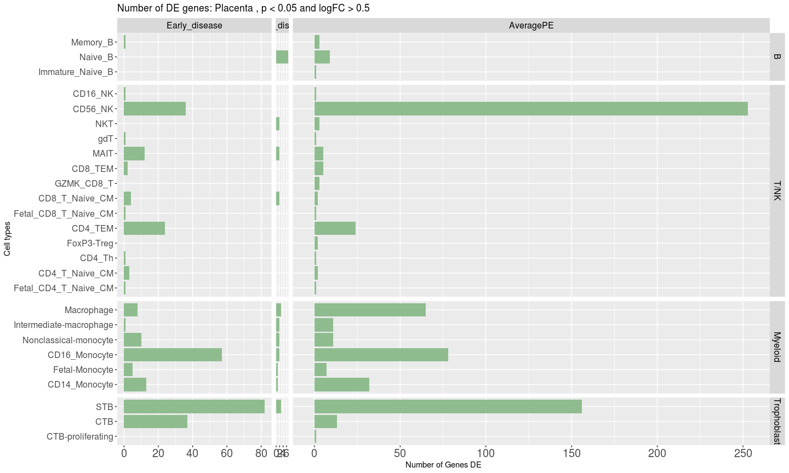
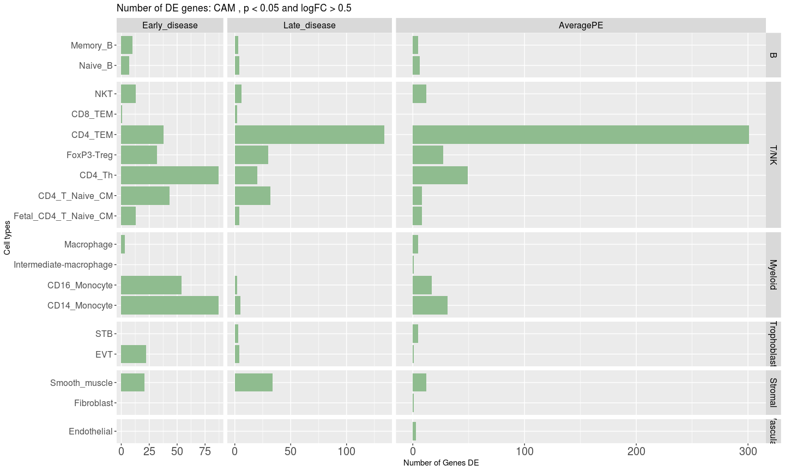
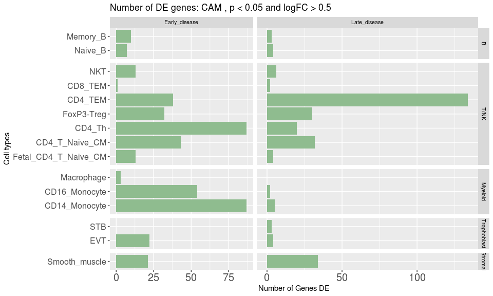
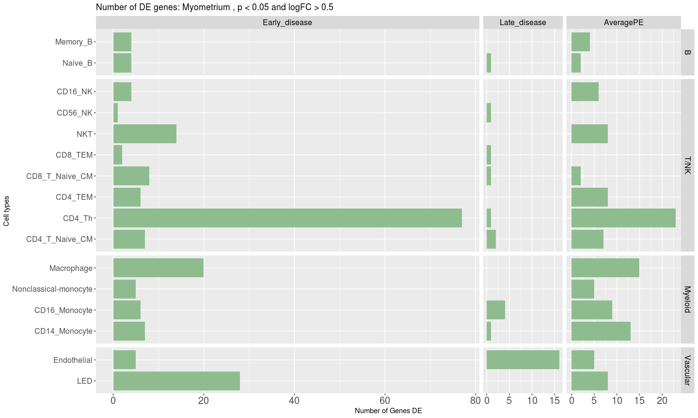
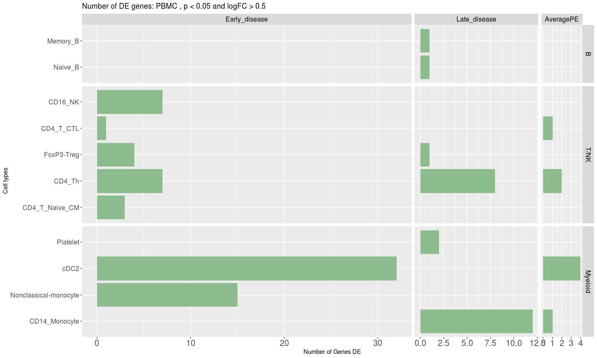

Single-cell FMI: check the output of EdgeR - number of differentially expressed genes per contrast
================
Author: Yara E. Sanchez Corrales

# Introduction

This notebook plots the number of genes that were differentially
expressed using EdgeR in severe PE in several contrasts.

The relevant GLM is: 3) model2: \~0 + GA\_Condition

The contrasts for model 2 are: \* Early\_disease =
GA\_ConditionEarly\_PE - GA\_ConditionEarly\_Control, \* Late\_disease =
GA\_ConditionLate\_PE - GA\_ConditionLate\_Control, \* averageGA =
(GA\_ConditionEarly\_PE + GA\_ConditionEarly\_Control)/2 -
(GA\_ConditionLate\_PE + GA\_ConditionLate\_Control)/2, \* averagePE =
(GA\_ConditionEarly\_PE + GA\_ConditionLate\_PE)/2 -
(GA\_ConditionEarly\_Control+ GA\_ConditionLate\_Control)/2

``` r
# Load libraries and Seurat object.
library(dplyr)
library(Seurat)
library(ggplot2)
library(tidyverse)
```

``` r
# These are the thresholds used:
p_thr <- 0.05
logFC_threshold = 0.50
exp_var <- "GA_Condition" # Explanatory variable: GA_Condition: 4 categories

# directory of the EdgeR results
dir <- "/home/ssd/ysanchez/Projects/FMI-all-singlecell-20230308/outputs/EdgeR-single-cell-20240828/EdgeR-single-cell-model2-GA_Condition-20240828/"

# This notebook is for annotation level:
annotation_level <- "CellTypeManual.l3"
```

# 1) Tissue: Placenta

``` r
tissue = "Placenta" # "CAM", "PBMC", "Myometrium"
results_placenta <- df_results_per_contrast_tissue(tissue)
```

    ## Joining, by = "CellTypeManual.l3"

    ## [1] "Analysis for contrast:  Late_disease"

    ## Joining, by = "CellTypeManual.l3"

    ## [1] "Analysis for contrast:  AveragePE"

    ## Joining, by = "CellTypeManual.l3"

``` r
head(results_placenta)
```

    ## # A tibble: 6 × 6
    ## # Groups:   cell_type [6]
    ##   cell_type                  n Tissue   Contrast  CellTypeManual.l3 cellgroup  
    ##   <chr>                  <int> <chr>    <ord>     <ord>             <ord>      
    ## 1 CD56_NK_Placenta         253 Placenta AveragePE CD56_NK           T/NK       
    ## 2 STB_Placenta             156 Placenta AveragePE STB               Trophoblast
    ## 3 CD16_Monocyte_Placenta    78 Placenta AveragePE CD16_Monocyte     Myeloid    
    ## 4 Macrophage_Placenta       65 Placenta AveragePE Macrophage        Myeloid    
    ## 5 CD14_Monocyte_Placenta    32 Placenta AveragePE CD14_Monocyte     Myeloid    
    ## 6 CD4_TEM_Placenta          24 Placenta AveragePE CD4_TEM           T/NK

``` r
p1
```

<!-- -->

# 2) Tissue: CAM

``` r
tissue = "CAM" # "CAM", "PBMC", "Myometrium"
results_cam <- df_results_per_contrast_tissue(tissue)
```

    ## Joining, by = "CellTypeManual.l3"

    ## [1] "Analysis for contrast:  Late_disease"

    ## Joining, by = "CellTypeManual.l3"

    ## [1] "Analysis for contrast:  AveragePE"

    ## Joining, by = "CellTypeManual.l3"

``` r
head(results_cam)
```

    ## # A tibble: 6 × 6
    ## # Groups:   cell_type [6]
    ##   cell_type             n Tissue Contrast  CellTypeManual.l3 cellgroup
    ##   <chr>             <int> <chr>  <ord>     <ord>             <ord>    
    ## 1 CD4_TEM_CAM         301 CAM    AveragePE CD4_TEM           T/NK     
    ## 2 CD4_Th_CAM           49 CAM    AveragePE CD4_Th            T/NK     
    ## 3 CD14_Monocyte_CAM    31 CAM    AveragePE CD14_Monocyte     Myeloid  
    ## 4 FoxP3-Treg_CAM       27 CAM    AveragePE FoxP3-Treg        T/NK     
    ## 5 CD16_Monocyte_CAM    17 CAM    AveragePE CD16_Monocyte     Myeloid  
    ## 6 NKT_CAM              12 CAM    AveragePE NKT               T/NK

``` r
p2
```

<!-- -->

``` r
results_cam <- results_cam %>% filter(!Contrast %in% "AveragePE")
head(results_cam)
```

    ## # A tibble: 6 × 6
    ## # Groups:   cell_type [6]
    ##   cell_type              n Tissue Contrast     CellTypeManual.l3 cellgroup
    ##   <chr>              <int> <chr>  <ord>        <ord>             <ord>    
    ## 1 CD4_TEM_CAM          134 CAM    Late_disease CD4_TEM           T/NK     
    ## 2 Smooth_muscle_CAM     34 CAM    Late_disease Smooth_muscle     Stromal  
    ## 3 CD4_T_Naive_CM_CAM    32 CAM    Late_disease CD4_T_Naive_CM    T/NK     
    ## 4 FoxP3-Treg_CAM        30 CAM    Late_disease FoxP3-Treg        T/NK     
    ## 5 CD4_Th_CAM            20 CAM    Late_disease CD4_Th            T/NK     
    ## 6 NKT_CAM                6 CAM    Late_disease NKT               T/NK

``` r
p5
```

<!-- -->

``` r
# ggsave(paste0(dirsave,tissue,"_number_of_DE_Early_Late_20241022.png"), p5, width=10,height=6, bg = "white",  units = 'in', dpi = 300)
```

# 3) Tissue: Myometrium

``` r
tissue = "Myometrium" # "CAM", "PBMC", "Myometrium"
results_myo <- df_results_per_contrast_tissue(tissue)
```

    ## Joining, by = "CellTypeManual.l3"

    ## [1] "Analysis for contrast:  Late_disease"

    ## Joining, by = "CellTypeManual.l3"

    ## [1] "Analysis for contrast:  AveragePE"

    ## Joining, by = "CellTypeManual.l3"

``` r
# head(results_myo)
```

``` r
p3
```

<!-- -->

# 4) Tissue: PBMC

``` r
tissue = "PBMC" # "CAM", "PBMC", "Myometrium"
results_pbmc <- df_results_per_contrast_tissue(tissue)
```

    ## Joining, by = "CellTypeManual.l3"

    ## [1] "Analysis for contrast:  Late_disease"

    ## Joining, by = "CellTypeManual.l3"

    ## [1] "Analysis for contrast:  AveragePE"

    ## Joining, by = "CellTypeManual.l3"

``` r
# head(results_pbmc)
```

``` r
p4
```

<!-- -->

``` r
sessionInfo()
```

    ## R version 4.1.1 (2021-08-10)
    ## Platform: x86_64-pc-linux-gnu (64-bit)
    ## Running under: Red Hat Enterprise Linux Server 7.6 (Maipo)
    ## 
    ## Matrix products: default
    ## BLAS:   /apps/R/4.1.1/lib64/R/lib/libRblas.so
    ## LAPACK: /apps/R/4.1.1/lib64/R/lib/libRlapack.so
    ## 
    ## locale:
    ##  [1] LC_CTYPE=en_US.UTF-8       LC_NUMERIC=C               LC_TIME=en_US.UTF-8        LC_COLLATE=en_US.UTF-8    
    ##  [5] LC_MONETARY=en_US.UTF-8    LC_MESSAGES=en_US.UTF-8    LC_PAPER=en_US.UTF-8       LC_NAME=C                 
    ##  [9] LC_ADDRESS=C               LC_TELEPHONE=C             LC_MEASUREMENT=en_US.UTF-8 LC_IDENTIFICATION=C       
    ## 
    ## attached base packages:
    ## [1] stats     graphics  grDevices utils     datasets  methods   base     
    ## 
    ## other attached packages:
    ##  [1] forcats_0.5.1      purrr_1.0.2        readr_2.1.1        tidyr_1.1.4        tibble_3.1.6       tidyverse_1.3.1   
    ##  [7] stringr_1.4.0      cowplot_1.1.1      ggplot2_3.3.5      SeuratObject_4.1.3 Seurat_4.2.1       dplyr_1.0.7       
    ## 
    ## loaded via a namespace (and not attached):
    ##   [1] Rtsne_0.15             colorspace_2.0-2       deldir_1.0-6           ellipsis_0.3.2         ggridges_0.5.3        
    ##   [6] fs_1.5.2               rstudioapi_0.13        spatstat.data_3.0-0    farver_2.1.0           leiden_0.3.9          
    ##  [11] listenv_0.8.0          ggrepel_0.9.1          lubridate_1.8.0        fansi_1.0.2            xml2_1.3.3            
    ##  [16] codetools_0.2-18       splines_4.1.1          knitr_1.45             polyclip_1.10-0        jsonlite_1.7.3        
    ##  [21] broom_0.7.11           ica_1.0-2              dbplyr_2.1.1           cluster_2.1.2          png_0.1-7             
    ##  [26] uwot_0.1.14            shiny_1.7.1            sctransform_0.3.5      spatstat.sparse_3.0-0  compiler_4.1.1        
    ##  [31] httr_1.4.2             backports_1.4.1        assertthat_0.2.1       Matrix_1.5-4.1         fastmap_1.1.1         
    ##  [36] lazyeval_0.2.2         cli_3.6.1              later_1.3.0            htmltools_0.5.8.1      tools_4.1.1           
    ##  [41] igraph_1.2.11          gtable_0.3.0           glue_1.6.1             RANN_2.6.1             reshape2_1.4.4        
    ##  [46] Rcpp_1.0.8             scattermore_0.7        cellranger_1.1.0       vctrs_0.6.5            spatstat.explore_3.0-5
    ##  [51] nlme_3.1-155           progressr_0.10.0       lmtest_0.9-39          spatstat.random_3.0-1  xfun_0.41             
    ##  [56] globals_0.14.0         rvest_1.0.2            mime_0.12              miniUI_0.1.1.1         lifecycle_1.0.4       
    ##  [61] irlba_2.3.5            goftest_1.2-3          future_1.23.0          MASS_7.3-55            zoo_1.8-9             
    ##  [66] scales_1.1.1           hms_1.1.1              promises_1.2.0.1       spatstat.utils_3.0-1   parallel_4.1.1        
    ##  [71] RColorBrewer_1.1-2     yaml_2.2.2             reticulate_1.24        pbapply_1.5-0          gridExtra_2.3         
    ##  [76] stringi_1.7.6          highr_0.9              rlang_1.1.1            pkgconfig_2.0.3        matrixStats_0.61.0    
    ##  [81] evaluate_0.23          lattice_0.20-45        ROCR_1.0-11            tensor_1.5             labeling_0.4.2        
    ##  [86] patchwork_1.1.1        htmlwidgets_1.5.4      tidyselect_1.1.1       parallelly_1.30.0      RcppAnnoy_0.0.19      
    ##  [91] plyr_1.8.6             magrittr_2.0.1         R6_2.5.1               generics_0.1.1         DBI_1.1.2             
    ##  [96] haven_2.4.3            withr_2.5.0            pillar_1.6.5           fitdistrplus_1.1-6     survival_3.2-13       
    ## [101] abind_1.4-5            sp_1.5-1               future.apply_1.8.1     modelr_0.1.8           crayon_1.4.2          
    ## [106] KernSmooth_2.23-20     utf8_1.2.2             spatstat.geom_3.0-3    plotly_4.10.0          tzdb_0.2.0            
    ## [111] rmarkdown_2.25         readxl_1.3.1           grid_4.1.1             data.table_1.14.2      reprex_2.0.1          
    ## [116] digest_0.6.29          xtable_1.8-4           httpuv_1.6.5           munsell_0.5.0          viridisLite_0.4.0


