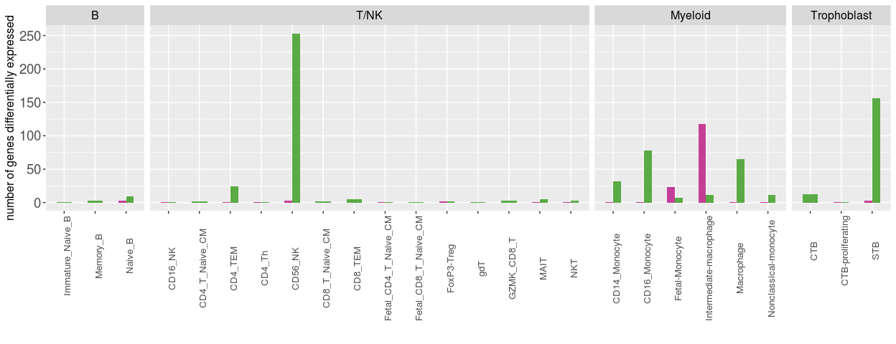
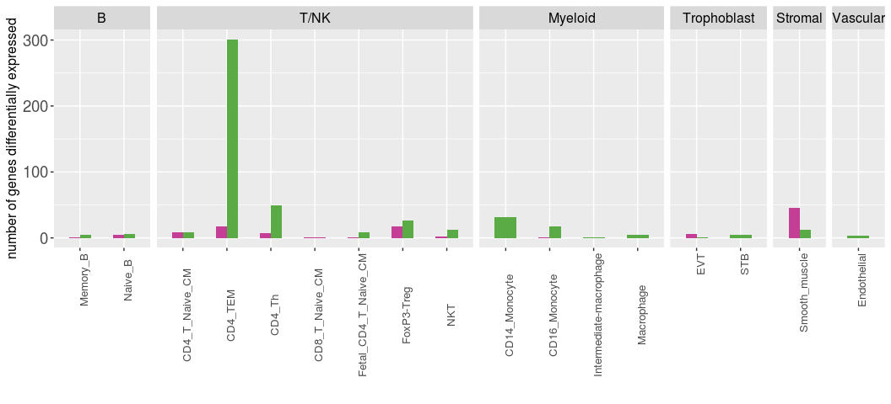
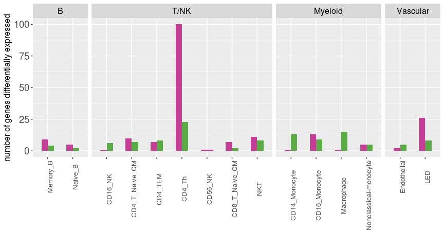
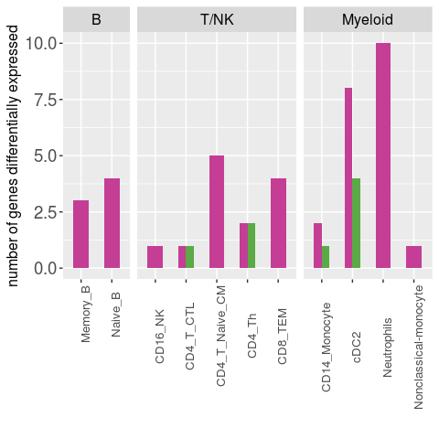

FMI all the data: quantify the overlap of signatures between PE and GA
================

Author: Yara E. Sanchez Corrales

``` r
# Load libraries and Seurat object.

library(dplyr)
library(patchwork)
library(ggplot2)
library(ggpubr)
library(tidyverse)

# Load the list of cell types and colours.
 source("/home/ssd/ysanchez/Projects/FMI-all-singlecell-20230308/scripts/single-cell-annotation/FMI-celltypes-ordered-list.R")
```

# Introduction

We would like count the number of genes in the average contrast by
condition or gestational age (AveragePE, AverageGA) and produce a
barplot.Here we show that we manage to separate the effects of
gestational age and disease.

*Note*: This is for supplementary figure on overlap

``` r
# These are the thresholds used:
p_thr <- 0.05
logFC_threshold = 0.50

# directory of the EdgeR results
dir <- "/home/ssd/ysanchez/Projects/FMI-all-singlecell-20230308/outputs/EdgeR-single-cell-20240828/EdgeR-single-cell-model2-GA_Condition-20240828/"

# dirsave
dirsave <- "/home/ssd/ysanchez/Projects/FMI-all-singlecell-20230308/plots/20250228_overlap_AvGA_AvPE/"

# sc-FMI-overlap_AvPE_avGA_v4_for_figure.Rmd
```

# Functions

# Tissue = Placenta

``` r
# Count the number of DE per contrast
avPE <- df_results_per_contrast_tissue("Placenta","AveragePE")
```

    ## Joining, by = "CellTypeManual.l3"

``` r
avGA <- df_results_per_contrast_tissue("Placenta","AverageGA")
```

    ## Joining, by = "CellTypeManual.l3"

``` r
# bind the dataframes
# This is a data frame counting the number of DE per contrast
df_placenta <- rbind(avPE,avGA)
```

``` r
tissue= "Placenta"
p1 <- barplot_number_genes_contrast(tissue, df_placenta)
p1
```

<!-- -->

# CAM

``` r
# Count the number of DE per contrast
avPE_cam <- df_results_per_contrast_tissue("CAM","AveragePE")
```

    ## Joining, by = "CellTypeManual.l3"

``` r
avGA_cam <- df_results_per_contrast_tissue("CAM","AverageGA")
```

    ## Joining, by = "CellTypeManual.l3"

``` r
df_cam <- rbind(avPE_cam,avGA_cam)
length(unique(df_cam$cell_type))
```

    ## [1] 17

``` r
tissue="CAM"
p2 <- barplot_number_genes_contrast(tissue, df_cam)
p2
```

<!-- -->

# Myometrium

``` r
# Count the number of DE per contrast
avPE_myo <- df_results_per_contrast_tissue("Myometrium","AveragePE")
```

    ## Joining, by = "CellTypeManual.l3"

``` r
avGA_myo <- df_results_per_contrast_tissue("Myometrium","AverageGA")
```

    ## Joining, by = "CellTypeManual.l3"

``` r
df_myo <- rbind(avPE_myo,avGA_myo)
length(unique(df_myo$cell_type))
```

    ## [1] 15

``` r
tissue="Myometrium"
p3 <- barplot_number_genes_contrast(tissue, df_myo)
p3
```

<!-- -->

# PBMC

``` r
# Count the number of DE per contrast
avPE_pbmc <- df_results_per_contrast_tissue("PBMC","AveragePE")
```

    ## Joining, by = "CellTypeManual.l3"

``` r
avGA_pbmc <- df_results_per_contrast_tissue("PBMC","AverageGA")
```

    ## Joining, by = "CellTypeManual.l3"

``` r
df_pbmc <- rbind(avPE_pbmc,avGA_pbmc)
length(unique(df_pbmc$cell_type))
```

    ## [1] 11

``` r
tissue="PBMC"
p4 <- barplot_number_genes_contrast(tissue, df_pbmc)
p4
```

<!-- -->

``` r
sessionInfo()
```

    ## R version 4.1.1 (2021-08-10)
    ## Platform: x86_64-pc-linux-gnu (64-bit)
    ## Running under: Red Hat Enterprise Linux Server 7.6 (Maipo)
    ## 
    ## Matrix products: default
    ## BLAS:   /apps/R/4.1.1/lib64/R/lib/libRblas.so
    ## LAPACK: /apps/R/4.1.1/lib64/R/lib/libRlapack.so
    ## 
    ## locale:
    ##  [1] LC_CTYPE=en_US.UTF-8       LC_NUMERIC=C               LC_TIME=en_US.UTF-8        LC_COLLATE=en_US.UTF-8     LC_MONETARY=en_US.UTF-8    LC_MESSAGES=en_US.UTF-8   
    ##  [7] LC_PAPER=en_US.UTF-8       LC_NAME=C                  LC_ADDRESS=C               LC_TELEPHONE=C             LC_MEASUREMENT=en_US.UTF-8 LC_IDENTIFICATION=C       
    ## 
    ## attached base packages:
    ## [1] stats4    stats     graphics  grDevices utils     datasets  methods   base     
    ## 
    ## other attached packages:
    ##  [1] ggpubr_0.4.0                patchwork_1.1.1             kableExtra_1.4.0            knitr_1.45                  data.table_1.14.2           EnhancedVolcano_1.13.2     
    ##  [7] ggrepel_0.9.1               scran_1.22.1                edgeR_3.36.0                limma_3.50.3                scater_1.22.0               scuttle_1.4.0              
    ## [13] SingleCellExperiment_1.16.0 SummarizedExperiment_1.24.0 Biobase_2.54.0              GenomicRanges_1.46.1        GenomeInfoDb_1.30.0         IRanges_2.28.0             
    ## [19] S4Vectors_0.32.3            BiocGenerics_0.40.0         MatrixGenerics_1.6.0        matrixStats_0.61.0          forcats_0.5.1               purrr_1.0.2                
    ## [25] readr_2.1.1                 tidyr_1.1.4                 tibble_3.1.6                tidyverse_1.3.1             stringr_1.4.0               cowplot_1.1.1              
    ## [31] ggplot2_3.3.5               SeuratObject_4.1.3          Seurat_4.2.1                dplyr_1.0.7                
    ## 
    ## loaded via a namespace (and not attached):
    ##   [1] utf8_1.2.2                spatstat.explore_3.0-5    reticulate_1.24           tidyselect_1.1.1          htmlwidgets_1.5.4         grid_4.1.1                BiocParallel_1.28.3      
    ##   [8] Rtsne_0.15                munsell_0.5.0             ScaledMatrix_1.2.0        codetools_0.2-18          ica_1.0-2                 statmod_1.4.36            future_1.23.0            
    ##  [15] miniUI_0.1.1.1            withr_2.5.0               spatstat.random_3.0-1     colorspace_2.0-2          progressr_0.10.0          highr_0.9                 rstudioapi_0.13          
    ##  [22] ROCR_1.0-11               ggsignif_0.6.3            tensor_1.5                listenv_0.8.0             labeling_0.4.2            GenomeInfoDbData_1.2.7    polyclip_1.10-0          
    ##  [29] farver_2.1.0              parallelly_1.30.0         vctrs_0.6.5               generics_0.1.1            xfun_0.41                 R6_2.5.1                  ggbeeswarm_0.6.0         
    ##  [36] rsvd_1.0.5                locfit_1.5-9.4            bitops_1.0-7              spatstat.utils_3.0-1      DelayedArray_0.20.0       assertthat_0.2.1          promises_1.2.0.1         
    ##  [43] scales_1.1.1              beeswarm_0.4.0            gtable_0.3.0              beachmat_2.10.0           globals_0.14.0            goftest_1.2-3             rlang_1.1.1              
    ##  [50] systemfonts_1.0.3         splines_4.1.1             rstatix_0.7.0             lazyeval_0.2.2            spatstat.geom_3.0-3       broom_0.7.11              yaml_2.2.2               
    ##  [57] reshape2_1.4.4            abind_1.4-5               modelr_0.1.8              backports_1.4.1           httpuv_1.6.5              tools_4.1.1               ellipsis_0.3.2           
    ##  [64] RColorBrewer_1.1-2        ggridges_0.5.3            Rcpp_1.0.8                plyr_1.8.6                sparseMatrixStats_1.6.0   zlibbioc_1.40.0           RCurl_1.98-1.5           
    ##  [71] deldir_1.0-6              pbapply_1.5-0             viridis_0.6.2             zoo_1.8-9                 haven_2.4.3               cluster_2.1.2             fs_1.5.2                 
    ##  [78] magrittr_2.0.1            scattermore_0.7           lmtest_0.9-39             reprex_2.0.1              RANN_2.6.1                fitdistrplus_1.1-6        evaluate_0.23            
    ##  [85] hms_1.1.1                 mime_0.12                 xtable_1.8-4              readxl_1.3.1              gridExtra_2.3             compiler_4.1.1            KernSmooth_2.23-20       
    ##  [92] crayon_1.4.2              htmltools_0.5.8.1         later_1.3.0               tzdb_0.2.0                lubridate_1.8.0           DBI_1.1.2                 dbplyr_2.1.1             
    ##  [99] MASS_7.3-55               car_3.0-12                Matrix_1.5-4.1            cli_3.6.1                 parallel_4.1.1            metapod_1.2.0             igraph_1.2.11            
    ## [106] pkgconfig_2.0.3           sp_1.5-1                  plotly_4.10.0             spatstat.sparse_3.0-0     xml2_1.3.3                svglite_2.1.0             vipor_0.4.5              
    ## [113] dqrng_0.3.0               XVector_0.34.0            rvest_1.0.2               digest_0.6.29             sctransform_0.3.5         RcppAnnoy_0.0.19          spatstat.data_3.0-0      
    ## [120] rmarkdown_2.25            cellranger_1.1.0          leiden_0.3.9              uwot_0.1.14               DelayedMatrixStats_1.16.0 shiny_1.7.1               lifecycle_1.0.4          
    ## [127] nlme_3.1-155              jsonlite_1.7.3            carData_3.0-5             BiocNeighbors_1.12.0      viridisLite_0.4.0         fansi_1.0.2               pillar_1.6.5             
    ## [134] lattice_0.20-45           fastmap_1.1.1             httr_1.4.2                survival_3.2-13           glue_1.6.1                png_0.1-7                 bluster_1.4.0            
    ## [141] stringi_1.7.6             BiocSingular_1.10.0       irlba_2.3.5               future.apply_1.8.1
