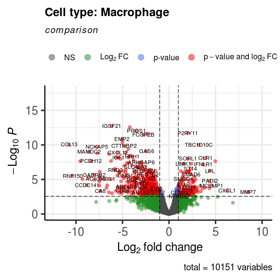
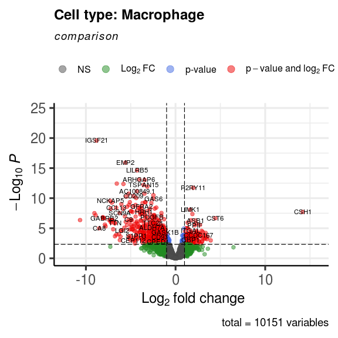
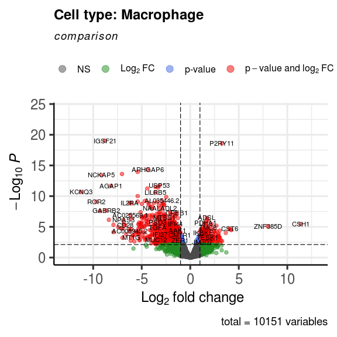

Single-cell FMI: check the output of EdgeR across tissues (Macrophages only)
================

Author: Yara E. Sanchez Corrales

# Introduction

We want to check for Macrophages differences **across tissues only in
PE** in either Early or Late disease.The object contains only PE from
both Early and Late.

Here I performed a paired differential expression analysis across
tissues within the PE group, accounting for donor-level effects.

This answers: What are the genes that different depending on the tissue?

*design &lt;- model.matrix(\~0 + Condition.Tissue, y\$samples)*

\*Contrasts evaluated here are:

    1. PVBP_Myometrium_Early = Condition.TissueEarly_PE_PVBP - Condition.TissueEarly_PE_Myometrium, <br>
    2. PVBP_CAM_Early = Condition.TissueEarly_PE_PVBP - Condition.TissueEarly_PE_CAM, <br>

    3. PVBP_Myometrium_Late = Condition.TissueLate_PE_PVBP - Condition.TissueLate_PE_Myometrium, <br>
    4. PVBP_CAM_Late = Condition.TissueLate_PE_PVBP - Condition.TissueLate_PE_CAM, <br>

*Note*: volcano plots are not rendered in this notebook.

``` r
library(dplyr)
library(Seurat)
library(ggplot2)
library(tidyverse)
library(SingleCellExperiment)
library(scater)
library(edgeR)
library(scran)
library(EnhancedVolcano)
require(data.table)
require(knitr)
library(kableExtra)

source("/home/ssd/ysanchez/Projects/FMI-all-singlecell-20230308/scripts/single-cell-annotation/FMI-celltypes-ordered-list.R")
```

``` r
# Establish the thresholds to consider something DEG
p_thr <- 0.05
logFC_thr <- 1.0
```

    ##        X  genes     logFC   logCPM       LR       PValue          FDR         padj  cell_type
    ## 1 IGSF21 IGSF21 -6.154465 5.840291 54.18902 1.821017e-13 1.371154e-09 1.371154e-09 Macrophage
    ## 2 LILRB5 LILRB5 -4.219285 7.419667 53.41410 2.701515e-13 1.371154e-09 1.371154e-09 Macrophage
    ## 3  PROS1  PROS1 -3.523925 4.600723 51.14282 8.588430e-13 2.906038e-09 2.906038e-09 Macrophage
    ## 4 P2RY11 P2RY11  2.023350 4.829416 49.60573 1.879636e-12 4.643587e-09 4.643587e-09 Macrophage
    ## 5  CLIC2  CLIC2 -2.303506 5.994816 49.22069 2.287256e-12 4.643587e-09 4.643587e-09 Macrophage
    ## 6 FCGR2B FCGR2B -2.738093 7.588563 48.54480 3.228290e-12 5.461729e-09 5.461729e-09 Macrophage

# Early disease

## Volcano plots and tables: PVBP vs Myometrium

``` r
# PVBP_Myo_Early 
# How many genes are different using a p_thr? 
number_of_deg_genes <- number_of_deg(PVBP_Myo_Early, p_thr)
number_of_deg_genes
```

    ## # A tibble: 1 × 2
    ## # Groups:   cell_type [1]
    ##   cell_type      n
    ##   <chr>      <int>
    ## 1 Macrophage   554

``` r
# call the function plot_volcano
plot1 <- plot_volcano(PVBP_Myo_Early, "PVBP_vs_Myo_Early")
plot1
```

<!-- -->

``` r
#  call the function make_a_deg_table <- function(table, p_thr,logFC_thr)
make_a_deg_table(PVBP_Myo_Early,p_thr, logFC_thr)
```

    ## [1] "Results for celltype:"
    ## [1] "Macrophage"
    ## [1] "Genes upregulated in disease"
    ## 
    ## 
    ## |genes       |    logFC|      padj|cell_type  |
    ## |:-----------|--------:|---------:|:----------|
    ## |MMP7        | 8.481598| 0.0172414|Macrophage |
    ## |CXCL1       | 6.252499| 0.0134908|Macrophage |
    ## |CST6        | 4.975774| 0.0000074|Macrophage |
    ## |MCEMP1      | 4.571641| 0.0040184|Macrophage |
    ## |LPL         | 4.386186| 0.0000967|Macrophage |
    ## |PADI2       | 4.350600| 0.0011030|Macrophage |
    ## |AGRP        | 4.333156| 0.0073951|Macrophage |
    ## |OLR1        | 3.916310| 0.0000030|Macrophage |
    ## |ZNF385D     | 3.876851| 0.0059942|Macrophage |
    ## |IFNLR1      | 3.682257| 0.0000157|Macrophage |
    ## |RETN        | 3.627403| 0.0077661|Macrophage |
    ## |TPST1       | 3.406044| 0.0154105|Macrophage |
    ## |PHLDA1      | 3.332765| 0.0041028|Macrophage |
    ## |TBC1D10C    | 3.195976| 0.0000001|Macrophage |
    ## |ICAM3       | 3.087369| 0.0183857|Macrophage |
    ## |SDS         | 3.042539| 0.0082652|Macrophage |
    ## |C3          | 2.953767| 0.0122324|Macrophage |
    ## |MRC2        | 2.930067| 0.0144330|Macrophage |
    ## |MELTF       | 2.887712| 0.0053998|Macrophage |
    ## |STK39       | 2.850430| 0.0007591|Macrophage |
    ## |S1PR4       | 2.757159| 0.0057071|Macrophage |
    ## |COL8A2      | 2.743173| 0.0003702|Macrophage |
    ## |HS3ST1      | 2.719496| 0.0045733|Macrophage |
    ## |SPTBN1      | 2.699820| 0.0229740|Macrophage |
    ## |ANO5        | 2.686358| 0.0094807|Macrophage |
    ## |RAB7B       | 2.683064| 0.0011780|Macrophage |
    ## |GPAT3       | 2.646271| 0.0247843|Macrophage |
    ## |CLEC5A      | 2.618485| 0.0013604|Macrophage |
    ## |PLD4        | 2.616406| 0.0172415|Macrophage |
    ## |SEMA3C      | 2.611383| 0.0485364|Macrophage |
    ## |PALM2-AKAP2 | 2.563817| 0.0145532|Macrophage |
    ## |IL1RN       | 2.549881| 0.0073928|Macrophage |
    ## |CD69        | 2.532656| 0.0007591|Macrophage |
    ## |MAP3K7CL    | 2.526975| 0.0016416|Macrophage |
    ## |SPN         | 2.491490| 0.0051311|Macrophage |
    ## |MEIKIN      | 2.466094| 0.0343822|Macrophage |
    ## |PPARG       | 2.448738| 0.0068559|Macrophage |
    ## |AC026369.3  | 2.443975| 0.0109732|Macrophage |
    ## |LSP1        | 2.438496| 0.0076432|Macrophage |
    ## |ASB1        | 2.421832| 0.0000133|Macrophage |
    ## |CD9         | 2.366359| 0.0280919|Macrophage |
    ## |IFITM10     | 2.364221| 0.0146703|Macrophage |
    ## |SMAD6       | 2.360482| 0.0002122|Macrophage |
    ## |TMEM52B     | 2.334234| 0.0170878|Macrophage |
    ## |ST14        | 2.312234| 0.0000605|Macrophage |
    ## |TPRG1       | 2.265995| 0.0033647|Macrophage |
    ## |CATSPER1    | 2.246188| 0.0133150|Macrophage |
    ## |HSD3B7      | 2.180462| 0.0360483|Macrophage |
    ## |MAP3K2-DT   | 2.165840| 0.0178317|Macrophage |
    ## |RGS1        | 2.164935| 0.0011294|Macrophage |
    ## |VASH1       | 2.161167| 0.0000959|Macrophage |
    ## |MACC1       | 2.157181| 0.0157313|Macrophage |
    ## |RMDN3       | 2.155185| 0.0001075|Macrophage |
    ## |OSM         | 2.134905| 0.0176387|Macrophage |
    ## |CKAP4       | 2.114024| 0.0110469|Macrophage |
    ## |DOCK3       | 2.101503| 0.0393060|Macrophage |
    ## |SPP1        | 2.096543| 0.0397039|Macrophage |
    ## |AMZ1        | 2.078578| 0.0073951|Macrophage |
    ## |METTL1      | 2.070324| 0.0468432|Macrophage |
    ## |ITGAL       | 2.050836| 0.0001133|Macrophage |
    ## |SYNGR1      | 2.050270| 0.0331681|Macrophage |
    ## |P2RY11      | 2.023350| 0.0000000|Macrophage |
    ## |SORL1       | 2.008784| 0.0000039|Macrophage |
    ## |HMGA1       | 1.909714| 0.0201905|Macrophage |
    ## |PLAUR       | 1.888711| 0.0001037|Macrophage |
    ## |RASGRP3     | 1.883036| 0.0006930|Macrophage |
    ## |LINC00900   | 1.878251| 0.0123583|Macrophage |
    ## |LINC00513   | 1.861870| 0.0094639|Macrophage |
    ## |SLC9A7      | 1.841320| 0.0034083|Macrophage |
    ## |AC068282.1  | 1.838709| 0.0001350|Macrophage |
    ## |ATF3        | 1.835470| 0.0292387|Macrophage |
    ## |NLRP12      | 1.785370| 0.0211761|Macrophage |
    ## |ZNF331      | 1.767761| 0.0127733|Macrophage |
    ## |KLHDC7B     | 1.743952| 0.0151318|Macrophage |
    ## |RGS2        | 1.721638| 0.0121136|Macrophage |
    ## |PPIF        | 1.653154| 0.0119161|Macrophage |
    ## |PRAM1       | 1.622338| 0.0225598|Macrophage |
    ## |STXBP2      | 1.601624| 0.0043902|Macrophage |
    ## |AL356417.3  | 1.597825| 0.0093271|Macrophage |
    ## |SGK1        | 1.580810| 0.0098368|Macrophage |
    ## |SRD5A3      | 1.579333| 0.0252312|Macrophage |
    ## |SPATA13     | 1.558589| 0.0001296|Macrophage |
    ## |LIMK1       | 1.554342| 0.0000133|Macrophage |
    ## |TAGAP       | 1.544909| 0.0009315|Macrophage |
    ## |ELL2        | 1.541162| 0.0027206|Macrophage |
    ## |SMCO4       | 1.537214| 0.0006749|Macrophage |
    ## |ORAI2       | 1.518370| 0.0270274|Macrophage |
    ## |MFSD13A     | 1.513913| 0.0267156|Macrophage |
    ## |TRERF1      | 1.505019| 0.0323683|Macrophage |
    ## |ITGAX       | 1.501737| 0.0455986|Macrophage |
    ## |RASAL3      | 1.493880| 0.0003947|Macrophage |
    ## |APOBR       | 1.477089| 0.0156858|Macrophage |
    ## |NETO2       | 1.448100| 0.0472924|Macrophage |
    ## |CD72        | 1.436633| 0.0443372|Macrophage |
    ## |CXXC5       | 1.415433| 0.0397039|Macrophage |
    ## |AC015871.1  | 1.407463| 0.0176578|Macrophage |
    ## |CD300LF     | 1.398711| 0.0194399|Macrophage |
    ## |TEX2        | 1.394717| 0.0485364|Macrophage |
    ## |ZNF804A     | 1.379972| 0.0209219|Macrophage |
    ## |RHOBTB2     | 1.340309| 0.0014417|Macrophage |
    ## |SMAD7       | 1.334392| 0.0011030|Macrophage |
    ## |MTHFD1L     | 1.326932| 0.0414030|Macrophage |
    ## |TOM1        | 1.272677| 0.0000967|Macrophage |
    ## |ATP6V0D1    | 1.250738| 0.0351631|Macrophage |
    ## |GMPPB       | 1.238069| 0.0207691|Macrophage |
    ## |SWI5        | 1.235157| 0.0466646|Macrophage |
    ## |NCLN        | 1.228182| 0.0495339|Macrophage |
    ## |PPAN        | 1.227112| 0.0402397|Macrophage |
    ## |TRIM24      | 1.184600| 0.0069805|Macrophage |
    ## |NLRC5       | 1.170522| 0.0485364|Macrophage |
    ## |FAM20C      | 1.138432| 0.0440897|Macrophage |
    ## |LIMS1       | 1.136464| 0.0011669|Macrophage |
    ## |SLC43A3     | 1.131879| 0.0171627|Macrophage |
    ## |MAP4K3-DT   | 1.128383| 0.0057023|Macrophage |
    ## |ALCAM       | 1.116397| 0.0301539|Macrophage |
    ## |SH3BP1      | 1.116354| 0.0063578|Macrophage |
    ## |POLD1       | 1.111018| 0.0027295|Macrophage |
    ## |MXD1        | 1.107668| 0.0163407|Macrophage |
    ## |PLK3        | 1.089754| 0.0436480|Macrophage |
    ## |ABHD2       | 1.086429| 0.0047833|Macrophage |
    ## |VPS18       | 1.080432| 0.0267156|Macrophage |
    ## |GPCPD1      | 1.077142| 0.0180210|Macrophage |
    ## |SQOR        | 1.076313| 0.0033731|Macrophage |
    ## |STAT1       | 1.072589| 0.0146703|Macrophage |
    ## |BST1        | 1.071528| 0.0081954|Macrophage |
    ## |SFXN4       | 1.067704| 0.0085791|Macrophage |
    ## |BCL6        | 1.049843| 0.0470142|Macrophage |
    ## |ADPRHL2     | 1.046640| 0.0130018|Macrophage |
    ## |STX4        | 1.042665| 0.0061272|Macrophage |
    ## |NFKBIE      | 1.040479| 0.0498114|Macrophage |
    ## |GLYCTK      | 1.039715| 0.0256893|Macrophage |
    ## |DOK3        | 1.037172| 0.0211497|Macrophage |
    ## |MFSD12      | 1.027010| 0.0380483|Macrophage |
    ## |ATP6V1B2    | 1.013226| 0.0055512|Macrophage |
    ## |SLC25A32    | 1.012115| 0.0115045|Macrophage |
    ## |HM13        | 1.001614| 0.0213304|Macrophage |
    ## 
    ## [1] "Genes downregulated in disease"
    ## 
    ## 
    ## |genes      |      logFC|      padj|cell_type  |
    ## |:----------|----------:|---------:|:----------|
    ## |PIK3C2A    |  -1.000424| 0.0466646|Macrophage |
    ## |ZNF701     |  -1.000932| 0.0427367|Macrophage |
    ## |RASGRP4    |  -1.004070| 0.0160552|Macrophage |
    ## |KIF20B     |  -1.010076| 0.0146703|Macrophage |
    ## |ZNF362     |  -1.018770| 0.0122324|Macrophage |
    ## |EGLN1      |  -1.030643| 0.0308596|Macrophage |
    ## |CREM       |  -1.042443| 0.0453318|Macrophage |
    ## |FGD2       |  -1.070097| 0.0408485|Macrophage |
    ## |TLR5       |  -1.072973| 0.0225598|Macrophage |
    ## |SARM1      |  -1.101946| 0.0270988|Macrophage |
    ## |TWSG1      |  -1.105773| 0.0292387|Macrophage |
    ## |MTMR12     |  -1.117544| 0.0273788|Macrophage |
    ## |PXDC1      |  -1.120579| 0.0323683|Macrophage |
    ## |PRKACB     |  -1.128578| 0.0068559|Macrophage |
    ## |ANTXR2     |  -1.129126| 0.0472924|Macrophage |
    ## |CYBRD1     |  -1.136362| 0.0209219|Macrophage |
    ## |CYBB       |  -1.139582| 0.0297133|Macrophage |
    ## |MKNK1      |  -1.141856| 0.0092129|Macrophage |
    ## |PPP3R1     |  -1.147208| 0.0308596|Macrophage |
    ## |RCBTB1     |  -1.156029| 0.0185478|Macrophage |
    ## |ZMYND11    |  -1.157966| 0.0095165|Macrophage |
    ## |ITGAM      |  -1.168833| 0.0105628|Macrophage |
    ## |NLRP1      |  -1.183496| 0.0384161|Macrophage |
    ## |ADAMTSL4   |  -1.184089| 0.0229740|Macrophage |
    ## |TERF2      |  -1.189668| 0.0157313|Macrophage |
    ## |MEF2C      |  -1.190392| 0.0260431|Macrophage |
    ## |STX2       |  -1.204106| 0.0191750|Macrophage |
    ## |LUZP1      |  -1.219656| 0.0222103|Macrophage |
    ## |SMARCA2    |  -1.231000| 0.0142326|Macrophage |
    ## |EPS15      |  -1.233305| 0.0134908|Macrophage |
    ## |AHNAK      |  -1.246888| 0.0472924|Macrophage |
    ## |MYO7A      |  -1.255994| 0.0419809|Macrophage |
    ## |TRPM4      |  -1.280503| 0.0102792|Macrophage |
    ## |NCOA7      |  -1.289235| 0.0400716|Macrophage |
    ## |GOLGA4     |  -1.298171| 0.0084313|Macrophage |
    ## |ARHGAP21   |  -1.302712| 0.0057071|Macrophage |
    ## |DAB2       |  -1.340301| 0.0050356|Macrophage |
    ## |FCHO2      |  -1.349745| 0.0030433|Macrophage |
    ## |MTM1       |  -1.359868| 0.0162089|Macrophage |
    ## |ANKAR      |  -1.364472| 0.0098902|Macrophage |
    ## |SNX9       |  -1.367344| 0.0024800|Macrophage |
    ## |FAM118B    |  -1.371125| 0.0014417|Macrophage |
    ## |EVI5       |  -1.388758| 0.0075546|Macrophage |
    ## |FCGR2A     |  -1.390549| 0.0003702|Macrophage |
    ## |HIP1       |  -1.394176| 0.0229740|Macrophage |
    ## |ABI2       |  -1.397304| 0.0282755|Macrophage |
    ## |MBNL2      |  -1.402506| 0.0071629|Macrophage |
    ## |ULK2       |  -1.405541| 0.0436656|Macrophage |
    ## |PELI1      |  -1.430451| 0.0144330|Macrophage |
    ## |FLI1       |  -1.431838| 0.0188431|Macrophage |
    ## |SPATS2L    |  -1.448626| 0.0000959|Macrophage |
    ## |MYLIP      |  -1.453141| 0.0499009|Macrophage |
    ## |UACA       |  -1.464932| 0.0360483|Macrophage |
    ## |BIN1       |  -1.468037| 0.0305163|Macrophage |
    ## |IFT88      |  -1.468369| 0.0066586|Macrophage |
    ## |MYO1C      |  -1.477850| 0.0146664|Macrophage |
    ## |NHSL1      |  -1.478019| 0.0351631|Macrophage |
    ## |USP53      |  -1.488449| 0.0332623|Macrophage |
    ## |OLFML2B    |  -1.492376| 0.0007889|Macrophage |
    ## |IDH1       |  -1.498224| 0.0402686|Macrophage |
    ## |ZBTB20     |  -1.517821| 0.0146703|Macrophage |
    ## |UNKL       |  -1.520556| 0.0452419|Macrophage |
    ## |GIMAP8     |  -1.537773| 0.0006749|Macrophage |
    ## |PEAK1      |  -1.538126| 0.0361318|Macrophage |
    ## |NFATC1     |  -1.549565| 0.0379320|Macrophage |
    ## |TLE4       |  -1.561986| 0.0031803|Macrophage |
    ## |RNF125     |  -1.567657| 0.0011058|Macrophage |
    ## |MPEG1      |  -1.570986| 0.0230460|Macrophage |
    ## |TTC28      |  -1.575391| 0.0476851|Macrophage |
    ## |CCDC170    |  -1.590972| 0.0025793|Macrophage |
    ## |RUBCNL     |  -1.592183| 0.0152614|Macrophage |
    ## |MLLT1      |  -1.598175| 0.0142704|Macrophage |
    ## |NBPF15     |  -1.613589| 0.0443372|Macrophage |
    ## |SEPTIN11   |  -1.621876| 0.0260431|Macrophage |
    ## |C1RL       |  -1.635976| 0.0106907|Macrophage |
    ## |TTYH2      |  -1.636935| 0.0066053|Macrophage |
    ## |TMOD2      |  -1.638026| 0.0025852|Macrophage |
    ## |VSIG4      |  -1.648452| 0.0229740|Macrophage |
    ## |MAP3K6     |  -1.650500| 0.0379731|Macrophage |
    ## |CAPS2      |  -1.650716| 0.0443372|Macrophage |
    ## |NOL3       |  -1.655363| 0.0053350|Macrophage |
    ## |CMKLR1     |  -1.661865| 0.0025598|Macrophage |
    ## |CALML4     |  -1.666542| 0.0003181|Macrophage |
    ## |ZCCHC24    |  -1.681818| 0.0381805|Macrophage |
    ## |YPEL2      |  -1.689971| 0.0003517|Macrophage |
    ## |PDGFB      |  -1.694018| 0.0216297|Macrophage |
    ## |DUSP6      |  -1.708692| 0.0041028|Macrophage |
    ## |EXOC6B     |  -1.709970| 0.0399306|Macrophage |
    ## |ZSCAN18    |  -1.714762| 0.0427367|Macrophage |
    ## |GPR155     |  -1.717108| 0.0092649|Macrophage |
    ## |WWC2       |  -1.721001| 0.0221411|Macrophage |
    ## |ALDH7A1    |  -1.721394| 0.0280919|Macrophage |
    ## |CD163      |  -1.726415| 0.0196026|Macrophage |
    ## |ENPP4      |  -1.732323| 0.0016202|Macrophage |
    ## |DTNB       |  -1.736723| 0.0418012|Macrophage |
    ## |EMP1       |  -1.748467| 0.0461499|Macrophage |
    ## |EPB41L2    |  -1.749759| 0.0045607|Macrophage |
    ## |SMAP2      |  -1.756610| 0.0005684|Macrophage |
    ## |SEPTIN8    |  -1.759652| 0.0178317|Macrophage |
    ## |FAM20A     |  -1.760701| 0.0221411|Macrophage |
    ## |ATN1       |  -1.765415| 0.0001547|Macrophage |
    ## |AL035587.1 |  -1.780814| 0.0031398|Macrophage |
    ## |IFT74      |  -1.786772| 0.0005684|Macrophage |
    ## |SCN1B      |  -1.786806| 0.0134908|Macrophage |
    ## |NFE2L3     |  -1.789633| 0.0351631|Macrophage |
    ## |RELL1      |  -1.794214| 0.0007637|Macrophage |
    ## |MS4A4E     |  -1.797668| 0.0120762|Macrophage |
    ## |ST6GAL1    |  -1.798776| 0.0269281|Macrophage |
    ## |TMCC3      |  -1.803899| 0.0125500|Macrophage |
    ## |ARHGAP5    |  -1.823301| 0.0050829|Macrophage |
    ## |KSR1       |  -1.832135| 0.0146703|Macrophage |
    ## |VOPP1      |  -1.837145| 0.0001493|Macrophage |
    ## |SNED1      |  -1.844680| 0.0021540|Macrophage |
    ## |C2         |  -1.857541| 0.0006129|Macrophage |
    ## |PGM2L1     |  -1.863118| 0.0027716|Macrophage |
    ## |EMB        |  -1.871505| 0.0003704|Macrophage |
    ## |ZKSCAN4    |  -1.882253| 0.0014417|Macrophage |
    ## |AC087854.1 |  -1.887467| 0.0209375|Macrophage |
    ## |PLB1       |  -1.888763| 0.0007702|Macrophage |
    ## |PLEKHA5    |  -1.897051| 0.0084313|Macrophage |
    ## |DSC2       |  -1.897681| 0.0001866|Macrophage |
    ## |ANKS1A     |  -1.923819| 0.0036561|Macrophage |
    ## |ETS2       |  -1.944511| 0.0000736|Macrophage |
    ## |CD93       |  -1.944643| 0.0084313|Macrophage |
    ## |PMP22      |  -1.950640| 0.0049524|Macrophage |
    ## |UST        |  -1.953672| 0.0132424|Macrophage |
    ## |RHOBTB1    |  -1.954435| 0.0005494|Macrophage |
    ## |TBC1D4     |  -1.966224| 0.0066586|Macrophage |
    ## |FAXDC2     |  -1.983811| 0.0035467|Macrophage |
    ## |ASAP2      |  -1.990223| 0.0057006|Macrophage |
    ## |EPHX1      |  -2.002801| 0.0006930|Macrophage |
    ## |MB21D2     |  -2.009518| 0.0152566|Macrophage |
    ## |AL356124.1 |  -2.014555| 0.0472924|Macrophage |
    ## |CD55       |  -2.040600| 0.0211761|Macrophage |
    ## |LINC01684  |  -2.042561| 0.0483955|Macrophage |
    ## |TBC1D14    |  -2.043542| 0.0020428|Macrophage |
    ## |CCND1      |  -2.045456| 0.0005491|Macrophage |
    ## |CLEC10A    |  -2.047652| 0.0443372|Macrophage |
    ## |DISP1      |  -2.060607| 0.0028516|Macrophage |
    ## |LRMP       |  -2.060771| 0.0001274|Macrophage |
    ## |GATM       |  -2.137093| 0.0081954|Macrophage |
    ## |TFCP2L1    |  -2.140178| 0.0108445|Macrophage |
    ## |HIVEP2     |  -2.148872| 0.0206140|Macrophage |
    ## |ITGB5      |  -2.149941| 0.0000795|Macrophage |
    ## |EGR1       |  -2.153468| 0.0026438|Macrophage |
    ## |RAB3IL1    |  -2.156729| 0.0006985|Macrophage |
    ## |TSPAN15    |  -2.157272| 0.0018572|Macrophage |
    ## |ACSM5      |  -2.160486| 0.0221150|Macrophage |
    ## |MOB3B      |  -2.161878| 0.0086125|Macrophage |
    ## |AL160272.1 |  -2.183791| 0.0143318|Macrophage |
    ## |STPG4      |  -2.191891| 0.0381447|Macrophage |
    ## |SLC24A4    |  -2.192499| 0.0014043|Macrophage |
    ## |ZDHHC14    |  -2.202342| 0.0035932|Macrophage |
    ## |DCBLD2     |  -2.212951| 0.0317488|Macrophage |
    ## |DAAM1      |  -2.213218| 0.0000959|Macrophage |
    ## |CNRIP1     |  -2.220308| 0.0007889|Macrophage |
    ## |LINC00996  |  -2.243826| 0.0375034|Macrophage |
    ## |ACVRL1     |  -2.275073| 0.0158912|Macrophage |
    ## |DTNA       |  -2.275351| 0.0091493|Macrophage |
    ## |LINC01482  |  -2.280172| 0.0018633|Macrophage |
    ## |HECTD2     |  -2.289090| 0.0002324|Macrophage |
    ## |WNT2B      |  -2.294305| 0.0005774|Macrophage |
    ## |TRAM2      |  -2.297600| 0.0026928|Macrophage |
    ## |CLIC2      |  -2.303505| 0.0000000|Macrophage |
    ## |NAALADL2   |  -2.304551| 0.0019614|Macrophage |
    ## |SNX7       |  -2.314042| 0.0082652|Macrophage |
    ## |FRMD4B     |  -2.328521| 0.0001296|Macrophage |
    ## |MPP5       |  -2.330115| 0.0003329|Macrophage |
    ## |EXT1       |  -2.344786| 0.0037389|Macrophage |
    ## |ICA1       |  -2.354468| 0.0007591|Macrophage |
    ## |HSF4       |  -2.363518| 0.0005567|Macrophage |
    ## |EPS8       |  -2.370798| 0.0001666|Macrophage |
    ## |MEF2C-AS1  |  -2.374698| 0.0068559|Macrophage |
    ## |DEPTOR     |  -2.376084| 0.0026762|Macrophage |
    ## |KANK2      |  -2.382449| 0.0229107|Macrophage |
    ## |TNIK       |  -2.385446| 0.0001722|Macrophage |
    ## |AL356356.1 |  -2.393715| 0.0209219|Macrophage |
    ## |SULF2      |  -2.402042| 0.0121102|Macrophage |
    ## |MTSS1      |  -2.414942| 0.0002660|Macrophage |
    ## |LNCAROD    |  -2.420894| 0.0024183|Macrophage |
    ## |TNFSF15    |  -2.431177| 0.0472924|Macrophage |
    ## |PRKN       |  -2.434283| 0.0034083|Macrophage |
    ## |GAS6       |  -2.441441| 0.0000006|Macrophage |
    ## |AC110995.1 |  -2.457551| 0.0100290|Macrophage |
    ## |PTK2       |  -2.458284| 0.0226399|Macrophage |
    ## |ARHGEF12   |  -2.467166| 0.0000736|Macrophage |
    ## |SLC30A4    |  -2.468170| 0.0178232|Macrophage |
    ## |WWP1       |  -2.477154| 0.0011058|Macrophage |
    ## |FSCN1      |  -2.477618| 0.0160225|Macrophage |
    ## |SH3RF3     |  -2.499663| 0.0385312|Macrophage |
    ## |SLC9A9     |  -2.518698| 0.0058080|Macrophage |
    ## |SEL1L3     |  -2.529284| 0.0006021|Macrophage |
    ## |P2RY12     |  -2.534959| 0.0146703|Macrophage |
    ## |PLEKHA1    |  -2.542767| 0.0012561|Macrophage |
    ## |TGFA       |  -2.549006| 0.0146703|Macrophage |
    ## |CYSLTR2    |  -2.567232| 0.0037246|Macrophage |
    ## |TMEM163    |  -2.577394| 0.0196044|Macrophage |
    ## |MAF        |  -2.583615| 0.0000326|Macrophage |
    ## |ATP8B4     |  -2.633062| 0.0011994|Macrophage |
    ## |IFI27      |  -2.635653| 0.0230905|Macrophage |
    ## |ECM1       |  -2.663605| 0.0084400|Macrophage |
    ## |RHOBTB3    |  -2.668554| 0.0443372|Macrophage |
    ## |GARNL3     |  -2.670120| 0.0172637|Macrophage |
    ## |FILIP1L    |  -2.674594| 0.0006749|Macrophage |
    ## |RNF217-AS1 |  -2.699086| 0.0331681|Macrophage |
    ## |APBA1      |  -2.700468| 0.0042255|Macrophage |
    ## |PTGFRN     |  -2.710114| 0.0000892|Macrophage |
    ## |CYP1B1     |  -2.715705| 0.0033647|Macrophage |
    ## |ITGA9-AS1  |  -2.729710| 0.0335696|Macrophage |
    ## |PDE7B      |  -2.736143| 0.0437887|Macrophage |
    ## |FCGR2B     |  -2.738093| 0.0000000|Macrophage |
    ## |PDGFC      |  -2.742175| 0.0011030|Macrophage |
    ## |CTDSPL     |  -2.746826| 0.0082652|Macrophage |
    ## |PIK3R3     |  -2.767386| 0.0112959|Macrophage |
    ## |ZNF704     |  -2.772314| 0.0417842|Macrophage |
    ## |PRR5       |  -2.789275| 0.0443372|Macrophage |
    ## |MVB12B     |  -2.808056| 0.0000671|Macrophage |
    ## |ANK2       |  -2.820135| 0.0385312|Macrophage |
    ## |OTUD7A     |  -2.821512| 0.0417842|Macrophage |
    ## |COL23A1    |  -2.828121| 0.0495339|Macrophage |
    ## |AC100849.1 |  -2.831912| 0.0003407|Macrophage |
    ## |WNT5B      |  -2.850752| 0.0025852|Macrophage |
    ## |PLTP       |  -2.856729| 0.0004394|Macrophage |
    ## |MAP7       |  -2.863404| 0.0093861|Macrophage |
    ## |PLCL1      |  -2.884152| 0.0015317|Macrophage |
    ## |RYR1       |  -2.902741| 0.0024183|Macrophage |
    ## |CDC14B     |  -2.924816| 0.0160552|Macrophage |
    ## |CR1        |  -2.932005| 0.0000252|Macrophage |
    ## |KHDRBS2    |  -2.935364| 0.0032574|Macrophage |
    ## |EGR3       |  -2.943325| 0.0264167|Macrophage |
    ## |CBFA2T3    |  -2.949844| 0.0019080|Macrophage |
    ## |GNG2       |  -2.967045| 0.0000115|Macrophage |
    ## |FN3K       |  -2.971714| 0.0065876|Macrophage |
    ## |ARHGAP6    |  -2.995401| 0.0000106|Macrophage |
    ## |CDKN2A     |  -3.002837| 0.0297133|Macrophage |
    ## |PLEKHG3    |  -3.033525| 0.0020608|Macrophage |
    ## |ADGRG6     |  -3.042300| 0.0075535|Macrophage |
    ## |ME1        |  -3.057356| 0.0000736|Macrophage |
    ## |AUTS2      |  -3.058717| 0.0193797|Macrophage |
    ## |LINC01422  |  -3.121659| 0.0120762|Macrophage |
    ## |AFDN       |  -3.136143| 0.0001783|Macrophage |
    ## |SPTBN5     |  -3.171056| 0.0288745|Macrophage |
    ## |EPB41L1    |  -3.182023| 0.0021472|Macrophage |
    ## |MRC1       |  -3.258804| 0.0000119|Macrophage |
    ## |TMEM236    |  -3.260954| 0.0270977|Macrophage |
    ## |FARP1      |  -3.261402| 0.0000371|Macrophage |
    ## |AC131956.2 |  -3.273752| 0.0005685|Macrophage |
    ## |SDK1       |  -3.284750| 0.0235973|Macrophage |
    ## |RBPJ       |  -3.285401| 0.0000410|Macrophage |
    ## |GPR85      |  -3.320641| 0.0000385|Macrophage |
    ## |WLS        |  -3.366251| 0.0004997|Macrophage |
    ## |SH3PXD2A   |  -3.375015| 0.0005697|Macrophage |
    ## |IGFBP4     |  -3.378063| 0.0003702|Macrophage |
    ## |LMCD1-AS1  |  -3.413889| 0.0171627|Macrophage |
    ## |NBL1       |  -3.507900| 0.0005567|Macrophage |
    ## |ADAMTS10   |  -3.522205| 0.0027716|Macrophage |
    ## |PROS1      |  -3.523925| 0.0000000|Macrophage |
    ## |CD209      |  -3.553284| 0.0001026|Macrophage |
    ## |PDE4D      |  -3.562225| 0.0007889|Macrophage |
    ## |MAN1C1     |  -3.564849| 0.0045652|Macrophage |
    ## |SLC40A1    |  -3.579087| 0.0000313|Macrophage |
    ## |COLEC12    |  -3.635420| 0.0001132|Macrophage |
    ## |TPD52      |  -3.644048| 0.0014266|Macrophage |
    ## |CCDC152    |  -3.662590| 0.0059480|Macrophage |
    ## |CD200R1    |  -3.667402| 0.0025852|Macrophage |
    ## |ANTXR1     |  -3.678154| 0.0093681|Macrophage |
    ## |FOLR2      |  -3.714533| 0.0001296|Macrophage |
    ## |THRB       |  -3.731764| 0.0017914|Macrophage |
    ## |LINC02798  |  -3.740797| 0.0038980|Macrophage |
    ## |EDA        |  -3.753684| 0.0005494|Macrophage |
    ## |ITGA9      |  -3.764212| 0.0004824|Macrophage |
    ## |IKZF2      |  -3.786989| 0.0011706|Macrophage |
    ## |WDR49      |  -3.799400| 0.0273788|Macrophage |
    ## |NFATC2     |  -3.822195| 0.0000056|Macrophage |
    ## |ABLIM3     |  -3.871777| 0.0011689|Macrophage |
    ## |NSUN7      |  -3.888370| 0.0146664|Macrophage |
    ## |HRH1       |  -3.939439| 0.0000023|Macrophage |
    ## |CCL18      |  -3.977717| 0.0028036|Macrophage |
    ## |NR3C2      |  -3.998020| 0.0059030|Macrophage |
    ## |CD163L1    |  -4.004114| 0.0000220|Macrophage |
    ## |C9         |  -4.035316| 0.0041028|Macrophage |
    ## |SPTLC3     |  -4.036973| 0.0200950|Macrophage |
    ## |DMD        |  -4.100256| 0.0439332|Macrophage |
    ## |AC008945.1 |  -4.103521| 0.0009955|Macrophage |
    ## |SCAMP5     |  -4.171958| 0.0004613|Macrophage |
    ## |LILRB5     |  -4.219285| 0.0000000|Macrophage |
    ## |GFRA2      |  -4.237609| 0.0000019|Macrophage |
    ## |AKAP6      |  -4.253347| 0.0120762|Macrophage |
    ## |F13A1      |  -4.255549| 0.0013732|Macrophage |
    ## |MIR99AHG   |  -4.285387| 0.0019127|Macrophage |
    ## |AC025569.1 |  -4.310924| 0.0060904|Macrophage |
    ## |SELENOP    |  -4.363061| 0.0000116|Macrophage |
    ## |DNM1       |  -4.368123| 0.0000028|Macrophage |
    ## |ENPP2      |  -4.371056| 0.0000003|Macrophage |
    ## |PKD1L3     |  -4.371675| 0.0059030|Macrophage |
    ## |LYVE1      |  -4.414827| 0.0195338|Macrophage |
    ## |SOCS2      |  -4.502417| 0.0013604|Macrophage |
    ## |GNG12      |  -4.516069| 0.0002849|Macrophage |
    ## |DIP2C      |  -4.530504| 0.0000119|Macrophage |
    ## |SIGLEC12   |  -4.542652| 0.0160225|Macrophage |
    ## |NEURL2     |  -4.570050| 0.0004657|Macrophage |
    ## |TNFRSF25   |  -4.617779| 0.0037246|Macrophage |
    ## |BMPR1A     |  -4.633571| 0.0000736|Macrophage |
    ## |TDRD10     |  -4.661196| 0.0001334|Macrophage |
    ## |HPGDS      |  -4.692281| 0.0000008|Macrophage |
    ## |NPAS3      |  -4.755059| 0.0140008|Macrophage |
    ## |ARL4D      |  -4.779806| 0.0048012|Macrophage |
    ## |TIMD4      |  -4.808014| 0.0000247|Macrophage |
    ## |CTTNBP2    |  -4.839366| 0.0000001|Macrophage |
    ## |LINC02381  |  -4.881887| 0.0005684|Macrophage |
    ## |STON2      |  -4.911941| 0.0000967|Macrophage |
    ## |HOXB6      |  -4.953454| 0.0003636|Macrophage |
    ## |AC087627.1 |  -4.956124| 0.0062495|Macrophage |
    ## |CD28       |  -4.990761| 0.0132424|Macrophage |
    ## |BATF3      |  -4.995008| 0.0000001|Macrophage |
    ## |TTN        |  -5.007970| 0.0064225|Macrophage |
    ## |EMP2       |  -5.055496| 0.0000000|Macrophage |
    ## |LINC01645  |  -5.090611| 0.0262653|Macrophage |
    ## |GASK1A     |  -5.155467| 0.0012561|Macrophage |
    ## |PDE9A      |  -5.164416| 0.0158912|Macrophage |
    ## |PLEKHG5    |  -5.220751| 0.0054245|Macrophage |
    ## |SLC22A23   |  -5.221582| 0.0000039|Macrophage |
    ## |B3GNT7     |  -5.308372| 0.0001132|Macrophage |
    ## |MCC        |  -5.351353| 0.0106264|Macrophage |
    ## |FGF13      |  -5.360921| 0.0211635|Macrophage |
    ## |ABCA6      |  -5.363505| 0.0001493|Macrophage |
    ## |EYA2       |  -5.368607| 0.0001037|Macrophage |
    ## |IGF1       |  -5.439586| 0.0000029|Macrophage |
    ## |LINC00639  |  -5.521243| 0.0054316|Macrophage |
    ## |CXCL12     |  -5.527084| 0.0000008|Macrophage |
    ## |HOXB7      |  -5.562270| 0.0003080|Macrophage |
    ## |AC079015.1 |  -5.650323| 0.0000028|Macrophage |
    ## |ABCA9      |  -5.709727| 0.0136801|Macrophage |
    ## |RND3       |  -5.807355| 0.0000795|Macrophage |
    ## |SCN9A      |  -5.822160| 0.0000585|Macrophage |
    ## |AL445213.2 |  -6.110945| 0.0235973|Macrophage |
    ## |IGSF21     |  -6.154465| 0.0000000|Macrophage |
    ## |P3H2       |  -6.223859| 0.0007142|Macrophage |
    ## |AGAP1      |  -6.235248| 0.0000074|Macrophage |
    ## |SHE        |  -6.450217| 0.0000011|Macrophage |
    ## |NEXMIF     |  -6.456298| 0.0191086|Macrophage |
    ## |ATOH8      |  -6.642476| 0.0033731|Macrophage |
    ## |SLC39A12   |  -6.713170| 0.0067324|Macrophage |
    ## |SH2D4A     |  -6.947550| 0.0006749|Macrophage |
    ## |CA8        |  -7.379685| 0.0136963|Macrophage |
    ## |AC109630.1 |  -7.386860| 0.0006749|Macrophage |
    ## |KCNQ3      |  -7.441279| 0.0001097|Macrophage |
    ## |RTN4RL1    |  -7.467368| 0.0003294|Macrophage |
    ## |LINC01266  |  -7.474897| 0.0013145|Macrophage |
    ## |LINC00472  |  -7.477936| 0.0037389|Macrophage |
    ## |IL2RA      |  -7.704321| 0.0000009|Macrophage |
    ## |NCKAP5     |  -7.744371| 0.0000002|Macrophage |
    ## |AC126177.3 |  -8.023920| 0.0007889|Macrophage |
    ## |GABRB2     |  -8.042310| 0.0002476|Macrophage |
    ## |PCDH12     |  -8.384218| 0.0000074|Macrophage |
    ## |MPPED2     |  -8.590895| 0.0004386|Macrophage |
    ## |MAMDC2     |  -8.632210| 0.0000007|Macrophage |
    ## |CCDC141    |  -8.831956| 0.0033080|Macrophage |
    ## |CLEC3B     |  -9.300466| 0.0006874|Macrophage |
    ## |NAV2       |  -9.556101| 0.0000074|Macrophage |
    ## |RNF150     | -10.362775| 0.0003432|Macrophage |
    ## |CCL13      | -10.736052| 0.0000001|Macrophage |

## Volcano plots and tables: PVBP vs CAM

``` r
# PVBP_Myo_Early 
# How many genes are different using a p_thr? 
number_of_deg_genes <- number_of_deg(PVBP_CAM_Early, p_thr)
number_of_deg_genes
```

    ## # A tibble: 1 × 2
    ## # Groups:   cell_type [1]
    ##   cell_type      n
    ##   <chr>      <int>
    ## 1 Macrophage  2531

``` r
# call the function plot_volcano
plot1 <- plot_volcano(PVBP_CAM_Early, "PVBP_vs_CAM_Early")
plot1
```

<!-- -->

``` r
#  call the function make_a_deg_table <- function(table, p_thr,logFC_thr)
make_a_deg_table(PVBP_CAM_Early,p_thr, logFC_thr)
```

    ## [1] "Results for celltype:"
    ## [1] "Macrophage"
    ## [1] "Genes upregulated in disease"
    ## 
    ## 
    ## |genes       |    logFC|      padj|cell_type  |
    ## |:-----------|--------:|---------:|:----------|
    ## |MMP7        | 5.844754| 0.0273116|Macrophage |
    ## |MCEMP1      | 5.462965| 0.0001896|Macrophage |
    ## |AGRP        | 5.210381| 0.0001741|Macrophage |
    ## |ZNF385D     | 5.134348| 0.0000178|Macrophage |
    ## |RETN        | 4.888816| 0.0000814|Macrophage |
    ## |CST6        | 4.806605| 0.0000006|Macrophage |
    ## |CSH1        | 4.673686| 0.0224013|Macrophage |
    ## |GPAT3       | 4.329149| 0.0000115|Macrophage |
    ## |MGST1       | 4.198956| 0.0010263|Macrophage |
    ## |DEFB1       | 4.132843| 0.0009397|Macrophage |
    ## |HBB         | 4.076941| 0.0352481|Macrophage |
    ## |TPST1       | 3.930906| 0.0012879|Macrophage |
    ## |PHLDA1      | 3.893877| 0.0002002|Macrophage |
    ## |CD36        | 3.892494| 0.0000241|Macrophage |
    ## |S1PR4       | 3.874734| 0.0000069|Macrophage |
    ## |TIMP3       | 3.813946| 0.0293425|Macrophage |
    ## |SPN         | 3.706165| 0.0000016|Macrophage |
    ## |DPYSL3      | 3.696616| 0.0272780|Macrophage |
    ## |GAPT        | 3.673736| 0.0001764|Macrophage |
    ## |PLD4        | 3.669948| 0.0000975|Macrophage |
    ## |GCHFR       | 3.663343| 0.0093374|Macrophage |
    ## |PRSS21      | 3.642501| 0.0115211|Macrophage |
    ## |LPL         | 3.620906| 0.0004122|Macrophage |
    ## |CD52        | 3.568206| 0.0036551|Macrophage |
    ## |STK39       | 3.563067| 0.0000027|Macrophage |
    ## |SPTBN1      | 3.465628| 0.0002872|Macrophage |
    ## |HS3ST1      | 3.456322| 0.0000437|Macrophage |
    ## |NRIP3       | 3.438426| 0.0009958|Macrophage |
    ## |NRGN        | 3.418334| 0.0038134|Macrophage |
    ## |ICAM3       | 3.416242| 0.0020088|Macrophage |
    ## |FP236383.3  | 3.365144| 0.0359364|Macrophage |
    ## |NMB         | 3.357593| 0.0059850|Macrophage |
    ## |APOBEC3A    | 3.229627| 0.0067694|Macrophage |
    ## |FN1         | 3.202605| 0.0067694|Macrophage |
    ## |SDS         | 3.157623| 0.0021192|Macrophage |
    ## |FABP5       | 3.152131| 0.0166980|Macrophage |
    ## |FP671120.4  | 3.126156| 0.0171883|Macrophage |
    ## |IFNLR1      | 3.113024| 0.0000150|Macrophage |
    ## |LSP1        | 3.101943| 0.0001620|Macrophage |
    ## |FCN1        | 3.098830| 0.0124607|Macrophage |
    ## |MELTF       | 3.083539| 0.0002451|Macrophage |
    ## |PLAC8       | 3.073159| 0.0023345|Macrophage |
    ## |ASGR1       | 3.072433| 0.0003174|Macrophage |
    ## |PADI2       | 3.046522| 0.0075425|Macrophage |
    ## |TBC1D10C    | 3.045831| 0.0000000|Macrophage |
    ## |CYTOR       | 3.027280| 0.0000373|Macrophage |
    ## |SYNGR1      | 3.024439| 0.0000866|Macrophage |
    ## |SEMA3C      | 2.996294| 0.0059695|Macrophage |
    ## |CKAP4       | 2.949458| 0.0000142|Macrophage |
    ## |SLAMF7      | 2.851344| 0.0150407|Macrophage |
    ## |APOC1       | 2.843882| 0.0494500|Macrophage |
    ## |AC239799.2  | 2.834664| 0.0004439|Macrophage |
    ## |ARMH1       | 2.810986| 0.0000975|Macrophage |
    ## |TM4SF19     | 2.784115| 0.0124050|Macrophage |
    ## |C15orf48    | 2.763425| 0.0308545|Macrophage |
    ## |OLR1        | 2.727404| 0.0005211|Macrophage |
    ## |AQP9        | 2.718333| 0.0028802|Macrophage |
    ## |AL021155.5  | 2.654677| 0.0000043|Macrophage |
    ## |CD1D        | 2.652833| 0.0170475|Macrophage |
    ## |SOX4        | 2.604577| 0.0100048|Macrophage |
    ## |QPCT        | 2.592462| 0.0148847|Macrophage |
    ## |C3          | 2.537865| 0.0133704|Macrophage |
    ## |CATSPER1    | 2.536657| 0.0006656|Macrophage |
    ## |HMGA1       | 2.527428| 0.0003323|Macrophage |
    ## |MARCKSL1    | 2.521167| 0.0366534|Macrophage |
    ## |IGF2BP2     | 2.512997| 0.0081154|Macrophage |
    ## |IGFBP7      | 2.499624| 0.0304722|Macrophage |
    ## |RBP7        | 2.490126| 0.0086325|Macrophage |
    ## |IL1RN       | 2.473505| 0.0028122|Macrophage |
    ## |CD9         | 2.473263| 0.0073984|Macrophage |
    ## |LTA4H       | 2.472431| 0.0005078|Macrophage |
    ## |PLIN2       | 2.471488| 0.0017373|Macrophage |
    ## |CENPW       | 2.465775| 0.0079165|Macrophage |
    ## |RMDN3       | 2.464870| 0.0000014|Macrophage |
    ## |PPARG       | 2.441208| 0.0025177|Macrophage |
    ## |P2RY11      | 2.438354| 0.0000000|Macrophage |
    ## |ST14        | 2.416297| 0.0000050|Macrophage |
    ## |LDHB        | 2.415833| 0.0397242|Macrophage |
    ## |Z93241.1    | 2.397096| 0.0075035|Macrophage |
    ## |B3GNT8      | 2.381982| 0.0035749|Macrophage |
    ## |METTL1      | 2.379864| 0.0031569|Macrophage |
    ## |CLEC5A      | 2.367374| 0.0007416|Macrophage |
    ## |SERPINA1    | 2.349817| 0.0150660|Macrophage |
    ## |ASB1        | 2.338714| 0.0000020|Macrophage |
    ## |ANO5        | 2.331006| 0.0046937|Macrophage |
    ## |COL8A2      | 2.318542| 0.0005657|Macrophage |
    ## |NLRP12      | 2.317205| 0.0001812|Macrophage |
    ## |RNFT1-DT    | 2.310947| 0.0023776|Macrophage |
    ## |PRAM1       | 2.310717| 0.0000953|Macrophage |
    ## |GPR65       | 2.305231| 0.0001620|Macrophage |
    ## |IL10RB-DT   | 2.274662| 0.0000249|Macrophage |
    ## |CD300E      | 2.273169| 0.0417572|Macrophage |
    ## |MCRIP2      | 2.271098| 0.0130681|Macrophage |
    ## |WARS        | 2.257272| 0.0013331|Macrophage |
    ## |KRT10       | 2.253218| 0.0305515|Macrophage |
    ## |CCR5AS      | 2.242429| 0.0029801|Macrophage |
    ## |TMEM52B     | 2.237963| 0.0049723|Macrophage |
    ## |IFI30       | 2.237014| 0.0212799|Macrophage |
    ## |CTSD        | 2.232587| 0.0096548|Macrophage |
    ## |NME1        | 2.211967| 0.0244306|Macrophage |
    ## |GPR35       | 2.204970| 0.0096306|Macrophage |
    ## |FAM89A      | 2.184478| 0.0309075|Macrophage |
    ## |SPP1        | 2.181099| 0.0110014|Macrophage |
    ## |AC026369.3  | 2.175136| 0.0080465|Macrophage |
    ## |GLT1D1      | 2.174033| 0.0029460|Macrophage |
    ## |LINC01010   | 2.137519| 0.0059791|Macrophage |
    ## |P2RY1       | 2.133632| 0.0027716|Macrophage |
    ## |HSD3B7      | 2.128083| 0.0130593|Macrophage |
    ## |SLC22A4     | 2.127123| 0.0123659|Macrophage |
    ## |C19orf38    | 2.120572| 0.0029005|Macrophage |
    ## |CSTA        | 2.117218| 0.0150935|Macrophage |
    ## |RNASE2      | 2.106483| 0.0163143|Macrophage |
    ## |NHSL2       | 2.105584| 0.0148847|Macrophage |
    ## |SOWAHD      | 2.103743| 0.0057728|Macrophage |
    ## |SIRPB1      | 2.100577| 0.0112433|Macrophage |
    ## |MAP3K2-DT   | 2.099177| 0.0032064|Macrophage |
    ## |PPIF        | 2.080062| 0.0001812|Macrophage |
    ## |ZGLP1       | 2.064653| 0.0196095|Macrophage |
    ## |SPHK1       | 2.062589| 0.0383349|Macrophage |
    ## |AC012447.1  | 2.058390| 0.0181266|Macrophage |
    ## |STXBP2      | 2.056951| 0.0000380|Macrophage |
    ## |TREM2       | 2.055410| 0.0411250|Macrophage |
    ## |LILRA2      | 2.054635| 0.0007668|Macrophage |
    ## |BCL2A1      | 2.053208| 0.0042208|Macrophage |
    ## |DNASE2      | 2.052926| 0.0215363|Macrophage |
    ## |ALDH1A2     | 2.052905| 0.0140973|Macrophage |
    ## |TSPAN32     | 2.049310| 0.0066435|Macrophage |
    ## |USP30-AS1   | 2.046153| 0.0107493|Macrophage |
    ## |FBP1        | 2.028421| 0.0056362|Macrophage |
    ## |RPARP-AS1   | 2.026863| 0.0135937|Macrophage |
    ## |ACOT2       | 2.025672| 0.0120969|Macrophage |
    ## |SLC30A1     | 2.022027| 0.0096962|Macrophage |
    ## |PSMB9       | 2.020402| 0.0110347|Macrophage |
    ## |CDA         | 2.011359| 0.0448910|Macrophage |
    ## |CCT5        | 2.006313| 0.0019174|Macrophage |
    ## |DOCK3       | 1.991359| 0.0095038|Macrophage |
    ## |PSME2       | 1.990026| 0.0176297|Macrophage |
    ## |DNLZ        | 1.989381| 0.0057331|Macrophage |
    ## |LIPA        | 1.978320| 0.0021033|Macrophage |
    ## |ADA         | 1.968077| 0.0073788|Macrophage |
    ## |ITGAE       | 1.961326| 0.0022756|Macrophage |
    ## |AC018521.5  | 1.959721| 0.0235468|Macrophage |
    ## |OVCA2       | 1.956261| 0.0210405|Macrophage |
    ## |TIMM13      | 1.946230| 0.0381550|Macrophage |
    ## |LYZ         | 1.942366| 0.0451290|Macrophage |
    ## |AL133415.1  | 1.940982| 0.0193515|Macrophage |
    ## |SLC39A4     | 1.937725| 0.0128401|Macrophage |
    ## |AC068282.1  | 1.933527| 0.0000027|Macrophage |
    ## |CPB2-AS1    | 1.931194| 0.0005483|Macrophage |
    ## |MRPS12      | 1.930080| 0.0417572|Macrophage |
    ## |HDDC2       | 1.923971| 0.0034836|Macrophage |
    ## |CXXC5       | 1.916752| 0.0004738|Macrophage |
    ## |ACTB        | 1.910278| 0.0264848|Macrophage |
    ## |CCDC200     | 1.908672| 0.0076300|Macrophage |
    ## |PALM2-AKAP2 | 1.908168| 0.0308545|Macrophage |
    ## |PSMB8       | 1.907175| 0.0273404|Macrophage |
    ## |SLC46A2     | 1.900427| 0.0150017|Macrophage |
    ## |RBM3        | 1.888964| 0.0035859|Macrophage |
    ## |GRWD1       | 1.885021| 0.0006333|Macrophage |
    ## |SLC52A2     | 1.877712| 0.0324312|Macrophage |
    ## |SMIM25      | 1.869645| 0.0111886|Macrophage |
    ## |SYNC        | 1.860126| 0.0133661|Macrophage |
    ## |OSTC        | 1.854568| 0.0230209|Macrophage |
    ## |AC010642.2  | 1.849125| 0.0014000|Macrophage |
    ## |NOP16       | 1.849113| 0.0074538|Macrophage |
    ## |ABRACL      | 1.847637| 0.0088309|Macrophage |
    ## |SMCO4       | 1.845975| 0.0000046|Macrophage |
    ## |MAP3K20     | 1.840791| 0.0040178|Macrophage |
    ## |ALYREF      | 1.837556| 0.0271077|Macrophage |
    ## |SPATC1L     | 1.836114| 0.0271167|Macrophage |
    ## |C20orf27    | 1.828981| 0.0368960|Macrophage |
    ## |ACTG1       | 1.826306| 0.0374406|Macrophage |
    ## |ROGDI       | 1.818699| 0.0025340|Macrophage |
    ## |MAP3K7CL    | 1.812180| 0.0086672|Macrophage |
    ## |RAC2        | 1.808955| 0.0222572|Macrophage |
    ## |ITGAL       | 1.808351| 0.0002034|Macrophage |
    ## |CORO1A      | 1.803005| 0.0012896|Macrophage |
    ## |LSM6        | 1.799817| 0.0140529|Macrophage |
    ## |AHCY        | 1.794010| 0.0022338|Macrophage |
    ## |UAP1        | 1.793024| 0.0270367|Macrophage |
    ## |PTCH2       | 1.792231| 0.0048350|Macrophage |
    ## |ENC1        | 1.791371| 0.0165966|Macrophage |
    ## |CALR        | 1.786531| 0.0315297|Macrophage |
    ## |RAB5IF      | 1.784228| 0.0229525|Macrophage |
    ## |PRADC1      | 1.780974| 0.0241520|Macrophage |
    ## |POLE4       | 1.769277| 0.0303128|Macrophage |
    ## |LINC00900   | 1.768167| 0.0032514|Macrophage |
    ## |GSTO1       | 1.758587| 0.0098759|Macrophage |
    ## |ENO1        | 1.758090| 0.0145820|Macrophage |
    ## |MTFP1       | 1.757165| 0.0491532|Macrophage |
    ## |CLEC11A     | 1.748565| 0.0273110|Macrophage |
    ## |NDUFAF8     | 1.748179| 0.0257032|Macrophage |
    ## |PSMB10      | 1.740434| 0.0224013|Macrophage |
    ## |POLR2G      | 1.738193| 0.0171450|Macrophage |
    ## |FUOM        | 1.736309| 0.0406477|Macrophage |
    ## |TAGAP       | 1.735464| 0.0000380|Macrophage |
    ## |SNRPF       | 1.732757| 0.0370700|Macrophage |
    ## |TMEM208     | 1.731844| 0.0251603|Macrophage |
    ## |SCRN2       | 1.731513| 0.0114830|Macrophage |
    ## |MYDGF       | 1.729678| 0.0363749|Macrophage |
    ## |ATP6V0D1    | 1.728835| 0.0004230|Macrophage |
    ## |LINC00513   | 1.726075| 0.0032941|Macrophage |
    ## |MRTO4       | 1.724529| 0.0030299|Macrophage |
    ## |SLC1A4      | 1.724324| 0.0034248|Macrophage |
    ## |ID2         | 1.715553| 0.0257032|Macrophage |
    ## |SRD5A3      | 1.712888| 0.0034593|Macrophage |
    ## |COTL1       | 1.709974| 0.0019174|Macrophage |
    ## |SNRNP25     | 1.708689| 0.0468800|Macrophage |
    ## |RPS10-NUDT3 | 1.707704| 0.0084659|Macrophage |
    ## |YDJC        | 1.702057| 0.0381550|Macrophage |
    ## |APOBR       | 1.701263| 0.0008827|Macrophage |
    ## |CYP27A1     | 1.698790| 0.0296890|Macrophage |
    ## |CKS2        | 1.698242| 0.0031470|Macrophage |
    ## |LSM7        | 1.697349| 0.0279701|Macrophage |
    ## |VPS25       | 1.696853| 0.0332744|Macrophage |
    ## |CNN2        | 1.690794| 0.0336627|Macrophage |
    ## |EIF5A       | 1.690663| 0.0217262|Macrophage |
    ## |C1GALT1C1   | 1.687656| 0.0192785|Macrophage |
    ## |YRDC        | 1.683129| 0.0073788|Macrophage |
    ## |POLD4       | 1.682341| 0.0437743|Macrophage |
    ## |LIMD2       | 1.682309| 0.0157737|Macrophage |
    ## |TAP1        | 1.678539| 0.0351792|Macrophage |
    ## |CALHM6      | 1.678505| 0.0434452|Macrophage |
    ## |TPI1        | 1.676151| 0.0359623|Macrophage |
    ## |FLNA        | 1.665543| 0.0128226|Macrophage |
    ## |MZT2A       | 1.662762| 0.0224013|Macrophage |
    ## |TMEM107     | 1.655639| 0.0139239|Macrophage |
    ## |LRRC59      | 1.654582| 0.0407020|Macrophage |
    ## |TMEM216     | 1.653312| 0.0494083|Macrophage |
    ## |DHRS9       | 1.652165| 0.0448143|Macrophage |
    ## |CD48        | 1.651178| 0.0408472|Macrophage |
    ## |DDB1        | 1.650670| 0.0381550|Macrophage |
    ## |SPINT1      | 1.647236| 0.0304316|Macrophage |
    ## |CCRL2       | 1.639552| 0.0330258|Macrophage |
    ## |RCN1        | 1.638968| 0.0348068|Macrophage |
    ## |ZSCAN16-AS1 | 1.638635| 0.0021629|Macrophage |
    ## |BOLA2B      | 1.634030| 0.0230300|Macrophage |
    ## |COX20       | 1.628277| 0.0031682|Macrophage |
    ## |NETO2       | 1.625847| 0.0041048|Macrophage |
    ## |THG1L       | 1.625308| 0.0083651|Macrophage |
    ## |UBE2S       | 1.617298| 0.0185863|Macrophage |
    ## |EIF3I       | 1.614105| 0.0332324|Macrophage |
    ## |RNF7        | 1.608923| 0.0327819|Macrophage |
    ## |ORAI2       | 1.608551| 0.0040097|Macrophage |
    ## |MRPL52      | 1.608318| 0.0458567|Macrophage |
    ## |MTX1        | 1.607589| 0.0276502|Macrophage |
    ## |TPRG1       | 1.604454| 0.0221580|Macrophage |
    ## |ZNF281      | 1.595345| 0.0174990|Macrophage |
    ## |RAB7B       | 1.592586| 0.0272780|Macrophage |
    ## |GSTZ1       | 1.592099| 0.0209893|Macrophage |
    ## |SERTAD1     | 1.591510| 0.0499437|Macrophage |
    ## |MKKS        | 1.590122| 0.0095107|Macrophage |
    ## |SLC25A3     | 1.587734| 0.0120969|Macrophage |
    ## |PAICS       | 1.587387| 0.0126657|Macrophage |
    ## |GLTP        | 1.585310| 0.0001812|Macrophage |
    ## |TEX14       | 1.585109| 0.0108423|Macrophage |
    ## |CKLF        | 1.582936| 0.0051456|Macrophage |
    ## |IMPA2       | 1.577755| 0.0402283|Macrophage |
    ## |AC025164.1  | 1.576648| 0.0066986|Macrophage |
    ## |AC100810.1  | 1.576101| 0.0289966|Macrophage |
    ## |HYOU1       | 1.574360| 0.0199455|Macrophage |
    ## |TRERF1      | 1.572930| 0.0053218|Macrophage |
    ## |SNRPD3      | 1.572185| 0.0470147|Macrophage |
    ## |FRAT2       | 1.570534| 0.0130655|Macrophage |
    ## |PDIA3       | 1.558937| 0.0444677|Macrophage |
    ## |CNIH1       | 1.556199| 0.0401964|Macrophage |
    ## |ISOC1       | 1.555960| 0.0359901|Macrophage |
    ## |VASH1       | 1.555881| 0.0023288|Macrophage |
    ## |MRPL4       | 1.555767| 0.0359919|Macrophage |
    ## |TBL2        | 1.554399| 0.0301130|Macrophage |
    ## |HMGN2       | 1.554254| 0.0491376|Macrophage |
    ## |SMAD6       | 1.554199| 0.0050638|Macrophage |
    ## |CRELD2      | 1.553785| 0.0047670|Macrophage |
    ## |GBP1        | 1.552866| 0.0155336|Macrophage |
    ## |GMPPB       | 1.549322| 0.0002745|Macrophage |
    ## |TRAF3IP3    | 1.545919| 0.0311929|Macrophage |
    ## |MIR4435-2HG | 1.545148| 0.0433745|Macrophage |
    ## |CPD         | 1.544640| 0.0128226|Macrophage |
    ## |ACAA2       | 1.542838| 0.0056417|Macrophage |
    ## |SASH3       | 1.542369| 0.0043884|Macrophage |
    ## |RAB24       | 1.542175| 0.0054015|Macrophage |
    ## |BRF2        | 1.537782| 0.0393038|Macrophage |
    ## |BTG1        | 1.537071| 0.0074693|Macrophage |
    ## |ALAS1       | 1.536973| 0.0024945|Macrophage |
    ## |MGST3       | 1.535330| 0.0230743|Macrophage |
    ## |GPATCH4     | 1.533851| 0.0016798|Macrophage |
    ## |PLPP5       | 1.530945| 0.0454706|Macrophage |
    ## |DDX28       | 1.530734| 0.0311724|Macrophage |
    ## |ABCF2       | 1.530346| 0.0161182|Macrophage |
    ## |DERL2       | 1.528398| 0.0020863|Macrophage |
    ## |AC011603.2  | 1.524534| 0.0005476|Macrophage |
    ## |SDSL        | 1.522992| 0.0218839|Macrophage |
    ## |PABPC1      | 1.521546| 0.0373222|Macrophage |
    ## |SLX1B       | 1.519504| 0.0474288|Macrophage |
    ## |NUDT16L1    | 1.517841| 0.0291409|Macrophage |
    ## |STX10       | 1.513108| 0.0154894|Macrophage |
    ## |UCK2        | 1.511744| 0.0035124|Macrophage |
    ## |ARPC4       | 1.507996| 0.0013384|Macrophage |
    ## |PSMA5       | 1.502836| 0.0029961|Macrophage |
    ## |FOXN3-AS1   | 1.501482| 0.0496398|Macrophage |
    ## |KLHDC7B     | 1.500512| 0.0089842|Macrophage |
    ## |RRP9        | 1.497877| 0.0235708|Macrophage |
    ## |EIF3K       | 1.497455| 0.0489731|Macrophage |
    ## |PNP         | 1.486444| 0.0248608|Macrophage |
    ## |MZT1        | 1.480689| 0.0249994|Macrophage |
    ## |AL445524.1  | 1.479822| 0.0359623|Macrophage |
    ## |CCDC86      | 1.479652| 0.0424721|Macrophage |
    ## |ARMCX6      | 1.478686| 0.0117684|Macrophage |
    ## |TIMM50      | 1.478670| 0.0124771|Macrophage |
    ## |CD69        | 1.478078| 0.0290126|Macrophage |
    ## |HSPBP1      | 1.477811| 0.0183608|Macrophage |
    ## |RAD51AP1    | 1.477252| 0.0008654|Macrophage |
    ## |GET4        | 1.477177| 0.0191830|Macrophage |
    ## |CTPS1       | 1.476931| 0.0091574|Macrophage |
    ## |LMNB2       | 1.476571| 0.0001352|Macrophage |
    ## |MFSD13A     | 1.474656| 0.0087859|Macrophage |
    ## |RNASEH2C    | 1.474243| 0.0247611|Macrophage |
    ## |SRPRB       | 1.466306| 0.0050295|Macrophage |
    ## |EIF3M       | 1.463956| 0.0142306|Macrophage |
    ## |TMEM126A    | 1.462155| 0.0310177|Macrophage |
    ## |ELOC        | 1.456597| 0.0046435|Macrophage |
    ## |PSMB8-AS1   | 1.455357| 0.0385784|Macrophage |
    ## |LINC00847   | 1.450632| 0.0028122|Macrophage |
    ## |GLIPR2      | 1.445707| 0.0023174|Macrophage |
    ## |RPUSD1      | 1.445490| 0.0464146|Macrophage |
    ## |IRF1        | 1.445321| 0.0053498|Macrophage |
    ## |SNX17       | 1.440496| 0.0236534|Macrophage |
    ## |PPAN        | 1.435893| 0.0023174|Macrophage |
    ## |PLAUR       | 1.434278| 0.0019986|Macrophage |
    ## |TAF9        | 1.433437| 0.0458567|Macrophage |
    ## |LIMK1       | 1.432254| 0.0000063|Macrophage |
    ## |TMEM167A    | 1.431656| 0.0007020|Macrophage |
    ## |PKM         | 1.425995| 0.0115948|Macrophage |
    ## |MUL1        | 1.424900| 0.0387029|Macrophage |
    ## |IDH2        | 1.423553| 0.0481996|Macrophage |
    ## |ILVBL       | 1.422106| 0.0131950|Macrophage |
    ## |NDUFB5      | 1.419669| 0.0266265|Macrophage |
    ## |PUF60       | 1.418951| 0.0354230|Macrophage |
    ## |GNPNAT1     | 1.416774| 0.0474288|Macrophage |
    ## |AC073896.2  | 1.413128| 0.0461879|Macrophage |
    ## |MRPL37      | 1.413110| 0.0288583|Macrophage |
    ## |GSR         | 1.411434| 0.0036212|Macrophage |
    ## |TIMM22      | 1.411403| 0.0497024|Macrophage |
    ## |PRR34-AS1   | 1.409612| 0.0472355|Macrophage |
    ## |PPP4C       | 1.408209| 0.0385381|Macrophage |
    ## |GGCT        | 1.402914| 0.0083489|Macrophage |
    ## |MYD88       | 1.401099| 0.0305586|Macrophage |
    ## |TMED3       | 1.391849| 0.0114830|Macrophage |
    ## |CYCS        | 1.389346| 0.0114830|Macrophage |
    ## |MRAS        | 1.386426| 0.0055393|Macrophage |
    ## |HSPA8       | 1.384948| 0.0347879|Macrophage |
    ## |DCAF13      | 1.384642| 0.0031470|Macrophage |
    ## |PSMA2       | 1.381530| 0.0444376|Macrophage |
    ## |LINC00607   | 1.380891| 0.0346130|Macrophage |
    ## |TIMM17A     | 1.379051| 0.0000225|Macrophage |
    ## |UQCRC1      | 1.376338| 0.0422997|Macrophage |
    ## |LSM1        | 1.375322| 0.0401834|Macrophage |
    ## |AMZ1        | 1.373251| 0.0351533|Macrophage |
    ## |NTMT1       | 1.372587| 0.0427088|Macrophage |
    ## |FARSA       | 1.366879| 0.0105695|Macrophage |
    ## |ATP5F1A     | 1.366223| 0.0144477|Macrophage |
    ## |IMPAD1      | 1.362744| 0.0228508|Macrophage |
    ## |SSR1        | 1.362577| 0.0304316|Macrophage |
    ## |TUBA1C      | 1.361905| 0.0221580|Macrophage |
    ## |HNRNPH2     | 1.361589| 0.0139857|Macrophage |
    ## |FBXO6       | 1.359976| 0.0159150|Macrophage |
    ## |SYS1        | 1.358173| 0.0391251|Macrophage |
    ## |HMGN1       | 1.357160| 0.0429753|Macrophage |
    ## |PTRH1       | 1.356292| 0.0339216|Macrophage |
    ## |SS18L2      | 1.355201| 0.0299166|Macrophage |
    ## |NAB2        | 1.352557| 0.0315540|Macrophage |
    ## |SWI5        | 1.351992| 0.0046839|Macrophage |
    ## |POLR2E      | 1.348369| 0.0228919|Macrophage |
    ## |ILF2        | 1.344239| 0.0316524|Macrophage |
    ## |RBM15B      | 1.343491| 0.0321093|Macrophage |
    ## |DOHH        | 1.343234| 0.0251603|Macrophage |
    ## |SEC13       | 1.342667| 0.0073310|Macrophage |
    ## |BOLA2       | 1.342430| 0.0065815|Macrophage |
    ## |MFSD12      | 1.341353| 0.0007323|Macrophage |
    ## |VPS18       | 1.339620| 0.0005329|Macrophage |
    ## |COMMD4      | 1.338377| 0.0357843|Macrophage |
    ## |TYMP        | 1.337121| 0.0215363|Macrophage |
    ## |MRPS6       | 1.332807| 0.0339506|Macrophage |
    ## |DUSP28      | 1.331445| 0.0103604|Macrophage |
    ## |COX7A2L     | 1.330548| 0.0422479|Macrophage |
    ## |MCRIP1      | 1.326470| 0.0193515|Macrophage |
    ## |SPATA13     | 1.324971| 0.0002451|Macrophage |
    ## |SNRPB       | 1.324040| 0.0352209|Macrophage |
    ## |PSAP        | 1.323077| 0.0326124|Macrophage |
    ## |SORL1       | 1.320728| 0.0016505|Macrophage |
    ## |PNO1        | 1.317496| 0.0272213|Macrophage |
    ## |AP002336.2  | 1.317157| 0.0243278|Macrophage |
    ## |TRAPPC3     | 1.316235| 0.0105695|Macrophage |
    ## |CCT6A       | 1.314355| 0.0031953|Macrophage |
    ## |PLIN3       | 1.314039| 0.0102326|Macrophage |
    ## |FUNDC2      | 1.313805| 0.0256133|Macrophage |
    ## |ACTN1       | 1.312611| 0.0183658|Macrophage |
    ## |APEH        | 1.311943| 0.0092475|Macrophage |
    ## |SNHG3       | 1.311325| 0.0465721|Macrophage |
    ## |SRPRA       | 1.310422| 0.0032585|Macrophage |
    ## |EIF4A1      | 1.310388| 0.0276640|Macrophage |
    ## |CD300LF     | 1.310313| 0.0079416|Macrophage |
    ## |SQOR        | 1.310104| 0.0000392|Macrophage |
    ## |COPB2       | 1.309038| 0.0091887|Macrophage |
    ## |MLST8       | 1.305923| 0.0189903|Macrophage |
    ## |NEDD8       | 1.304403| 0.0438227|Macrophage |
    ## |ODC1        | 1.301135| 0.0069486|Macrophage |
    ## |ZBED5-AS1   | 1.300817| 0.0040708|Macrophage |
    ## |UQCC2       | 1.296630| 0.0439574|Macrophage |
    ## |EIF4E3      | 1.296587| 0.0204809|Macrophage |
    ## |UTP11       | 1.295676| 0.0317286|Macrophage |
    ## |MAP4K3-DT   | 1.293565| 0.0001622|Macrophage |
    ## |LACTB       | 1.290615| 0.0008054|Macrophage |
    ## |ACADVL      | 1.288269| 0.0016505|Macrophage |
    ## |C7orf50     | 1.285350| 0.0090902|Macrophage |
    ## |ACRBP       | 1.285185| 0.0364533|Macrophage |
    ## |CYB561A3    | 1.282229| 0.0424818|Macrophage |
    ## |C12orf43    | 1.281777| 0.0435506|Macrophage |
    ## |DTYMK       | 1.281040| 0.0406552|Macrophage |
    ## |TDP2        | 1.278944| 0.0107642|Macrophage |
    ## |TMEM199     | 1.271318| 0.0146951|Macrophage |
    ## |LCP1        | 1.271249| 0.0064028|Macrophage |
    ## |VASP        | 1.270928| 0.0406477|Macrophage |
    ## |BST1        | 1.270755| 0.0001352|Macrophage |
    ## |PCK2        | 1.270647| 0.0148445|Macrophage |
    ## |STIP1       | 1.269095| 0.0027716|Macrophage |
    ## |WDR46       | 1.265202| 0.0276048|Macrophage |
    ## |GPR84       | 1.264974| 0.0363399|Macrophage |
    ## |NIPSNAP3A   | 1.263508| 0.0076112|Macrophage |
    ## |SLC16A3     | 1.261599| 0.0033102|Macrophage |
    ## |CHMP4A      | 1.260998| 0.0454706|Macrophage |
    ## |CTSA        | 1.259696| 0.0184154|Macrophage |
    ## |CAMK1       | 1.259619| 0.0416141|Macrophage |
    ## |AP002381.2  | 1.258775| 0.0359919|Macrophage |
    ## |ZYX         | 1.257073| 0.0315415|Macrophage |
    ## |HM13        | 1.256163| 0.0006208|Macrophage |
    ## |PLEKHJ1     | 1.255630| 0.0450680|Macrophage |
    ## |MAGOH       | 1.253243| 0.0286340|Macrophage |
    ## |DMAC2L      | 1.253000| 0.0015804|Macrophage |
    ## |SH3BP1      | 1.251897| 0.0003003|Macrophage |
    ## |ADPRHL2     | 1.250496| 0.0003178|Macrophage |
    ## |CORO1B      | 1.246809| 0.0427088|Macrophage |
    ## |SAT2        | 1.243903| 0.0289286|Macrophage |
    ## |EIF3L       | 1.240778| 0.0034248|Macrophage |
    ## |MRPL20      | 1.234209| 0.0207282|Macrophage |
    ## |EIF4G1      | 1.233238| 0.0019394|Macrophage |
    ## |RRAGC       | 1.232403| 0.0317032|Macrophage |
    ## |MRPS11      | 1.232374| 0.0103286|Macrophage |
    ## |ADA2        | 1.232239| 0.0118199|Macrophage |
    ## |BCKDHA      | 1.232229| 0.0283482|Macrophage |
    ## |UFM1        | 1.231576| 0.0104099|Macrophage |
    ## |TOR1A       | 1.231280| 0.0420844|Macrophage |
    ## |HLA-F       | 1.229379| 0.0073310|Macrophage |
    ## |COPE        | 1.228561| 0.0454930|Macrophage |
    ## |SNRPA       | 1.227518| 0.0234631|Macrophage |
    ## |ATP13A3     | 1.221209| 0.0205237|Macrophage |
    ## |TIMM21      | 1.220734| 0.0084945|Macrophage |
    ## |C15orf40    | 1.216047| 0.0324312|Macrophage |
    ## |MDH1        | 1.216011| 0.0268007|Macrophage |
    ## |ARHGDIA     | 1.214437| 0.0357084|Macrophage |
    ## |AC147651.4  | 1.213757| 0.0332009|Macrophage |
    ## |NCLN        | 1.213276| 0.0140237|Macrophage |
    ## |UBE2J1      | 1.212517| 0.0142306|Macrophage |
    ## |URM1        | 1.212188| 0.0150323|Macrophage |
    ## |NAP1L1      | 1.212126| 0.0255953|Macrophage |
    ## |TBL3        | 1.211548| 0.0171883|Macrophage |
    ## |MICOS10     | 1.208405| 0.0124607|Macrophage |
    ## |PPIH        | 1.207175| 0.0032869|Macrophage |
    ## |TINF2       | 1.205220| 0.0405905|Macrophage |
    ## |YBEY        | 1.204972| 0.0383557|Macrophage |
    ## |SCCPDH      | 1.201256| 0.0311724|Macrophage |
    ## |SAMM50      | 1.197941| 0.0001518|Macrophage |
    ## |PSMC4       | 1.197555| 0.0136319|Macrophage |
    ## |GSS         | 1.194863| 0.0011428|Macrophage |
    ## |AL096870.8  | 1.193530| 0.0142306|Macrophage |
    ## |NOB1        | 1.188300| 0.0273645|Macrophage |
    ## |PGK1        | 1.187875| 0.0077115|Macrophage |
    ## |ST6GALNAC6  | 1.187537| 0.0461203|Macrophage |
    ## |WDR74       | 1.186813| 0.0044705|Macrophage |
    ## |ATP1A1      | 1.186226| 0.0187508|Macrophage |
    ## |TESK1       | 1.185748| 0.0274670|Macrophage |
    ## |AC015871.1  | 1.184729| 0.0117786|Macrophage |
    ## |MRPS23      | 1.180304| 0.0257510|Macrophage |
    ## |EIF4E2      | 1.180120| 0.0017163|Macrophage |
    ## |DNAJA2      | 1.176730| 0.0408168|Macrophage |
    ## |TRIM24      | 1.174310| 0.0015804|Macrophage |
    ## |CCT8        | 1.170256| 0.0288773|Macrophage |
    ## |MAP2K2      | 1.167430| 0.0091182|Macrophage |
    ## |PPP1R11     | 1.162511| 0.0499107|Macrophage |
    ## |SLC25A20    | 1.161703| 0.0020863|Macrophage |
    ## |U2AF1       | 1.160178| 0.0437446|Macrophage |
    ## |TRMT1       | 1.159380| 0.0224013|Macrophage |
    ## |KARS        | 1.158726| 0.0332324|Macrophage |
    ## |FEM1A       | 1.158661| 0.0476162|Macrophage |
    ## |BID         | 1.155541| 0.0002535|Macrophage |
    ## |SLC25A32    | 1.154907| 0.0003039|Macrophage |
    ## |SPNS1       | 1.154715| 0.0095773|Macrophage |
    ## |DOK3        | 1.153104| 0.0019332|Macrophage |
    ## |SPCS2       | 1.149964| 0.0346168|Macrophage |
    ## |ABCE1       | 1.148988| 0.0009683|Macrophage |
    ## |STAT1       | 1.148224| 0.0026150|Macrophage |
    ## |BABAM1      | 1.147472| 0.0476395|Macrophage |
    ## |FAM207A     | 1.146824| 0.0226388|Macrophage |
    ## |EBNA1BP2    | 1.146212| 0.0489254|Macrophage |
    ## |HADHA       | 1.144241| 0.0005734|Macrophage |
    ## |B4GALT7     | 1.140238| 0.0481032|Macrophage |
    ## |RABGGTA     | 1.139969| 0.0308288|Macrophage |
    ## |CD2BP2      | 1.138224| 0.0456266|Macrophage |
    ## |MNDA        | 1.135588| 0.0452551|Macrophage |
    ## |CHTF8       | 1.134406| 0.0317286|Macrophage |
    ## |HSPD1       | 1.132727| 0.0060946|Macrophage |
    ## |GYG1        | 1.130862| 0.0027697|Macrophage |
    ## |PDIA6       | 1.128995| 0.0316524|Macrophage |
    ## |SLC43A3     | 1.128972| 0.0050159|Macrophage |
    ## |SEC11A      | 1.128944| 0.0076548|Macrophage |
    ## |TOP1MT      | 1.128418| 0.0395202|Macrophage |
    ## |ARPC2       | 1.128165| 0.0209129|Macrophage |
    ## |ACAA1       | 1.126316| 0.0175055|Macrophage |
    ## |AK2         | 1.124297| 0.0001740|Macrophage |
    ## |IAH1        | 1.122813| 0.0406552|Macrophage |
    ## |PNPO        | 1.122067| 0.0246811|Macrophage |
    ## |SNX10       | 1.119628| 0.0156594|Macrophage |
    ## |ATP6V1B2    | 1.119152| 0.0004448|Macrophage |
    ## |METTL23     | 1.118555| 0.0119068|Macrophage |
    ## |CCNDBP1     | 1.117357| 0.0494500|Macrophage |
    ## |PREB        | 1.116526| 0.0088425|Macrophage |
    ## |OSCAR       | 1.116503| 0.0385441|Macrophage |
    ## |SAYSD1      | 1.115446| 0.0324137|Macrophage |
    ## |PPP1CC      | 1.115406| 0.0044378|Macrophage |
    ## |PSMB2       | 1.114916| 0.0366225|Macrophage |
    ## |CCT2        | 1.114375| 0.0111910|Macrophage |
    ## |TMEM138     | 1.112888| 0.0247611|Macrophage |
    ## |FH          | 1.108564| 0.0293493|Macrophage |
    ## |TAPBPL      | 1.108538| 0.0008499|Macrophage |
    ## |AL121933.2  | 1.105557| 0.0130593|Macrophage |
    ## |BORCS7      | 1.102773| 0.0362811|Macrophage |
    ## |MPLKIP      | 1.102110| 0.0444921|Macrophage |
    ## |MRGBP       | 1.102072| 0.0360180|Macrophage |
    ## |VARS        | 1.101397| 0.0167539|Macrophage |
    ## |AL356417.3  | 1.100375| 0.0290783|Macrophage |
    ## |INAFM2      | 1.100199| 0.0165101|Macrophage |
    ## |ATF5        | 1.098877| 0.0433745|Macrophage |
    ## |DUS3L       | 1.098060| 0.0151093|Macrophage |
    ## |DNTTIP2     | 1.098049| 0.0087203|Macrophage |
    ## |BOP1        | 1.097759| 0.0189860|Macrophage |
    ## |PRPF19      | 1.095813| 0.0112430|Macrophage |
    ## |ASL         | 1.092748| 0.0042631|Macrophage |
    ## |ASRGL1      | 1.089977| 0.0007581|Macrophage |
    ## |MCTS1       | 1.089358| 0.0450300|Macrophage |
    ## |DNAJB11     | 1.087846| 0.0134919|Macrophage |
    ## |FAHD2A      | 1.085994| 0.0221866|Macrophage |
    ## |CCT4        | 1.083782| 0.0200338|Macrophage |
    ## |SRP72       | 1.083721| 0.0234631|Macrophage |
    ## |WDR1        | 1.083103| 0.0027628|Macrophage |
    ## |CEBPG       | 1.081879| 0.0203406|Macrophage |
    ## |PSMD9       | 1.081839| 0.0243278|Macrophage |
    ## |ADSL        | 1.079054| 0.0022410|Macrophage |
    ## |CCT3        | 1.077783| 0.0402448|Macrophage |
    ## |E2F4        | 1.077737| 0.0089842|Macrophage |
    ## |PPP2R1A     | 1.077703| 0.0108809|Macrophage |
    ## |CHURC1      | 1.075323| 0.0360553|Macrophage |
    ## |DNAJC8      | 1.074470| 0.0443843|Macrophage |
    ## |SMIM12      | 1.074341| 0.0094088|Macrophage |
    ## |PHF23       | 1.072069| 0.0359623|Macrophage |
    ## |IDH3B       | 1.071720| 0.0348068|Macrophage |
    ## |AIMP2       | 1.069381| 0.0286589|Macrophage |
    ## |LIN7C       | 1.067512| 0.0274795|Macrophage |
    ## |CBWD5       | 1.064907| 0.0166980|Macrophage |
    ## |PSMD6       | 1.062382| 0.0473421|Macrophage |
    ## |M6PR        | 1.058142| 0.0413981|Macrophage |
    ## |HDAC1       | 1.055370| 0.0064028|Macrophage |
    ## |SRSF2       | 1.054206| 0.0308974|Macrophage |
    ## |LSM12       | 1.054116| 0.0040404|Macrophage |
    ## |COMMD7      | 1.053937| 0.0241214|Macrophage |
    ## |RASAL3      | 1.053344| 0.0046605|Macrophage |
    ## |EEF1E1      | 1.052500| 0.0419528|Macrophage |
    ## |SRSF3       | 1.051804| 0.0042418|Macrophage |
    ## |RWDD4       | 1.051533| 0.0266265|Macrophage |
    ## |MTCH2       | 1.051250| 0.0081154|Macrophage |
    ## |DDX39A      | 1.049694| 0.0224013|Macrophage |
    ## |PSME3       | 1.049056| 0.0363204|Macrophage |
    ## |POP5        | 1.047174| 0.0257864|Macrophage |
    ## |DNPEP       | 1.047073| 0.0226807|Macrophage |
    ## |OASL        | 1.045348| 0.0336912|Macrophage |
    ## |MBD4        | 1.042647| 0.0061466|Macrophage |
    ## |TMEM218     | 1.042177| 0.0293493|Macrophage |
    ## |SHKBP1      | 1.038550| 0.0224013|Macrophage |
    ## |NAA20       | 1.036029| 0.0106379|Macrophage |
    ## |EMC8        | 1.034733| 0.0175262|Macrophage |
    ## |NAPA        | 1.033646| 0.0008449|Macrophage |
    ## |LETM1       | 1.031717| 0.0025340|Macrophage |
    ## |CLPTM1      | 1.031595| 0.0080256|Macrophage |
    ## |PAK1IP1     | 1.031525| 0.0026466|Macrophage |
    ## |PSMD3       | 1.030230| 0.0349525|Macrophage |
    ## |DCPS        | 1.029939| 0.0009854|Macrophage |
    ## |AIMP1       | 1.028099| 0.0145209|Macrophage |
    ## |SDF2        | 1.022789| 0.0115199|Macrophage |
    ## |WDR77       | 1.018881| 0.0244306|Macrophage |
    ## |CHMP6       | 1.018374| 0.0215318|Macrophage |
    ## |YKT6        | 1.018247| 0.0245998|Macrophage |
    ## |LRR1        | 1.016290| 0.0124598|Macrophage |
    ## |FLAD1       | 1.015279| 0.0271077|Macrophage |
    ## |MAPKAPK3    | 1.014273| 0.0071570|Macrophage |
    ## |EXOSC3      | 1.012516| 0.0068863|Macrophage |
    ## |SNHG17      | 1.012294| 0.0332009|Macrophage |
    ## |SDHB        | 1.011260| 0.0111334|Macrophage |
    ## |TSR1        | 1.009885| 0.0225736|Macrophage |
    ## |TRMT6       | 1.008856| 0.0310768|Macrophage |
    ## |STAC3       | 1.008722| 0.0472355|Macrophage |
    ## |TRIM69      | 1.005915| 0.0324312|Macrophage |
    ## |NFKBIE      | 1.004818| 0.0157624|Macrophage |
    ## |TCIRG1      | 1.004548| 0.0449895|Macrophage |
    ## |DPP3        | 1.002786| 0.0314026|Macrophage |
    ## |CBWD1       | 1.001556| 0.0230209|Macrophage |
    ## 
    ## [1] "Genes downregulated in disease"
    ## 
    ## 
    ## |genes          |      logFC|      padj|cell_type  |
    ## |:--------------|----------:|---------:|:----------|
    ## |ATE1           |  -1.000303| 0.0198173|Macrophage |
    ## |SUGP2          |  -1.001404| 0.0150407|Macrophage |
    ## |BCAT1          |  -1.001939| 0.0150872|Macrophage |
    ## |RPS6KA5        |  -1.004165| 0.0342076|Macrophage |
    ## |CHCHD6         |  -1.004506| 0.0180522|Macrophage |
    ## |CREBBP         |  -1.004838| 0.0143529|Macrophage |
    ## |RABGAP1        |  -1.006288| 0.0283975|Macrophage |
    ## |WDR44          |  -1.006306| 0.0268034|Macrophage |
    ## |FBXL20         |  -1.006963| 0.0312727|Macrophage |
    ## |COA1           |  -1.007813| 0.0309526|Macrophage |
    ## |WAC            |  -1.008632| 0.0066190|Macrophage |
    ## |AGFG1          |  -1.008700| 0.0494871|Macrophage |
    ## |PACS1          |  -1.009262| 0.0053498|Macrophage |
    ## |CRYL1          |  -1.009665| 0.0098759|Macrophage |
    ## |GPHN           |  -1.009894| 0.0297882|Macrophage |
    ## |PMS1           |  -1.011467| 0.0133661|Macrophage |
    ## |RALGAPA1       |  -1.011534| 0.0233036|Macrophage |
    ## |MPHOSPH9       |  -1.011802| 0.0213393|Macrophage |
    ## |KLHL2          |  -1.012091| 0.0243278|Macrophage |
    ## |IFT74          |  -1.012403| 0.0393907|Macrophage |
    ## |TAF3           |  -1.014042| 0.0198794|Macrophage |
    ## |ATP6V0A1       |  -1.016874| 0.0072892|Macrophage |
    ## |PTPN22         |  -1.017755| 0.0289286|Macrophage |
    ## |NSMCE2         |  -1.017755| 0.0361875|Macrophage |
    ## |ARL13B         |  -1.018707| 0.0210405|Macrophage |
    ## |USP12          |  -1.018777| 0.0341775|Macrophage |
    ## |VAV1           |  -1.019943| 0.0421289|Macrophage |
    ## |WDR37          |  -1.020451| 0.0209893|Macrophage |
    ## |ATRX           |  -1.021421| 0.0045736|Macrophage |
    ## |SREBF2         |  -1.022002| 0.0359919|Macrophage |
    ## |SLC35E2B       |  -1.022704| 0.0196436|Macrophage |
    ## |NECTIN2        |  -1.025506| 0.0095038|Macrophage |
    ## |CLOCK          |  -1.025805| 0.0303972|Macrophage |
    ## |IL6R           |  -1.025862| 0.0392782|Macrophage |
    ## |ZC3HAV1        |  -1.026238| 0.0275366|Macrophage |
    ## |CSF2RA         |  -1.028687| 0.0036535|Macrophage |
    ## |CMSS1          |  -1.028957| 0.0079631|Macrophage |
    ## |FGD3           |  -1.029366| 0.0391001|Macrophage |
    ## |ARMH3          |  -1.030690| 0.0449849|Macrophage |
    ## |ZNF189         |  -1.031199| 0.0249942|Macrophage |
    ## |MLKL           |  -1.031996| 0.0166980|Macrophage |
    ## |TRIM25         |  -1.032162| 0.0114830|Macrophage |
    ## |TPP2           |  -1.033073| 0.0150407|Macrophage |
    ## |NAA35          |  -1.033311| 0.0324312|Macrophage |
    ## |SLC25A12       |  -1.034486| 0.0271965|Macrophage |
    ## |SLC49A4        |  -1.035866| 0.0150716|Macrophage |
    ## |OGT            |  -1.036863| 0.0315415|Macrophage |
    ## |ST8SIA4        |  -1.039342| 0.0380195|Macrophage |
    ## |CREB1          |  -1.039564| 0.0008017|Macrophage |
    ## |EXT2           |  -1.039786| 0.0324720|Macrophage |
    ## |AC022098.1     |  -1.040989| 0.0255641|Macrophage |
    ## |GOLGB1         |  -1.041417| 0.0072320|Macrophage |
    ## |PTPN1          |  -1.042659| 0.0262029|Macrophage |
    ## |JADE2          |  -1.042855| 0.0173585|Macrophage |
    ## |PIP5K1C        |  -1.043308| 0.0006186|Macrophage |
    ## |TPCN1          |  -1.044194| 0.0185048|Macrophage |
    ## |FAM222B        |  -1.045844| 0.0332705|Macrophage |
    ## |MIR181A1HG     |  -1.045894| 0.0333260|Macrophage |
    ## |ENPP4          |  -1.045973| 0.0407020|Macrophage |
    ## |ZNF780B        |  -1.046088| 0.0319525|Macrophage |
    ## |ZC2HC1A        |  -1.046382| 0.0095050|Macrophage |
    ## |RSRC1          |  -1.046725| 0.0375212|Macrophage |
    ## |NR2C2          |  -1.047165| 0.0167198|Macrophage |
    ## |PHKB           |  -1.048492| 0.0187175|Macrophage |
    ## |HEATR3         |  -1.049240| 0.0209146|Macrophage |
    ## |RNF149         |  -1.050536| 0.0125339|Macrophage |
    ## |EMSY           |  -1.050841| 0.0247611|Macrophage |
    ## |GOLPH3L        |  -1.050888| 0.0053277|Macrophage |
    ## |SCARF1         |  -1.052121| 0.0406552|Macrophage |
    ## |RNF216         |  -1.052267| 0.0205237|Macrophage |
    ## |HECTD4         |  -1.052746| 0.0175262|Macrophage |
    ## |NPC1           |  -1.053067| 0.0136149|Macrophage |
    ## |APC            |  -1.053219| 0.0176438|Macrophage |
    ## |NEK1           |  -1.053419| 0.0395266|Macrophage |
    ## |TERF2          |  -1.054589| 0.0114891|Macrophage |
    ## |BTAF1          |  -1.055204| 0.0232440|Macrophage |
    ## |PIGG           |  -1.055827| 0.0105862|Macrophage |
    ## |SPIDR          |  -1.055965| 0.0349102|Macrophage |
    ## |ARHGEF9        |  -1.056037| 0.0479508|Macrophage |
    ## |N4BP2L1        |  -1.056350| 0.0055393|Macrophage |
    ## |HDAC8          |  -1.056612| 0.0196095|Macrophage |
    ## |D2HGDH         |  -1.057125| 0.0020351|Macrophage |
    ## |STIM1          |  -1.059843| 0.0206129|Macrophage |
    ## |EGLN1          |  -1.060331| 0.0067115|Macrophage |
    ## |MCCC1          |  -1.060574| 0.0242851|Macrophage |
    ## |DYM            |  -1.061095| 0.0243315|Macrophage |
    ## |MTMR12         |  -1.061493| 0.0111334|Macrophage |
    ## |ASB3           |  -1.062414| 0.0112771|Macrophage |
    ## |TRRAP          |  -1.062727| 0.0167498|Macrophage |
    ## |SNX8           |  -1.063160| 0.0079232|Macrophage |
    ## |NFIC           |  -1.063413| 0.0015956|Macrophage |
    ## |CNOT4          |  -1.063447| 0.0051456|Macrophage |
    ## |FARP2          |  -1.064658| 0.0497353|Macrophage |
    ## |ZNF496         |  -1.066349| 0.0079285|Macrophage |
    ## |KIFC3          |  -1.067008| 0.0416141|Macrophage |
    ## |UVRAG          |  -1.067321| 0.0116294|Macrophage |
    ## |LRRC8D         |  -1.069499| 0.0412981|Macrophage |
    ## |EFCAB13        |  -1.069600| 0.0359623|Macrophage |
    ## |APPBP2         |  -1.071290| 0.0123835|Macrophage |
    ## |PARG           |  -1.071721| 0.0318126|Macrophage |
    ## |AOAH           |  -1.071895| 0.0238752|Macrophage |
    ## |ARHGAP15       |  -1.072163| 0.0233907|Macrophage |
    ## |CASD1          |  -1.072958| 0.0275366|Macrophage |
    ## |CSNK1G3        |  -1.073164| 0.0073791|Macrophage |
    ## |USP40          |  -1.074705| 0.0070509|Macrophage |
    ## |EPS15L1        |  -1.075354| 0.0216850|Macrophage |
    ## |PFKFB2         |  -1.076275| 0.0134281|Macrophage |
    ## |HS6ST1         |  -1.077067| 0.0208763|Macrophage |
    ## |LRRK1          |  -1.077685| 0.0096546|Macrophage |
    ## |AVL9           |  -1.080785| 0.0466880|Macrophage |
    ## |NBR2           |  -1.081038| 0.0461879|Macrophage |
    ## |BCLAF3         |  -1.081225| 0.0362811|Macrophage |
    ## |MAP2K5         |  -1.083122| 0.0485707|Macrophage |
    ## |SDCCAG8        |  -1.084376| 0.0038947|Macrophage |
    ## |ABCC5          |  -1.084846| 0.0222572|Macrophage |
    ## |VPS54          |  -1.085951| 0.0234057|Macrophage |
    ## |RIN3           |  -1.086189| 0.0086175|Macrophage |
    ## |USP47          |  -1.086383| 0.0256575|Macrophage |
    ## |RUBCN          |  -1.086442| 0.0118416|Macrophage |
    ## |RNF125         |  -1.087651| 0.0148847|Macrophage |
    ## |TTL            |  -1.088027| 0.0121035|Macrophage |
    ## |DAB2           |  -1.089121| 0.0124489|Macrophage |
    ## |MYO9A          |  -1.089166| 0.0243486|Macrophage |
    ## |RLF            |  -1.090071| 0.0224013|Macrophage |
    ## |CDYL           |  -1.090396| 0.0062217|Macrophage |
    ## |CEP120         |  -1.090489| 0.0112941|Macrophage |
    ## |NPHP4          |  -1.090934| 0.0467539|Macrophage |
    ## |CASP10         |  -1.091205| 0.0073557|Macrophage |
    ## |TTC21B         |  -1.091538| 0.0436366|Macrophage |
    ## |SLC11A2        |  -1.091578| 0.0044892|Macrophage |
    ## |FBXO46         |  -1.091617| 0.0273110|Macrophage |
    ## |NME7           |  -1.091657| 0.0417572|Macrophage |
    ## |TBC1D15        |  -1.091937| 0.0198157|Macrophage |
    ## |ACSL1          |  -1.093101| 0.0437446|Macrophage |
    ## |INSIG2         |  -1.094048| 0.0113321|Macrophage |
    ## |AL161785.1     |  -1.096387| 0.0327276|Macrophage |
    ## |WDR7           |  -1.096860| 0.0342076|Macrophage |
    ## |FBXO42         |  -1.098239| 0.0117352|Macrophage |
    ## |WDR26          |  -1.098353| 0.0065815|Macrophage |
    ## |ZNF362         |  -1.099177| 0.0011756|Macrophage |
    ## |C2             |  -1.100189| 0.0332614|Macrophage |
    ## |BBS4           |  -1.100610| 0.0205064|Macrophage |
    ## |ERCC8          |  -1.100861| 0.0230246|Macrophage |
    ## |ACAD11         |  -1.102151| 0.0411168|Macrophage |
    ## |VPS13D         |  -1.103413| 0.0193083|Macrophage |
    ## |ZFX            |  -1.103834| 0.0077896|Macrophage |
    ## |ZCWPW2         |  -1.104232| 0.0453940|Macrophage |
    ## |HS2ST1         |  -1.105347| 0.0460670|Macrophage |
    ## |NOD1           |  -1.105940| 0.0020307|Macrophage |
    ## |ANO10          |  -1.106166| 0.0259716|Macrophage |
    ## |DOCK2          |  -1.106548| 0.0332614|Macrophage |
    ## |FIG4           |  -1.107153| 0.0241214|Macrophage |
    ## |CDCP1          |  -1.107176| 0.0055900|Macrophage |
    ## |VPS13A         |  -1.107255| 0.0143727|Macrophage |
    ## |ST3GAL3        |  -1.109273| 0.0441854|Macrophage |
    ## |AC242426.2     |  -1.110184| 0.0385441|Macrophage |
    ## |TMCO4          |  -1.110698| 0.0326999|Macrophage |
    ## |SS18L1         |  -1.110856| 0.0467346|Macrophage |
    ## |SIGLEC1        |  -1.111058| 0.0096825|Macrophage |
    ## |FAM120B        |  -1.111213| 0.0260785|Macrophage |
    ## |NBAS           |  -1.112805| 0.0375212|Macrophage |
    ## |BCL2L1         |  -1.113120| 0.0004327|Macrophage |
    ## |ZNF445         |  -1.113639| 0.0363204|Macrophage |
    ## |GAB2           |  -1.113666| 0.0342076|Macrophage |
    ## |NBPF9          |  -1.113726| 0.0227771|Macrophage |
    ## |LDAH           |  -1.113881| 0.0289286|Macrophage |
    ## |PIBF1          |  -1.114893| 0.0223003|Macrophage |
    ## |EHMT1          |  -1.116390| 0.0360553|Macrophage |
    ## |UVSSA          |  -1.116590| 0.0386301|Macrophage |
    ## |LRRC28         |  -1.117375| 0.0241214|Macrophage |
    ## |ZMYM2          |  -1.117490| 0.0019332|Macrophage |
    ## |PLEKHM1        |  -1.117983| 0.0096347|Macrophage |
    ## |PPP3CA         |  -1.118821| 0.0171450|Macrophage |
    ## |SYAP1          |  -1.118858| 0.0067739|Macrophage |
    ## |ASXL2          |  -1.119508| 0.0271077|Macrophage |
    ## |ZCCHC14        |  -1.119652| 0.0079416|Macrophage |
    ## |DNMBP          |  -1.120640| 0.0260279|Macrophage |
    ## |ZCCHC2         |  -1.121550| 0.0083323|Macrophage |
    ## |ADAMTSL4       |  -1.122012| 0.0116787|Macrophage |
    ## |ZFYVE1         |  -1.122857| 0.0081437|Macrophage |
    ## |CELF2          |  -1.124076| 0.0203406|Macrophage |
    ## |ZSCAN9         |  -1.124420| 0.0136319|Macrophage |
    ## |ANKRD12        |  -1.124532| 0.0084551|Macrophage |
    ## |MCPH1          |  -1.125341| 0.0274327|Macrophage |
    ## |MFSD4B         |  -1.128801| 0.0363399|Macrophage |
    ## |RAB31          |  -1.129182| 0.0081206|Macrophage |
    ## |CTDSPL2        |  -1.130115| 0.0095773|Macrophage |
    ## |HERC4          |  -1.130237| 0.0119106|Macrophage |
    ## |KDM4C          |  -1.130809| 0.0308020|Macrophage |
    ## |FNBP1          |  -1.131789| 0.0095811|Macrophage |
    ## |N4BP1          |  -1.133406| 0.0112309|Macrophage |
    ## |ZNF875         |  -1.135420| 0.0359364|Macrophage |
    ## |CPQ            |  -1.136798| 0.0175055|Macrophage |
    ## |KIAA0232       |  -1.138240| 0.0144292|Macrophage |
    ## |NFATC3         |  -1.138551| 0.0069415|Macrophage |
    ## |CARF           |  -1.138605| 0.0212675|Macrophage |
    ## |ZNF346         |  -1.141659| 0.0272780|Macrophage |
    ## |GSAP           |  -1.142294| 0.0148445|Macrophage |
    ## |CHM            |  -1.142443| 0.0171174|Macrophage |
    ## |GALK2          |  -1.142522| 0.0204978|Macrophage |
    ## |KLHL20         |  -1.143123| 0.0062217|Macrophage |
    ## |MAP3K3         |  -1.143709| 0.0025144|Macrophage |
    ## |TOM1L2         |  -1.144160| 0.0374406|Macrophage |
    ## |LINC00894      |  -1.144479| 0.0406552|Macrophage |
    ## |AGTPBP1        |  -1.146034| 0.0125589|Macrophage |
    ## |STRN3          |  -1.146572| 0.0382118|Macrophage |
    ## |UMAD1          |  -1.146886| 0.0163854|Macrophage |
    ## |CUEDC1         |  -1.147344| 0.0054585|Macrophage |
    ## |ARHGAP22       |  -1.147808| 0.0187508|Macrophage |
    ## |IQCG           |  -1.148406| 0.0019986|Macrophage |
    ## |MAPK8IP3       |  -1.148662| 0.0029873|Macrophage |
    ## |SLC38A9        |  -1.148912| 0.0028907|Macrophage |
    ## |LATS2          |  -1.149491| 0.0249906|Macrophage |
    ## |SEC31B         |  -1.149631| 0.0315871|Macrophage |
    ## |GPR137B        |  -1.151864| 0.0011918|Macrophage |
    ## |NOXA1          |  -1.151883| 0.0209893|Macrophage |
    ## |VPS50          |  -1.153207| 0.0160437|Macrophage |
    ## |WBP1L          |  -1.154927| 0.0028496|Macrophage |
    ## |TMEM135        |  -1.157317| 0.0289966|Macrophage |
    ## |TRIM37         |  -1.158105| 0.0353040|Macrophage |
    ## |UQCC1          |  -1.158358| 0.0472673|Macrophage |
    ## |ARID1B         |  -1.158611| 0.0220364|Macrophage |
    ## |ARID4A         |  -1.159017| 0.0055781|Macrophage |
    ## |NAIP           |  -1.160385| 0.0456266|Macrophage |
    ## |ABI2           |  -1.161330| 0.0290616|Macrophage |
    ## |TPCN2          |  -1.161761| 0.0332744|Macrophage |
    ## |ALMS1          |  -1.161781| 0.0409788|Macrophage |
    ## |SH3BP5-AS1     |  -1.164001| 0.0163084|Macrophage |
    ## |PHTF2          |  -1.165119| 0.0191021|Macrophage |
    ## |PUM2           |  -1.165199| 0.0089488|Macrophage |
    ## |STK3           |  -1.165682| 0.0393563|Macrophage |
    ## |ACYP2          |  -1.166811| 0.0087131|Macrophage |
    ## |PTPRJ          |  -1.167330| 0.0374406|Macrophage |
    ## |COG5           |  -1.169950| 0.0187508|Macrophage |
    ## |CCDC84         |  -1.170005| 0.0187467|Macrophage |
    ## |MKLN1          |  -1.171538| 0.0298055|Macrophage |
    ## |TBC1D5         |  -1.171556| 0.0235860|Macrophage |
    ## |XIST           |  -1.172709| 0.0103466|Macrophage |
    ## |TAPT1          |  -1.172790| 0.0183127|Macrophage |
    ## |TOGARAM1       |  -1.173391| 0.0024129|Macrophage |
    ## |ANKMY1         |  -1.174276| 0.0253512|Macrophage |
    ## |SBNO2          |  -1.174356| 0.0002636|Macrophage |
    ## |PYGL           |  -1.175106| 0.0121804|Macrophage |
    ## |ZNF37A         |  -1.176123| 0.0361875|Macrophage |
    ## |PPP3CC         |  -1.176225| 0.0034593|Macrophage |
    ## |KAT2B          |  -1.176489| 0.0119106|Macrophage |
    ## |ANXA1          |  -1.177364| 0.0210405|Macrophage |
    ## |DSC2           |  -1.177476| 0.0162509|Macrophage |
    ## |SH3GL1         |  -1.178047| 0.0003174|Macrophage |
    ## |MLLT6          |  -1.178901| 0.0005322|Macrophage |
    ## |WDR60          |  -1.179385| 0.0097965|Macrophage |
    ## |MACF1          |  -1.180643| 0.0376772|Macrophage |
    ## |MRTFB          |  -1.182630| 0.0182818|Macrophage |
    ## |AC138150.1     |  -1.183890| 0.0103604|Macrophage |
    ## |AGAP4          |  -1.185497| 0.0068591|Macrophage |
    ## |AKAP9          |  -1.185942| 0.0004476|Macrophage |
    ## |JAZF1          |  -1.186303| 0.0366334|Macrophage |
    ## |AXL            |  -1.186991| 0.0157737|Macrophage |
    ## |ZFAND4         |  -1.188763| 0.0284885|Macrophage |
    ## |CYTH1          |  -1.189409| 0.0246123|Macrophage |
    ## |RAPH1          |  -1.189790| 0.0210405|Macrophage |
    ## |FBXO34         |  -1.191032| 0.0084824|Macrophage |
    ## |WDR70          |  -1.192246| 0.0315871|Macrophage |
    ## |KIAA1841       |  -1.192419| 0.0247021|Macrophage |
    ## |STX16          |  -1.192731| 0.0019323|Macrophage |
    ## |MTAP           |  -1.194636| 0.0092153|Macrophage |
    ## |TNRC18         |  -1.194770| 0.0215081|Macrophage |
    ## |CLEC16A        |  -1.195885| 0.0264604|Macrophage |
    ## |ORC2           |  -1.197779| 0.0193461|Macrophage |
    ## |CNNM4          |  -1.198302| 0.0292533|Macrophage |
    ## |HSPA6          |  -1.198415| 0.0116294|Macrophage |
    ## |CENPJ          |  -1.200187| 0.0369336|Macrophage |
    ## |TNRC6C-AS1     |  -1.200284| 0.0376789|Macrophage |
    ## |HEATR5B        |  -1.202555| 0.0025478|Macrophage |
    ## |PPARD          |  -1.203370| 0.0160014|Macrophage |
    ## |GNAQ           |  -1.203880| 0.0107353|Macrophage |
    ## |GBE1           |  -1.204719| 0.0334603|Macrophage |
    ## |TYW1           |  -1.204806| 0.0112898|Macrophage |
    ## |WDR59          |  -1.205221| 0.0119106|Macrophage |
    ## |VPS8           |  -1.206028| 0.0197643|Macrophage |
    ## |LRBA           |  -1.206197| 0.0108423|Macrophage |
    ## |USP32          |  -1.206442| 0.0084551|Macrophage |
    ## |GRAMD1B        |  -1.206710| 0.0248840|Macrophage |
    ## |PARP11         |  -1.208847| 0.0286340|Macrophage |
    ## |IL4R           |  -1.209407| 0.0028771|Macrophage |
    ## |BBX            |  -1.211208| 0.0040404|Macrophage |
    ## |XPR1           |  -1.214168| 0.0057206|Macrophage |
    ## |CHID1          |  -1.216043| 0.0031800|Macrophage |
    ## |TMEM104        |  -1.216333| 0.0448910|Macrophage |
    ## |SMYD4          |  -1.218329| 0.0090614|Macrophage |
    ## |RREB1          |  -1.219239| 0.0252697|Macrophage |
    ## |DDHD2          |  -1.219786| 0.0057655|Macrophage |
    ## |EXOC6          |  -1.220763| 0.0167109|Macrophage |
    ## |AC118549.1     |  -1.221021| 0.0111910|Macrophage |
    ## |SMG6           |  -1.221029| 0.0124050|Macrophage |
    ## |TPK1           |  -1.221039| 0.0239003|Macrophage |
    ## |SH2B3          |  -1.221682| 0.0028122|Macrophage |
    ## |SHPRH          |  -1.221969| 0.0053349|Macrophage |
    ## |CHKA           |  -1.222557| 0.0077140|Macrophage |
    ## |KANSL1         |  -1.222754| 0.0419950|Macrophage |
    ## |ZNF235         |  -1.223104| 0.0130238|Macrophage |
    ## |PRSS36         |  -1.223124| 0.0226093|Macrophage |
    ## |SCLT1          |  -1.223362| 0.0260575|Macrophage |
    ## |GAB1           |  -1.223679| 0.0368960|Macrophage |
    ## |PIGN           |  -1.223769| 0.0215000|Macrophage |
    ## |ST3GAL2        |  -1.224278| 0.0209230|Macrophage |
    ## |AAK1           |  -1.224986| 0.0014455|Macrophage |
    ## |CMIP           |  -1.226191| 0.0369810|Macrophage |
    ## |ARHGAP25       |  -1.227549| 0.0088697|Macrophage |
    ## |PPCDC          |  -1.227918| 0.0190951|Macrophage |
    ## |SCARB1         |  -1.229242| 0.0025455|Macrophage |
    ## |LRRC8B         |  -1.229786| 0.0191830|Macrophage |
    ## |ACOT11         |  -1.229842| 0.0298229|Macrophage |
    ## |P4HA1          |  -1.231202| 0.0231071|Macrophage |
    ## |C1RL           |  -1.232101| 0.0274795|Macrophage |
    ## |HELZ           |  -1.233215| 0.0041048|Macrophage |
    ## |NHLRC2         |  -1.233377| 0.0019802|Macrophage |
    ## |FBXW4          |  -1.233465| 0.0202797|Macrophage |
    ## |RNLS           |  -1.234384| 0.0290184|Macrophage |
    ## |RAD51D         |  -1.234476| 0.0254113|Macrophage |
    ## |CCNY           |  -1.234548| 0.0222572|Macrophage |
    ## |IPMK           |  -1.235139| 0.0096548|Macrophage |
    ## |TRIM3          |  -1.236798| 0.0185989|Macrophage |
    ## |FBXL17         |  -1.237976| 0.0136545|Macrophage |
    ## |DNASE1         |  -1.238128| 0.0187360|Macrophage |
    ## |IQCK           |  -1.239301| 0.0319811|Macrophage |
    ## |UHRF1BP1       |  -1.240025| 0.0090749|Macrophage |
    ## |TNKS           |  -1.240423| 0.0206208|Macrophage |
    ## |MOB1B          |  -1.241294| 0.0066083|Macrophage |
    ## |VPS53          |  -1.241770| 0.0252033|Macrophage |
    ## |EIF4G3         |  -1.242572| 0.0348313|Macrophage |
    ## |CHD6           |  -1.244961| 0.0057562|Macrophage |
    ## |EPHB2          |  -1.245932| 0.0147547|Macrophage |
    ## |GANC           |  -1.246825| 0.0046605|Macrophage |
    ## |PRKAG2         |  -1.247720| 0.0276867|Macrophage |
    ## |LINC01473      |  -1.248277| 0.0440063|Macrophage |
    ## |ATXN7L1        |  -1.249260| 0.0134368|Macrophage |
    ## |CRTC3          |  -1.250115| 0.0054815|Macrophage |
    ## |ARRDC3         |  -1.251752| 0.0084824|Macrophage |
    ## |SLC12A7        |  -1.255846| 0.0034105|Macrophage |
    ## |PPM1K          |  -1.256404| 0.0061981|Macrophage |
    ## |RUFY3          |  -1.257074| 0.0058038|Macrophage |
    ## |GPATCH2L       |  -1.257259| 0.0007319|Macrophage |
    ## |PLXND1         |  -1.257347| 0.0002731|Macrophage |
    ## |GIMAP8         |  -1.260213| 0.0029005|Macrophage |
    ## |SFI1           |  -1.260837| 0.0249320|Macrophage |
    ## |ARHGAP18       |  -1.261273| 0.0010616|Macrophage |
    ## |PER1           |  -1.261822| 0.0334007|Macrophage |
    ## |FLYWCH1        |  -1.262417| 0.0002263|Macrophage |
    ## |VSIG4          |  -1.263322| 0.0444929|Macrophage |
    ## |POC1B          |  -1.264619| 0.0089466|Macrophage |
    ## |TECPR2         |  -1.265580| 0.0136902|Macrophage |
    ## |SPIRE1         |  -1.266154| 0.0187354|Macrophage |
    ## |FAM49A         |  -1.266681| 0.0014455|Macrophage |
    ## |CSAD           |  -1.267500| 0.0014731|Macrophage |
    ## |RPAP2          |  -1.267635| 0.0081437|Macrophage |
    ## |GABPB2         |  -1.268411| 0.0182058|Macrophage |
    ## |ARL15          |  -1.268460| 0.0397062|Macrophage |
    ## |ZNF280D        |  -1.268848| 0.0020307|Macrophage |
    ## |IKBKB          |  -1.269733| 0.0015804|Macrophage |
    ## |DMXL1          |  -1.270096| 0.0038063|Macrophage |
    ## |INPP5B         |  -1.270459| 0.0378908|Macrophage |
    ## |MERTK          |  -1.271199| 0.0209146|Macrophage |
    ## |RHBDF2         |  -1.271991| 0.0021682|Macrophage |
    ## |CCDC66         |  -1.273187| 0.0015689|Macrophage |
    ## |RAB20          |  -1.276260| 0.0002206|Macrophage |
    ## |SIPA1L1        |  -1.276750| 0.0360180|Macrophage |
    ## |SYNE3          |  -1.278502| 0.0167928|Macrophage |
    ## |MBNL2          |  -1.278882| 0.0057349|Macrophage |
    ## |SPIN1          |  -1.278952| 0.0106882|Macrophage |
    ## |RTN1           |  -1.279138| 0.0303215|Macrophage |
    ## |NEK3           |  -1.281909| 0.0028122|Macrophage |
    ## |EGR2           |  -1.282211| 0.0487872|Macrophage |
    ## |FAM126B        |  -1.283708| 0.0225315|Macrophage |
    ## |TRPV4          |  -1.284217| 0.0476387|Macrophage |
    ## |CYTH4          |  -1.284492| 0.0097333|Macrophage |
    ## |DNMT3A         |  -1.285399| 0.0145209|Macrophage |
    ## |SLC2A13        |  -1.289281| 0.0322195|Macrophage |
    ## |ZNF337         |  -1.289661| 0.0218158|Macrophage |
    ## |KLC1           |  -1.290340| 0.0019037|Macrophage |
    ## |TBC1D31        |  -1.291724| 0.0325411|Macrophage |
    ## |HERC2          |  -1.293951| 0.0024451|Macrophage |
    ## |FGD2           |  -1.294562| 0.0025800|Macrophage |
    ## |MTERF1         |  -1.294791| 0.0214091|Macrophage |
    ## |CRAMP1         |  -1.295113| 0.0342076|Macrophage |
    ## |AC074032.1     |  -1.295324| 0.0301130|Macrophage |
    ## |FAF1           |  -1.295572| 0.0060059|Macrophage |
    ## |ZNF559         |  -1.295592| 0.0145842|Macrophage |
    ## |MYO1C          |  -1.295815| 0.0131316|Macrophage |
    ## |MXI1           |  -1.296196| 0.0468416|Macrophage |
    ## |ZNF585B        |  -1.298433| 0.0186120|Macrophage |
    ## |MMS22L         |  -1.300114| 0.0413441|Macrophage |
    ## |ARID3A         |  -1.300623| 0.0016249|Macrophage |
    ## |PIK3C2A        |  -1.301879| 0.0012431|Macrophage |
    ## |SH3RF1         |  -1.304359| 0.0274768|Macrophage |
    ## |FAM228B        |  -1.305117| 0.0066228|Macrophage |
    ## |TNK2           |  -1.306600| 0.0014610|Macrophage |
    ## |CNTLN          |  -1.307823| 0.0112433|Macrophage |
    ## |CDK8           |  -1.310283| 0.0184046|Macrophage |
    ## |HERC1          |  -1.310807| 0.0080295|Macrophage |
    ## |FAM185A        |  -1.310825| 0.0309075|Macrophage |
    ## |SUCLG2         |  -1.311130| 0.0091785|Macrophage |
    ## |GCNT1          |  -1.311770| 0.0419116|Macrophage |
    ## |TENT2          |  -1.312811| 0.0048350|Macrophage |
    ## |ZNF254         |  -1.312903| 0.0168881|Macrophage |
    ## |DFFB           |  -1.312905| 0.0485261|Macrophage |
    ## |SGSM2          |  -1.313198| 0.0076418|Macrophage |
    ## |RIC8B          |  -1.313419| 0.0151169|Macrophage |
    ## |ZNF680         |  -1.313574| 0.0251280|Macrophage |
    ## |SUSD1          |  -1.313990| 0.0053020|Macrophage |
    ## |ATRN           |  -1.314202| 0.0048350|Macrophage |
    ## |MED27          |  -1.314559| 0.0242639|Macrophage |
    ## |APLF           |  -1.314921| 0.0325411|Macrophage |
    ## |TCF12          |  -1.315941| 0.0186721|Macrophage |
    ## |CCDC91         |  -1.316402| 0.0134368|Macrophage |
    ## |CDK18          |  -1.318442| 0.0439574|Macrophage |
    ## |PIK3IP1        |  -1.318715| 0.0333260|Macrophage |
    ## |AL645568.1     |  -1.319223| 0.0276048|Macrophage |
    ## |ZNF75D         |  -1.320345| 0.0309075|Macrophage |
    ## |EZH1           |  -1.323266| 0.0001812|Macrophage |
    ## |CAMK1D         |  -1.327523| 0.0209893|Macrophage |
    ## |CCSER2         |  -1.327684| 0.0026592|Macrophage |
    ## |SNAPC1         |  -1.327986| 0.0357709|Macrophage |
    ## |PCNX1          |  -1.328558| 0.0371119|Macrophage |
    ## |FAM118B        |  -1.330310| 0.0005396|Macrophage |
    ## |INPP5D         |  -1.331733| 0.0036948|Macrophage |
    ## |CDKAL1         |  -1.333517| 0.0077616|Macrophage |
    ## |PXDC1          |  -1.333691| 0.0016505|Macrophage |
    ## |PCCA           |  -1.334275| 0.0167109|Macrophage |
    ## |ARNTL          |  -1.335147| 0.0326202|Macrophage |
    ## |PRKCE          |  -1.335275| 0.0123903|Macrophage |
    ## |ABL2           |  -1.336373| 0.0022319|Macrophage |
    ## |MBTD1          |  -1.337600| 0.0103604|Macrophage |
    ## |AC090825.1     |  -1.337662| 0.0076112|Macrophage |
    ## |VPS13B         |  -1.337997| 0.0187354|Macrophage |
    ## |ODF2L          |  -1.338597| 0.0429977|Macrophage |
    ## |TBCK           |  -1.338720| 0.0129700|Macrophage |
    ## |NIPA1          |  -1.339424| 0.0251290|Macrophage |
    ## |PRAG1          |  -1.340057| 0.0029126|Macrophage |
    ## |TNFRSF10B      |  -1.340505| 0.0048812|Macrophage |
    ## |UBR3           |  -1.340624| 0.0060242|Macrophage |
    ## |RFC3           |  -1.341139| 0.0208504|Macrophage |
    ## |STAG1          |  -1.343218| 0.0060946|Macrophage |
    ## |ST7            |  -1.343251| 0.0147430|Macrophage |
    ## |IFI44L         |  -1.343449| 0.0026660|Macrophage |
    ## |ATF7IP         |  -1.343459| 0.0022319|Macrophage |
    ## |TRAF3          |  -1.343646| 0.0202602|Macrophage |
    ## |TENT4A         |  -1.344842| 0.0111753|Macrophage |
    ## |WDR19          |  -1.345278| 0.0276489|Macrophage |
    ## |BMP2K          |  -1.346216| 0.0080465|Macrophage |
    ## |TMLHE          |  -1.347865| 0.0059877|Macrophage |
    ## |CEP162         |  -1.350633| 0.0257510|Macrophage |
    ## |SWT1           |  -1.353156| 0.0115697|Macrophage |
    ## |PRIM2          |  -1.354933| 0.0112941|Macrophage |
    ## |ELF2           |  -1.356394| 0.0025144|Macrophage |
    ## |TCF20          |  -1.356563| 0.0161595|Macrophage |
    ## |WDR20          |  -1.357161| 0.0212679|Macrophage |
    ## |PIKFYVE        |  -1.357560| 0.0018669|Macrophage |
    ## |HIBCH          |  -1.360350| 0.0353917|Macrophage |
    ## |BAZ2B          |  -1.365963| 0.0095050|Macrophage |
    ## |MLXIP          |  -1.366266| 0.0021372|Macrophage |
    ## |AC114763.1     |  -1.366870| 0.0284007|Macrophage |
    ## |ANKAR          |  -1.367601| 0.0024828|Macrophage |
    ## |FOXO1          |  -1.367982| 0.0381550|Macrophage |
    ## |TRPS1          |  -1.368094| 0.0251290|Macrophage |
    ## |FANCC          |  -1.369403| 0.0432148|Macrophage |
    ## |RIN2           |  -1.370289| 0.0011528|Macrophage |
    ## |ZNF566         |  -1.370615| 0.0486186|Macrophage |
    ## |ENTPD1         |  -1.371339| 0.0039998|Macrophage |
    ## |RUFY2          |  -1.371644| 0.0005322|Macrophage |
    ## |TRAF5          |  -1.375368| 0.0201911|Macrophage |
    ## |SKI            |  -1.378232| 0.0199138|Macrophage |
    ## |SCFD2          |  -1.378465| 0.0264848|Macrophage |
    ## |FAM135A        |  -1.379496| 0.0005428|Macrophage |
    ## |TNRC6B         |  -1.379707| 0.0031682|Macrophage |
    ## |INVS           |  -1.379719| 0.0119106|Macrophage |
    ## |DOCK7          |  -1.380580| 0.0051456|Macrophage |
    ## |ZC3H12D        |  -1.382473| 0.0008173|Macrophage |
    ## |PARP8          |  -1.384653| 0.0067694|Macrophage |
    ## |ZNF69          |  -1.386004| 0.0324312|Macrophage |
    ## |NLRP1          |  -1.386443| 0.0030143|Macrophage |
    ## |PKD1           |  -1.387359| 0.0072349|Macrophage |
    ## |ZKSCAN4        |  -1.388532| 0.0119943|Macrophage |
    ## |KIF9-AS1       |  -1.388877| 0.0361875|Macrophage |
    ## |AC010210.1     |  -1.389244| 0.0114830|Macrophage |
    ## |YPEL2          |  -1.391016| 0.0017654|Macrophage |
    ## |CPNE8          |  -1.391240| 0.0118279|Macrophage |
    ## |MARCH1         |  -1.391925| 0.0031065|Macrophage |
    ## |FTO            |  -1.391986| 0.0186721|Macrophage |
    ## |AC007566.1     |  -1.392167| 0.0289558|Macrophage |
    ## |NEAT1          |  -1.392521| 0.0233036|Macrophage |
    ## |PLAU           |  -1.392699| 0.0148847|Macrophage |
    ## |FAM198B-AS1    |  -1.394368| 0.0332567|Macrophage |
    ## |SPPL3          |  -1.396438| 0.0025031|Macrophage |
    ## |GRK3           |  -1.397457| 0.0067694|Macrophage |
    ## |TTBK2          |  -1.398746| 0.0079232|Macrophage |
    ## |TRPM2          |  -1.399614| 0.0297423|Macrophage |
    ## |DUSP6          |  -1.401013| 0.0101989|Macrophage |
    ## |KDM4B          |  -1.401309| 0.0094823|Macrophage |
    ## |MTMR10         |  -1.403669| 0.0056222|Macrophage |
    ## |HESX1          |  -1.403839| 0.0145209|Macrophage |
    ## |DIAPH2         |  -1.403863| 0.0139825|Macrophage |
    ## |SMARCA2        |  -1.404764| 0.0011472|Macrophage |
    ## |SRPK2          |  -1.404855| 0.0020239|Macrophage |
    ## |ATXN7          |  -1.407653| 0.0180206|Macrophage |
    ## |ATG7           |  -1.408510| 0.0091182|Macrophage |
    ## |TPT1-AS1       |  -1.411095| 0.0061561|Macrophage |
    ## |NIPAL2         |  -1.411825| 0.0041351|Macrophage |
    ## |CPEB3          |  -1.411941| 0.0139661|Macrophage |
    ## |FAM219A        |  -1.413464| 0.0337334|Macrophage |
    ## |ERCC6L2        |  -1.413715| 0.0065815|Macrophage |
    ## |INO80D         |  -1.413958| 0.0036623|Macrophage |
    ## |RCBTB1         |  -1.415110| 0.0003984|Macrophage |
    ## |RASSF4         |  -1.415626| 0.0002096|Macrophage |
    ## |CKMT2-AS1      |  -1.416117| 0.0468945|Macrophage |
    ## |SEPTIN8        |  -1.418432| 0.0255641|Macrophage |
    ## |CTIF           |  -1.419289| 0.0072632|Macrophage |
    ## |ATF6           |  -1.419723| 0.0001920|Macrophage |
    ## |SUMF1          |  -1.419851| 0.0088309|Macrophage |
    ## |ARHGAP35       |  -1.420371| 0.0020750|Macrophage |
    ## |MSH2           |  -1.421100| 0.0277306|Macrophage |
    ## |TIAM2          |  -1.421822| 0.0346168|Macrophage |
    ## |NAV1           |  -1.422324| 0.0167109|Macrophage |
    ## |ARHGAP24       |  -1.422812| 0.0211748|Macrophage |
    ## |SETD7          |  -1.423008| 0.0027936|Macrophage |
    ## |ALPK1          |  -1.424001| 0.0088425|Macrophage |
    ## |ZNF678         |  -1.425252| 0.0368960|Macrophage |
    ## |RALGAPA2       |  -1.428398| 0.0160744|Macrophage |
    ## |GPATCH2        |  -1.428456| 0.0057206|Macrophage |
    ## |ABCA1          |  -1.429558| 0.0020330|Macrophage |
    ## |PIGX           |  -1.432336| 0.0068059|Macrophage |
    ## |DNAJC13        |  -1.434984| 0.0036278|Macrophage |
    ## |AUH            |  -1.436041| 0.0357084|Macrophage |
    ## |NBPF1          |  -1.436193| 0.0010889|Macrophage |
    ## |FBXO11         |  -1.436472| 0.0021506|Macrophage |
    ## |RFX7           |  -1.436837| 0.0088425|Macrophage |
    ## |NMNAT3         |  -1.438341| 0.0350641|Macrophage |
    ## |ZNF197         |  -1.440853| 0.0023708|Macrophage |
    ## |SESN1          |  -1.440990| 0.0066435|Macrophage |
    ## |MAML3          |  -1.441348| 0.0030838|Macrophage |
    ## |SEMA4A         |  -1.441568| 0.0279970|Macrophage |
    ## |ZNF345         |  -1.443525| 0.0248760|Macrophage |
    ## |MEF2C          |  -1.443774| 0.0015003|Macrophage |
    ## |SCAPER         |  -1.444989| 0.0081575|Macrophage |
    ## |ANTXR2         |  -1.445226| 0.0017372|Macrophage |
    ## |RFPL1S         |  -1.445702| 0.0127573|Macrophage |
    ## |NABP1          |  -1.448478| 0.0090390|Macrophage |
    ## |CLASP1         |  -1.449003| 0.0094366|Macrophage |
    ## |SIRPB2         |  -1.449524| 0.0010191|Macrophage |
    ## |PLD1           |  -1.451722| 0.0067694|Macrophage |
    ## |ACSF2          |  -1.452907| 0.0038063|Macrophage |
    ## |TARBP1         |  -1.454421| 0.0047412|Macrophage |
    ## |FARS2          |  -1.454821| 0.0150407|Macrophage |
    ## |PDE4B          |  -1.456270| 0.0199194|Macrophage |
    ## |MLH3           |  -1.456330| 0.0011442|Macrophage |
    ## |ZBTB37         |  -1.456745| 0.0079509|Macrophage |
    ## |TAFA2          |  -1.457745| 0.0150407|Macrophage |
    ## |RAD51B         |  -1.458142| 0.0110014|Macrophage |
    ## |ABCC1          |  -1.460087| 0.0036077|Macrophage |
    ## |TMCC1          |  -1.460403| 0.0045598|Macrophage |
    ## |TBC1D12        |  -1.465787| 0.0007020|Macrophage |
    ## |GPR132         |  -1.466169| 0.0041351|Macrophage |
    ## |NR4A2          |  -1.467196| 0.0080761|Macrophage |
    ## |SFMBT2         |  -1.469454| 0.0242639|Macrophage |
    ## |RBMS1          |  -1.470101| 0.0023174|Macrophage |
    ## |MTMR8          |  -1.472643| 0.0357843|Macrophage |
    ## |PLXNA1         |  -1.474031| 0.0044483|Macrophage |
    ## |METTL15        |  -1.476200| 0.0147356|Macrophage |
    ## |ZNF33B         |  -1.476749| 0.0056362|Macrophage |
    ## |DTWD2          |  -1.476965| 0.0484961|Macrophage |
    ## |SGMS1          |  -1.477204| 0.0187354|Macrophage |
    ## |KIAA1328       |  -1.477414| 0.0107291|Macrophage |
    ## |RASA2          |  -1.477588| 0.0005657|Macrophage |
    ## |ZNF736         |  -1.477691| 0.0119106|Macrophage |
    ## |HERC3          |  -1.479780| 0.0049429|Macrophage |
    ## |IQCE           |  -1.479802| 0.0073791|Macrophage |
    ## |CDR2           |  -1.479888| 0.0020953|Macrophage |
    ## |BCAS3          |  -1.481592| 0.0043534|Macrophage |
    ## |DPY19L4        |  -1.481816| 0.0030221|Macrophage |
    ## |RAD54L2        |  -1.482887| 0.0025479|Macrophage |
    ## |MKNK1          |  -1.484973| 0.0000846|Macrophage |
    ## |AL035587.1     |  -1.486262| 0.0068580|Macrophage |
    ## |PALD1          |  -1.486347| 0.0381885|Macrophage |
    ## |SNX29          |  -1.487547| 0.0025908|Macrophage |
    ## |RAP2C-AS1      |  -1.487640| 0.0385079|Macrophage |
    ## |RFX3           |  -1.487925| 0.0078213|Macrophage |
    ## |PANX1          |  -1.487937| 0.0191596|Macrophage |
    ## |AC020916.1     |  -1.487988| 0.0210405|Macrophage |
    ## |PPARA          |  -1.488765| 0.0001565|Macrophage |
    ## |AGAP5          |  -1.489116| 0.0081154|Macrophage |
    ## |WWC3           |  -1.489780| 0.0024741|Macrophage |
    ## |PDSS2          |  -1.490050| 0.0053032|Macrophage |
    ## |HELB           |  -1.491192| 0.0447100|Macrophage |
    ## |TBC1D22A       |  -1.491413| 0.0083323|Macrophage |
    ## |MAN1A1         |  -1.492000| 0.0055393|Macrophage |
    ## |CDKL5          |  -1.492177| 0.0365456|Macrophage |
    ## |ICAM1          |  -1.492183| 0.0177607|Macrophage |
    ## |TTC7B          |  -1.493085| 0.0042285|Macrophage |
    ## |NEB            |  -1.493086| 0.0170458|Macrophage |
    ## |EXOC4          |  -1.493141| 0.0075656|Macrophage |
    ## |TRPM4          |  -1.493755| 0.0003208|Macrophage |
    ## |SOCS7          |  -1.496412| 0.0212679|Macrophage |
    ## |ABHD3          |  -1.496890| 0.0020863|Macrophage |
    ## |LRCH1          |  -1.498019| 0.0092826|Macrophage |
    ## |SGPP1          |  -1.498388| 0.0117335|Macrophage |
    ## |LRMDA          |  -1.500803| 0.0181266|Macrophage |
    ## |FRS2           |  -1.504247| 0.0027409|Macrophage |
    ## |PACRGL         |  -1.506305| 0.0120969|Macrophage |
    ## |INPP4A         |  -1.506495| 0.0066083|Macrophage |
    ## |LRRC37B        |  -1.506623| 0.0009953|Macrophage |
    ## |GSE1           |  -1.507863| 0.0097333|Macrophage |
    ## |TTYH2          |  -1.508324| 0.0043026|Macrophage |
    ## |SLC16A1-AS1    |  -1.509244| 0.0140973|Macrophage |
    ## |TBKBP1         |  -1.512775| 0.0308020|Macrophage |
    ## |DOCK11         |  -1.516019| 0.0039439|Macrophage |
    ## |IQGAP2         |  -1.516947| 0.0017372|Macrophage |
    ## |CEP192         |  -1.517500| 0.0125656|Macrophage |
    ## |ACE            |  -1.518398| 0.0337454|Macrophage |
    ## |STX2           |  -1.518789| 0.0003876|Macrophage |
    ## |CEP57L1        |  -1.519806| 0.0027107|Macrophage |
    ## |STAB1          |  -1.520349| 0.0133417|Macrophage |
    ## |SPATA5         |  -1.522217| 0.0031470|Macrophage |
    ## |TFDP2          |  -1.522266| 0.0005367|Macrophage |
    ## |LRRC37A2       |  -1.524161| 0.0036551|Macrophage |
    ## |LRIG2          |  -1.524661| 0.0055265|Macrophage |
    ## |NEDD4          |  -1.526122| 0.0486905|Macrophage |
    ## |FER            |  -1.528543| 0.0126394|Macrophage |
    ## |STAU2          |  -1.529154| 0.0075751|Macrophage |
    ## |CATSPERG       |  -1.530006| 0.0466484|Macrophage |
    ## |TRMT11         |  -1.531450| 0.0127563|Macrophage |
    ## |MYO18A         |  -1.531582| 0.0183478|Macrophage |
    ## |TNFRSF21       |  -1.532651| 0.0236705|Macrophage |
    ## |SLC24A1        |  -1.532699| 0.0224013|Macrophage |
    ## |TBL1XR1        |  -1.533371| 0.0088425|Macrophage |
    ## |TBC1D2B        |  -1.535913| 0.0006297|Macrophage |
    ## |PCBP1-AS1      |  -1.536016| 0.0072349|Macrophage |
    ## |PIAS2          |  -1.537841| 0.0159620|Macrophage |
    ## |PPM1L          |  -1.539045| 0.0051887|Macrophage |
    ## |CLIP2          |  -1.539509| 0.0024809|Macrophage |
    ## |FBXO10         |  -1.539991| 0.0332744|Macrophage |
    ## |DENND1A        |  -1.541551| 0.0120811|Macrophage |
    ## |DENND4A        |  -1.544180| 0.0028634|Macrophage |
    ## |HMBOX1         |  -1.546853| 0.0055527|Macrophage |
    ## |AMPD3          |  -1.546905| 0.0005374|Macrophage |
    ## |ETV5           |  -1.548931| 0.0201540|Macrophage |
    ## |PPP3R1         |  -1.548979| 0.0004151|Macrophage |
    ## |TBC1D9         |  -1.549290| 0.0005605|Macrophage |
    ## |DST            |  -1.550324| 0.0055393|Macrophage |
    ## |CAMKMT         |  -1.551300| 0.0044864|Macrophage |
    ## |AVIL           |  -1.551953| 0.0079915|Macrophage |
    ## |CTPS2          |  -1.552135| 0.0176063|Macrophage |
    ## |PPFIBP2        |  -1.552560| 0.0033500|Macrophage |
    ## |PHF21A         |  -1.554387| 0.0036212|Macrophage |
    ## |ARMCX4         |  -1.555260| 0.0187847|Macrophage |
    ## |ZDHHC21        |  -1.555562| 0.0203447|Macrophage |
    ## |PLCL2          |  -1.557519| 0.0054379|Macrophage |
    ## |ALDH7A1        |  -1.557957| 0.0185048|Macrophage |
    ## |NAMPT          |  -1.560623| 0.0250088|Macrophage |
    ## |ADAM28         |  -1.560727| 0.0008109|Macrophage |
    ## |SLC4A7         |  -1.561593| 0.0010493|Macrophage |
    ## |CHST15         |  -1.562511| 0.0078835|Macrophage |
    ## |AL110114.1     |  -1.562823| 0.0437346|Macrophage |
    ## |SLC24A4        |  -1.563898| 0.0141299|Macrophage |
    ## |TMEM161B-AS1   |  -1.564339| 0.0088761|Macrophage |
    ## |CLYBL          |  -1.566073| 0.0040020|Macrophage |
    ## |HEG1           |  -1.568199| 0.0124050|Macrophage |
    ## |SNX13          |  -1.570013| 0.0013847|Macrophage |
    ## |FOXN3          |  -1.571174| 0.0039165|Macrophage |
    ## |AC090517.5     |  -1.572124| 0.0046496|Macrophage |
    ## |TNFRSF11A      |  -1.574078| 0.0247611|Macrophage |
    ## |LPAR5          |  -1.574593| 0.0070272|Macrophage |
    ## |SBF2           |  -1.575393| 0.0019986|Macrophage |
    ## |EVI5           |  -1.575980| 0.0005691|Macrophage |
    ## |TLE4           |  -1.576019| 0.0009849|Macrophage |
    ## |BAIAP2         |  -1.576778| 0.0018907|Macrophage |
    ## |GOLGA4         |  -1.577591| 0.0002562|Macrophage |
    ## |RPTOR          |  -1.578592| 0.0142306|Macrophage |
    ## |TAF4           |  -1.581170| 0.0180477|Macrophage |
    ## |GPR183         |  -1.584122| 0.0020009|Macrophage |
    ## |ENOX2          |  -1.584870| 0.0019204|Macrophage |
    ## |OSBPL3         |  -1.586594| 0.0048350|Macrophage |
    ## |KLF9           |  -1.586838| 0.0424818|Macrophage |
    ## |SPICE1         |  -1.587346| 0.0073788|Macrophage |
    ## |WDR91          |  -1.588386| 0.0001352|Macrophage |
    ## |TET3           |  -1.588914| 0.0040404|Macrophage |
    ## |ARHGAP26       |  -1.592487| 0.0050638|Macrophage |
    ## |LINC00106      |  -1.592627| 0.0286340|Macrophage |
    ## |BIN1           |  -1.594140| 0.0048094|Macrophage |
    ## |DCUN1D2        |  -1.594363| 0.0044378|Macrophage |
    ## |ULK2           |  -1.594519| 0.0046442|Macrophage |
    ## |CLCN5          |  -1.594867| 0.0089466|Macrophage |
    ## |IMMP2L         |  -1.596143| 0.0062990|Macrophage |
    ## |ATP11C         |  -1.596795| 0.0088309|Macrophage |
    ## |ZNF573         |  -1.596828| 0.0139373|Macrophage |
    ## |ZNF266         |  -1.596973| 0.0067149|Macrophage |
    ## |EPHX1          |  -1.597449| 0.0039697|Macrophage |
    ## |TRAPPC9        |  -1.597854| 0.0133064|Macrophage |
    ## |IFT88          |  -1.598924| 0.0005743|Macrophage |
    ## |HLX            |  -1.604369| 0.0000380|Macrophage |
    ## |AL035446.2     |  -1.604940| 0.0018277|Macrophage |
    ## |PTPRN2         |  -1.605654| 0.0184335|Macrophage |
    ## |MAP3K6         |  -1.607048| 0.0135869|Macrophage |
    ## |LMLN           |  -1.607989| 0.0258728|Macrophage |
    ## |CDKL3          |  -1.608384| 0.0051721|Macrophage |
    ## |LMNA           |  -1.608409| 0.0282562|Macrophage |
    ## |TLN2           |  -1.610946| 0.0335260|Macrophage |
    ## |CDC42BPB       |  -1.612207| 0.0003369|Macrophage |
    ## |TTN-AS1        |  -1.613304| 0.0125451|Macrophage |
    ## |DUSP16         |  -1.614154| 0.0256531|Macrophage |
    ## |MBD5           |  -1.616008| 0.0016019|Macrophage |
    ## |AHCYL2         |  -1.617511| 0.0049097|Macrophage |
    ## |MTM1           |  -1.617759| 0.0006810|Macrophage |
    ## |MTMR1          |  -1.618864| 0.0032156|Macrophage |
    ## |RCN3           |  -1.619518| 0.0053927|Macrophage |
    ## |LPP            |  -1.620594| 0.0029991|Macrophage |
    ## |MTUS1          |  -1.622074| 0.0298593|Macrophage |
    ## |FCGR2A         |  -1.622571| 0.0000064|Macrophage |
    ## |TNS3           |  -1.626165| 0.0085216|Macrophage |
    ## |ABL1           |  -1.626589| 0.0026906|Macrophage |
    ## |SOGA1          |  -1.627996| 0.0010932|Macrophage |
    ## |ANKRD36        |  -1.630653| 0.0035611|Macrophage |
    ## |DPH6           |  -1.631459| 0.0043315|Macrophage |
    ## |MTA3           |  -1.632638| 0.0206208|Macrophage |
    ## |MCTP1          |  -1.633879| 0.0108442|Macrophage |
    ## |SCGB2B2        |  -1.634474| 0.0440063|Macrophage |
    ## |ZMAT1          |  -1.635843| 0.0001189|Macrophage |
    ## |MBOAT1         |  -1.635965| 0.0016008|Macrophage |
    ## |RAD52          |  -1.636817| 0.0167109|Macrophage |
    ## |WWOX           |  -1.637392| 0.0040097|Macrophage |
    ## |SUFU           |  -1.637490| 0.0005417|Macrophage |
    ## |GMDS-DT        |  -1.637851| 0.0025933|Macrophage |
    ## |ARMCX5-GPRASP2 |  -1.642628| 0.0351456|Macrophage |
    ## |FGD4           |  -1.643126| 0.0038038|Macrophage |
    ## |WDFY2          |  -1.647166| 0.0007422|Macrophage |
    ## |ZHX3           |  -1.652834| 0.0107353|Macrophage |
    ## |C2CD5          |  -1.655317| 0.0005410|Macrophage |
    ## |SPATS2L        |  -1.658793| 0.0000016|Macrophage |
    ## |ASAP1          |  -1.659349| 0.0076105|Macrophage |
    ## |LINC00174      |  -1.662446| 0.0057462|Macrophage |
    ## |EPB41L3        |  -1.662947| 0.0002207|Macrophage |
    ## |DIP2A          |  -1.663627| 0.0001324|Macrophage |
    ## |AC240274.1     |  -1.666814| 0.0150115|Macrophage |
    ## |ECHDC2         |  -1.667834| 0.0095038|Macrophage |
    ## |CASK           |  -1.669628| 0.0014733|Macrophage |
    ## |DISC1          |  -1.670875| 0.0076112|Macrophage |
    ## |AC016831.7     |  -1.674250| 0.0345761|Macrophage |
    ## |KIF1B          |  -1.674852| 0.0038346|Macrophage |
    ## |HIP1           |  -1.676602| 0.0011751|Macrophage |
    ## |AC009226.1     |  -1.678128| 0.0036948|Macrophage |
    ## |KIAA0753       |  -1.679531| 0.0086325|Macrophage |
    ## |UBA6-AS1       |  -1.681367| 0.0322181|Macrophage |
    ## |SKP2           |  -1.681459| 0.0293493|Macrophage |
    ## |AFF1           |  -1.682496| 0.0015148|Macrophage |
    ## |WDPCP          |  -1.682629| 0.0024741|Macrophage |
    ## |LINC01176      |  -1.683989| 0.0308545|Macrophage |
    ## |AC104123.1     |  -1.690984| 0.0167109|Macrophage |
    ## |TTLL5          |  -1.692653| 0.0034248|Macrophage |
    ## |RAB28          |  -1.692692| 0.0036535|Macrophage |
    ## |HDAC4          |  -1.696105| 0.0140529|Macrophage |
    ## |MIATNB         |  -1.697964| 0.0211207|Macrophage |
    ## |ZNF609         |  -1.698655| 0.0012062|Macrophage |
    ## |LUZP1          |  -1.699056| 0.0001023|Macrophage |
    ## |SAMD4A         |  -1.699532| 0.0112433|Macrophage |
    ## |AC078883.1     |  -1.699652| 0.0476387|Macrophage |
    ## |ZNF544         |  -1.703355| 0.0073788|Macrophage |
    ## |KDM3A          |  -1.703740| 0.0008054|Macrophage |
    ## |DCAF6          |  -1.703843| 0.0003984|Macrophage |
    ## |ZMYND11        |  -1.708398| 0.0000040|Macrophage |
    ## |TNS1           |  -1.715602| 0.0005574|Macrophage |
    ## |ATG2B          |  -1.718194| 0.0088066|Macrophage |
    ## |AL078600.1     |  -1.721809| 0.0133417|Macrophage |
    ## |CLEC2D         |  -1.725007| 0.0067694|Macrophage |
    ## |CAPRIN2        |  -1.725621| 0.0034248|Macrophage |
    ## |GTF2IRD1       |  -1.725858| 0.0017727|Macrophage |
    ## |NCOA7          |  -1.727015| 0.0006939|Macrophage |
    ## |USP54          |  -1.728201| 0.0011533|Macrophage |
    ## |NLRP3          |  -1.728864| 0.0041099|Macrophage |
    ## |ANKDD1A        |  -1.736285| 0.0314489|Macrophage |
    ## |ZNF789         |  -1.736321| 0.0039413|Macrophage |
    ## |LINC02356      |  -1.737289| 0.0499151|Macrophage |
    ## |TBC1D30        |  -1.737990| 0.0376772|Macrophage |
    ## |MEF2B          |  -1.738853| 0.0016354|Macrophage |
    ## |EXD3           |  -1.740365| 0.0006349|Macrophage |
    ## |ZNF568         |  -1.740467| 0.0009795|Macrophage |
    ## |C15orf41       |  -1.740719| 0.0196731|Macrophage |
    ## |CRACR2A        |  -1.742049| 0.0246145|Macrophage |
    ## |LRRC63         |  -1.742519| 0.0232006|Macrophage |
    ## |BTRC           |  -1.742575| 0.0021682|Macrophage |
    ## |FKBP5          |  -1.743076| 0.0478480|Macrophage |
    ## |SLC2A9         |  -1.745238| 0.0040528|Macrophage |
    ## |RUNX1          |  -1.746160| 0.0150407|Macrophage |
    ## |RALGPS2        |  -1.748761| 0.0110506|Macrophage |
    ## |ZNF117         |  -1.750789| 0.0150716|Macrophage |
    ## |SLCO2B1        |  -1.751169| 0.0008432|Macrophage |
    ## |KIAA1522       |  -1.752500| 0.0356267|Macrophage |
    ## |EMC1-AS1       |  -1.755543| 0.0492049|Macrophage |
    ## |EPDR1          |  -1.759786| 0.0136319|Macrophage |
    ## |AL109809.5     |  -1.763125| 0.0352004|Macrophage |
    ## |LRP5L          |  -1.764722| 0.0182818|Macrophage |
    ## |GTDC1          |  -1.765601| 0.0009223|Macrophage |
    ## |ST3GAL1        |  -1.767259| 0.0034186|Macrophage |
    ## |ZHX2           |  -1.768827| 0.0156359|Macrophage |
    ## |ADAMTSL4-AS1   |  -1.771817| 0.0183716|Macrophage |
    ## |SIPA1L3        |  -1.773973| 0.0026089|Macrophage |
    ## |SCN1B          |  -1.774650| 0.0048350|Macrophage |
    ## |CCDC7          |  -1.774774| 0.0096825|Macrophage |
    ## |LRMP           |  -1.779163| 0.0004366|Macrophage |
    ## |AL592183.1     |  -1.781317| 0.0067694|Macrophage |
    ## |RNF217         |  -1.783133| 0.0053349|Macrophage |
    ## |AC009120.2     |  -1.792101| 0.0120528|Macrophage |
    ## |ARHGAP21       |  -1.792517| 0.0000108|Macrophage |
    ## |TMEM72-AS1     |  -1.794852| 0.0282562|Macrophage |
    ## |ARID3B         |  -1.796185| 0.0079631|Macrophage |
    ## |LINC02328      |  -1.796223| 0.0050486|Macrophage |
    ## |BTG2           |  -1.797743| 0.0001682|Macrophage |
    ## |FOXO3          |  -1.799026| 0.0008789|Macrophage |
    ## |HLCS           |  -1.802643| 0.0027733|Macrophage |
    ## |IL1RAP         |  -1.806576| 0.0014473|Macrophage |
    ## |ATP2B4         |  -1.807886| 0.0076300|Macrophage |
    ## |GPR155         |  -1.809736| 0.0018275|Macrophage |
    ## |PGM2L1         |  -1.809887| 0.0011284|Macrophage |
    ## |CAMSAP2        |  -1.810121| 0.0018331|Macrophage |
    ## |ZNF33A         |  -1.811726| 0.0003034|Macrophage |
    ## |ZNF528-AS1     |  -1.811881| 0.0092355|Macrophage |
    ## |CD163          |  -1.814911| 0.0048350|Macrophage |
    ## |VENTX          |  -1.815507| 0.0191830|Macrophage |
    ## |AL731577.2     |  -1.817284| 0.0296890|Macrophage |
    ## |SH3BP5         |  -1.818905| 0.0017085|Macrophage |
    ## |EMP1           |  -1.820855| 0.0121769|Macrophage |
    ## |ARMC2          |  -1.825897| 0.0010380|Macrophage |
    ## |LMF1           |  -1.826711| 0.0044378|Macrophage |
    ## |ZNF248         |  -1.828776| 0.0064028|Macrophage |
    ## |LINC00893      |  -1.829166| 0.0419528|Macrophage |
    ## |CCDC170        |  -1.830724| 0.0000930|Macrophage |
    ## |SMYD3          |  -1.832674| 0.0025120|Macrophage |
    ## |ANKRD36C       |  -1.832804| 0.0093415|Macrophage |
    ## |SLC15A2        |  -1.833028| 0.0345702|Macrophage |
    ## |NUBPL          |  -1.834553| 0.0022267|Macrophage |
    ## |MYO7A          |  -1.836535| 0.0001565|Macrophage |
    ## |HACE1          |  -1.836978| 0.0053349|Macrophage |
    ## |DNAH1          |  -1.838657| 0.0261180|Macrophage |
    ## |ZNF586         |  -1.839544| 0.0078223|Macrophage |
    ## |MS4A4E         |  -1.841837| 0.0034593|Macrophage |
    ## |FAM13A         |  -1.842079| 0.0036551|Macrophage |
    ## |AHDC1          |  -1.843860| 0.0032509|Macrophage |
    ## |ECM1           |  -1.844241| 0.0409625|Macrophage |
    ## |ZNF66          |  -1.845411| 0.0288915|Macrophage |
    ## |USP36          |  -1.848594| 0.0035170|Macrophage |
    ## |MLF1           |  -1.851483| 0.0256575|Macrophage |
    ## |CREM           |  -1.851488| 0.0000054|Macrophage |
    ## |NRP2           |  -1.852165| 0.0001016|Macrophage |
    ## |IRS2           |  -1.853258| 0.0180005|Macrophage |
    ## |OPHN1          |  -1.858982| 0.0021980|Macrophage |
    ## |KIF16B         |  -1.863589| 0.0003984|Macrophage |
    ## |RAD18          |  -1.864062| 0.0129163|Macrophage |
    ## |GAREM1         |  -1.864141| 0.0491376|Macrophage |
    ## |STARD8         |  -1.864760| 0.0002083|Macrophage |
    ## |NFKBID         |  -1.864813| 0.0032164|Macrophage |
    ## |RERE           |  -1.865618| 0.0002211|Macrophage |
    ## |PRH1           |  -1.865860| 0.0038947|Macrophage |
    ## |C20orf194      |  -1.867382| 0.0000871|Macrophage |
    ## |UNC13B         |  -1.868259| 0.0002908|Macrophage |
    ## |KCNQ1          |  -1.868273| 0.0020953|Macrophage |
    ## |DIP2B          |  -1.868649| 0.0021177|Macrophage |
    ## |AC097376.3     |  -1.874727| 0.0034751|Macrophage |
    ## |ARHGEF10L      |  -1.874864| 0.0000095|Macrophage |
    ## |SHB            |  -1.874892| 0.0143116|Macrophage |
    ## |PARP15         |  -1.876765| 0.0064212|Macrophage |
    ## |CAPN3          |  -1.877234| 0.0000560|Macrophage |
    ## |OLFML2B        |  -1.878035| 0.0000028|Macrophage |
    ## |TMCC3          |  -1.880293| 0.0026780|Macrophage |
    ## |ZNF549         |  -1.881279| 0.0110014|Macrophage |
    ## |LIMK2          |  -1.882559| 0.0171662|Macrophage |
    ## |EPS15          |  -1.886522| 0.0000082|Macrophage |
    ## |ZFHX3          |  -1.892496| 0.0003062|Macrophage |
    ## |BICD1          |  -1.893369| 0.0032068|Macrophage |
    ## |SLX4IP         |  -1.893619| 0.0044567|Macrophage |
    ## |FCHO2          |  -1.897522| 0.0000028|Macrophage |
    ## |AP002495.1     |  -1.897635| 0.0077140|Macrophage |
    ## |ZNF26          |  -1.899035| 0.0011606|Macrophage |
    ## |SPATS2         |  -1.899261| 0.0007160|Macrophage |
    ## |POC1B-AS1      |  -1.903440| 0.0062217|Macrophage |
    ## |SYNE1          |  -1.904717| 0.0022867|Macrophage |
    ## |SENP7          |  -1.906543| 0.0008601|Macrophage |
    ## |WARS2-AS1      |  -1.907230| 0.0114830|Macrophage |
    ## |CPLANE1        |  -1.910689| 0.0001303|Macrophage |
    ## |NR4A1          |  -1.910889| 0.0103286|Macrophage |
    ## |ZNF283         |  -1.912321| 0.0200568|Macrophage |
    ## |ZC4H2          |  -1.912717| 0.0208710|Macrophage |
    ## |H2AFY2         |  -1.913753| 0.0019037|Macrophage |
    ## |GATM           |  -1.914804| 0.0076300|Macrophage |
    ## |WDR27          |  -1.917082| 0.0019986|Macrophage |
    ## |AC007038.1     |  -1.918568| 0.0348313|Macrophage |
    ## |ARHGAP12       |  -1.920308| 0.0001938|Macrophage |
    ## |CNRIP1         |  -1.921440| 0.0017727|Macrophage |
    ## |CPEB4          |  -1.930628| 0.0001270|Macrophage |
    ## |FTX            |  -1.930670| 0.0005909|Macrophage |
    ## |EMB            |  -1.932845| 0.0000811|Macrophage |
    ## |RPH3AL         |  -1.933607| 0.0175262|Macrophage |
    ## |Z94721.1       |  -1.933844| 0.0183955|Macrophage |
    ## |RHOBTB1        |  -1.935523| 0.0001908|Macrophage |
    ## |FAM214A        |  -1.937141| 0.0064953|Macrophage |
    ## |MICAL2         |  -1.937263| 0.0026820|Macrophage |
    ## |ATN1           |  -1.937915| 0.0000043|Macrophage |
    ## |UACA           |  -1.938142| 0.0007011|Macrophage |
    ## |FOSB           |  -1.939531| 0.0041085|Macrophage |
    ## |ZNF546         |  -1.939810| 0.0129074|Macrophage |
    ## |TMOD2          |  -1.942035| 0.0000343|Macrophage |
    ## |SSBP2          |  -1.943260| 0.0040178|Macrophage |
    ## |TTLL11         |  -1.943846| 0.0183378|Macrophage |
    ## |ARAP2          |  -1.952108| 0.0021261|Macrophage |
    ## |AC053527.2     |  -1.957688| 0.0090390|Macrophage |
    ## |CD93           |  -1.962727| 0.0027030|Macrophage |
    ## |NPIPB5         |  -1.966570| 0.0040401|Macrophage |
    ## |MYO5A          |  -1.967154| 0.0002096|Macrophage |
    ## |FAXDC2         |  -1.968491| 0.0010532|Macrophage |
    ## |ZNF532         |  -1.983256| 0.0002745|Macrophage |
    ## |ELL            |  -1.983641| 0.0020088|Macrophage |
    ## |LINC01237      |  -1.984858| 0.0304316|Macrophage |
    ## |TRAM2          |  -1.985818| 0.0042153|Macrophage |
    ## |C3orf35        |  -1.985977| 0.0272812|Macrophage |
    ## |UBE3D          |  -1.986366| 0.0091039|Macrophage |
    ## |LINC00996      |  -1.986885| 0.0271874|Macrophage |
    ## |SNX9           |  -1.988158| 0.0000007|Macrophage |
    ## |KANK2          |  -1.988558| 0.0267828|Macrophage |
    ## |LINC-PINT      |  -1.991663| 0.0100978|Macrophage |
    ## |PDCD1LG2       |  -1.992306| 0.0019816|Macrophage |
    ## |AC007384.1     |  -1.992364| 0.0048443|Macrophage |
    ## |LIMD1          |  -1.992877| 0.0005963|Macrophage |
    ## |MAF            |  -1.996121| 0.0008124|Macrophage |
    ## |NOL3           |  -1.997272| 0.0000632|Macrophage |
    ## |CHIC1          |  -2.001830| 0.0259716|Macrophage |
    ## |AC067852.3     |  -2.003433| 0.0389423|Macrophage |
    ## |P2RY12         |  -2.006642| 0.0273110|Macrophage |
    ## |CLIC2          |  -2.009688| 0.0000002|Macrophage |
    ## |WDFY3          |  -2.009931| 0.0009953|Macrophage |
    ## |AZIN1-AS1      |  -2.011904| 0.0051754|Macrophage |
    ## |AF117829.1     |  -2.012582| 0.0130374|Macrophage |
    ## |Z83843.1       |  -2.013594| 0.0147430|Macrophage |
    ## |KCNJ5          |  -2.015915| 0.0024809|Macrophage |
    ## |LINC00630      |  -2.016013| 0.0131950|Macrophage |
    ## |ABAT           |  -2.018189| 0.0094732|Macrophage |
    ## |PLEKHM3        |  -2.021178| 0.0004403|Macrophage |
    ## |ARMC9          |  -2.022539| 0.0046605|Macrophage |
    ## |TEC            |  -2.022897| 0.0005483|Macrophage |
    ## |CCDC149        |  -2.031245| 0.0002996|Macrophage |
    ## |PRELID2        |  -2.033055| 0.0306816|Macrophage |
    ## |CCND1          |  -2.037079| 0.0001660|Macrophage |
    ## |SMAP2          |  -2.040009| 0.0000151|Macrophage |
    ## |PNPLA7         |  -2.049109| 0.0008173|Macrophage |
    ## |ARHGAP5        |  -2.051074| 0.0003597|Macrophage |
    ## |SEPTIN11       |  -2.052699| 0.0008124|Macrophage |
    ## |ZBTB20         |  -2.053723| 0.0001352|Macrophage |
    ## |ZSCAN18        |  -2.060471| 0.0020004|Macrophage |
    ## |PGGHG          |  -2.061699| 0.0107642|Macrophage |
    ## |ELMO1          |  -2.063178| 0.0001839|Macrophage |
    ## |RPS6KA2        |  -2.063886| 0.0002495|Macrophage |
    ## |MLLT1          |  -2.065234| 0.0001303|Macrophage |
    ## |KLF7           |  -2.068555| 0.0003456|Macrophage |
    ## |FLI1           |  -2.071415| 0.0000655|Macrophage |
    ## |FUT8           |  -2.076711| 0.0002329|Macrophage |
    ## |RUBCNL         |  -2.077425| 0.0002031|Macrophage |
    ## |PELI1          |  -2.079484| 0.0000312|Macrophage |
    ## |APPL2          |  -2.082672| 0.0000437|Macrophage |
    ## |SIAH2          |  -2.083162| 0.0043026|Macrophage |
    ## |TIPARP         |  -2.088032| 0.0002484|Macrophage |
    ## |CELF6          |  -2.093169| 0.0000253|Macrophage |
    ## |NRIR           |  -2.094577| 0.0097711|Macrophage |
    ## |ETS2           |  -2.098880| 0.0000043|Macrophage |
    ## |RFX3-AS1       |  -2.103574| 0.0119422|Macrophage |
    ## |EEF2K          |  -2.107705| 0.0000101|Macrophage |
    ## |SATB2          |  -2.107712| 0.0271922|Macrophage |
    ## |PLB1           |  -2.108967| 0.0000347|Macrophage |
    ## |UNKL           |  -2.110545| 0.0002685|Macrophage |
    ## |USP53          |  -2.110834| 0.0001352|Macrophage |
    ## |VAV2           |  -2.112101| 0.0007070|Macrophage |
    ## |SNED1          |  -2.118864| 0.0000497|Macrophage |
    ## |TBC1D19        |  -2.119495| 0.0102216|Macrophage |
    ## |ABCC4          |  -2.120689| 0.0013040|Macrophage |
    ## |AC243829.4     |  -2.122135| 0.0451674|Macrophage |
    ## |SPATA7         |  -2.138919| 0.0029873|Macrophage |
    ## |SPRED2         |  -2.141728| 0.0002096|Macrophage |
    ## |PTPRM          |  -2.142772| 0.0017398|Macrophage |
    ## |CDS1           |  -2.146707| 0.0209129|Macrophage |
    ## |CLDN7          |  -2.156936| 0.0104568|Macrophage |
    ## |CFAP44         |  -2.162563| 0.0060242|Macrophage |
    ## |RASL10A        |  -2.167468| 0.0139825|Macrophage |
    ## |CENPP          |  -2.177366| 0.0021635|Macrophage |
    ## |AC087854.1     |  -2.179213| 0.0016767|Macrophage |
    ## |EPB41L2        |  -2.183610| 0.0000741|Macrophage |
    ## |RGL1           |  -2.185210| 0.0047564|Macrophage |
    ## |MFHAS1         |  -2.187750| 0.0002658|Macrophage |
    ## |IQCN           |  -2.189821| 0.0112309|Macrophage |
    ## |KANTR          |  -2.190454| 0.0002479|Macrophage |
    ## |CCND3          |  -2.197478| 0.0042285|Macrophage |
    ## |LINC02391      |  -2.206852| 0.0016261|Macrophage |
    ## |RAB3IL1        |  -2.209612| 0.0001565|Macrophage |
    ## |MIR34AHG       |  -2.212549| 0.0016883|Macrophage |
    ## |BBS9           |  -2.216712| 0.0020307|Macrophage |
    ## |RELL1          |  -2.217993| 0.0000043|Macrophage |
    ## |ZNF782         |  -2.221035| 0.0004151|Macrophage |
    ## |CCDC102B       |  -2.224162| 0.0110473|Macrophage |
    ## |STK32B         |  -2.227003| 0.0226807|Macrophage |
    ## |FGD5           |  -2.231136| 0.0330271|Macrophage |
    ## |PLEKHA5        |  -2.232118| 0.0002680|Macrophage |
    ## |CMKLR1         |  -2.234888| 0.0000054|Macrophage |
    ## |SPRED1         |  -2.236819| 0.0022338|Macrophage |
    ## |FAM53B         |  -2.241290| 0.0002096|Macrophage |
    ## |TCF4           |  -2.245766| 0.0001620|Macrophage |
    ## |SEL1L3         |  -2.247652| 0.0009918|Macrophage |
    ## |SPATA6         |  -2.252610| 0.0008066|Macrophage |
    ## |NLK            |  -2.253419| 0.0009096|Macrophage |
    ## |AL096803.2     |  -2.257606| 0.0142306|Macrophage |
    ## |FHIT           |  -2.258716| 0.0001682|Macrophage |
    ## |CPED1          |  -2.259159| 0.0046442|Macrophage |
    ## |CCDC171        |  -2.260348| 0.0019782|Macrophage |
    ## |B4GALT1        |  -2.262718| 0.0000017|Macrophage |
    ## |PAPSS2         |  -2.262912| 0.0002201|Macrophage |
    ## |ZBTB46         |  -2.268810| 0.0009873|Macrophage |
    ## |C8orf37-AS1    |  -2.272258| 0.0032509|Macrophage |
    ## |EXT1           |  -2.273690| 0.0020307|Macrophage |
    ## |MYO10          |  -2.280896| 0.0421083|Macrophage |
    ## |SAP30L-AS1     |  -2.284442| 0.0064028|Macrophage |
    ## |LDLRAD4        |  -2.288995| 0.0002451|Macrophage |
    ## |CFB            |  -2.290843| 0.0001883|Macrophage |
    ## |BDNF-AS        |  -2.292193| 0.0121756|Macrophage |
    ## |NBPF15         |  -2.294666| 0.0002529|Macrophage |
    ## |RGL3           |  -2.296140| 0.0013571|Macrophage |
    ## |NBEA           |  -2.297006| 0.0041349|Macrophage |
    ## |NEDD4L         |  -2.299398| 0.0035131|Macrophage |
    ## |SHMT1          |  -2.305713| 0.0023065|Macrophage |
    ## |KSR1           |  -2.312313| 0.0002908|Macrophage |
    ## |CYSLTR2        |  -2.314703| 0.0035824|Macrophage |
    ## |ZCCHC24        |  -2.314999| 0.0003493|Macrophage |
    ## |ANKH           |  -2.315490| 0.0007581|Macrophage |
    ## |KIAA0355       |  -2.321107| 0.0001143|Macrophage |
    ## |GPR161         |  -2.325510| 0.0348313|Macrophage |
    ## |TTC23          |  -2.328228| 0.0009958|Macrophage |
    ## |CAPS2          |  -2.330150| 0.0002263|Macrophage |
    ## |NHSL1          |  -2.333406| 0.0000535|Macrophage |
    ## |AC110995.1     |  -2.337548| 0.0056312|Macrophage |
    ## |EPS8           |  -2.338569| 0.0000846|Macrophage |
    ## |ITPR2          |  -2.340476| 0.0002872|Macrophage |
    ## |RNF144B        |  -2.340889| 0.0000318|Macrophage |
    ## |CC2D2B         |  -2.345432| 0.0217262|Macrophage |
    ## |RCAN1          |  -2.346386| 0.0005791|Macrophage |
    ## |WWC2           |  -2.347765| 0.0002263|Macrophage |
    ## |UNC5B          |  -2.349313| 0.0035349|Macrophage |
    ## |BNC2           |  -2.349342| 0.0015971|Macrophage |
    ## |SFXN2          |  -2.350981| 0.0037877|Macrophage |
    ## |PER3           |  -2.351774| 0.0055393|Macrophage |
    ## |KCNE1          |  -2.353211| 0.0005833|Macrophage |
    ## |UST            |  -2.354337| 0.0004287|Macrophage |
    ## |MROH7          |  -2.355701| 0.0004403|Macrophage |
    ## |AP2A2          |  -2.359727| 0.0000153|Macrophage |
    ## |WNT2B          |  -2.361632| 0.0001331|Macrophage |
    ## |CHSY1          |  -2.365833| 0.0008868|Macrophage |
    ## |PTK2           |  -2.367957| 0.0110506|Macrophage |
    ## |LINC02698      |  -2.379122| 0.0200791|Macrophage |
    ## |NFATC1         |  -2.384143| 0.0000747|Macrophage |
    ## |FCGR2B         |  -2.384838| 0.0000002|Macrophage |
    ## |RAB38          |  -2.394893| 0.0270367|Macrophage |
    ## |PMP22          |  -2.398299| 0.0001241|Macrophage |
    ## |TBC1D4         |  -2.399909| 0.0001759|Macrophage |
    ## |MOB3B          |  -2.403823| 0.0008871|Macrophage |
    ## |FRMD4A         |  -2.410973| 0.0000380|Macrophage |
    ## |CHD7           |  -2.415264| 0.0003292|Macrophage |
    ## |AUTS2          |  -2.417948| 0.0320748|Macrophage |
    ## |DENND3         |  -2.419870| 0.0000366|Macrophage |
    ## |STARD9         |  -2.430052| 0.0005859|Macrophage |
    ## |AC107884.1     |  -2.431888| 0.0047564|Macrophage |
    ## |SH3PXD2B       |  -2.434577| 0.0243278|Macrophage |
    ## |FGFR1          |  -2.440373| 0.0371899|Macrophage |
    ## |EXOC6B         |  -2.444900| 0.0003783|Macrophage |
    ## |KATNAL2        |  -2.452213| 0.0150174|Macrophage |
    ## |HECTD2         |  -2.466417| 0.0000180|Macrophage |
    ## |CCDC146        |  -2.470685| 0.0016884|Macrophage |
    ## |ACSM5          |  -2.473356| 0.0017372|Macrophage |
    ## |NFIA           |  -2.480304| 0.0002553|Macrophage |
    ## |PLTP           |  -2.486223| 0.0010889|Macrophage |
    ## |VOPP1          |  -2.488479| 0.0000000|Macrophage |
    ## |LINC02649      |  -2.492498| 0.0006001|Macrophage |
    ## |LINC01409      |  -2.498770| 0.0195461|Macrophage |
    ## |EGR1           |  -2.500391| 0.0001303|Macrophage |
    ## |SRGAP1         |  -2.500942| 0.0024936|Macrophage |
    ## |LINC01684      |  -2.508173| 0.0028182|Macrophage |
    ## |FMN1           |  -2.511971| 0.0009892|Macrophage |
    ## |TIMD4          |  -2.512947| 0.0215081|Macrophage |
    ## |NRP1           |  -2.513002| 0.0021506|Macrophage |
    ## |AC093849.4     |  -2.513706| 0.0461203|Macrophage |
    ## |IFI27          |  -2.514786| 0.0122762|Macrophage |
    ## |GRK5           |  -2.524925| 0.0028035|Macrophage |
    ## |EPAS1          |  -2.538998| 0.0004957|Macrophage |
    ## |PRKCA          |  -2.546290| 0.0021614|Macrophage |
    ## |SLC18B1        |  -2.548849| 0.0008854|Macrophage |
    ## |LINC01278      |  -2.552850| 0.0044378|Macrophage |
    ## |AL139317.5     |  -2.557197| 0.0337454|Macrophage |
    ## |CDYL2          |  -2.558597| 0.0009576|Macrophage |
    ## |MACROD2        |  -2.558755| 0.0173382|Macrophage |
    ## |COX10-AS1      |  -2.565750| 0.0002329|Macrophage |
    ## |FCHSD2         |  -2.565817| 0.0008485|Macrophage |
    ## |ZSCAN30        |  -2.571747| 0.0004403|Macrophage |
    ## |DPH6-DT        |  -2.582143| 0.0387825|Macrophage |
    ## |MIRLET7BHG     |  -2.593119| 0.0007422|Macrophage |
    ## |TTC28          |  -2.600014| 0.0000380|Macrophage |
    ## |TFRC           |  -2.605394| 0.0004566|Macrophage |
    ## |SLC30A4        |  -2.606696| 0.0030221|Macrophage |
    ## |MIR29B2CHG     |  -2.615914| 0.0002417|Macrophage |
    ## |AC109927.1     |  -2.616143| 0.0339300|Macrophage |
    ## |SLC2A5         |  -2.623416| 0.0098759|Macrophage |
    ## |PLXNA2         |  -2.626446| 0.0041739|Macrophage |
    ## |LINC01002      |  -2.627135| 0.0390068|Macrophage |
    ## |AC011346.1     |  -2.634312| 0.0252033|Macrophage |
    ## |SLC40A1        |  -2.644950| 0.0011453|Macrophage |
    ## |TNFSF15        |  -2.649562| 0.0067310|Macrophage |
    ## |PYROXD2        |  -2.653881| 0.0023275|Macrophage |
    ## |ANKS1A         |  -2.655358| 0.0000077|Macrophage |
    ## |AL049828.1     |  -2.656813| 0.0177075|Macrophage |
    ## |LINC00342      |  -2.662710| 0.0001972|Macrophage |
    ## |CCDC144A       |  -2.674805| 0.0381550|Macrophage |
    ## |ZBED3-AS1      |  -2.678969| 0.0003959|Macrophage |
    ## |ESR1           |  -2.686018| 0.0007070|Macrophage |
    ## |ITGB5          |  -2.690691| 0.0000001|Macrophage |
    ## |ZFYVE28        |  -2.690694| 0.0021025|Macrophage |
    ## |TMEM117        |  -2.697876| 0.0000386|Macrophage |
    ## |LTBP2          |  -2.702681| 0.0027716|Macrophage |
    ## |DIRC3          |  -2.718321| 0.0015358|Macrophage |
    ## |AC078845.1     |  -2.719326| 0.0036535|Macrophage |
    ## |AC011586.2     |  -2.719937| 0.0005657|Macrophage |
    ## |GAS6           |  -2.720809| 0.0000000|Macrophage |
    ## |DCBLD2         |  -2.724047| 0.0011086|Macrophage |
    ## |DENND5B        |  -2.728907| 0.0028035|Macrophage |
    ## |DISP1          |  -2.729995| 0.0000108|Macrophage |
    ## |GPR85          |  -2.738778| 0.0003775|Macrophage |
    ## |KHDRBS2        |  -2.740123| 0.0024945|Macrophage |
    ## |TFCP2L1        |  -2.748226| 0.0001494|Macrophage |
    ## |HIVEP2         |  -2.749681| 0.0004834|Macrophage |
    ## |PEAK1          |  -2.750157| 0.0000051|Macrophage |
    ## |RHOBTB3        |  -2.750596| 0.0125656|Macrophage |
    ## |LINC01482      |  -2.752492| 0.0000158|Macrophage |
    ## |FOLR2          |  -2.756291| 0.0024936|Macrophage |
    ## |AL050309.1     |  -2.762083| 0.0003747|Macrophage |
    ## |LRRC39         |  -2.762422| 0.0055758|Macrophage |
    ## |DOCK1          |  -2.771959| 0.0004235|Macrophage |
    ## |SNX7           |  -2.773157| 0.0002083|Macrophage |
    ## |WNT5B          |  -2.790433| 0.0011700|Macrophage |
    ## |RORA-AS1       |  -2.797303| 0.0019450|Macrophage |
    ## |MPP5           |  -2.800176| 0.0000017|Macrophage |
    ## |GFRA2          |  -2.800571| 0.0013666|Macrophage |
    ## |SLC45A4        |  -2.806124| 0.0002729|Macrophage |
    ## |STARD13        |  -2.811437| 0.0001831|Macrophage |
    ## |MEGF6          |  -2.814125| 0.0202438|Macrophage |
    ## |CBFA2T3        |  -2.814662| 0.0009956|Macrophage |
    ## |AL627309.5     |  -2.818357| 0.0170458|Macrophage |
    ## |DEPTOR         |  -2.821233| 0.0000787|Macrophage |
    ## |NEK10          |  -2.822630| 0.0151474|Macrophage |
    ## |TNIK           |  -2.825314| 0.0000013|Macrophage |
    ## |DAAM1          |  -2.832184| 0.0000001|Macrophage |
    ## |MGAT5          |  -2.852369| 0.0000079|Macrophage |
    ## |C5AR2          |  -2.853116| 0.0000780|Macrophage |
    ## |FILIP1L        |  -2.855129| 0.0000975|Macrophage |
    ## |XKR6           |  -2.855306| 0.0021216|Macrophage |
    ## |WWP1           |  -2.865268| 0.0000467|Macrophage |
    ## |PTGFRN         |  -2.866259| 0.0000044|Macrophage |
    ## |PDGFB          |  -2.867285| 0.0000033|Macrophage |
    ## |AC024084.1     |  -2.875703| 0.0017009|Macrophage |
    ## |GNG2           |  -2.886296| 0.0000066|Macrophage |
    ## |ST6GAL1        |  -2.908054| 0.0000249|Macrophage |
    ## |NCK2           |  -2.913620| 0.0002263|Macrophage |
    ## |TSPAN15        |  -2.921238| 0.0000017|Macrophage |
    ## |KLF12          |  -2.922442| 0.0354945|Macrophage |
    ## |FAM20A         |  -2.925652| 0.0000077|Macrophage |
    ## |TSHZ3          |  -2.936515| 0.0000541|Macrophage |
    ## |FRMD4B         |  -2.945734| 0.0000003|Macrophage |
    ## |TBC1D14        |  -2.952503| 0.0000010|Macrophage |
    ## |MEF2C-AS1      |  -2.961652| 0.0000741|Macrophage |
    ## |SRGAP3         |  -2.978353| 0.0002417|Macrophage |
    ## |AFDN           |  -2.981404| 0.0001655|Macrophage |
    ## |PPIC           |  -2.989199| 0.0446491|Macrophage |
    ## |MIR646HG       |  -2.993232| 0.0039158|Macrophage |
    ## |MB21D2         |  -3.001438| 0.0000177|Macrophage |
    ## |AL356124.1     |  -3.010268| 0.0003100|Macrophage |
    ## |DTNB           |  -3.026165| 0.0000150|Macrophage |
    ## |NAALADL2       |  -3.039477| 0.0000048|Macrophage |
    ## |WDR49          |  -3.058502| 0.0357115|Macrophage |
    ## |PLEKHA1        |  -3.065766| 0.0000193|Macrophage |
    ## |GRAMD2B        |  -3.071911| 0.0355675|Macrophage |
    ## |ITGA9-AS1      |  -3.072317| 0.0031071|Macrophage |
    ## |AL356356.1     |  -3.079497| 0.0002420|Macrophage |
    ## |PSD3           |  -3.080762| 0.0003493|Macrophage |
    ## |CR1            |  -3.083285| 0.0000033|Macrophage |
    ## |ITSN1          |  -3.084305| 0.0002181|Macrophage |
    ## |PDE4D          |  -3.086111| 0.0018669|Macrophage |
    ## |HSF4           |  -3.091870| 0.0000003|Macrophage |
    ## |OTUD7A         |  -3.094949| 0.0048350|Macrophage |
    ## |ZDHHC14        |  -3.122247| 0.0000043|Macrophage |
    ## |VNN2           |  -3.124963| 0.0424721|Macrophage |
    ## |ARHGEF12       |  -3.133604| 0.0000000|Macrophage |
    ## |ST5            |  -3.135467| 0.0048742|Macrophage |
    ## |RNF217-AS1     |  -3.201064| 0.0021070|Macrophage |
    ## |LYVE1          |  -3.201298| 0.0445479|Macrophage |
    ## |MYO1D          |  -3.207599| 0.0021461|Macrophage |
    ## |LINC01374      |  -3.210443| 0.0027621|Macrophage |
    ## |NBL1           |  -3.247849| 0.0006349|Macrophage |
    ## |ICA1           |  -3.249039| 0.0000003|Macrophage |
    ## |AC007364.1     |  -3.269015| 0.0078194|Macrophage |
    ## |TGFA           |  -3.270756| 0.0002096|Macrophage |
    ## |LINC02542      |  -3.275879| 0.0003174|Macrophage |
    ## |AC007262.2     |  -3.279875| 0.0003369|Macrophage |
    ## |MTSS1          |  -3.304651| 0.0000001|Macrophage |
    ## |SPTBN5         |  -3.313231| 0.0061758|Macrophage |
    ## |AL160272.1     |  -3.317663| 0.0000101|Macrophage |
    ## |ATP6V0D2       |  -3.340907| 0.0139825|Macrophage |
    ## |PDGFC          |  -3.360978| 0.0000177|Macrophage |
    ## |CTDSPL         |  -3.368343| 0.0001938|Macrophage |
    ## |CHSY3          |  -3.371961| 0.0171450|Macrophage |
    ## |AL162414.1     |  -3.379983| 0.0034593|Macrophage |
    ## |SELENOP        |  -3.391306| 0.0002749|Macrophage |
    ## |AC008945.2     |  -3.414004| 0.0158578|Macrophage |
    ## |PDE8B          |  -3.419612| 0.0275890|Macrophage |
    ## |AC034195.1     |  -3.422363| 0.0011489|Macrophage |
    ## |PDE7B          |  -3.441547| 0.0022539|Macrophage |
    ## |CD209          |  -3.443100| 0.0000655|Macrophage |
    ## |AC008945.1     |  -3.451057| 0.0029873|Macrophage |
    ## |CDKN2A         |  -3.451238| 0.0026660|Macrophage |
    ## |CACNB4         |  -3.454301| 0.0026380|Macrophage |
    ## |AC022509.2     |  -3.455033| 0.0405905|Macrophage |
    ## |PLEKHG3        |  -3.465073| 0.0000616|Macrophage |
    ## |FN3K           |  -3.473020| 0.0003003|Macrophage |
    ## |LMCD1-AS1      |  -3.482321| 0.0048753|Macrophage |
    ## |DTNA           |  -3.487165| 0.0000053|Macrophage |
    ## |IGFBP4         |  -3.504228| 0.0000704|Macrophage |
    ## |PROS1          |  -3.504352| 0.0000000|Macrophage |
    ## |ROBO1          |  -3.516437| 0.0085216|Macrophage |
    ## |ADGRG6         |  -3.540667| 0.0004536|Macrophage |
    ## |FAM110B        |  -3.563069| 0.0006346|Macrophage |
    ## |ARHGAP6        |  -3.590517| 0.0000000|Macrophage |
    ## |C9             |  -3.592428| 0.0050330|Macrophage |
    ## |CCDC40         |  -3.612316| 0.0036212|Macrophage |
    ## |PRKN           |  -3.612706| 0.0000017|Macrophage |
    ## |ZNF704         |  -3.627146| 0.0011379|Macrophage |
    ## |LNCAROD        |  -3.638352| 0.0000006|Macrophage |
    ## |CEMIP2         |  -3.643104| 0.0000041|Macrophage |
    ## |PIK3R3         |  -3.645098| 0.0000930|Macrophage |
    ## |ATP8B4         |  -3.665503| 0.0000014|Macrophage |
    ## |AC131956.2     |  -3.672687| 0.0000138|Macrophage |
    ## |DLG2           |  -3.689517| 0.0002745|Macrophage |
    ## |ME1            |  -3.690885| 0.0000004|Macrophage |
    ## |CABLES1        |  -3.692582| 0.0000808|Macrophage |
    ## |MUC6           |  -3.693683| 0.0057728|Macrophage |
    ## |LINC01422      |  -3.734049| 0.0003039|Macrophage |
    ## |CALCR          |  -3.747975| 0.0150188|Macrophage |
    ## |MVB12B         |  -3.752263| 0.0000000|Macrophage |
    ## |CEP295NL       |  -3.772222| 0.0346470|Macrophage |
    ## |MRC1           |  -3.780451| 0.0000002|Macrophage |
    ## |RILPL1         |  -3.800287| 0.0001197|Macrophage |
    ## |APBA1          |  -3.800922| 0.0000053|Macrophage |
    ## |GARNL3         |  -3.821070| 0.0000420|Macrophage |
    ## |AC099489.1     |  -3.832279| 0.0019124|Macrophage |
    ## |SLC9A9         |  -3.848238| 0.0000042|Macrophage |
    ## |BATF3          |  -3.869976| 0.0000202|Macrophage |
    ## |ERRFI1         |  -3.877806| 0.0042882|Macrophage |
    ## |AC087672.2     |  -3.901905| 0.0025177|Macrophage |
    ## |PLCL1          |  -3.906356| 0.0000043|Macrophage |
    ## |WLS            |  -3.920827| 0.0000132|Macrophage |
    ## |ABCA6          |  -3.947416| 0.0036212|Macrophage |
    ## |MAP7           |  -3.956799| 0.0000329|Macrophage |
    ## |TMEM236        |  -3.976758| 0.0014515|Macrophage |
    ## |RYR1           |  -4.002631| 0.0000043|Macrophage |
    ## |PRR5           |  -4.037306| 0.0004151|Macrophage |
    ## |SDK1           |  -4.037525| 0.0010932|Macrophage |
    ## |EPB41L1        |  -4.038414| 0.0000108|Macrophage |
    ## |P2RY14         |  -4.041102| 0.0328470|Macrophage |
    ## |TXK            |  -4.052909| 0.0056362|Macrophage |
    ## |CHIT1          |  -4.057139| 0.0331219|Macrophage |
    ## |THBS1          |  -4.058661| 0.0381665|Macrophage |
    ## |PLA2G2D        |  -4.074562| 0.0175262|Macrophage |
    ## |LILRB5         |  -4.111723| 0.0000000|Macrophage |
    ## |ETS1           |  -4.132620| 0.0046786|Macrophage |
    ## |EGLN3          |  -4.146331| 0.0084824|Macrophage |
    ## |COL23A1        |  -4.153057| 0.0004746|Macrophage |
    ## |HRH1           |  -4.153679| 0.0000002|Macrophage |
    ## |ANTXR1         |  -4.162344| 0.0007668|Macrophage |
    ## |RBPJ           |  -4.175272| 0.0000001|Macrophage |
    ## |SCN9A          |  -4.194537| 0.0022725|Macrophage |
    ## |IL7            |  -4.223659| 0.0005574|Macrophage |
    ## |ITGA9          |  -4.238996| 0.0000240|Macrophage |
    ## |AC100849.1     |  -4.298165| 0.0000000|Macrophage |
    ## |ADAMTS10       |  -4.300857| 0.0000211|Macrophage |
    ## |ENPP2          |  -4.309215| 0.0000002|Macrophage |
    ## |ANK3           |  -4.329213| 0.0127573|Macrophage |
    ## |SCAMP5         |  -4.335527| 0.0000647|Macrophage |
    ## |NUAK1          |  -4.339014| 0.0018239|Macrophage |
    ## |LINC02798      |  -4.343788| 0.0002131|Macrophage |
    ## |ABCA9          |  -4.369417| 0.0326238|Macrophage |
    ## |EGR3           |  -4.406284| 0.0000503|Macrophage |
    ## |TMEM163        |  -4.418074| 0.0000043|Macrophage |
    ## |SH3PXD2A       |  -4.421391| 0.0000017|Macrophage |
    ## |SOCS2          |  -4.424975| 0.0006349|Macrophage |
    ## |AL136962.1     |  -4.426234| 0.0054337|Macrophage |
    ## |NR3C2          |  -4.427466| 0.0006523|Macrophage |
    ## |TPD52          |  -4.441061| 0.0000283|Macrophage |
    ## |SIGLEC8        |  -4.444077| 0.0038164|Macrophage |
    ## |HPGDS          |  -4.459441| 0.0000012|Macrophage |
    ## |FARP1          |  -4.460323| 0.0000000|Macrophage |
    ## |ASTN2          |  -4.482920| 0.0011498|Macrophage |
    ## |CD200R1        |  -4.488851| 0.0000467|Macrophage |
    ## |CDC14B         |  -4.497342| 0.0000047|Macrophage |
    ## |CH25H          |  -4.563722| 0.0054015|Macrophage |
    ## |CTTNBP2        |  -4.695249| 0.0000001|Macrophage |
    ## |DMD            |  -4.710129| 0.0052894|Macrophage |
    ## |CD163L1        |  -4.723556| 0.0000002|Macrophage |
    ## |COLEC12        |  -4.726992| 0.0000002|Macrophage |
    ## |CSGALNACT1     |  -4.728610| 0.0047564|Macrophage |
    ## |STEAP1B        |  -4.741839| 0.0007070|Macrophage |
    ## |SH3RF3         |  -4.742471| 0.0000043|Macrophage |
    ## |LINC02381      |  -4.749224| 0.0003164|Macrophage |
    ## |NSUN7          |  -4.760712| 0.0003178|Macrophage |
    ## |HOXB6          |  -4.765572| 0.0002451|Macrophage |
    ## |ANK2           |  -4.787544| 0.0000180|Macrophage |
    ## |LURAP1         |  -4.808294| 0.0133417|Macrophage |
    ## |LARGE1         |  -4.809374| 0.0025327|Macrophage |
    ## |HOXB7          |  -4.810936| 0.0009576|Macrophage |
    ## |THRB           |  -4.821160| 0.0000108|Macrophage |
    ## |NFATC2         |  -4.821884| 0.0000000|Macrophage |
    ## |DNM1           |  -4.826319| 0.0000001|Macrophage |
    ## |IKZF2          |  -4.829228| 0.0000041|Macrophage |
    ## |CCL18          |  -4.842515| 0.0001109|Macrophage |
    ## |SIGLEC12       |  -4.898520| 0.0023631|Macrophage |
    ## |TNFRSF25       |  -4.932761| 0.0005396|Macrophage |
    ## |EDA            |  -5.075272| 0.0000009|Macrophage |
    ## |STON2          |  -5.083710| 0.0000189|Macrophage |
    ## |PKD1L3         |  -5.110622| 0.0002096|Macrophage |
    ## |NEURL2         |  -5.138584| 0.0000216|Macrophage |
    ## |SPTLC3         |  -5.152750| 0.0005400|Macrophage |
    ## |HS3ST2         |  -5.180887| 0.0001994|Macrophage |
    ## |F13A1          |  -5.237769| 0.0000366|Macrophage |
    ## |CEP112         |  -5.282265| 0.0025800|Macrophage |
    ## |ABLIM3         |  -5.286866| 0.0000010|Macrophage |
    ## |B3GNT7         |  -5.300630| 0.0000424|Macrophage |
    ## |MAN1C1         |  -5.349336| 0.0000035|Macrophage |
    ## |LGI2           |  -5.353807| 0.0046937|Macrophage |
    ## |BMPR1A         |  -5.450155| 0.0000004|Macrophage |
    ## |EMP2           |  -5.477862| 0.0000000|Macrophage |
    ## |PARD3B         |  -5.484250| 0.0150407|Macrophage |
    ## |MIR99AHG       |  -5.576500| 0.0000138|Macrophage |
    ## |AC087627.1     |  -5.577768| 0.0003984|Macrophage |
    ## |TTN            |  -5.592419| 0.0008124|Macrophage |
    ## |AC079015.1     |  -5.611536| 0.0000010|Macrophage |
    ## |TDRD10         |  -5.660360| 0.0000004|Macrophage |
    ## |AKAP6          |  -5.664179| 0.0000787|Macrophage |
    ## |CXCL12         |  -5.673666| 0.0000001|Macrophage |
    ## |GNG12          |  -5.742824| 0.0000003|Macrophage |
    ## |PLEKHG5        |  -5.805574| 0.0005355|Macrophage |
    ## |AC025569.1     |  -5.903210| 0.0000206|Macrophage |
    ## |IGF1           |  -5.929267| 0.0000001|Macrophage |
    ## |SHE            |  -5.940719| 0.0000043|Macrophage |
    ## |DIP2C          |  -5.981609| 0.0000000|Macrophage |
    ## |GNG12-AS1      |  -6.031433| 0.0004986|Macrophage |
    ## |GASK1A         |  -6.199269| 0.0000111|Macrophage |
    ## |IGSF21         |  -6.362773| 0.0000000|Macrophage |
    ## |LINC01645      |  -6.638157| 0.0005675|Macrophage |
    ## |NPAS3          |  -6.741342| 0.0000885|Macrophage |
    ## |LINC00639      |  -6.818180| 0.0000993|Macrophage |
    ## |CA8            |  -6.877322| 0.0095588|Macrophage |
    ## |SLC22A23       |  -6.952912| 0.0000000|Macrophage |
    ## |ATOH8          |  -7.068715| 0.0003322|Macrophage |
    ## |AL445213.2     |  -7.121070| 0.0012641|Macrophage |
    ## |CD28           |  -7.200629| 0.0000399|Macrophage |
    ## |EYA2           |  -7.289501| 0.0000001|Macrophage |
    ## |MAMDC2         |  -7.293160| 0.0000102|Macrophage |
    ## |PDE9A          |  -7.385911| 0.0000493|Macrophage |
    ## |AGAP1          |  -7.534029| 0.0000000|Macrophage |
    ## |SH2D4A         |  -7.539697| 0.0000303|Macrophage |
    ## |RND3           |  -7.570179| 0.0000000|Macrophage |
    ## |MCC            |  -7.586617| 0.0000240|Macrophage |
    ## |SLC39A12       |  -7.598139| 0.0003039|Macrophage |
    ## |ROR2           |  -7.613771| 0.0000043|Macrophage |
    ## |P3H2           |  -7.673152| 0.0000058|Macrophage |
    ## |NEXMIF         |  -7.911637| 0.0005074|Macrophage |
    ## |ARHGAP8        |  -7.915741| 0.0027628|Macrophage |
    ## |RTN4RL1        |  -7.965954| 0.0000225|Macrophage |
    ## |AC109630.1     |  -7.988920| 0.0000374|Macrophage |
    ## |PCDH12         |  -8.131518| 0.0000060|Macrophage |
    ## |LINC00472      |  -8.187618| 0.0003174|Macrophage |
    ## |LINC01266      |  -8.401173| 0.0000437|Macrophage |
    ## |CCDC141        |  -8.723343| 0.0015012|Macrophage |
    ## |FGF13          |  -8.860626| 0.0000581|Macrophage |
    ## |IL2RA          |  -8.906125| 0.0000000|Macrophage |
    ## |SYT1           |  -8.918995| 0.0019012|Macrophage |
    ## |CCL17          |  -9.658160| 0.0304629|Macrophage |
    ## |GABRB2         |  -9.689267| 0.0000007|Macrophage |
    ## |AC126177.3     |  -9.898405| 0.0000038|Macrophage |
    ## |CCL13          | -10.017990| 0.0000004|Macrophage |
    ## |NCKAP5         | -10.037465| 0.0000000|Macrophage |
    ## |MPPED2         | -10.096282| 0.0000053|Macrophage |
    ## |KCNQ3          | -10.146242| 0.0000001|Macrophage |
    ## |NAV2           | -10.620261| 0.0000003|Macrophage |
    ## |RNF150         | -11.856747| 0.0000136|Macrophage |

# Late disease

## Volcano plots and tables: PVBP vs Myometrium

``` r
# How many genes are different using a p_thr? 
number_of_deg_genes <- number_of_deg(PVBP_Myo_Late, p_thr)
number_of_deg_genes
```

    ## # A tibble: 1 × 2
    ## # Groups:   cell_type [1]
    ##   cell_type      n
    ##   <chr>      <int>
    ## 1 Macrophage   963

``` r
# call the function plot_volcano
plot1 <- plot_volcano(PVBP_Myo_Late, "PVBP_vs_Myo_Late")
plot1
```

<!-- -->

``` r
#  call the function make_a_deg_table <- function(table, p_thr,logFC_thr)
make_a_deg_table(PVBP_Myo_Late,p_thr, logFC_thr)
```

    ## [1] "Results for celltype:"
    ## [1] "Macrophage"
    ## [1] "Genes upregulated in disease"
    ## 
    ## 
    ## |genes       |     logFC|      padj|cell_type  |
    ## |:-----------|---------:|---------:|:----------|
    ## |CSH1        | 14.185713| 0.0000041|Macrophage |
    ## |CST6        |  4.433892| 0.0000288|Macrophage |
    ## |PRSS21      |  3.924978| 0.0179053|Macrophage |
    ## |CD52        |  3.590919| 0.0068182|Macrophage |
    ## |MGST1       |  3.497360| 0.0128292|Macrophage |
    ## |ICAM3       |  3.370752| 0.0057909|Macrophage |
    ## |LPL         |  3.344569| 0.0023404|Macrophage |
    ## |SLAMF7      |  3.302467| 0.0109450|Macrophage |
    ## |SPTBN1      |  3.274975| 0.0041490|Macrophage |
    ## |PRKAR1B     |  3.204976| 0.0113187|Macrophage |
    ## |ANO5        |  3.023490| 0.0017155|Macrophage |
    ## |MRC2        |  3.015477| 0.0102067|Macrophage |
    ## |PADI2       |  2.966565| 0.0238279|Macrophage |
    ## |RETN        |  2.938385| 0.0253747|Macrophage |
    ## |HS3ST1      |  2.897609| 0.0012960|Macrophage |
    ## |USP30-AS1   |  2.880231| 0.0043817|Macrophage |
    ## |GAPT        |  2.868826| 0.0064265|Macrophage |
    ## |FBLN5       |  2.819769| 0.0457509|Macrophage |
    ## |CLEC5A      |  2.725987| 0.0002251|Macrophage |
    ## |S1PR4       |  2.692149| 0.0035395|Macrophage |
    ## |DUSP2       |  2.638678| 0.0241536|Macrophage |
    ## |IL1RN       |  2.599921| 0.0042685|Macrophage |
    ## |PHLDA1      |  2.598571| 0.0216311|Macrophage |
    ## |CCDC167     |  2.572611| 0.0047978|Macrophage |
    ## |C3          |  2.566748| 0.0254212|Macrophage |
    ## |SPN         |  2.565144| 0.0025319|Macrophage |
    ## |ASGR1       |  2.478693| 0.0076260|Macrophage |
    ## |QPCT        |  2.464556| 0.0484832|Macrophage |
    ## |CD36        |  2.412416| 0.0152590|Macrophage |
    ## |SLC46A2     |  2.395588| 0.0046110|Macrophage |
    ## |CKAP4       |  2.361007| 0.0018479|Macrophage |
    ## |CD69        |  2.347308| 0.0013088|Macrophage |
    ## |PLIN2       |  2.340874| 0.0057297|Macrophage |
    ## |ARMH1       |  2.322057| 0.0063259|Macrophage |
    ## |HMGA1       |  2.319619| 0.0021638|Macrophage |
    ## |CATSPER1    |  2.316005| 0.0057086|Macrophage |
    ## |TBC1D10C    |  2.310531| 0.0001510|Macrophage |
    ## |CYTOR       |  2.285241| 0.0040551|Macrophage |
    ## |LSP1        |  2.273659| 0.0102067|Macrophage |
    ## |MAP3K2-DT   |  2.246335| 0.0082868|Macrophage |
    ## |ASB1        |  2.232247| 0.0000554|Macrophage |
    ## |AC239799.2  |  2.145696| 0.0366870|Macrophage |
    ## |PPIF        |  2.141803| 0.0002476|Macrophage |
    ## |GPR35       |  2.120214| 0.0165838|Macrophage |
    ## |OLR1        |  2.092510| 0.0150933|Macrophage |
    ## |ROGDI       |  2.092498| 0.0021499|Macrophage |
    ## |TMEM52B     |  2.062273| 0.0232346|Macrophage |
    ## |LTA4H       |  2.018793| 0.0091778|Macrophage |
    ## |STK39       |  2.012914| 0.0158123|Macrophage |
    ## |CSTA        |  2.006118| 0.0424849|Macrophage |
    ## |IFNLR1      |  2.001713| 0.0334721|Macrophage |
    ## |EEF1AKMT4   |  1.999451| 0.0351550|Macrophage |
    ## |AMZ1        |  1.981638| 0.0069689|Macrophage |
    ## |MELTF       |  1.978716| 0.0488297|Macrophage |
    ## |P2RY11      |  1.968771| 0.0000000|Macrophage |
    ## |AC026369.3  |  1.962818| 0.0359560|Macrophage |
    ## |ID2         |  1.905347| 0.0268985|Macrophage |
    ## |FBP1        |  1.884801| 0.0200988|Macrophage |
    ## |SMCO4       |  1.875356| 0.0000080|Macrophage |
    ## |IMPA2       |  1.872358| 0.0324332|Macrophage |
    ## |MIR4435-2HG |  1.828052| 0.0362202|Macrophage |
    ## |PRAM1       |  1.823449| 0.0049966|Macrophage |
    ## |GPR84       |  1.811945| 0.0051585|Macrophage |
    ## |PSMB9       |  1.799910| 0.0450651|Macrophage |
    ## |RGS1        |  1.787256| 0.0078370|Macrophage |
    ## |PTCRA       |  1.781053| 0.0429648|Macrophage |
    ## |COL8A2      |  1.762293| 0.0260858|Macrophage |
    ## |RHOBTB2     |  1.740706| 0.0000524|Macrophage |
    ## |ST14        |  1.740671| 0.0025319|Macrophage |
    ## |PCED1B-AS1  |  1.717018| 0.0064265|Macrophage |
    ## |WARS        |  1.703376| 0.0292847|Macrophage |
    ## |ADA         |  1.695202| 0.0444688|Macrophage |
    ## |SMAD6       |  1.688860| 0.0067613|Macrophage |
    ## |VASH1       |  1.687798| 0.0018506|Macrophage |
    ## |IL10RB-DT   |  1.686945| 0.0064534|Macrophage |
    ## |BCL2A1      |  1.676280| 0.0385220|Macrophage |
    ## |GBP1        |  1.674747| 0.0170072|Macrophage |
    ## |ITGAL       |  1.671380| 0.0012632|Macrophage |
    ## |CRELD2      |  1.641240| 0.0063259|Macrophage |
    ## |COTL1       |  1.641198| 0.0055630|Macrophage |
    ## |CTPS1       |  1.636099| 0.0160093|Macrophage |
    ## |TUBA1C      |  1.635032| 0.0112390|Macrophage |
    ## |RMDN3       |  1.624829| 0.0037884|Macrophage |
    ## |LIMK1       |  1.618041| 0.0000020|Macrophage |
    ## |HDDC2       |  1.616654| 0.0344453|Macrophage |
    ## |STXBP2      |  1.616237| 0.0028126|Macrophage |
    ## |ARMCX6      |  1.609451| 0.0127837|Macrophage |
    ## |AC147651.4  |  1.596827| 0.0488297|Macrophage |
    ## |ITGAE       |  1.589143| 0.0297501|Macrophage |
    ## |LINC00900   |  1.550243| 0.0338249|Macrophage |
    ## |KCNC3       |  1.546771| 0.0112695|Macrophage |
    ## |ZBED5-AS1   |  1.543172| 0.0035395|Macrophage |
    ## |ATP6V0D1    |  1.536651| 0.0039744|Macrophage |
    ## |PTRH1       |  1.527120| 0.0392382|Macrophage |
    ## |MRPS11      |  1.523865| 0.0041490|Macrophage |
    ## |RBM3        |  1.503119| 0.0401368|Macrophage |
    ## |RGS2        |  1.502905| 0.0275368|Macrophage |
    ## |CYCS        |  1.500679| 0.0127443|Macrophage |
    ## |SLC35B1     |  1.497626| 0.0425095|Macrophage |
    ## |KCTD17      |  1.495815| 0.0185203|Macrophage |
    ## |CCT5        |  1.490977| 0.0408135|Macrophage |
    ## |AHCY        |  1.485346| 0.0243009|Macrophage |
    ## |PLAUR       |  1.472982| 0.0028478|Macrophage |
    ## |CD300LF     |  1.458186| 0.0067613|Macrophage |
    ## |DUSP1       |  1.450029| 0.0446002|Macrophage |
    ## |GPR65       |  1.441890| 0.0376656|Macrophage |
    ## |CORO1A      |  1.414886| 0.0240490|Macrophage |
    ## |ELOC        |  1.408868| 0.0125506|Macrophage |
    ## |HK2         |  1.408586| 0.0412750|Macrophage |
    ## |BTG1        |  1.405478| 0.0286769|Macrophage |
    ## |SLC25A20    |  1.390464| 0.0006318|Macrophage |
    ## |TOR3A       |  1.385193| 0.0484832|Macrophage |
    ## |SRD5A3      |  1.364806| 0.0472750|Macrophage |
    ## |TMED3       |  1.362146| 0.0299295|Macrophage |
    ## |ORAI2       |  1.358429| 0.0376377|Macrophage |
    ## |ATP5F1A     |  1.358394| 0.0305591|Macrophage |
    ## |AC025164.1  |  1.356072| 0.0471999|Macrophage |
    ## |TIMM17A     |  1.344288| 0.0001150|Macrophage |
    ## |AC068282.1  |  1.343214| 0.0063259|Macrophage |
    ## |NUP210      |  1.323879| 0.0175362|Macrophage |
    ## |ASRGL1      |  1.320505| 0.0006010|Macrophage |
    ## |EIF3L       |  1.318650| 0.0039872|Macrophage |
    ## |MFSD13A     |  1.307288| 0.0464403|Macrophage |
    ## |SORL1       |  1.305092| 0.0038178|Macrophage |
    ## |LMNB2       |  1.290168| 0.0030841|Macrophage |
    ## |GMPPB       |  1.287923| 0.0104609|Macrophage |
    ## |GLI4        |  1.283507| 0.0383631|Macrophage |
    ## |PPAN        |  1.276311| 0.0171166|Macrophage |
    ## |APEH        |  1.271810| 0.0260858|Macrophage |
    ## |PRMT5       |  1.267946| 0.0165838|Macrophage |
    ## |SCCPDH      |  1.265287| 0.0478543|Macrophage |
    ## |SPATA13     |  1.245387| 0.0029306|Macrophage |
    ## |WDR77       |  1.244534| 0.0125590|Macrophage |
    ## |SGK1        |  1.239090| 0.0445897|Macrophage |
    ## |IDH3B       |  1.238339| 0.0350639|Macrophage |
    ## |FCHO1       |  1.234064| 0.0242653|Macrophage |
    ## |AIMP2       |  1.230921| 0.0247419|Macrophage |
    ## |PSMA5       |  1.226905| 0.0321168|Macrophage |
    ## |FAM207A     |  1.214946| 0.0362202|Macrophage |
    ## |ALAS1       |  1.205412| 0.0381149|Macrophage |
    ## |ARPC4       |  1.174258| 0.0263197|Macrophage |
    ## |SQOR        |  1.168501| 0.0005934|Macrophage |
    ## |IRF1        |  1.165988| 0.0479202|Macrophage |
    ## |RASAL3      |  1.144168| 0.0102067|Macrophage |
    ## |RASSF5      |  1.135535| 0.0224362|Macrophage |
    ## |ELP6        |  1.134595| 0.0160093|Macrophage |
    ## |UBE2J1      |  1.132780| 0.0444011|Macrophage |
    ## |TAGAP       |  1.132019| 0.0187267|Macrophage |
    ## |ATP1B3      |  1.123324| 0.0226483|Macrophage |
    ## |LCP1        |  1.123064| 0.0317231|Macrophage |
    ## |GBP2        |  1.108380| 0.0141491|Macrophage |
    ## |SDHC        |  1.102465| 0.0051585|Macrophage |
    ## |ADSL        |  1.101935| 0.0040907|Macrophage |
    ## |SNX10       |  1.099678| 0.0350269|Macrophage |
    ## |HM13        |  1.098790| 0.0062834|Macrophage |
    ## |ELL2        |  1.097324| 0.0383839|Macrophage |
    ## |GSS         |  1.093439| 0.0098765|Macrophage |
    ## |AC011603.2  |  1.088739| 0.0341272|Macrophage |
    ## |ARL5A       |  1.081952| 0.0149512|Macrophage |
    ## |UCHL3       |  1.081605| 0.0397844|Macrophage |
    ## |BORCS8      |  1.078218| 0.0226914|Macrophage |
    ## |ACAA1       |  1.076182| 0.0488297|Macrophage |
    ## |TRUB2       |  1.069286| 0.0383631|Macrophage |
    ## |BID         |  1.068253| 0.0015914|Macrophage |
    ## |TMC8        |  1.064623| 0.0348926|Macrophage |
    ## |YKT6        |  1.058385| 0.0452476|Macrophage |
    ## |SNX20       |  1.055864| 0.0486138|Macrophage |
    ## |SKIV2L      |  1.052654| 0.0260181|Macrophage |
    ## |PABPC4      |  1.052494| 0.0270726|Macrophage |
    ## |WDR1        |  1.052304| 0.0070079|Macrophage |
    ## |SMAD7       |  1.047033| 0.0073836|Macrophage |
    ## |SH3BP1      |  1.045879| 0.0074150|Macrophage |
    ## |DDX39A      |  1.044268| 0.0444665|Macrophage |
    ## |MAPKAPK3    |  1.041534| 0.0120134|Macrophage |
    ## |SDHAF3      |  1.040035| 0.0176389|Macrophage |
    ## |MAP4K3-DT   |  1.033705| 0.0073374|Macrophage |
    ## |SARS2       |  1.031901| 0.0419304|Macrophage |
    ## |MGLL        |  1.025796| 0.0060681|Macrophage |
    ## |SLC6A6      |  1.009402| 0.0187267|Macrophage |
    ## 
    ## [1] "Genes downregulated in disease"
    ## 
    ## 
    ## |genes      |      logFC|      padj|cell_type  |
    ## |:----------|----------:|---------:|:----------|
    ## |HERC2      |  -1.001130| 0.0366870|Macrophage |
    ## |RNF103     |  -1.001520| 0.0423116|Macrophage |
    ## |TUT4       |  -1.002899| 0.0160093|Macrophage |
    ## |CRYBG3     |  -1.004593| 0.0344453|Macrophage |
    ## |TRIM25     |  -1.006954| 0.0228404|Macrophage |
    ## |THUMPD2    |  -1.009149| 0.0433772|Macrophage |
    ## |SRPK2      |  -1.011453| 0.0497763|Macrophage |
    ## |SPECC1L    |  -1.011928| 0.0232346|Macrophage |
    ## |ZNF496     |  -1.015087| 0.0280007|Macrophage |
    ## |DMXL1      |  -1.016536| 0.0384805|Macrophage |
    ## |PPP4R1     |  -1.016676| 0.0058111|Macrophage |
    ## |USF3       |  -1.018674| 0.0204535|Macrophage |
    ## |SLC35E2B   |  -1.020306| 0.0334388|Macrophage |
    ## |SLC12A7    |  -1.022352| 0.0288739|Macrophage |
    ## |ANKRD12    |  -1.024981| 0.0300200|Macrophage |
    ## |ARID3A     |  -1.025128| 0.0262209|Macrophage |
    ## |RALGAPA1   |  -1.032104| 0.0341272|Macrophage |
    ## |FBXL20     |  -1.033074| 0.0481051|Macrophage |
    ## |CCDC186    |  -1.035897| 0.0127837|Macrophage |
    ## |TLR5       |  -1.040150| 0.0131625|Macrophage |
    ## |ITGAM      |  -1.043655| 0.0163210|Macrophage |
    ## |MLXIP      |  -1.044716| 0.0361697|Macrophage |
    ## |SH3GL1     |  -1.044822| 0.0025683|Macrophage |
    ## |RASA2      |  -1.045495| 0.0294734|Macrophage |
    ## |SLC38A9    |  -1.050243| 0.0112133|Macrophage |
    ## |ZMAT1      |  -1.052094| 0.0270726|Macrophage |
    ## |SH2B3      |  -1.053664| 0.0164707|Macrophage |
    ## |PUM2       |  -1.054854| 0.0317015|Macrophage |
    ## |MARCH1     |  -1.055450| 0.0462450|Macrophage |
    ## |KMT2A      |  -1.055464| 0.0058119|Macrophage |
    ## |WDR44      |  -1.057951| 0.0352401|Macrophage |
    ## |ELF2       |  -1.058087| 0.0329277|Macrophage |
    ## |CCDC18-AS1 |  -1.063948| 0.0062834|Macrophage |
    ## |CBLB       |  -1.075791| 0.0480445|Macrophage |
    ## |TARSL2     |  -1.075854| 0.0245799|Macrophage |
    ## |CREM       |  -1.082274| 0.0185799|Macrophage |
    ## |S100PBP    |  -1.084175| 0.0040292|Macrophage |
    ## |SMYD4      |  -1.084432| 0.0374324|Macrophage |
    ## |ZNF844     |  -1.086612| 0.0224757|Macrophage |
    ## |CWF19L2    |  -1.088486| 0.0047662|Macrophage |
    ## |XPR1       |  -1.088687| 0.0233764|Macrophage |
    ## |AAK1       |  -1.092672| 0.0084028|Macrophage |
    ## |EVI5       |  -1.096737| 0.0337930|Macrophage |
    ## |ATP13A2    |  -1.096785| 0.0009199|Macrophage |
    ## |ARHGEF10L  |  -1.097827| 0.0222614|Macrophage |
    ## |CMTR1      |  -1.099418| 0.0025985|Macrophage |
    ## |PIK3C2A    |  -1.101346| 0.0097951|Macrophage |
    ## |LRMP       |  -1.109647| 0.0427494|Macrophage |
    ## |LUZP1      |  -1.111387| 0.0215011|Macrophage |
    ## |PIWIL4     |  -1.113768| 0.0176479|Macrophage |
    ## |AHI1       |  -1.115700| 0.0270726|Macrophage |
    ## |DAB2       |  -1.121046| 0.0178837|Macrophage |
    ## |WDR60      |  -1.127818| 0.0263521|Macrophage |
    ## |BAIAP2     |  -1.131119| 0.0435875|Macrophage |
    ## |EOGT       |  -1.132070| 0.0062524|Macrophage |
    ## |PARP14     |  -1.146718| 0.0301176|Macrophage |
    ## |KCTD3      |  -1.149125| 0.0446002|Macrophage |
    ## |IFIH1      |  -1.153738| 0.0160093|Macrophage |
    ## |SBF2       |  -1.154283| 0.0458195|Macrophage |
    ## |KIF20B     |  -1.154437| 0.0033509|Macrophage |
    ## |CASS4      |  -1.155314| 0.0458233|Macrophage |
    ## |GASK1B     |  -1.164669| 0.0021314|Macrophage |
    ## |PPP3R1     |  -1.167216| 0.0153702|Macrophage |
    ## |MKLN1      |  -1.171817| 0.0497763|Macrophage |
    ## |KANSL1L    |  -1.172141| 0.0136252|Macrophage |
    ## |BBS2       |  -1.172743| 0.0078370|Macrophage |
    ## |CD276      |  -1.173691| 0.0383839|Macrophage |
    ## |GOLPH3L    |  -1.175215| 0.0047662|Macrophage |
    ## |XAF1       |  -1.175442| 0.0040706|Macrophage |
    ## |SPTLC2     |  -1.182362| 0.0231539|Macrophage |
    ## |RAPH1      |  -1.193413| 0.0334672|Macrophage |
    ## |NPIPB4     |  -1.195117| 0.0472750|Macrophage |
    ## |STX2       |  -1.197527| 0.0091502|Macrophage |
    ## |CALML4     |  -1.198098| 0.0093112|Macrophage |
    ## |AC010210.1 |  -1.200046| 0.0488297|Macrophage |
    ## |DSC2       |  -1.200097| 0.0176053|Macrophage |
    ## |ZFHX3      |  -1.200661| 0.0445897|Macrophage |
    ## |NOXA1      |  -1.205578| 0.0361697|Macrophage |
    ## |MLKL       |  -1.206722| 0.0090545|Macrophage |
    ## |PRAG1      |  -1.208044| 0.0113871|Macrophage |
    ## |PLB1       |  -1.216344| 0.0348926|Macrophage |
    ## |PON2       |  -1.218876| 0.0104289|Macrophage |
    ## |ADAMTSL4   |  -1.220005| 0.0086944|Macrophage |
    ## |RASGRP4    |  -1.222951| 0.0017691|Macrophage |
    ## |SLCO2B1    |  -1.224070| 0.0384805|Macrophage |
    ## |ZC3H12D    |  -1.225970| 0.0165749|Macrophage |
    ## |SNX13      |  -1.233231| 0.0235268|Macrophage |
    ## |P4HA1      |  -1.234288| 0.0400883|Macrophage |
    ## |TCP11L1    |  -1.235179| 0.0052272|Macrophage |
    ## |MBOAT1     |  -1.235505| 0.0326835|Macrophage |
    ## |DOCK11     |  -1.236713| 0.0343677|Macrophage |
    ## |CYBRD1     |  -1.238049| 0.0051658|Macrophage |
    ## |B4GALT1    |  -1.238244| 0.0196921|Macrophage |
    ## |DDX60      |  -1.239416| 0.0116052|Macrophage |
    ## |NISCH      |  -1.241385| 0.0122600|Macrophage |
    ## |CLIC2      |  -1.244995| 0.0012175|Macrophage |
    ## |TBC1D9     |  -1.245895| 0.0086948|Macrophage |
    ## |CEP57L1    |  -1.252607| 0.0190066|Macrophage |
    ## |TWSG1      |  -1.253797| 0.0070261|Macrophage |
    ## |UNC13B     |  -1.253997| 0.0303020|Macrophage |
    ## |PPM1L      |  -1.254036| 0.0376377|Macrophage |
    ## |ATF7IP     |  -1.255923| 0.0068642|Macrophage |
    ## |GOLGA4     |  -1.260380| 0.0066129|Macrophage |
    ## |DDX60L     |  -1.262713| 0.0376377|Macrophage |
    ## |PHACTR2    |  -1.263455| 0.0108419|Macrophage |
    ## |MEF2C      |  -1.264809| 0.0102067|Macrophage |
    ## |C2         |  -1.265222| 0.0243767|Macrophage |
    ## |CASP10     |  -1.271198| 0.0027302|Macrophage |
    ## |GPATCH1    |  -1.272089| 0.0217646|Macrophage |
    ## |SRGAP2     |  -1.276828| 0.0156433|Macrophage |
    ## |ZBTB38     |  -1.278689| 0.0000403|Macrophage |
    ## |SAMD9      |  -1.282432| 0.0338428|Macrophage |
    ## |RERE       |  -1.287680| 0.0233252|Macrophage |
    ## |PLCL2      |  -1.291570| 0.0377853|Macrophage |
    ## |MERTK      |  -1.291637| 0.0349856|Macrophage |
    ## |LATS2      |  -1.291726| 0.0168216|Macrophage |
    ## |ZMYND11    |  -1.291779| 0.0005830|Macrophage |
    ## |ZNF85      |  -1.292856| 0.0372473|Macrophage |
    ## |NRIP1      |  -1.295367| 0.0099977|Macrophage |
    ## |RUBCN      |  -1.295622| 0.0043006|Macrophage |
    ## |TMOD2      |  -1.296644| 0.0049114|Macrophage |
    ## |OLFML2B    |  -1.297180| 0.0015110|Macrophage |
    ## |PLD1       |  -1.302373| 0.0303046|Macrophage |
    ## |CMPK2      |  -1.302452| 0.0004745|Macrophage |
    ## |CDC42BPB   |  -1.303341| 0.0065433|Macrophage |
    ## |TNS1       |  -1.305596| 0.0153339|Macrophage |
    ## |FUT8       |  -1.307484| 0.0352427|Macrophage |
    ## |LINC01004  |  -1.307622| 0.0352264|Macrophage |
    ## |TBCK       |  -1.311327| 0.0241011|Macrophage |
    ## |CYSLTR1    |  -1.312084| 0.0183531|Macrophage |
    ## |TXNDC16    |  -1.313534| 0.0270668|Macrophage |
    ## |YPEL2      |  -1.314376| 0.0040850|Macrophage |
    ## |MKNK1      |  -1.315365| 0.0008341|Macrophage |
    ## |TFDP2      |  -1.316833| 0.0063259|Macrophage |
    ## |TTC21B     |  -1.317539| 0.0310631|Macrophage |
    ## |WDFY2      |  -1.318731| 0.0128292|Macrophage |
    ## |ANKRD36    |  -1.319230| 0.0362739|Macrophage |
    ## |IFT88      |  -1.320238| 0.0052272|Macrophage |
    ## |CAMSAP2    |  -1.325042| 0.0337745|Macrophage |
    ## |NEK3       |  -1.331243| 0.0025683|Macrophage |
    ## |IQGAP2     |  -1.333353| 0.0112390|Macrophage |
    ## |ARHGAP21   |  -1.337911| 0.0020064|Macrophage |
    ## |ZKSCAN4    |  -1.338326| 0.0169180|Macrophage |
    ## |C20orf194  |  -1.338698| 0.0092996|Macrophage |
    ## |ZNF782     |  -1.342632| 0.0464403|Macrophage |
    ## |MS4A4A     |  -1.344879| 0.0293793|Macrophage |
    ## |LYRM1      |  -1.346801| 0.0018506|Macrophage |
    ## |FTX        |  -1.347206| 0.0332882|Macrophage |
    ## |ATN1       |  -1.349322| 0.0028633|Macrophage |
    ## |SNX9       |  -1.349828| 0.0015811|Macrophage |
    ## |PRKACB     |  -1.350915| 0.0002663|Macrophage |
    ## |PXDC1      |  -1.357898| 0.0015250|Macrophage |
    ## |CAPRIN2    |  -1.363218| 0.0376377|Macrophage |
    ## |EPB41L2    |  -1.363614| 0.0241536|Macrophage |
    ## |WDFY3      |  -1.364526| 0.0481720|Macrophage |
    ## |LRRC37B    |  -1.367271| 0.0051585|Macrophage |
    ## |NRP2       |  -1.368333| 0.0075020|Macrophage |
    ## |ZNF680     |  -1.368387| 0.0376377|Macrophage |
    ## |KIAA0355   |  -1.370627| 0.0376377|Macrophage |
    ## |ELMO1      |  -1.372835| 0.0260858|Macrophage |
    ## |MRNIP      |  -1.375787| 0.0047978|Macrophage |
    ## |SYNE1      |  -1.378794| 0.0488297|Macrophage |
    ## |LRRC37A3   |  -1.385964| 0.0172206|Macrophage |
    ## |DIP2A      |  -1.390527| 0.0025961|Macrophage |
    ## |TTYH2      |  -1.390854| 0.0057909|Macrophage |
    ## |BRCA2      |  -1.391384| 0.0109450|Macrophage |
    ## |SIGLEC1    |  -1.398845| 0.0016976|Macrophage |
    ## |FRMD4A     |  -1.414130| 0.0324332|Macrophage |
    ## |RAB3IL1    |  -1.417242| 0.0185203|Macrophage |
    ## |ST7        |  -1.419498| 0.0165838|Macrophage |
    ## |TAFA2      |  -1.420302| 0.0314922|Macrophage |
    ## |RCN3       |  -1.434911| 0.0260858|Macrophage |
    ## |HERC5      |  -1.439016| 0.0086948|Macrophage |
    ## |ANKAR      |  -1.441361| 0.0017684|Macrophage |
    ## |FER        |  -1.443224| 0.0295232|Macrophage |
    ## |SEL1L3     |  -1.446563| 0.0372473|Macrophage |
    ## |SLC7A8     |  -1.447350| 0.0150626|Macrophage |
    ## |SESN1      |  -1.454358| 0.0115236|Macrophage |
    ## |SMAP2      |  -1.456408| 0.0045694|Macrophage |
    ## |IFI44      |  -1.456817| 0.0003487|Macrophage |
    ## |ULK1       |  -1.456937| 0.0279449|Macrophage |
    ## |HELZ2      |  -1.458521| 0.0280089|Macrophage |
    ## |GIMAP8     |  -1.459651| 0.0005830|Macrophage |
    ## |FOXO3      |  -1.461336| 0.0133195|Macrophage |
    ## |TBC1D4     |  -1.461641| 0.0408135|Macrophage |
    ## |TLE4       |  -1.463941| 0.0027140|Macrophage |
    ## |ABCA1      |  -1.466204| 0.0025542|Macrophage |
    ## |TMEM117    |  -1.467800| 0.0485256|Macrophage |
    ## |AL592183.1 |  -1.469902| 0.0396599|Macrophage |
    ## |EPS15      |  -1.471458| 0.0009406|Macrophage |
    ## |FLI1       |  -1.475986| 0.0082868|Macrophage |
    ## |KIF1B      |  -1.479352| 0.0183520|Macrophage |
    ## |FHIT       |  -1.486347| 0.0270726|Macrophage |
    ## |ANTXR2     |  -1.488168| 0.0017684|Macrophage |
    ## |ARMH4      |  -1.488991| 0.0204211|Macrophage |
    ## |AGAP4      |  -1.490499| 0.0027140|Macrophage |
    ## |LINC01482  |  -1.500751| 0.0248552|Macrophage |
    ## |CCDC170    |  -1.509790| 0.0027919|Macrophage |
    ## |TENT2      |  -1.521832| 0.0016939|Macrophage |
    ## |RCAN1      |  -1.522450| 0.0464403|Macrophage |
    ## |FCHO2      |  -1.529108| 0.0003133|Macrophage |
    ## |AFF1       |  -1.529128| 0.0070099|Macrophage |
    ## |HLCS       |  -1.531694| 0.0215011|Macrophage |
    ## |CPEB4      |  -1.539264| 0.0040720|Macrophage |
    ## |PDE4B      |  -1.541257| 0.0260181|Macrophage |
    ## |STARD8     |  -1.541352| 0.0041873|Macrophage |
    ## |POC1B-AS1  |  -1.541856| 0.0496540|Macrophage |
    ## |SSBP2      |  -1.542159| 0.0383839|Macrophage |
    ## |ZBTB20     |  -1.542492| 0.0072264|Macrophage |
    ## |PPM1K      |  -1.545171| 0.0012074|Macrophage |
    ## |KANTR      |  -1.545619| 0.0169838|Macrophage |
    ## |VSIG4      |  -1.547295| 0.0255011|Macrophage |
    ## |SPICE1     |  -1.549011| 0.0165838|Macrophage |
    ## |ARHGAP12   |  -1.552626| 0.0051829|Macrophage |
    ## |AGAP9      |  -1.557855| 0.0457509|Macrophage |
    ## |TCF4       |  -1.558288| 0.0167564|Macrophage |
    ## |TEC        |  -1.559931| 0.0134383|Macrophage |
    ## |ENPP4      |  -1.560618| 0.0009400|Macrophage |
    ## |MTM1       |  -1.563904| 0.0018756|Macrophage |
    ## |GAB1       |  -1.567353| 0.0130464|Macrophage |
    ## |EIF1B-AS1  |  -1.569898| 0.0338249|Macrophage |
    ## |RUBCNL     |  -1.570347| 0.0070079|Macrophage |
    ## |MYO5A      |  -1.572285| 0.0057909|Macrophage |
    ## |SPATS2L    |  -1.573549| 0.0000057|Macrophage |
    ## |BIN1       |  -1.574288| 0.0084894|Macrophage |
    ## |C2CD5      |  -1.575060| 0.0016475|Macrophage |
    ## |FCGR2A     |  -1.577197| 0.0000139|Macrophage |
    ## |UST        |  -1.577890| 0.0244212|Macrophage |
    ## |PLEKHA5    |  -1.579438| 0.0121126|Macrophage |
    ## |HESX1      |  -1.587207| 0.0106185|Macrophage |
    ## |ITPR2      |  -1.589262| 0.0263980|Macrophage |
    ## |AC007566.1 |  -1.595803| 0.0223071|Macrophage |
    ## |CHD7       |  -1.604566| 0.0263980|Macrophage |
    ## |GTF2IRD2   |  -1.605398| 0.0234466|Macrophage |
    ## |HEG1       |  -1.621744| 0.0169786|Macrophage |
    ## |STAB1      |  -1.625054| 0.0150933|Macrophage |
    ## |CHSY1      |  -1.625902| 0.0388616|Macrophage |
    ## |HERC6      |  -1.634672| 0.0028126|Macrophage |
    ## |RELL1      |  -1.634982| 0.0009151|Macrophage |
    ## |HS6ST1     |  -1.636181| 0.0009267|Macrophage |
    ## |BICD1      |  -1.638580| 0.0210328|Macrophage |
    ## |SNED1      |  -1.639373| 0.0008341|Macrophage |
    ## |BBS9       |  -1.643781| 0.0349856|Macrophage |
    ## |ZNF566     |  -1.649771| 0.0344453|Macrophage |
    ## |HFE        |  -1.655665| 0.0017015|Macrophage |
    ## |EMP1       |  -1.659149| 0.0408135|Macrophage |
    ## |PRSS36     |  -1.663633| 0.0054031|Macrophage |
    ## |CBX7       |  -1.670690| 0.0346754|Macrophage |
    ## |CDYL2      |  -1.671036| 0.0436560|Macrophage |
    ## |PAM        |  -1.677634| 0.0185203|Macrophage |
    ## |SRGAP2B    |  -1.680310| 0.0008668|Macrophage |
    ## |CCDC149    |  -1.689736| 0.0055569|Macrophage |
    ## |ABCC4      |  -1.689921| 0.0169812|Macrophage |
    ## |TRAF5      |  -1.690472| 0.0063737|Macrophage |
    ## |CMKLR1     |  -1.694421| 0.0010497|Macrophage |
    ## |GPR34      |  -1.699288| 0.0390267|Macrophage |
    ## |TRAM2      |  -1.701411| 0.0218152|Macrophage |
    ## |ST6GAL1    |  -1.704000| 0.0255899|Macrophage |
    ## |SLC30A4    |  -1.712798| 0.0323583|Macrophage |
    ## |IQCK       |  -1.713066| 0.0088172|Macrophage |
    ## |MX2        |  -1.716559| 0.0008149|Macrophage |
    ## |EPS8       |  -1.722496| 0.0058945|Macrophage |
    ## |NLRP1      |  -1.728799| 0.0002196|Macrophage |
    ## |RSAD2      |  -1.732053| 0.0043130|Macrophage |
    ## |SPRED1     |  -1.734783| 0.0331933|Macrophage |
    ## |AL078600.1 |  -1.735362| 0.0153339|Macrophage |
    ## |AC087854.1 |  -1.735726| 0.0163210|Macrophage |
    ## |DTNB       |  -1.743914| 0.0218600|Macrophage |
    ## |NOL3       |  -1.744138| 0.0020777|Macrophage |
    ## |FAM174B    |  -1.745575| 0.0106913|Macrophage |
    ## |CD93       |  -1.751429| 0.0075887|Macrophage |
    ## |USP54      |  -1.755572| 0.0062834|Macrophage |
    ## |PRXL2A     |  -1.756500| 0.0484455|Macrophage |
    ## |TUBG2      |  -1.759011| 0.0041490|Macrophage |
    ## |AP2A2      |  -1.760624| 0.0025542|Macrophage |
    ## |PRH1       |  -1.765097| 0.0111844|Macrophage |
    ## |MFHAS1     |  -1.768644| 0.0063836|Macrophage |
    ## |MAP3K6     |  -1.770374| 0.0092135|Macrophage |
    ## |KLF9       |  -1.773376| 0.0409973|Macrophage |
    ## |ZFP30      |  -1.774921| 0.0168216|Macrophage |
    ## |KIF16B     |  -1.775263| 0.0010784|Macrophage |
    ## |LNCAROD    |  -1.775573| 0.0252093|Macrophage |
    ## |WWC2       |  -1.777368| 0.0093112|Macrophage |
    ## |PLEKHA1    |  -1.780195| 0.0164707|Macrophage |
    ## |UACA       |  -1.783145| 0.0030927|Macrophage |
    ## |ANKH       |  -1.795812| 0.0163210|Macrophage |
    ## |GLCCI1     |  -1.795818| 0.0185799|Macrophage |
    ## |DIP2B      |  -1.797014| 0.0052943|Macrophage |
    ## |C1RL       |  -1.797809| 0.0008143|Macrophage |
    ## |CAPS2      |  -1.798698| 0.0062834|Macrophage |
    ## |CHST15     |  -1.804128| 0.0024786|Macrophage |
    ## |HIP1       |  -1.808111| 0.0003522|Macrophage |
    ## |SPATA6     |  -1.822255| 0.0118002|Macrophage |
    ## |ACVRL1     |  -1.823940| 0.0304797|Macrophage |
    ## |WBP2NL     |  -1.829204| 0.0336718|Macrophage |
    ## |ETS2       |  -1.830169| 0.0000554|Macrophage |
    ## |RORA-AS1   |  -1.830256| 0.0486138|Macrophage |
    ## |VOPP1      |  -1.830457| 0.0000583|Macrophage |
    ## |RHOBTB1    |  -1.835042| 0.0004339|Macrophage |
    ## |THBD       |  -1.843887| 0.0389042|Macrophage |
    ## |FAXDC2     |  -1.845265| 0.0040551|Macrophage |
    ## |PNPLA7     |  -1.852842| 0.0092636|Macrophage |
    ## |PLEKHG3    |  -1.853648| 0.0334388|Macrophage |
    ## |ZNF737     |  -1.864694| 0.0484832|Macrophage |
    ## |NLK        |  -1.867184| 0.0099766|Macrophage |
    ## |MPP5       |  -1.877896| 0.0016071|Macrophage |
    ## |STARD9     |  -1.880325| 0.0153339|Macrophage |
    ## |MPEG1      |  -1.883687| 0.0015222|Macrophage |
    ## |DUSP6      |  -1.888692| 0.0004786|Macrophage |
    ## |ICA1       |  -1.890901| 0.0051658|Macrophage |
    ## |SRGAP1     |  -1.911688| 0.0367938|Macrophage |
    ## |SRGAP3     |  -1.914587| 0.0344745|Macrophage |
    ## |WDR27      |  -1.915503| 0.0041412|Macrophage |
    ## |NCK2       |  -1.916886| 0.0263980|Macrophage |
    ## |LINC00571  |  -1.939487| 0.0198161|Macrophage |
    ## |MGAT5      |  -1.944673| 0.0046248|Macrophage |
    ## |ARMC2      |  -1.950140| 0.0008049|Macrophage |
    ## |TMCC3      |  -1.950780| 0.0024278|Macrophage |
    ## |KCNJ5      |  -1.951619| 0.0063731|Macrophage |
    ## |PARP15     |  -1.954863| 0.0071044|Macrophage |
    ## |CYP1B1     |  -1.962521| 0.0485790|Macrophage |
    ## |SUSD3      |  -1.963450| 0.0484832|Macrophage |
    ## |AC007384.1 |  -1.965943| 0.0064265|Macrophage |
    ## |PMP22      |  -1.967270| 0.0028534|Macrophage |
    ## |CPED1      |  -1.974820| 0.0276853|Macrophage |
    ## |CD55       |  -1.983919| 0.0162797|Macrophage |
    ## |MAN1A1     |  -1.985486| 0.0002477|Macrophage |
    ## |ARHGAP5    |  -1.995667| 0.0007956|Macrophage |
    ## |SFXN2      |  -1.999142| 0.0367938|Macrophage |
    ## |NBPF15     |  -2.012075| 0.0019830|Macrophage |
    ## |CD163      |  -2.014205| 0.0031203|Macrophage |
    ## |GATM       |  -2.014314| 0.0063259|Macrophage |
    ## |TMEM72-AS1 |  -2.028177| 0.0137558|Macrophage |
    ## |TNIK       |  -2.031000| 0.0010320|Macrophage |
    ## |STARD13    |  -2.040755| 0.0119713|Macrophage |
    ## |CYSLTR2    |  -2.052225| 0.0102563|Macrophage |
    ## |ITGB5      |  -2.055308| 0.0000544|Macrophage |
    ## |TBC1D14    |  -2.075335| 0.0009449|Macrophage |
    ## |SHMT1      |  -2.082590| 0.0078458|Macrophage |
    ## |EXT1       |  -2.082742| 0.0063259|Macrophage |
    ## |SLC15A2    |  -2.090519| 0.0357246|Macrophage |
    ## |DTNA       |  -2.099607| 0.0097858|Macrophage |
    ## |GPR85      |  -2.107043| 0.0029304|Macrophage |
    ## |SH3PXD2A   |  -2.108350| 0.0377853|Macrophage |
    ## |AC078845.1 |  -2.115543| 0.0361298|Macrophage |
    ## |CPLANE1    |  -2.120561| 0.0000288|Macrophage |
    ## |CRHBP      |  -2.143786| 0.0498168|Macrophage |
    ## |TNFSF15    |  -2.148012| 0.0446002|Macrophage |
    ## |IFI44L     |  -2.148048| 0.0000011|Macrophage |
    ## |KHDRBS2    |  -2.153797| 0.0270726|Macrophage |
    ## |CASTOR2    |  -2.166839| 0.0253715|Macrophage |
    ## |GPR155     |  -2.170099| 0.0001957|Macrophage |
    ## |ZSCAN18    |  -2.172068| 0.0027140|Macrophage |
    ## |KIAA1522   |  -2.174363| 0.0145083|Macrophage |
    ## |WNT2B      |  -2.179282| 0.0004786|Macrophage |
    ## |AC007262.2 |  -2.183256| 0.0192322|Macrophage |
    ## |ZDHHC14    |  -2.195533| 0.0015322|Macrophage |
    ## |RPH3AL     |  -2.197702| 0.0112739|Macrophage |
    ## |ME1        |  -2.201886| 0.0038384|Macrophage |
    ## |NBEA       |  -2.208535| 0.0081579|Macrophage |
    ## |XKR6       |  -2.214010| 0.0392382|Macrophage |
    ## |CBFA2T3    |  -2.218916| 0.0116052|Macrophage |
    ## |EXOC6B     |  -2.221369| 0.0023093|Macrophage |
    ## |ACVR2B     |  -2.231364| 0.0175701|Macrophage |
    ## |GNG2       |  -2.244684| 0.0004990|Macrophage |
    ## |HECTD2     |  -2.248950| 0.0001276|Macrophage |
    ## |FRMD4B     |  -2.249120| 0.0001508|Macrophage |
    ## |KATNAL2    |  -2.256942| 0.0427200|Macrophage |
    ## |MLLT3      |  -2.258734| 0.0492534|Macrophage |
    ## |KCNE1      |  -2.265987| 0.0012390|Macrophage |
    ## |SNX7       |  -2.271116| 0.0101570|Macrophage |
    ## |ANKS1A     |  -2.275341| 0.0002196|Macrophage |
    ## |SCN1B      |  -2.277073| 0.0006519|Macrophage |
    ## |TSHZ3      |  -2.277753| 0.0025614|Macrophage |
    ## |MEF2C-AS1  |  -2.288191| 0.0033084|Macrophage |
    ## |DISP1      |  -2.290771| 0.0003437|Macrophage |
    ## |PEAK1      |  -2.305059| 0.0001852|Macrophage |
    ## |FAM20A     |  -2.308044| 0.0005470|Macrophage |
    ## |GARNL3     |  -2.308578| 0.0211512|Macrophage |
    ## |P2RY12     |  -2.315304| 0.0112250|Macrophage |
    ## |ZSCAN30    |  -2.316581| 0.0022029|Macrophage |
    ## |EMB        |  -2.317798| 0.0000014|Macrophage |
    ## |MTUS1      |  -2.326593| 0.0061933|Macrophage |
    ## |EPHX1      |  -2.327610| 0.0000210|Macrophage |
    ## |UNKL       |  -2.332567| 0.0004444|Macrophage |
    ## |IL20RB     |  -2.333589| 0.0041873|Macrophage |
    ## |PLXNA2     |  -2.338008| 0.0113187|Macrophage |
    ## |MB21D2     |  -2.341801| 0.0009548|Macrophage |
    ## |CCND1      |  -2.351840| 0.0000125|Macrophage |
    ## |MOB3B      |  -2.354110| 0.0009211|Macrophage |
    ## |ATP2B4     |  -2.354160| 0.0007956|Macrophage |
    ## |CNRIP1     |  -2.370424| 0.0001460|Macrophage |
    ## |LINC02356  |  -2.373529| 0.0138789|Macrophage |
    ## |GLIS3      |  -2.374738| 0.0407772|Macrophage |
    ## |H2AFY2     |  -2.387078| 0.0002599|Macrophage |
    ## |PLTP       |  -2.389407| 0.0031109|Macrophage |
    ## |CTSK       |  -2.395488| 0.0240114|Macrophage |
    ## |AC009226.1 |  -2.396249| 0.0001671|Macrophage |
    ## |USP53      |  -2.396321| 0.0000106|Macrophage |
    ## |DEPTOR     |  -2.404793| 0.0014992|Macrophage |
    ## |CCDC102B   |  -2.411228| 0.0118002|Macrophage |
    ## |AL035446.2 |  -2.414970| 0.0000160|Macrophage |
    ## |PLCL1      |  -2.415992| 0.0061235|Macrophage |
    ## |SLC18B1    |  -2.438765| 0.0018756|Macrophage |
    ## |NRP1       |  -2.439917| 0.0047662|Macrophage |
    ## |ALDH7A1    |  -2.442566| 0.0005470|Macrophage |
    ## |WNT5B      |  -2.444077| 0.0047662|Macrophage |
    ## |ZNF528-AS1 |  -2.444085| 0.0015250|Macrophage |
    ## |ASAP2      |  -2.445139| 0.0000629|Macrophage |
    ## |NHSL1      |  -2.448384| 0.0000268|Macrophage |
    ## |AL160272.1 |  -2.453075| 0.0015000|Macrophage |
    ## |LINC01684  |  -2.456933| 0.0061605|Macrophage |
    ## |AC010201.3 |  -2.460369| 0.0064343|Macrophage |
    ## |PRELID2    |  -2.462997| 0.0243337|Macrophage |
    ## |METTL27    |  -2.464925| 0.0286532|Macrophage |
    ## |FCGR2B     |  -2.474434| 0.0000000|Macrophage |
    ## |SLC9A9     |  -2.486569| 0.0043006|Macrophage |
    ## |GAS6       |  -2.490688| 0.0000001|Macrophage |
    ## |AFDN       |  -2.554024| 0.0012960|Macrophage |
    ## |TTC28      |  -2.555816| 0.0001197|Macrophage |
    ## |LINC01422  |  -2.563383| 0.0111608|Macrophage |
    ## |AL356124.1 |  -2.565404| 0.0030232|Macrophage |
    ## |RGL1       |  -2.569608| 0.0015161|Macrophage |
    ## |MS4A4E     |  -2.570208| 0.0000631|Macrophage |
    ## |ANKRD29    |  -2.571777| 0.0471944|Macrophage |
    ## |AC110995.1 |  -2.582972| 0.0035251|Macrophage |
    ## |NAALADL2   |  -2.583102| 0.0000739|Macrophage |
    ## |BATF3      |  -2.591670| 0.0011983|Macrophage |
    ## |PTK2       |  -2.594662| 0.0092135|Macrophage |
    ## |PDGFB      |  -2.608866| 0.0000206|Macrophage |
    ## |MAP7       |  -2.620359| 0.0041490|Macrophage |
    ## |LINC00996  |  -2.631710| 0.0099766|Macrophage |
    ## |ITSN1      |  -2.638120| 0.0027784|Macrophage |
    ## |GPR82      |  -2.649012| 0.0218392|Macrophage |
    ## |FARP1      |  -2.661138| 0.0003228|Macrophage |
    ## |RYR1       |  -2.687156| 0.0025542|Macrophage |
    ## |PSD3       |  -2.690857| 0.0025012|Macrophage |
    ## |CC2D2B     |  -2.690979| 0.0260858|Macrophage |
    ## |DAAM1      |  -2.701234| 0.0000003|Macrophage |
    ## |SH3RF3     |  -2.701406| 0.0108419|Macrophage |
    ## |FMN1       |  -2.703128| 0.0006978|Macrophage |
    ## |AC011586.2 |  -2.709817| 0.0010446|Macrophage |
    ## |PYROXD2    |  -2.777130| 0.0065427|Macrophage |
    ## |MTSS1      |  -2.781579| 0.0000086|Macrophage |
    ## |PRKN       |  -2.798494| 0.0003143|Macrophage |
    ## |ASTN2      |  -2.801093| 0.0479202|Macrophage |
    ## |P3H2       |  -2.825177| 0.0497763|Macrophage |
    ## |LINC02649  |  -2.832750| 0.0001629|Macrophage |
    ## |TPD52      |  -2.838326| 0.0076260|Macrophage |
    ## |PDE7B      |  -2.843034| 0.0240637|Macrophage |
    ## |MAF        |  -2.849453| 0.0000014|Macrophage |
    ## |WWP1       |  -2.887347| 0.0000507|Macrophage |
    ## |ENO2       |  -2.901877| 0.0123615|Macrophage |
    ## |EPB41L1    |  -2.908210| 0.0012083|Macrophage |
    ## |SH3PXD2B   |  -2.912603| 0.0102067|Macrophage |
    ## |CCL18      |  -2.916278| 0.0268981|Macrophage |
    ## |AL592295.3 |  -2.922324| 0.0484832|Macrophage |
    ## |AL162414.1 |  -2.926026| 0.0169180|Macrophage |
    ## |NRIR       |  -2.934901| 0.0007033|Macrophage |
    ## |PCDH12     |  -2.937557| 0.0074191|Macrophage |
    ## |DLG2       |  -2.949391| 0.0040706|Macrophage |
    ## |CCL8       |  -2.978108| 0.0067295|Macrophage |
    ## |CEMIP2     |  -2.995743| 0.0001510|Macrophage |
    ## |TMEM163    |  -2.996316| 0.0016716|Macrophage |
    ## |PIK3R3     |  -3.007760| 0.0015917|Macrophage |
    ## |BMPR1A     |  -3.027225| 0.0025319|Macrophage |
    ## |FILIP1L    |  -3.060579| 0.0000271|Macrophage |
    ## |HSF4       |  -3.067224| 0.0000028|Macrophage |
    ## |HOXB6      |  -3.085149| 0.0058111|Macrophage |
    ## |KLF12      |  -3.095725| 0.0406517|Macrophage |
    ## |PROS1      |  -3.149640| 0.0000000|Macrophage |
    ## |CABLES1    |  -3.154066| 0.0010320|Macrophage |
    ## |IFI27      |  -3.201810| 0.0030677|Macrophage |
    ## |GRAMD2B    |  -3.224023| 0.0361697|Macrophage |
    ## |SCAMP5     |  -3.265964| 0.0005684|Macrophage |
    ## |AC087627.1 |  -3.273196| 0.0137558|Macrophage |
    ## |RTN4RL1    |  -3.299591| 0.0163210|Macrophage |
    ## |TFCP2L1    |  -3.302081| 0.0001862|Macrophage |
    ## |LINC02381  |  -3.310824| 0.0061014|Macrophage |
    ## |KANK2      |  -3.332778| 0.0003454|Macrophage |
    ## |PDGFC      |  -3.344801| 0.0000288|Macrophage |
    ## |MVB12B     |  -3.350811| 0.0000002|Macrophage |
    ## |SOX5       |  -3.352291| 0.0488297|Macrophage |
    ## |NFATC2     |  -3.365962| 0.0000149|Macrophage |
    ## |AC129507.1 |  -3.382690| 0.0135972|Macrophage |
    ## |CR1        |  -3.391042| 0.0000002|Macrophage |
    ## |ATP8B4     |  -3.409521| 0.0000083|Macrophage |
    ## |EYA2       |  -3.413335| 0.0064265|Macrophage |
    ## |FOLR2      |  -3.431369| 0.0002774|Macrophage |
    ## |ARHGEF12   |  -3.455406| 0.0000000|Macrophage |
    ## |PTGFRN     |  -3.466789| 0.0000000|Macrophage |
    ## |SIGLEC12   |  -3.467646| 0.0080878|Macrophage |
    ## |AKAP6      |  -3.502621| 0.0106185|Macrophage |
    ## |B3GNT7     |  -3.511295| 0.0016078|Macrophage |
    ## |ANK2       |  -3.519613| 0.0025683|Macrophage |
    ## |LRRC39     |  -3.526781| 0.0022627|Macrophage |
    ## |TMEM236    |  -3.539829| 0.0047662|Macrophage |
    ## |TGFA       |  -3.540193| 0.0001505|Macrophage |
    ## |ATOH8      |  -3.543189| 0.0055220|Macrophage |
    ## |ABLIM3     |  -3.544874| 0.0010816|Macrophage |
    ## |HRH1       |  -3.545519| 0.0000040|Macrophage |
    ## |AC131956.2 |  -3.555583| 0.0000617|Macrophage |
    ## |TSPAN15    |  -3.566411| 0.0000000|Macrophage |
    ## |TIMD4      |  -3.576951| 0.0006316|Macrophage |
    ## |ADTRP      |  -3.604348| 0.0046409|Macrophage |
    ## |RBPJ       |  -3.613629| 0.0000032|Macrophage |
    ## |RNASE1     |  -3.629357| 0.0040449|Macrophage |
    ## |ETS1       |  -3.652969| 0.0152590|Macrophage |
    ## |CCDC152    |  -3.655279| 0.0024144|Macrophage |
    ## |CALCR      |  -3.675492| 0.0119713|Macrophage |
    ## |MRC1       |  -3.680740| 0.0000003|Macrophage |
    ## |PDE4D      |  -3.681316| 0.0004200|Macrophage |
    ## |MEGF6      |  -3.696667| 0.0064265|Macrophage |
    ## |SLC39A12   |  -3.700501| 0.0299295|Macrophage |
    ## |SDK1       |  -3.736681| 0.0178837|Macrophage |
    ## |APBA1      |  -3.743087| 0.0000083|Macrophage |
    ## |MUC12      |  -3.779449| 0.0102067|Macrophage |
    ## |GFRA2      |  -3.817913| 0.0000009|Macrophage |
    ## |DNM1       |  -3.827935| 0.0000070|Macrophage |
    ## |CD200R1    |  -3.828117| 0.0004258|Macrophage |
    ## |SH2D4A     |  -3.853884| 0.0012083|Macrophage |
    ## |CTDSPL     |  -3.862920| 0.0000625|Macrophage |
    ## |CTTNBP2    |  -3.874739| 0.0000015|Macrophage |
    ## |AC079015.1 |  -3.875017| 0.0000507|Macrophage |
    ## |LINC02798  |  -3.922787| 0.0010366|Macrophage |
    ## |COLEC12    |  -3.938646| 0.0000089|Macrophage |
    ## |HPGDS      |  -3.959039| 0.0000043|Macrophage |
    ## |LMCD1-AS1  |  -3.981991| 0.0019291|Macrophage |
    ## |MAN1C1     |  -3.994335| 0.0005470|Macrophage |
    ## |GPR137C    |  -3.997671| 0.0018319|Macrophage |
    ## |IGFBP4     |  -4.012001| 0.0000012|Macrophage |
    ## |AC008945.1 |  -4.024454| 0.0003454|Macrophage |
    ## |ARHGAP6    |  -4.071978| 0.0000000|Macrophage |
    ## |SLC40A1    |  -4.082505| 0.0000011|Macrophage |
    ## |LINC00639  |  -4.129853| 0.0085868|Macrophage |
    ## |CDC14B     |  -4.198240| 0.0001639|Macrophage |
    ## |AC109630.1 |  -4.225153| 0.0025319|Macrophage |
    ## |ZNF704     |  -4.239620| 0.0003982|Macrophage |
    ## |LILRB5     |  -4.293023| 0.0000000|Macrophage |
    ## |PLA2G2D    |  -4.296504| 0.0139001|Macrophage |
    ## |AC100849.1 |  -4.304947| 0.0000000|Macrophage |
    ## |WLS        |  -4.316877| 0.0000028|Macrophage |
    ## |THRB       |  -4.320655| 0.0000718|Macrophage |
    ## |AFF3       |  -4.328463| 0.0065310|Macrophage |
    ## |GNG12      |  -4.341643| 0.0001178|Macrophage |
    ## |GASK1A     |  -4.344914| 0.0018506|Macrophage |
    ## |ENPP2      |  -4.395281| 0.0000001|Macrophage |
    ## |S1PR1      |  -4.398137| 0.0055220|Macrophage |
    ## |PRR5       |  -4.436393| 0.0005470|Macrophage |
    ## |EDA        |  -4.455464| 0.0000177|Macrophage |
    ## |CD163L1    |  -4.456030| 0.0000005|Macrophage |
    ## |PRSS23     |  -4.523737| 0.0409973|Macrophage |
    ## |ANTXR1     |  -4.550754| 0.0001639|Macrophage |
    ## |BANK1      |  -4.564988| 0.0176053|Macrophage |
    ## |HS3ST2     |  -4.583499| 0.0014043|Macrophage |
    ## |CSGALNACT1 |  -4.643818| 0.0087691|Macrophage |
    ## |FGFR1      |  -4.665535| 0.0003199|Macrophage |
    ## |GNG12-AS1  |  -4.667247| 0.0137558|Macrophage |
    ## |CD209      |  -4.702081| 0.0000000|Macrophage |
    ## |CEP112     |  -4.726130| 0.0196080|Macrophage |
    ## |ITGA9      |  -4.729264| 0.0000009|Macrophage |
    ## |AC007364.1 |  -4.756625| 0.0009211|Macrophage |
    ## |IKZF2      |  -4.797563| 0.0000042|Macrophage |
    ## |GPR161     |  -4.800579| 0.0008359|Macrophage |
    ## |RND3       |  -4.858320| 0.0000507|Macrophage |
    ## |ABCA6      |  -4.880436| 0.0003691|Macrophage |
    ## |AC025569.1 |  -4.911145| 0.0008341|Macrophage |
    ## |IGF1       |  -4.944917| 0.0000033|Macrophage |
    ## |AUTS2      |  -4.950522| 0.0000507|Macrophage |
    ## |MIR99AHG   |  -4.965489| 0.0002323|Macrophage |
    ## |AL445213.2 |  -4.981486| 0.0055266|Macrophage |
    ## |ADGRG6     |  -4.984414| 0.0000032|Macrophage |
    ## |CLEC3B     |  -5.042988| 0.0166202|Macrophage |
    ## |DIP2C      |  -5.098002| 0.0000002|Macrophage |
    ## |ITGA9-AS1  |  -5.145979| 0.0000739|Macrophage |
    ## |LINC01645  |  -5.153505| 0.0102067|Macrophage |
    ## |AC109927.1 |  -5.158895| 0.0009151|Macrophage |
    ## |SHE        |  -5.191661| 0.0000005|Macrophage |
    ## |PDE9A      |  -5.200544| 0.0062524|Macrophage |
    ## |CXCL12     |  -5.222261| 0.0000000|Macrophage |
    ## |C9         |  -5.226538| 0.0000446|Macrophage |
    ## |TDRD10     |  -5.397281| 0.0000009|Macrophage |
    ## |NSUN7      |  -5.405055| 0.0002323|Macrophage |
    ## |SELENOP    |  -5.498786| 0.0000000|Macrophage |
    ## |HOXB7      |  -5.555392| 0.0000838|Macrophage |
    ## |EMP2       |  -5.584037| 0.0000000|Macrophage |
    ## |F13A1      |  -5.646244| 0.0000163|Macrophage |
    ## |LAG3       |  -5.711762| 0.0005470|Macrophage |
    ## |NBL1       |  -5.815041| 0.0000000|Macrophage |
    ## |IL2RA      |  -5.853795| 0.0000014|Macrophage |
    ## |LGI2       |  -5.969757| 0.0011959|Macrophage |
    ## |STON2      |  -6.048226| 0.0000004|Macrophage |
    ## |LINC00472  |  -6.056526| 0.0011647|Macrophage |
    ## |AC022509.2 |  -6.144122| 0.0063283|Macrophage |
    ## |HBB        |  -6.210828| 0.0168216|Macrophage |
    ## |SCN9A      |  -6.222829| 0.0000059|Macrophage |
    ## |FGF13      |  -6.315021| 0.0033509|Macrophage |
    ## |SLC22A23   |  -6.555368| 0.0000000|Macrophage |
    ## |NEXMIF     |  -6.607307| 0.0039314|Macrophage |
    ## |CCL13      |  -6.619154| 0.0000012|Macrophage |
    ## |TTN        |  -6.752530| 0.0001319|Macrophage |
    ## |ABCA9      |  -6.757301| 0.0058945|Macrophage |
    ## |SOCS2      |  -6.784431| 0.0001395|Macrophage |
    ## |ROR2       |  -6.953521| 0.0008341|Macrophage |
    ## |NPAS3      |  -7.029630| 0.0000501|Macrophage |
    ## |MPPED2     |  -7.074986| 0.0000494|Macrophage |
    ## |AGAP1      |  -7.104295| 0.0000002|Macrophage |
    ## |NAV2       |  -7.193374| 0.0001120|Macrophage |
    ## |AC008945.2 |  -7.227726| 0.0000501|Macrophage |
    ## |CD28       |  -7.234323| 0.0000739|Macrophage |
    ## |MAMDC2     |  -7.238907| 0.0000014|Macrophage |
    ## |NCKAP5     |  -7.297344| 0.0000001|Macrophage |
    ## |TNFRSF25   |  -7.416767| 0.0000501|Macrophage |
    ## |RNF150     |  -7.807529| 0.0003454|Macrophage |
    ## |MCC        |  -7.879519| 0.0002055|Macrophage |
    ## |GABRB2     |  -7.980075| 0.0000288|Macrophage |
    ## |LINC01266  |  -8.058452| 0.0000298|Macrophage |
    ## |KCNQ3      |  -8.100890| 0.0000241|Macrophage |
    ## |LYVE1      |  -8.108763| 0.0000210|Macrophage |
    ## |CA8        |  -8.505975| 0.0006146|Macrophage |
    ## |IGSF21     |  -8.820526| 0.0000000|Macrophage |
    ## |AC126177.3 |  -8.910155| 0.0000117|Macrophage |
    ## |PLEKHG5    |  -9.052120| 0.0000061|Macrophage |
    ## |CCDC141    | -10.652057| 0.0000507|Macrophage |

## Volcano plots and tables: PVBP vs CAM

``` r
# How many genes are different using a p_thr? 
number_of_deg_genes <- number_of_deg(PVBP_CAM_Late, p_thr)
number_of_deg_genes
```

    ## # A tibble: 1 × 2
    ## # Groups:   cell_type [1]
    ##   cell_type      n
    ##   <chr>      <int>
    ## 1 Macrophage  1550

``` r
# call the function plot_volcano
plot1 <- plot_volcano(PVBP_CAM_Late, "PVBP_vs_CAM_Late")
plot1
```

<!-- -->

``` r
#  call the function make_a_deg_table <- function(table, p_thr,logFC_thr)
make_a_deg_table(PVBP_CAM_Late,p_thr, logFC_thr)
```

    ## [1] "Results for celltype:"
    ## [1] "Macrophage"
    ## [1] "Genes upregulated in disease"
    ## 
    ## 
    ## |genes       |     logFC|      padj|cell_type  |
    ## |:-----------|---------:|---------:|:----------|
    ## |CSH1        | 11.377352| 0.0003008|Macrophage |
    ## |ZNF385D     |  7.990836| 0.0005231|Macrophage |
    ## |PLAC8       |  4.241620| 0.0014097|Macrophage |
    ## |SYNGR1      |  4.141221| 0.0012086|Macrophage |
    ## |CST6        |  4.038424| 0.0010159|Macrophage |
    ## |GAPT        |  3.656022| 0.0028917|Macrophage |
    ## |CD52        |  3.270532| 0.0216117|Macrophage |
    ## |P2RY11      |  3.263126| 0.0000000|Macrophage |
    ## |ICAM3       |  3.171200| 0.0175327|Macrophage |
    ## |MARCKSL1    |  3.112871| 0.0323379|Macrophage |
    ## |RBP7        |  3.052566| 0.0094383|Macrophage |
    ## |SPN         |  3.026088| 0.0016197|Macrophage |
    ## |USP30-AS1   |  2.960590| 0.0092958|Macrophage |
    ## |OOEP        |  2.952081| 0.0077753|Macrophage |
    ## |HS3ST1      |  2.921375| 0.0036129|Macrophage |
    ## |CD36        |  2.908318| 0.0063935|Macrophage |
    ## |EEF1AKMT4   |  2.901073| 0.0070361|Macrophage |
    ## |SPHK1       |  2.860600| 0.0170089|Macrophage |
    ## |GPR35       |  2.858004| 0.0048690|Macrophage |
    ## |SLC16A7     |  2.848472| 0.0267690|Macrophage |
    ## |PLD4        |  2.749026| 0.0218706|Macrophage |
    ## |CYTOR       |  2.713469| 0.0018485|Macrophage |
    ## |C3          |  2.712061| 0.0253883|Macrophage |
    ## |CX3CR1      |  2.698110| 0.0483570|Macrophage |
    ## |GPR84       |  2.691492| 0.0004254|Macrophage |
    ## |ANO5        |  2.569145| 0.0123006|Macrophage |
    ## |THTPA       |  2.539024| 0.0034656|Macrophage |
    ## |MHENCR      |  2.494470| 0.0019738|Macrophage |
    ## |CATSPER1    |  2.453513| 0.0081980|Macrophage |
    ## |IMPA2       |  2.452580| 0.0089031|Macrophage |
    ## |CTPS1       |  2.444416| 0.0018041|Macrophage |
    ## |STK39       |  2.426808| 0.0071110|Macrophage |
    ## |LINC00900   |  2.377255| 0.0036096|Macrophage |
    ## |CCDC167     |  2.363718| 0.0182517|Macrophage |
    ## |SDS         |  2.343771| 0.0473594|Macrophage |
    ## |PRADC1      |  2.332937| 0.0209784|Macrophage |
    ## |CLEC11A     |  2.330331| 0.0150821|Macrophage |
    ## |S1PR4       |  2.319265| 0.0201262|Macrophage |
    ## |C19orf38    |  2.314440| 0.0082194|Macrophage |
    ## |TBC1D10C    |  2.293758| 0.0009886|Macrophage |
    ## |TMEM52B     |  2.274934| 0.0189443|Macrophage |
    ## |HMGA1       |  2.274638| 0.0059149|Macrophage |
    ## |CNN2        |  2.274523| 0.0156006|Macrophage |
    ## |APEH        |  2.213075| 0.0003008|Macrophage |
    ## |SOWAHD      |  2.212668| 0.0168659|Macrophage |
    ## |LSP1        |  2.193654| 0.0197261|Macrophage |
    ## |ARMH1       |  2.182033| 0.0218367|Macrophage |
    ## |LBX2-AS1    |  2.165727| 0.0158100|Macrophage |
    ## |OMA1        |  2.137697| 0.0158100|Macrophage |
    ## |ADA         |  2.136835| 0.0158100|Macrophage |
    ## |FASN        |  2.106425| 0.0258854|Macrophage |
    ## |CSTA        |  2.106041| 0.0393410|Macrophage |
    ## |LINC01146   |  2.095748| 0.0475463|Macrophage |
    ## |ID2         |  2.095350| 0.0199602|Macrophage |
    ## |SLC46A2     |  2.093342| 0.0191913|Macrophage |
    ## |MIR4435-2HG |  2.088660| 0.0225700|Macrophage |
    ## |NOP16       |  2.087924| 0.0130071|Macrophage |
    ## |STK16       |  2.082294| 0.0450471|Macrophage |
    ## |EIF3F       |  2.072169| 0.0234807|Macrophage |
    ## |RCN1        |  2.048648| 0.0346312|Macrophage |
    ## |PTCRA       |  2.020855| 0.0364874|Macrophage |
    ## |CLEC5A      |  2.015353| 0.0137778|Macrophage |
    ## |PSME2       |  2.014069| 0.0387232|Macrophage |
    ## |ENC1        |  2.000423| 0.0354742|Macrophage |
    ## |TOR3A       |  1.997882| 0.0067322|Macrophage |
    ## |ITGAL       |  1.992490| 0.0004788|Macrophage |
    ## |CORO1A      |  1.990686| 0.0022508|Macrophage |
    ## |DENND6B     |  1.989619| 0.0327290|Macrophage |
    ## |TOR2A       |  1.978978| 0.0356080|Macrophage |
    ## |TBL3        |  1.966431| 0.0029428|Macrophage |
    ## |PTCH2       |  1.963947| 0.0137778|Macrophage |
    ## |MAP3K2-DT   |  1.938650| 0.0369494|Macrophage |
    ## |PRAM1       |  1.921405| 0.0059206|Macrophage |
    ## |LIMD2       |  1.917311| 0.0195056|Macrophage |
    ## |LIPA        |  1.901696| 0.0103675|Macrophage |
    ## |IL18BP      |  1.884192| 0.0011222|Macrophage |
    ## |CAMK1       |  1.879246| 0.0109850|Macrophage |
    ## |ZBED5-AS1   |  1.876065| 0.0014381|Macrophage |
    ## |EIF3L       |  1.869017| 0.0001241|Macrophage |
    ## |ISOC2       |  1.863282| 0.0452917|Macrophage |
    ## |AHCY        |  1.862805| 0.0075460|Macrophage |
    ## |MRPL47      |  1.860997| 0.0199997|Macrophage |
    ## |SLC25A6     |  1.849974| 0.0376629|Macrophage |
    ## |POLR2G      |  1.846219| 0.0322808|Macrophage |
    ## |NIPSNAP3A   |  1.844686| 0.0014547|Macrophage |
    ## |PLPPR2      |  1.836810| 0.0223895|Macrophage |
    ## |LTA4H       |  1.825391| 0.0267213|Macrophage |
    ## |STXBP2      |  1.820052| 0.0018599|Macrophage |
    ## |GPR65       |  1.809424| 0.0119304|Macrophage |
    ## |TP53I3      |  1.802203| 0.0461522|Macrophage |
    ## |TMC8        |  1.798770| 0.0007937|Macrophage |
    ## |TEN1        |  1.778616| 0.0044394|Macrophage |
    ## |GPKOW       |  1.777858| 0.0284122|Macrophage |
    ## |CYC1        |  1.766501| 0.0443118|Macrophage |
    ## |CD3EAP      |  1.763558| 0.0468033|Macrophage |
    ## |IDH2        |  1.762541| 0.0386363|Macrophage |
    ## |ABRACL      |  1.756362| 0.0329467|Macrophage |
    ## |RBMX2       |  1.753224| 0.0062515|Macrophage |
    ## |RPS10-NUDT3 |  1.746023| 0.0329256|Macrophage |
    ## |RBM3        |  1.744620| 0.0200596|Macrophage |
    ## |ASRGL1      |  1.742212| 0.0000713|Macrophage |
    ## |SCRN2       |  1.739603| 0.0435760|Macrophage |
    ## |TESK1       |  1.737716| 0.0089031|Macrophage |
    ## |PPIF        |  1.736844| 0.0080759|Macrophage |
    ## |MRPL4       |  1.733320| 0.0499061|Macrophage |
    ## |SLC35B1     |  1.732998| 0.0232470|Macrophage |
    ## |PNP         |  1.729396| 0.0213615|Macrophage |
    ## |ARMCX6      |  1.719820| 0.0139694|Macrophage |
    ## |OXA1L       |  1.718588| 0.0141602|Macrophage |
    ## |RASA4       |  1.713024| 0.0358342|Macrophage |
    ## |ATP5F1A     |  1.712091| 0.0080759|Macrophage |
    ## |HLA-DPB1    |  1.710388| 0.0431268|Macrophage |
    ## |PTRH1       |  1.709838| 0.0284122|Macrophage |
    ## |AL021155.5  |  1.707574| 0.0324234|Macrophage |
    ## |VASP        |  1.701947| 0.0168152|Macrophage |
    ## |PDIA5       |  1.697644| 0.0194625|Macrophage |
    ## |COTL1       |  1.695737| 0.0072660|Macrophage |
    ## |IGSF6       |  1.691734| 0.0457836|Macrophage |
    ## |PCED1B-AS1  |  1.678535| 0.0141816|Macrophage |
    ## |ADSL        |  1.677017| 0.0000473|Macrophage |
    ## |IL10RB-DT   |  1.674522| 0.0136332|Macrophage |
    ## |ASL         |  1.674379| 0.0005135|Macrophage |
    ## |ADCK2       |  1.663036| 0.0267213|Macrophage |
    ## |BOP1        |  1.646268| 0.0065208|Macrophage |
    ## |GMPPB       |  1.643095| 0.0031831|Macrophage |
    ## |SRSF2       |  1.640144| 0.0036129|Macrophage |
    ## |WARS        |  1.630448| 0.0441493|Macrophage |
    ## |ACRBP       |  1.630414| 0.0319220|Macrophage |
    ## |UCP2        |  1.623002| 0.0283173|Macrophage |
    ## |AL121933.2  |  1.619704| 0.0074044|Macrophage |
    ## |ALAS1       |  1.618114| 0.0074044|Macrophage |
    ## |SWI5        |  1.615186| 0.0121173|Macrophage |
    ## |DDX49       |  1.614702| 0.0441493|Macrophage |
    ## |MFSD13A     |  1.611686| 0.0175588|Macrophage |
    ## |SNHG5       |  1.610187| 0.0232470|Macrophage |
    ## |SNX17       |  1.608765| 0.0315136|Macrophage |
    ## |CD300LF     |  1.599133| 0.0062994|Macrophage |
    ## |CCT5        |  1.596800| 0.0331020|Macrophage |
    ## |CCDC71      |  1.591371| 0.0277291|Macrophage |
    ## |ORAI2       |  1.584013| 0.0199629|Macrophage |
    ## |NOB1        |  1.581116| 0.0178805|Macrophage |
    ## |ASB1        |  1.575889| 0.0116584|Macrophage |
    ## |ZNF236-DT   |  1.575516| 0.0118302|Macrophage |
    ## |TUBA1C      |  1.573803| 0.0211388|Macrophage |
    ## |CPB2-AS1    |  1.572905| 0.0342115|Macrophage |
    ## |POLD2       |  1.567364| 0.0280789|Macrophage |
    ## |MRPS23      |  1.554419| 0.0144963|Macrophage |
    ## |VPS18       |  1.548885| 0.0017935|Macrophage |
    ## |PDHA1       |  1.548827| 0.0002115|Macrophage |
    ## |CYCS        |  1.548712| 0.0154456|Macrophage |
    ## |GGCT        |  1.536521| 0.0164217|Macrophage |
    ## |PPAN        |  1.534387| 0.0077753|Macrophage |
    ## |ASB6        |  1.532773| 0.0152762|Macrophage |
    ## |DHRS1       |  1.531620| 0.0457836|Macrophage |
    ## |SPNS1       |  1.529387| 0.0038887|Macrophage |
    ## |AIMP2       |  1.524694| 0.0082784|Macrophage |
    ## |LMNB2       |  1.522434| 0.0015608|Macrophage |
    ## |SH3BP1      |  1.511992| 0.0003339|Macrophage |
    ## |SMCO4       |  1.507246| 0.0015752|Macrophage |
    ## |CHTF8       |  1.506013| 0.0193439|Macrophage |
    ## |PSMC4       |  1.504712| 0.0076278|Macrophage |
    ## |EIF4A1      |  1.500875| 0.0284122|Macrophage |
    ## |VASH1       |  1.499610| 0.0119942|Macrophage |
    ## |ITGAE       |  1.491384| 0.0488930|Macrophage |
    ## |TEX14       |  1.486095| 0.0406460|Macrophage |
    ## |MAP11       |  1.485731| 0.0247212|Macrophage |
    ## |ACAT1       |  1.483739| 0.0014381|Macrophage |
    ## |RMDN3       |  1.480513| 0.0148715|Macrophage |
    ## |ATP6V0D1    |  1.478077| 0.0095307|Macrophage |
    ## |PGM2        |  1.474813| 0.0022544|Macrophage |
    ## |GSS         |  1.474587| 0.0014665|Macrophage |
    ## |GPAA1       |  1.472873| 0.0485762|Macrophage |
    ## |ROGDI       |  1.470553| 0.0499061|Macrophage |
    ## |LIMK1       |  1.469398| 0.0001769|Macrophage |
    ## |DCPS        |  1.463157| 0.0002902|Macrophage |
    ## |SLC25A3     |  1.461512| 0.0469463|Macrophage |
    ## |SUCLG1      |  1.458580| 0.0024389|Macrophage |
    ## |SLC27A3     |  1.457746| 0.0292494|Macrophage |
    ## |STAC3       |  1.451833| 0.0209784|Macrophage |
    ## |DDX39A      |  1.446842| 0.0067322|Macrophage |
    ## |DPP3        |  1.439432| 0.0135289|Macrophage |
    ## |PSAP        |  1.433290| 0.0450025|Macrophage |
    ## |WDR77       |  1.432746| 0.0076880|Macrophage |
    ## |AC011603.2  |  1.431431| 0.0075460|Macrophage |
    ## |CCT2        |  1.426026| 0.0049928|Macrophage |
    ## |PREB        |  1.421530| 0.0076429|Macrophage |
    ## |POMGNT1     |  1.415432| 0.0245778|Macrophage |
    ## |RHOBTB2     |  1.407722| 0.0028917|Macrophage |
    ## |ARPC4       |  1.400933| 0.0100907|Macrophage |
    ## |PDHB        |  1.393014| 0.0333804|Macrophage |
    ## |GMPPA       |  1.392164| 0.0188352|Macrophage |
    ## |CRELD2      |  1.389749| 0.0328284|Macrophage |
    ## |SNHG17      |  1.388511| 0.0210190|Macrophage |
    ## |IDH3A       |  1.385161| 0.0022544|Macrophage |
    ## |TAPBPL      |  1.383907| 0.0006763|Macrophage |
    ## |CD180       |  1.378999| 0.0153784|Macrophage |
    ## |ZNF467      |  1.377508| 0.0443118|Macrophage |
    ## |PRMT5       |  1.372635| 0.0171167|Macrophage |
    ## |SEC13       |  1.363933| 0.0201262|Macrophage |
    ## |MAPKAPK3    |  1.361379| 0.0020050|Macrophage |
    ## |SLC25A20    |  1.356818| 0.0028272|Macrophage |
    ## |GLTP        |  1.355722| 0.0094662|Macrophage |
    ## |UCKL1       |  1.350910| 0.0435760|Macrophage |
    ## |QARS        |  1.350781| 0.0287675|Macrophage |
    ## |ACADVL      |  1.344050| 0.0045281|Macrophage |
    ## |HOMER3      |  1.343376| 0.0197261|Macrophage |
    ## |GPATCH4     |  1.341238| 0.0267213|Macrophage |
    ## |KPNA2       |  1.341238| 0.0011118|Macrophage |
    ## |IKBKE       |  1.335971| 0.0028098|Macrophage |
    ## |RABGGTA     |  1.334351| 0.0467691|Macrophage |
    ## |BOLA2       |  1.334040| 0.0362941|Macrophage |
    ## |AC069368.2  |  1.332314| 0.0400016|Macrophage |
    ## |PPM1M       |  1.330799| 0.0327587|Macrophage |
    ## |HECTD3      |  1.326118| 0.0374692|Macrophage |
    ## |ACAA2       |  1.321450| 0.0442979|Macrophage |
    ## |BCCIP       |  1.321293| 0.0063935|Macrophage |
    ## |RASAL3      |  1.320542| 0.0072721|Macrophage |
    ## |IKBIP       |  1.318732| 0.0074044|Macrophage |
    ## |FDPS        |  1.316817| 0.0034656|Macrophage |
    ## |PPP1CC      |  1.301557| 0.0053301|Macrophage |
    ## |BOD1        |  1.296889| 0.0172360|Macrophage |
    ## |DHRS4       |  1.291316| 0.0373069|Macrophage |
    ## |ST14        |  1.291079| 0.0405717|Macrophage |
    ## |TIMM17A     |  1.289160| 0.0011143|Macrophage |
    ## |ARPC2       |  1.285458| 0.0210610|Macrophage |
    ## |NELFCD      |  1.279221| 0.0066896|Macrophage |
    ## |FARSA       |  1.276575| 0.0467691|Macrophage |
    ## |CCT6A       |  1.273303| 0.0142399|Macrophage |
    ## |CCT8        |  1.271758| 0.0443118|Macrophage |
    ## |BORCS8      |  1.271377| 0.0128106|Macrophage |
    ## |NOL12       |  1.264142| 0.0262096|Macrophage |
    ## |GYG1        |  1.261912| 0.0051405|Macrophage |
    ## |TRAF7       |  1.253240| 0.0316581|Macrophage |
    ## |SAMM50      |  1.250082| 0.0019886|Macrophage |
    ## |NUP210      |  1.243018| 0.0364874|Macrophage |
    ## |AKR1A1      |  1.241949| 0.0388529|Macrophage |
    ## |JMJD7       |  1.238333| 0.0283173|Macrophage |
    ## |IL12RB1     |  1.237322| 0.0112784|Macrophage |
    ## |PSMB2       |  1.235915| 0.0470170|Macrophage |
    ## |MRPS11      |  1.226136| 0.0355671|Macrophage |
    ## |DOK3        |  1.222985| 0.0059149|Macrophage |
    ## |IPO5        |  1.221195| 0.0048740|Macrophage |
    ## |IRF1        |  1.218952| 0.0426960|Macrophage |
    ## |PRPF38A     |  1.217420| 0.0033584|Macrophage |
    ## |BID         |  1.215029| 0.0009397|Macrophage |
    ## |DMAC2L      |  1.213481| 0.0134334|Macrophage |
    ## |HLA-F       |  1.213098| 0.0219949|Macrophage |
    ## |HOTAIRM1    |  1.210130| 0.0345736|Macrophage |
    ## |POLR2H      |  1.209014| 0.0194179|Macrophage |
    ## |HADHA       |  1.204754| 0.0019313|Macrophage |
    ## |ODC1        |  1.200373| 0.0388936|Macrophage |
    ## |PLEK        |  1.196809| 0.0473449|Macrophage |
    ## |OGG1        |  1.193236| 0.0085013|Macrophage |
    ## |POLR3H      |  1.192127| 0.0415996|Macrophage |
    ## |CHAMP1      |  1.191858| 0.0321239|Macrophage |
    ## |SLC27A4     |  1.190728| 0.0114234|Macrophage |
    ## |ADA2        |  1.189660| 0.0348588|Macrophage |
    ## |DDX56       |  1.182430| 0.0074044|Macrophage |
    ## |AC068282.1  |  1.181635| 0.0270423|Macrophage |
    ## |HADH        |  1.180692| 0.0311615|Macrophage |
    ## |UBE2J1      |  1.175172| 0.0408530|Macrophage |
    ## |SNX20       |  1.171930| 0.0341283|Macrophage |
    ## |HGF         |  1.165920| 0.0217504|Macrophage |
    ## |ARHGAP9     |  1.162790| 0.0076617|Macrophage |
    ## |UCHL3       |  1.160552| 0.0358342|Macrophage |
    ## |SHKBP1      |  1.159589| 0.0298944|Macrophage |
    ## |ABCE1       |  1.155553| 0.0064451|Macrophage |
    ## |ATIC        |  1.155218| 0.0037185|Macrophage |
    ## |MFSD12      |  1.149518| 0.0149520|Macrophage |
    ## |WDR1        |  1.148496| 0.0055908|Macrophage |
    ## |ACAA1       |  1.146881| 0.0424053|Macrophage |
    ## |ALG1        |  1.141989| 0.0168452|Macrophage |
    ## |HM13        |  1.141921| 0.0075460|Macrophage |
    ## |EIF3E       |  1.140483| 0.0430261|Macrophage |
    ## |GOT1        |  1.138308| 0.0199982|Macrophage |
    ## |ATPAF2      |  1.137436| 0.0082733|Macrophage |
    ## |YKT6        |  1.132745| 0.0373502|Macrophage |
    ## |FLAD1       |  1.125671| 0.0491749|Macrophage |
    ## |MVD         |  1.124897| 0.0261993|Macrophage |
    ## |SDHC        |  1.119469| 0.0081859|Macrophage |
    ## |NFKBIE      |  1.117049| 0.0292234|Macrophage |
    ## |VPS16       |  1.113568| 0.0193011|Macrophage |
    ## |CSK         |  1.109728| 0.0275109|Macrophage |
    ## |SMARCB1     |  1.106026| 0.0048426|Macrophage |
    ## |ASPSCR1     |  1.096072| 0.0342068|Macrophage |
    ## |TMA16       |  1.093958| 0.0207679|Macrophage |
    ## |KCNE3       |  1.090917| 0.0270423|Macrophage |
    ## |LRR1        |  1.088817| 0.0498252|Macrophage |
    ## |CIAPIN1     |  1.088709| 0.0365910|Macrophage |
    ## |DERL1       |  1.086634| 0.0034752|Macrophage |
    ## |CLUH        |  1.085547| 0.0085013|Macrophage |
    ## |CAPN1       |  1.084832| 0.0224045|Macrophage |
    ## |NANS        |  1.084617| 0.0209053|Macrophage |
    ## |SQOR        |  1.083391| 0.0038887|Macrophage |
    ## |FERMT3      |  1.082207| 0.0174805|Macrophage |
    ## |DCAF11      |  1.081799| 0.0255232|Macrophage |
    ## |SORL1       |  1.076694| 0.0267235|Macrophage |
    ## |GMIP        |  1.076024| 0.0013212|Macrophage |
    ## |STRAP       |  1.074600| 0.0290318|Macrophage |
    ## |RBBP4       |  1.063867| 0.0019954|Macrophage |
    ## |LTV1        |  1.057596| 0.0362941|Macrophage |
    ## |SLC16A3     |  1.047384| 0.0345188|Macrophage |
    ## |MAP2K2      |  1.041090| 0.0497696|Macrophage |
    ## |EIF3H       |  1.040413| 0.0173409|Macrophage |
    ## |RPS6KA1     |  1.037660| 0.0023769|Macrophage |
    ## |SRSF3       |  1.034965| 0.0158123|Macrophage |
    ## |CDK5RAP3    |  1.030087| 0.0077480|Macrophage |
    ## |BCAS2       |  1.024836| 0.0131406|Macrophage |
    ## |POFUT1      |  1.024788| 0.0322808|Macrophage |
    ## |SEC11A      |  1.022493| 0.0385509|Macrophage |
    ## |TMEM167A    |  1.020417| 0.0442151|Macrophage |
    ## |RNASEH1     |  1.019198| 0.0412815|Macrophage |
    ## |DNAJC2      |  1.012456| 0.0119942|Macrophage |
    ## |NUBP1       |  1.011425| 0.0117496|Macrophage |
    ## |UTP14A      |  1.002431| 0.0338097|Macrophage |
    ## |EIF4E       |  1.002422| 0.0254147|Macrophage |
    ## 
    ## [1] "Genes downregulated in disease"
    ## 
    ## 
    ## |genes        |      logFC|      padj|cell_type  |
    ## |:------------|----------:|---------:|:----------|
    ## |SOS2         |  -1.001611| 0.0139088|Macrophage |
    ## |WDR91        |  -1.003719| 0.0325418|Macrophage |
    ## |FAM135A      |  -1.004113| 0.0224960|Macrophage |
    ## |TBC1D2B      |  -1.005225| 0.0437289|Macrophage |
    ## |PPP4R1       |  -1.006677| 0.0084740|Macrophage |
    ## |ANKRD12      |  -1.007501| 0.0327587|Macrophage |
    ## |RPS6KB1      |  -1.007859| 0.0338727|Macrophage |
    ## |WDR37        |  -1.008082| 0.0402581|Macrophage |
    ## |ZCCHC2       |  -1.008454| 0.0322387|Macrophage |
    ## |SPPL3        |  -1.008741| 0.0489268|Macrophage |
    ## |FOXP1        |  -1.009297| 0.0476878|Macrophage |
    ## |RAB11FIP1    |  -1.011524| 0.0497666|Macrophage |
    ## |NOD1         |  -1.013302| 0.0130071|Macrophage |
    ## |PIK3C2A      |  -1.017250| 0.0209784|Macrophage |
    ## |MBTPS1       |  -1.017608| 0.0039197|Macrophage |
    ## |SLC38A2      |  -1.019220| 0.0023095|Macrophage |
    ## |APPBP2       |  -1.020063| 0.0309267|Macrophage |
    ## |TRA2A        |  -1.020947| 0.0037552|Macrophage |
    ## |CYBRD1       |  -1.021003| 0.0318938|Macrophage |
    ## |ZMAT3        |  -1.021367| 0.0482903|Macrophage |
    ## |DSTYK        |  -1.022265| 0.0499061|Macrophage |
    ## |HSPBAP1      |  -1.022478| 0.0174685|Macrophage |
    ## |CNOT4        |  -1.022777| 0.0132284|Macrophage |
    ## |FOXK1        |  -1.024300| 0.0382084|Macrophage |
    ## |ANAPC4       |  -1.026470| 0.0055409|Macrophage |
    ## |ATF6         |  -1.026791| 0.0149581|Macrophage |
    ## |UBE2W        |  -1.028898| 0.0162568|Macrophage |
    ## |PHACTR2      |  -1.031202| 0.0454668|Macrophage |
    ## |USP34        |  -1.031238| 0.0286779|Macrophage |
    ## |BABAM2       |  -1.031465| 0.0395229|Macrophage |
    ## |CCDC77       |  -1.031537| 0.0373069|Macrophage |
    ## |NRIP1        |  -1.036502| 0.0477735|Macrophage |
    ## |NPC1         |  -1.038125| 0.0270423|Macrophage |
    ## |VPS50        |  -1.039024| 0.0467691|Macrophage |
    ## |EVI5         |  -1.039751| 0.0440058|Macrophage |
    ## |NCOA6        |  -1.041807| 0.0452419|Macrophage |
    ## |JMJD1C       |  -1.042750| 0.0385921|Macrophage |
    ## |NEK3         |  -1.043804| 0.0327305|Macrophage |
    ## |PHC3         |  -1.044710| 0.0251888|Macrophage |
    ## |PAN3         |  -1.044777| 0.0389630|Macrophage |
    ## |IQCG         |  -1.046046| 0.0114697|Macrophage |
    ## |NAA35        |  -1.049817| 0.0412339|Macrophage |
    ## |LUZP1        |  -1.050707| 0.0329256|Macrophage |
    ## |CEP120       |  -1.051579| 0.0218247|Macrophage |
    ## |BCL2L11      |  -1.052959| 0.0385509|Macrophage |
    ## |SHPRH        |  -1.053256| 0.0255882|Macrophage |
    ## |ZBTB4        |  -1.053910| 0.0034286|Macrophage |
    ## |SPTLC2       |  -1.056040| 0.0463702|Macrophage |
    ## |DYM          |  -1.056473| 0.0424053|Macrophage |
    ## |RBMS1        |  -1.058991| 0.0487987|Macrophage |
    ## |ZER1         |  -1.062121| 0.0174805|Macrophage |
    ## |CCNT2        |  -1.063127| 0.0343544|Macrophage |
    ## |MON2         |  -1.064693| 0.0159553|Macrophage |
    ## |TOGARAM1     |  -1.064812| 0.0081859|Macrophage |
    ## |TFCP2        |  -1.067179| 0.0195019|Macrophage |
    ## |VPS13A       |  -1.067797| 0.0305181|Macrophage |
    ## |PIBF1        |  -1.069468| 0.0470170|Macrophage |
    ## |UHRF2        |  -1.069699| 0.0388936|Macrophage |
    ## |CDR2         |  -1.070231| 0.0487194|Macrophage |
    ## |CMPK2        |  -1.070438| 0.0088994|Macrophage |
    ## |WDR59        |  -1.070453| 0.0451813|Macrophage |
    ## |AKAP11       |  -1.071855| 0.0212470|Macrophage |
    ## |AKAP7        |  -1.075926| 0.0049581|Macrophage |
    ## |RAPGEF1      |  -1.076685| 0.0373069|Macrophage |
    ## |CMTR1        |  -1.080310| 0.0053505|Macrophage |
    ## |TCP11L1      |  -1.081180| 0.0220959|Macrophage |
    ## |KLC1         |  -1.081362| 0.0192585|Macrophage |
    ## |HDAC8        |  -1.081823| 0.0281975|Macrophage |
    ## |ABL2         |  -1.082766| 0.0210610|Macrophage |
    ## |MYO9A        |  -1.082939| 0.0429184|Macrophage |
    ## |PNPT1        |  -1.084144| 0.0059206|Macrophage |
    ## |EPSTI1       |  -1.084712| 0.0093504|Macrophage |
    ## |SMYD4        |  -1.085903| 0.0393410|Macrophage |
    ## |STK24        |  -1.086161| 0.0045281|Macrophage |
    ## |KIAA0232     |  -1.086787| 0.0375544|Macrophage |
    ## |STAG1        |  -1.087478| 0.0445901|Macrophage |
    ## |DCUN1D4      |  -1.087639| 0.0308640|Macrophage |
    ## |CCDC93       |  -1.090234| 0.0273647|Macrophage |
    ## |CNST         |  -1.091824| 0.0151892|Macrophage |
    ## |TUT7         |  -1.093414| 0.0133549|Macrophage |
    ## |ZNF160       |  -1.096092| 0.0158100|Macrophage |
    ## |RPRD1A       |  -1.098791| 0.0187550|Macrophage |
    ## |TNK2         |  -1.098936| 0.0191692|Macrophage |
    ## |KIZ          |  -1.100432| 0.0422213|Macrophage |
    ## |CEP295       |  -1.100609| 0.0186409|Macrophage |
    ## |NEMP1        |  -1.101885| 0.0157391|Macrophage |
    ## |MLKL         |  -1.103279| 0.0226001|Macrophage |
    ## |ZNF43        |  -1.103283| 0.0291545|Macrophage |
    ## |SPECC1L      |  -1.103492| 0.0132284|Macrophage |
    ## |BICRAL       |  -1.105781| 0.0128384|Macrophage |
    ## |RABGEF1      |  -1.108045| 0.0122106|Macrophage |
    ## |USP37        |  -1.109474| 0.0195518|Macrophage |
    ## |FRS2         |  -1.109657| 0.0456686|Macrophage |
    ## |SIRPB2       |  -1.115081| 0.0199982|Macrophage |
    ## |RFFL         |  -1.116526| 0.0393410|Macrophage |
    ## |SAV1         |  -1.118315| 0.0119643|Macrophage |
    ## |RNF145       |  -1.118656| 0.0027593|Macrophage |
    ## |CCDC66       |  -1.119448| 0.0072451|Macrophage |
    ## |TRPM4        |  -1.119532| 0.0184048|Macrophage |
    ## |VPS54        |  -1.120537| 0.0312336|Macrophage |
    ## |AC090825.1   |  -1.120887| 0.0224149|Macrophage |
    ## |PARP12       |  -1.122067| 0.0059149|Macrophage |
    ## |MAP3K12      |  -1.123204| 0.0386363|Macrophage |
    ## |PKN2         |  -1.123205| 0.0048423|Macrophage |
    ## |ZNF487       |  -1.126146| 0.0393410|Macrophage |
    ## |HECTD4       |  -1.126885| 0.0193011|Macrophage |
    ## |ACYP2        |  -1.127536| 0.0224148|Macrophage |
    ## |TMLHE        |  -1.127724| 0.0382084|Macrophage |
    ## |MIGA1        |  -1.129131| 0.0146192|Macrophage |
    ## |LINC00662    |  -1.130113| 0.0013772|Macrophage |
    ## |UHRF1BP1     |  -1.131838| 0.0292400|Macrophage |
    ## |RPS6KC1      |  -1.132796| 0.0361982|Macrophage |
    ## |ZDHHC20      |  -1.133229| 0.0240595|Macrophage |
    ## |EEF2K        |  -1.133371| 0.0309500|Macrophage |
    ## |MTMR6        |  -1.135468| 0.0135963|Macrophage |
    ## |GOLPH3L      |  -1.135503| 0.0096687|Macrophage |
    ## |IPMK         |  -1.136517| 0.0323174|Macrophage |
    ## |GOLGA4       |  -1.136578| 0.0184048|Macrophage |
    ## |CCDC84       |  -1.138322| 0.0375834|Macrophage |
    ## |AKAP13       |  -1.143775| 0.0369494|Macrophage |
    ## |ARHGEF10L    |  -1.146296| 0.0169296|Macrophage |
    ## |PPP2R5C      |  -1.146496| 0.0109657|Macrophage |
    ## |EOGT         |  -1.150301| 0.0083929|Macrophage |
    ## |SPIDR        |  -1.150823| 0.0373502|Macrophage |
    ## |ZNF141       |  -1.151312| 0.0300777|Macrophage |
    ## |PPP3CA       |  -1.154161| 0.0238295|Macrophage |
    ## |EXD2         |  -1.154528| 0.0235181|Macrophage |
    ## |MOSMO        |  -1.154674| 0.0289129|Macrophage |
    ## |TDRD7        |  -1.156384| 0.0148905|Macrophage |
    ## |SNX29        |  -1.157218| 0.0352557|Macrophage |
    ## |SLC49A4      |  -1.158087| 0.0110991|Macrophage |
    ## |N4BP1        |  -1.159520| 0.0156724|Macrophage |
    ## |STAT5B       |  -1.160096| 0.0008059|Macrophage |
    ## |UBL7-AS1     |  -1.160317| 0.0252651|Macrophage |
    ## |CSGALNACT2   |  -1.161330| 0.0006751|Macrophage |
    ## |LCOR         |  -1.162986| 0.0298944|Macrophage |
    ## |AC138150.1   |  -1.163743| 0.0213259|Macrophage |
    ## |AHR          |  -1.163960| 0.0216575|Macrophage |
    ## |TNRC6B       |  -1.164401| 0.0218367|Macrophage |
    ## |TNRC6A       |  -1.165291| 0.0077480|Macrophage |
    ## |IFIH1        |  -1.165895| 0.0159553|Macrophage |
    ## |ZNF280D      |  -1.167118| 0.0097204|Macrophage |
    ## |BBX          |  -1.169517| 0.0095307|Macrophage |
    ## |CWF19L2      |  -1.169761| 0.0033584|Macrophage |
    ## |LRBA         |  -1.172509| 0.0227878|Macrophage |
    ## |TMCC1        |  -1.172707| 0.0389991|Macrophage |
    ## |HERC2        |  -1.174340| 0.0125399|Macrophage |
    ## |FBXW11       |  -1.175566| 0.0053207|Macrophage |
    ## |PRIM2        |  -1.175738| 0.0444027|Macrophage |
    ## |TMEM65       |  -1.175908| 0.0035325|Macrophage |
    ## |MAPK8        |  -1.176857| 0.0426612|Macrophage |
    ## |ZNF839       |  -1.178991| 0.0382084|Macrophage |
    ## |GAB2         |  -1.179358| 0.0414375|Macrophage |
    ## |BAZ2B        |  -1.185912| 0.0406460|Macrophage |
    ## |ZNF714       |  -1.186451| 0.0470984|Macrophage |
    ## |RNF13        |  -1.187254| 0.0008059|Macrophage |
    ## |PRAG1        |  -1.188184| 0.0167481|Macrophage |
    ## |ZFYVE1       |  -1.188421| 0.0119304|Macrophage |
    ## |SIPA1L2      |  -1.189134| 0.0437808|Macrophage |
    ## |OLFML2B      |  -1.191009| 0.0061801|Macrophage |
    ## |CDK8         |  -1.191840| 0.0470170|Macrophage |
    ## |B4GALT1      |  -1.194216| 0.0258854|Macrophage |
    ## |SRGAP2       |  -1.195247| 0.0256161|Macrophage |
    ## |DENND4C      |  -1.195614| 0.0046601|Macrophage |
    ## |SRPK2        |  -1.196854| 0.0168044|Macrophage |
    ## |PPFIBP2      |  -1.198189| 0.0390962|Macrophage |
    ## |AMN1         |  -1.198932| 0.0408530|Macrophage |
    ## |TLE4         |  -1.199141| 0.0199982|Macrophage |
    ## |JMY          |  -1.199436| 0.0490050|Macrophage |
    ## |PIKFYVE      |  -1.199930| 0.0106190|Macrophage |
    ## |CCDC14       |  -1.200800| 0.0076680|Macrophage |
    ## |APPL2        |  -1.201736| 0.0365158|Macrophage |
    ## |ERCC6L2      |  -1.202921| 0.0353576|Macrophage |
    ## |HMBOX1       |  -1.203605| 0.0490611|Macrophage |
    ## |ST3GAL3      |  -1.204715| 0.0438734|Macrophage |
    ## |TNKS         |  -1.205750| 0.0349063|Macrophage |
    ## |CHD6         |  -1.205871| 0.0135731|Macrophage |
    ## |RIN2         |  -1.206571| 0.0088961|Macrophage |
    ## |ADAMTSL4     |  -1.207052| 0.0115402|Macrophage |
    ## |DZIP1L       |  -1.207113| 0.0228129|Macrophage |
    ## |CCDC170      |  -1.207576| 0.0262650|Macrophage |
    ## |PARP14       |  -1.208451| 0.0207869|Macrophage |
    ## |CCSER2       |  -1.208780| 0.0111214|Macrophage |
    ## |CREBRF       |  -1.210012| 0.0047457|Macrophage |
    ## |CCDC18-AS1   |  -1.210336| 0.0022903|Macrophage |
    ## |TTC7B        |  -1.212517| 0.0345544|Macrophage |
    ## |XIST         |  -1.213024| 0.0149806|Macrophage |
    ## |WDR44        |  -1.214072| 0.0135731|Macrophage |
    ## |HRH2         |  -1.214759| 0.0382084|Macrophage |
    ## |EMSY         |  -1.215378| 0.0157539|Macrophage |
    ## |TPT1-AS1     |  -1.215998| 0.0292219|Macrophage |
    ## |ARID5B       |  -1.218352| 0.0299592|Macrophage |
    ## |CLIP2        |  -1.219125| 0.0244961|Macrophage |
    ## |ENTPD1       |  -1.219921| 0.0182042|Macrophage |
    ## |CDKAL1       |  -1.224441| 0.0252503|Macrophage |
    ## |TPK1         |  -1.225471| 0.0421024|Macrophage |
    ## |CTBP2        |  -1.227427| 0.0276444|Macrophage |
    ## |AC090517.5   |  -1.227752| 0.0447656|Macrophage |
    ## |SEC22A       |  -1.228675| 0.0026519|Macrophage |
    ## |TBC1D5       |  -1.228950| 0.0321450|Macrophage |
    ## |WBP1L        |  -1.229510| 0.0032294|Macrophage |
    ## |ZNF33A       |  -1.230471| 0.0243955|Macrophage |
    ## |TENT2        |  -1.238250| 0.0157539|Macrophage |
    ## |AC025171.2   |  -1.238603| 0.0079507|Macrophage |
    ## |DMXL1        |  -1.242422| 0.0092907|Macrophage |
    ## |RIC8B        |  -1.243600| 0.0360853|Macrophage |
    ## |BBS5         |  -1.245273| 0.0231894|Macrophage |
    ## |SS18L1       |  -1.245730| 0.0322808|Macrophage |
    ## |NBPF12       |  -1.246864| 0.0089031|Macrophage |
    ## |SNED1        |  -1.248806| 0.0231894|Macrophage |
    ## |PCBP1-AS1    |  -1.248825| 0.0451813|Macrophage |
    ## |ABL1         |  -1.249295| 0.0383918|Macrophage |
    ## |DOCK7        |  -1.250929| 0.0194307|Macrophage |
    ## |CRTC3        |  -1.253987| 0.0089031|Macrophage |
    ## |ZNF875       |  -1.254071| 0.0355196|Macrophage |
    ## |ZNF844       |  -1.255518| 0.0076880|Macrophage |
    ## |ARID1B       |  -1.255882| 0.0228129|Macrophage |
    ## |CASP10       |  -1.256409| 0.0048690|Macrophage |
    ## |TRIM25       |  -1.256607| 0.0037185|Macrophage |
    ## |MARCH1       |  -1.260309| 0.0143305|Macrophage |
    ## |ZNF85        |  -1.260965| 0.0465742|Macrophage |
    ## |NR2C2        |  -1.261844| 0.0068562|Macrophage |
    ## |INPP4A       |  -1.264074| 0.0386363|Macrophage |
    ## |SPATS2L      |  -1.264743| 0.0009682|Macrophage |
    ## |ZNF568       |  -1.265214| 0.0261152|Macrophage |
    ## |IRAK3        |  -1.266259| 0.0385921|Macrophage |
    ## |ATF7IP       |  -1.268658| 0.0076880|Macrophage |
    ## |PCMTD1       |  -1.270304| 0.0000509|Macrophage |
    ## |MBTD1        |  -1.270617| 0.0222578|Macrophage |
    ## |SLC12A7      |  -1.270938| 0.0057050|Macrophage |
    ## |DLEU1        |  -1.273161| 0.0395229|Macrophage |
    ## |ZNF292       |  -1.276673| 0.0098469|Macrophage |
    ## |MIER3        |  -1.277248| 0.0305181|Macrophage |
    ## |WDR70        |  -1.278072| 0.0367438|Macrophage |
    ## |SCARB1       |  -1.279568| 0.0046440|Macrophage |
    ## |NEK7         |  -1.279770| 0.0047760|Macrophage |
    ## |KANSL1L      |  -1.280050| 0.0074388|Macrophage |
    ## |EFCAB11      |  -1.280476| 0.0148681|Macrophage |
    ## |XAF1         |  -1.280569| 0.0022430|Macrophage |
    ## |CASS4        |  -1.280750| 0.0242939|Macrophage |
    ## |TRAK1        |  -1.281846| 0.0327290|Macrophage |
    ## |TIAM1        |  -1.281903| 0.0037140|Macrophage |
    ## |YEATS2       |  -1.282199| 0.0266796|Macrophage |
    ## |BAIAP2       |  -1.283108| 0.0195713|Macrophage |
    ## |PUM2         |  -1.283396| 0.0074044|Macrophage |
    ## |RHOBTB1      |  -1.283481| 0.0276858|Macrophage |
    ## |KMT2A        |  -1.283756| 0.0008766|Macrophage |
    ## |EFHC1        |  -1.283921| 0.0138566|Macrophage |
    ## |CTIF         |  -1.284646| 0.0256685|Macrophage |
    ## |WDFY2        |  -1.285386| 0.0169296|Macrophage |
    ## |ZNF254       |  -1.288422| 0.0316303|Macrophage |
    ## |MLH3         |  -1.289418| 0.0087838|Macrophage |
    ## |CEP162       |  -1.289419| 0.0439159|Macrophage |
    ## |TASP1        |  -1.290196| 0.0293682|Macrophage |
    ## |SEMA4B       |  -1.290235| 0.0485192|Macrophage |
    ## |TARSL2       |  -1.290307| 0.0070306|Macrophage |
    ## |SWT1         |  -1.290746| 0.0185418|Macrophage |
    ## |VPS13B       |  -1.292775| 0.0383664|Macrophage |
    ## |MBNL2        |  -1.293503| 0.0088184|Macrophage |
    ## |CAPN3        |  -1.294159| 0.0114697|Macrophage |
    ## |SMPDL3A      |  -1.294691| 0.0207679|Macrophage |
    ## |CASK         |  -1.296567| 0.0232470|Macrophage |
    ## |NPHP4        |  -1.297166| 0.0332371|Macrophage |
    ## |DENND4A      |  -1.299209| 0.0209053|Macrophage |
    ## |SLCO2B1      |  -1.300172| 0.0256081|Macrophage |
    ## |CLIP1        |  -1.300710| 0.0037436|Macrophage |
    ## |RNF103       |  -1.302270| 0.0050742|Macrophage |
    ## |DCUN1D2      |  -1.304309| 0.0286993|Macrophage |
    ## |SLC4A8       |  -1.304573| 0.0285041|Macrophage |
    ## |ZBTB21       |  -1.304927| 0.0168452|Macrophage |
    ## |OSBPL9       |  -1.305426| 0.0023323|Macrophage |
    ## |CDCP1        |  -1.305734| 0.0023862|Macrophage |
    ## |ZCWPW2       |  -1.305760| 0.0319388|Macrophage |
    ## |PXDC1        |  -1.308096| 0.0040165|Macrophage |
    ## |IL4R         |  -1.309724| 0.0028917|Macrophage |
    ## |RALGAPA1     |  -1.313370| 0.0053505|Macrophage |
    ## |CCDC186      |  -1.313659| 0.0014097|Macrophage |
    ## |MRNIP        |  -1.316751| 0.0112117|Macrophage |
    ## |NCOA2        |  -1.317853| 0.0292505|Macrophage |
    ## |AAK1         |  -1.319921| 0.0015752|Macrophage |
    ## |CPQ          |  -1.320371| 0.0104402|Macrophage |
    ## |TBL1X        |  -1.320584| 0.0151147|Macrophage |
    ## |RASA2        |  -1.320668| 0.0047979|Macrophage |
    ## |MKNK1        |  -1.323383| 0.0014097|Macrophage |
    ## |VGLL4        |  -1.323574| 0.0195056|Macrophage |
    ## |PRKAG2       |  -1.326123| 0.0305539|Macrophage |
    ## |RAD51B       |  -1.326353| 0.0372051|Macrophage |
    ## |FAM49A       |  -1.327579| 0.0015698|Macrophage |
    ## |MOB1B        |  -1.328374| 0.0064200|Macrophage |
    ## |TMOD2        |  -1.331495| 0.0056581|Macrophage |
    ## |THADA        |  -1.331687| 0.0059657|Macrophage |
    ## |SPIRE1       |  -1.333882| 0.0220201|Macrophage |
    ## |LINC01184    |  -1.338581| 0.0259330|Macrophage |
    ## |ZNF345       |  -1.338857| 0.0373069|Macrophage |
    ## |ZNF680       |  -1.339282| 0.0441493|Macrophage |
    ## |MIR181A1HG   |  -1.340551| 0.0091448|Macrophage |
    ## |HERC6        |  -1.340617| 0.0204245|Macrophage |
    ## |AC025171.1   |  -1.341053| 0.0308066|Macrophage |
    ## |RSAD2        |  -1.341300| 0.0360188|Macrophage |
    ## |POMT1        |  -1.341352| 0.0284240|Macrophage |
    ## |KIAA1109     |  -1.342131| 0.0043551|Macrophage |
    ## |NLRP3        |  -1.343556| 0.0384818|Macrophage |
    ## |JAZF1        |  -1.344240| 0.0292400|Macrophage |
    ## |PGM2L1       |  -1.344531| 0.0303891|Macrophage |
    ## |KLF7         |  -1.345859| 0.0349818|Macrophage |
    ## |TMEM135      |  -1.346048| 0.0159316|Macrophage |
    ## |SUMF1        |  -1.346542| 0.0226001|Macrophage |
    ## |MBD5         |  -1.349846| 0.0163657|Macrophage |
    ## |ZNF496       |  -1.351060| 0.0026223|Macrophage |
    ## |STX2         |  -1.353149| 0.0036398|Macrophage |
    ## |SIGLEC1      |  -1.353254| 0.0036398|Macrophage |
    ## |C20orf194    |  -1.354440| 0.0095307|Macrophage |
    ## |RALGAPA2     |  -1.354740| 0.0364874|Macrophage |
    ## |XPR1         |  -1.357871| 0.0037966|Macrophage |
    ## |ST8SIA4      |  -1.357887| 0.0117560|Macrophage |
    ## |YPEL2        |  -1.358205| 0.0040105|Macrophage |
    ## |LRRC37B      |  -1.358762| 0.0076680|Macrophage |
    ## |ZMAT1        |  -1.359798| 0.0032294|Macrophage |
    ## |ACVR1        |  -1.360350| 0.0193439|Macrophage |
    ## |SLC38A9      |  -1.362306| 0.0008059|Macrophage |
    ## |TBCK         |  -1.363096| 0.0186529|Macrophage |
    ## |ARL15        |  -1.363366| 0.0456769|Macrophage |
    ## |CSNK1G3      |  -1.365403| 0.0008157|Macrophage |
    ## |ABCG1        |  -1.368140| 0.0170437|Macrophage |
    ## |ANKRD42      |  -1.368606| 0.0454361|Macrophage |
    ## |FOXN3        |  -1.369520| 0.0226590|Macrophage |
    ## |KCNQ1        |  -1.370916| 0.0430016|Macrophage |
    ## |ZFHX3        |  -1.371174| 0.0184672|Macrophage |
    ## |RPS6KA5      |  -1.375136| 0.0045337|Macrophage |
    ## |JADE2        |  -1.377024| 0.0025369|Macrophage |
    ## |RICTOR       |  -1.377433| 0.0067322|Macrophage |
    ## |TXNDC16      |  -1.377490| 0.0205150|Macrophage |
    ## |TBC1D22A     |  -1.378022| 0.0261993|Macrophage |
    ## |TET3         |  -1.378883| 0.0226344|Macrophage |
    ## |TTBK2        |  -1.380655| 0.0165500|Macrophage |
    ## |DISC1        |  -1.381003| 0.0455833|Macrophage |
    ## |CEP57L1      |  -1.385764| 0.0095307|Macrophage |
    ## |RUFY2        |  -1.387923| 0.0007810|Macrophage |
    ## |FLI1         |  -1.388552| 0.0155412|Macrophage |
    ## |SAMD9        |  -1.391599| 0.0193439|Macrophage |
    ## |RUBCN        |  -1.392505| 0.0027470|Macrophage |
    ## |PRKCE        |  -1.392678| 0.0152238|Macrophage |
    ## |KDM6A        |  -1.392783| 0.0402041|Macrophage |
    ## |FANCL        |  -1.394272| 0.0275424|Macrophage |
    ## |ZNF595       |  -1.394422| 0.0325418|Macrophage |
    ## |FAM126B      |  -1.396485| 0.0223769|Macrophage |
    ## |MLXIP        |  -1.396738| 0.0037140|Macrophage |
    ## |ATN1         |  -1.397123| 0.0032768|Macrophage |
    ## |DDX60        |  -1.397561| 0.0047441|Macrophage |
    ## |TRMT11       |  -1.400375| 0.0373069|Macrophage |
    ## |LINC02328    |  -1.400580| 0.0422213|Macrophage |
    ## |ARAP2        |  -1.402234| 0.0426761|Macrophage |
    ## |HMGN5        |  -1.402271| 0.0271371|Macrophage |
    ## |PLCL2        |  -1.402393| 0.0212828|Macrophage |
    ## |KAT2B        |  -1.404997| 0.0050500|Macrophage |
    ## |SCAPER       |  -1.405893| 0.0180741|Macrophage |
    ## |ZBTB38       |  -1.407472| 0.0000175|Macrophage |
    ## |CLASP1       |  -1.408393| 0.0187808|Macrophage |
    ## |ZNF197       |  -1.409535| 0.0062985|Macrophage |
    ## |ADAM28       |  -1.410398| 0.0047287|Macrophage |
    ## |HIF1A-AS3    |  -1.411324| 0.0087428|Macrophage |
    ## |ZNF609       |  -1.411443| 0.0146192|Macrophage |
    ## |ZNF235       |  -1.411896| 0.0062994|Macrophage |
    ## |BRCA2        |  -1.412416| 0.0118302|Macrophage |
    ## |ZNF621       |  -1.412745| 0.0048499|Macrophage |
    ## |SMG6         |  -1.414190| 0.0067710|Macrophage |
    ## |EPS15        |  -1.417431| 0.0023862|Macrophage |
    ## |RAB11FIP2    |  -1.417671| 0.0014097|Macrophage |
    ## |ATXN7L1      |  -1.418435| 0.0094778|Macrophage |
    ## |ADCY9        |  -1.419598| 0.0199997|Macrophage |
    ## |CREB1        |  -1.424437| 0.0000128|Macrophage |
    ## |ZNF81        |  -1.424697| 0.0274083|Macrophage |
    ## |CCDC91       |  -1.428241| 0.0131406|Macrophage |
    ## |LINC00265    |  -1.428552| 0.0345736|Macrophage |
    ## |RFX7         |  -1.428756| 0.0168279|Macrophage |
    ## |TAPT1        |  -1.429047| 0.0081491|Macrophage |
    ## |SOCS3        |  -1.430820| 0.0158015|Macrophage |
    ## |WDPCP        |  -1.431396| 0.0169296|Macrophage |
    ## |SKI          |  -1.431706| 0.0253883|Macrophage |
    ## |GAB1         |  -1.431717| 0.0259330|Macrophage |
    ## |FUT8         |  -1.432518| 0.0189849|Macrophage |
    ## |KIAA1328     |  -1.434249| 0.0188993|Macrophage |
    ## |ATXN7        |  -1.435272| 0.0224155|Macrophage |
    ## |BTRC         |  -1.435538| 0.0181253|Macrophage |
    ## |EPB41L3      |  -1.436349| 0.0033584|Macrophage |
    ## |GPR183       |  -1.436788| 0.0103675|Macrophage |
    ## |HESX1        |  -1.437654| 0.0276627|Macrophage |
    ## |LYRM1        |  -1.438853| 0.0014328|Macrophage |
    ## |NDRG1        |  -1.440115| 0.0452917|Macrophage |
    ## |MERTK        |  -1.440308| 0.0165548|Macrophage |
    ## |SPATS2       |  -1.441504| 0.0168044|Macrophage |
    ## |DDX58        |  -1.447688| 0.0093504|Macrophage |
    ## |CCND1        |  -1.452248| 0.0230263|Macrophage |
    ## |PIK3IP1      |  -1.452255| 0.0298944|Macrophage |
    ## |UBTD2        |  -1.453235| 0.0187808|Macrophage |
    ## |IL1RAP       |  -1.453494| 0.0169296|Macrophage |
    ## |ZNF569       |  -1.454430| 0.0426612|Macrophage |
    ## |CREM         |  -1.460453| 0.0011988|Macrophage |
    ## |EXD3         |  -1.460624| 0.0094778|Macrophage |
    ## |METTL15      |  -1.461753| 0.0252651|Macrophage |
    ## |IFT88        |  -1.463301| 0.0023512|Macrophage |
    ## |MKLN1        |  -1.466224| 0.0109119|Macrophage |
    ## |TBL1XR1      |  -1.467788| 0.0211079|Macrophage |
    ## |PRKD2        |  -1.469746| 0.0252842|Macrophage |
    ## |CTPS2        |  -1.470087| 0.0455506|Macrophage |
    ## |ACAD11       |  -1.470785| 0.0094841|Macrophage |
    ## |NMNAT3       |  -1.472067| 0.0443118|Macrophage |
    ## |WWOX         |  -1.476034| 0.0180362|Macrophage |
    ## |INVS         |  -1.479494| 0.0125199|Macrophage |
    ## |NOL3         |  -1.482068| 0.0189107|Macrophage |
    ## |ZNF532       |  -1.483844| 0.0141602|Macrophage |
    ## |DENND3       |  -1.483875| 0.0213101|Macrophage |
    ## |IQGAP2       |  -1.483882| 0.0049766|Macrophage |
    ## |CMIP         |  -1.486160| 0.0200156|Macrophage |
    ## |HIP1         |  -1.487867| 0.0062928|Macrophage |
    ## |HELZ2        |  -1.488161| 0.0253201|Macrophage |
    ## |FAM53B       |  -1.490570| 0.0261993|Macrophage |
    ## |STARD8       |  -1.491568| 0.0074642|Macrophage |
    ## |ELF2         |  -1.492899| 0.0016771|Macrophage |
    ## |CAMSAP2      |  -1.493076| 0.0144963|Macrophage |
    ## |RAD54L2      |  -1.494434| 0.0044751|Macrophage |
    ## |HEG1         |  -1.496108| 0.0305181|Macrophage |
    ## |TTC21B       |  -1.497505| 0.0122942|Macrophage |
    ## |RFPL1S       |  -1.498118| 0.0445901|Macrophage |
    ## |ITGB5        |  -1.499492| 0.0074044|Macrophage |
    ## |GTF2IRD1     |  -1.499822| 0.0122880|Macrophage |
    ## |ULK4         |  -1.504034| 0.0362941|Macrophage |
    ## |FAXDC2       |  -1.505367| 0.0336939|Macrophage |
    ## |SYTL3        |  -1.507166| 0.0218015|Macrophage |
    ## |SNX13        |  -1.509315| 0.0047664|Macrophage |
    ## |ZNF782       |  -1.510573| 0.0202760|Macrophage |
    ## |GTDC1        |  -1.511213| 0.0088184|Macrophage |
    ## |COX10-AS1    |  -1.512170| 0.0339939|Macrophage |
    ## |ULK1         |  -1.513003| 0.0201763|Macrophage |
    ## |FBXO34       |  -1.517522| 0.0013098|Macrophage |
    ## |CPEB4        |  -1.517884| 0.0058339|Macrophage |
    ## |DOCK11       |  -1.518922| 0.0074044|Macrophage |
    ## |ARRDC3       |  -1.520517| 0.0022544|Macrophage |
    ## |IMMP2L       |  -1.520572| 0.0169296|Macrophage |
    ## |DIP2A        |  -1.521406| 0.0014079|Macrophage |
    ## |CMKLR1       |  -1.525866| 0.0049766|Macrophage |
    ## |ARID3B       |  -1.529286| 0.0368659|Macrophage |
    ## |FAM172A      |  -1.529378| 0.0074693|Macrophage |
    ## |NRP2         |  -1.530611| 0.0032294|Macrophage |
    ## |FBXL20       |  -1.531009| 0.0019212|Macrophage |
    ## |PPM1K        |  -1.532208| 0.0024216|Macrophage |
    ## |CHD7         |  -1.532584| 0.0344912|Macrophage |
    ## |GRAMD1B      |  -1.532991| 0.0074044|Macrophage |
    ## |AVIL         |  -1.536670| 0.0270423|Macrophage |
    ## |NAPB         |  -1.539294| 0.0311017|Macrophage |
    ## |MAN1A1       |  -1.540599| 0.0077843|Macrophage |
    ## |IFI44        |  -1.540771| 0.0003008|Macrophage |
    ## |SCN1B        |  -1.541073| 0.0379479|Macrophage |
    ## |AC009093.2   |  -1.541554| 0.0219949|Macrophage |
    ## |KANTR        |  -1.541675| 0.0189849|Macrophage |
    ## |LATS2        |  -1.542691| 0.0038642|Macrophage |
    ## |LCLAT1       |  -1.544136| 0.0292567|Macrophage |
    ## |ZCCHC14      |  -1.544600| 0.0003818|Macrophage |
    ## |ARHGAP26     |  -1.544999| 0.0130851|Macrophage |
    ## |SP140        |  -1.545380| 0.0178805|Macrophage |
    ## |BBS4         |  -1.547367| 0.0025928|Macrophage |
    ## |NR4A2        |  -1.548147| 0.0110776|Macrophage |
    ## |ENPP4        |  -1.550053| 0.0020014|Macrophage |
    ## |SGPP1        |  -1.552315| 0.0160490|Macrophage |
    ## |LPP          |  -1.552807| 0.0092614|Macrophage |
    ## |NFIA         |  -1.554533| 0.0389630|Macrophage |
    ## |SLCO3A1      |  -1.554592| 0.0201262|Macrophage |
    ## |BCAS3        |  -1.560471| 0.0055635|Macrophage |
    ## |CDC42BPA     |  -1.564141| 0.0393919|Macrophage |
    ## |ANKAR        |  -1.564649| 0.0009637|Macrophage |
    ## |KIAA0355     |  -1.564741| 0.0152947|Macrophage |
    ## |ARHGAP24     |  -1.567308| 0.0196729|Macrophage |
    ## |UMAD1        |  -1.568107| 0.0016771|Macrophage |
    ## |TCF20        |  -1.573244| 0.0077480|Macrophage |
    ## |RTTN         |  -1.574492| 0.0141312|Macrophage |
    ## |SNX9         |  -1.576265| 0.0003008|Macrophage |
    ## |RUNX1        |  -1.576731| 0.0467691|Macrophage |
    ## |CCDC171      |  -1.577505| 0.0464301|Macrophage |
    ## |ZMYND11      |  -1.578699| 0.0000329|Macrophage |
    ## |EIF1B-AS1    |  -1.581067| 0.0323247|Macrophage |
    ## |IQCK         |  -1.581606| 0.0210610|Macrophage |
    ## |CAMKMT       |  -1.582466| 0.0074044|Macrophage |
    ## |LMF1         |  -1.582801| 0.0229510|Macrophage |
    ## |CSAD         |  -1.582809| 0.0001893|Macrophage |
    ## |FARS2        |  -1.584429| 0.0138566|Macrophage |
    ## |MICAL2       |  -1.586347| 0.0191865|Macrophage |
    ## |TIPARP       |  -1.586786| 0.0111719|Macrophage |
    ## |EFCAB13      |  -1.588794| 0.0045374|Macrophage |
    ## |HECTD2       |  -1.589208| 0.0139559|Macrophage |
    ## |IGF1R        |  -1.594966| 0.0095164|Macrophage |
    ## |ARMH4        |  -1.597630| 0.0128384|Macrophage |
    ## |SRGAP2B      |  -1.599051| 0.0025142|Macrophage |
    ## |CKMT2-AS1    |  -1.601867| 0.0388936|Macrophage |
    ## |RFX3         |  -1.602136| 0.0066519|Macrophage |
    ## |SBF2         |  -1.603997| 0.0037595|Macrophage |
    ## |EMB          |  -1.605193| 0.0027274|Macrophage |
    ## |AL512603.2   |  -1.606841| 0.0300829|Macrophage |
    ## |FCGR2A       |  -1.607080| 0.0000304|Macrophage |
    ## |TFDP2        |  -1.610249| 0.0007937|Macrophage |
    ## |CRADD        |  -1.611413| 0.0345397|Macrophage |
    ## |BBS2         |  -1.612388| 0.0001297|Macrophage |
    ## |C2CD5        |  -1.613300| 0.0019110|Macrophage |
    ## |AHI1         |  -1.613396| 0.0007618|Macrophage |
    ## |FAM13A-AS1   |  -1.614568| 0.0291736|Macrophage |
    ## |ZNF41        |  -1.615642| 0.0234368|Macrophage |
    ## |RUBCNL       |  -1.615661| 0.0066528|Macrophage |
    ## |ANKH         |  -1.617299| 0.0322159|Macrophage |
    ## |FOXO3        |  -1.617353| 0.0062707|Macrophage |
    ## |CHST15       |  -1.620393| 0.0089031|Macrophage |
    ## |RNF217       |  -1.621946| 0.0180067|Macrophage |
    ## |STRN3        |  -1.624896| 0.0062985|Macrophage |
    ## |CNRIP1       |  -1.625176| 0.0213337|Macrophage |
    ## |P4HA1        |  -1.625526| 0.0052309|Macrophage |
    ## |AC092944.1   |  -1.629994| 0.0172395|Macrophage |
    ## |MYO5A        |  -1.630335| 0.0049067|Macrophage |
    ## |CDC42BPB     |  -1.633078| 0.0006526|Macrophage |
    ## |PELI1        |  -1.633717| 0.0027808|Macrophage |
    ## |UBR5-AS1     |  -1.635166| 0.0090322|Macrophage |
    ## |WDFY3        |  -1.639622| 0.0141816|Macrophage |
    ## |GPR155       |  -1.639671| 0.0094929|Macrophage |
    ## |NOXA1        |  -1.643926| 0.0030088|Macrophage |
    ## |ARHGAP5      |  -1.647380| 0.0088184|Macrophage |
    ## |ARHGAP21     |  -1.647578| 0.0001666|Macrophage |
    ## |FER          |  -1.651889| 0.0110776|Macrophage |
    ## |MAP3K6       |  -1.652419| 0.0214771|Macrophage |
    ## |GMDS-DT      |  -1.653899| 0.0049557|Macrophage |
    ## |MAF          |  -1.659143| 0.0113157|Macrophage |
    ## |TTLL5        |  -1.660119| 0.0074044|Macrophage |
    ## |NEDD4L       |  -1.662133| 0.0464301|Macrophage |
    ## |FAM157C      |  -1.664355| 0.0463287|Macrophage |
    ## |ZNF117       |  -1.664787| 0.0388936|Macrophage |
    ## |DUSP16       |  -1.667044| 0.0304395|Macrophage |
    ## |CARMIL1      |  -1.667933| 0.0149745|Macrophage |
    ## |TBC1D19      |  -1.672685| 0.0471807|Macrophage |
    ## |RASAL2       |  -1.673313| 0.0182042|Macrophage |
    ## |IFIT1        |  -1.675053| 0.0388936|Macrophage |
    ## |BTBD8        |  -1.675142| 0.0340823|Macrophage |
    ## |RPS6KA2      |  -1.675423| 0.0071232|Macrophage |
    ## |MTMR1        |  -1.676418| 0.0038670|Macrophage |
    ## |ATP11C       |  -1.679060| 0.0088186|Macrophage |
    ## |ZNF155       |  -1.679108| 0.0039197|Macrophage |
    ## |MDM2         |  -1.681007| 0.0034657|Macrophage |
    ## |STXBP4       |  -1.683307| 0.0361340|Macrophage |
    ## |TBC1D9       |  -1.684297| 0.0003145|Macrophage |
    ## |KDM3A        |  -1.686260| 0.0021187|Macrophage |
    ## |LRRC37A3     |  -1.690815| 0.0031514|Macrophage |
    ## |GLCCI1       |  -1.691428| 0.0292138|Macrophage |
    ## |MIRLET7BHG   |  -1.692085| 0.0357705|Macrophage |
    ## |KLHDC1       |  -1.693425| 0.0325418|Macrophage |
    ## |OPHN1        |  -1.694162| 0.0107784|Macrophage |
    ## |CNIH3        |  -1.694768| 0.0451748|Macrophage |
    ## |LRRC37A2     |  -1.695777| 0.0018767|Macrophage |
    ## |CCDC149      |  -1.699369| 0.0066882|Macrophage |
    ## |ZNF8         |  -1.700433| 0.0226590|Macrophage |
    ## |MBOAT1       |  -1.702970| 0.0020931|Macrophage |
    ## |RERE         |  -1.707526| 0.0020680|Macrophage |
    ## |AC114763.1   |  -1.708344| 0.0090322|Macrophage |
    ## |TAFA2        |  -1.708627| 0.0076680|Macrophage |
    ## |PRPF40B      |  -1.710131| 0.0194625|Macrophage |
    ## |NLK          |  -1.713575| 0.0197325|Macrophage |
    ## |AC053527.2   |  -1.718540| 0.0390962|Macrophage |
    ## |ZBTB10       |  -1.722846| 0.0321239|Macrophage |
    ## |KANSL1       |  -1.723864| 0.0075230|Macrophage |
    ## |ARL4C        |  -1.726383| 0.0022317|Macrophage |
    ## |SFMBT1       |  -1.726550| 0.0125314|Macrophage |
    ## |WDR60        |  -1.727374| 0.0003056|Macrophage |
    ## |PPM1L        |  -1.727571| 0.0028917|Macrophage |
    ## |SMYD3        |  -1.727899| 0.0083932|Macrophage |
    ## |CCDC7        |  -1.734168| 0.0189849|Macrophage |
    ## |PCNX1        |  -1.736468| 0.0098040|Macrophage |
    ## |AC009120.2   |  -1.736988| 0.0246297|Macrophage |
    ## |TSHZ1        |  -1.737383| 0.0034828|Macrophage |
    ## |ZHX2         |  -1.737947| 0.0270423|Macrophage |
    ## |SPRED2       |  -1.738376| 0.0041396|Macrophage |
    ## |AGPAT4       |  -1.739205| 0.0048773|Macrophage |
    ## |NFATC1       |  -1.745502| 0.0074044|Macrophage |
    ## |POC1B-AS1    |  -1.746806| 0.0191913|Macrophage |
    ## |MPP5         |  -1.749645| 0.0050500|Macrophage |
    ## |HIVEP2       |  -1.750199| 0.0283173|Macrophage |
    ## |FAM185A      |  -1.751502| 0.0054430|Macrophage |
    ## |MTM1         |  -1.751680| 0.0006445|Macrophage |
    ## |RELL1        |  -1.752040| 0.0005941|Macrophage |
    ## |FRRS1        |  -1.753100| 0.0146315|Macrophage |
    ## |LINC01482    |  -1.754361| 0.0074044|Macrophage |
    ## |ZNF790-AS1   |  -1.756383| 0.0330080|Macrophage |
    ## |MX2          |  -1.758218| 0.0009665|Macrophage |
    ## |KIF1B        |  -1.760835| 0.0046360|Macrophage |
    ## |EGR1         |  -1.761507| 0.0131406|Macrophage |
    ## |MXI1         |  -1.764022| 0.0111802|Macrophage |
    ## |TTC23        |  -1.764513| 0.0155985|Macrophage |
    ## |CCDC30       |  -1.766189| 0.0431598|Macrophage |
    ## |ESR1         |  -1.766713| 0.0441719|Macrophage |
    ## |TWSG1        |  -1.766843| 0.0000566|Macrophage |
    ## |AL078600.1   |  -1.768597| 0.0143305|Macrophage |
    ## |PELI2        |  -1.770552| 0.0114682|Macrophage |
    ## |NR4A1        |  -1.773310| 0.0298756|Macrophage |
    ## |AC020916.1   |  -1.774113| 0.0119020|Macrophage |
    ## |SSBP2        |  -1.780068| 0.0141299|Macrophage |
    ## |FTX          |  -1.781935| 0.0036129|Macrophage |
    ## |ANTXR2       |  -1.783284| 0.0002115|Macrophage |
    ## |FAM174B      |  -1.785297| 0.0128182|Macrophage |
    ## |UNC13B       |  -1.787758| 0.0011118|Macrophage |
    ## |CHSY1        |  -1.793328| 0.0197261|Macrophage |
    ## |PCNX2        |  -1.795851| 0.0169296|Macrophage |
    ## |AC139887.2   |  -1.803760| 0.0402047|Macrophage |
    ## |PHF21A       |  -1.805471| 0.0014547|Macrophage |
    ## |TNS1         |  -1.805549| 0.0006004|Macrophage |
    ## |PLD1         |  -1.811105| 0.0017036|Macrophage |
    ## |ARHGAP12     |  -1.816299| 0.0012033|Macrophage |
    ## |NLRP1        |  -1.816989| 0.0001932|Macrophage |
    ## |NRP1         |  -1.820099| 0.0405304|Macrophage |
    ## |ELMO1        |  -1.821418| 0.0024334|Macrophage |
    ## |ITPR2        |  -1.831599| 0.0091763|Macrophage |
    ## |TEC          |  -1.834833| 0.0035325|Macrophage |
    ## |FOSB         |  -1.835300| 0.0132411|Macrophage |
    ## |AL592183.1   |  -1.836482| 0.0074044|Macrophage |
    ## |BNC2         |  -1.838970| 0.0220959|Macrophage |
    ## |ABCA1        |  -1.840011| 0.0001747|Macrophage |
    ## |PMP22        |  -1.847038| 0.0066882|Macrophage |
    ## |FCHO2        |  -1.848506| 0.0000210|Macrophage |
    ## |ST3GAL1      |  -1.852118| 0.0042966|Macrophage |
    ## |LDLRAD4      |  -1.852755| 0.0066882|Macrophage |
    ## |LINC01473    |  -1.859096| 0.0058339|Macrophage |
    ## |BBS9         |  -1.859530| 0.0144212|Macrophage |
    ## |MARCH8       |  -1.867707| 0.0007937|Macrophage |
    ## |ZNF283       |  -1.868245| 0.0156006|Macrophage |
    ## |AC104123.1   |  -1.868658| 0.0130294|Macrophage |
    ## |IFT140       |  -1.870880| 0.0083929|Macrophage |
    ## |SPICE1       |  -1.872851| 0.0028917|Macrophage |
    ## |UACA         |  -1.873787| 0.0023862|Macrophage |
    ## |LINC01376    |  -1.873949| 0.0479202|Macrophage |
    ## |CELF6        |  -1.877634| 0.0004461|Macrophage |
    ## |ADAMTSL4-AS1 |  -1.880462| 0.0199075|Macrophage |
    ## |SMAP2        |  -1.885720| 0.0002391|Macrophage |
    ## |HERC5        |  -1.887703| 0.0005290|Macrophage |
    ## |ST6GAL1      |  -1.891856| 0.0119304|Macrophage |
    ## |PLTP         |  -1.896543| 0.0223975|Macrophage |
    ## |AL157392.3   |  -1.897045| 0.0193439|Macrophage |
    ## |KSR1         |  -1.899107| 0.0039044|Macrophage |
    ## |GMPR         |  -1.902293| 0.0007095|Macrophage |
    ## |HACE1        |  -1.907958| 0.0035054|Macrophage |
    ## |UBA6-AS1     |  -1.909299| 0.0204245|Macrophage |
    ## |ETS2         |  -1.910250| 0.0000680|Macrophage |
    ## |GRK5         |  -1.912371| 0.0364770|Macrophage |
    ## |ZC4H2        |  -1.912785| 0.0321239|Macrophage |
    ## |DIP2B        |  -1.914127| 0.0034945|Macrophage |
    ## |AP2A2        |  -1.917843| 0.0013313|Macrophage |
    ## |CPED1        |  -1.922033| 0.0304642|Macrophage |
    ## |ST18         |  -1.938687| 0.0111214|Macrophage |
    ## |MS4A4E       |  -1.940489| 0.0049922|Macrophage |
    ## |AC007032.1   |  -1.942564| 0.0070361|Macrophage |
    ## |WWC2         |  -1.948712| 0.0046037|Macrophage |
    ## |AC007262.2   |  -1.951863| 0.0388936|Macrophage |
    ## |AC007566.1   |  -1.953239| 0.0038888|Macrophage |
    ## |SLC18B1      |  -1.962534| 0.0174805|Macrophage |
    ## |HLCS         |  -1.969549| 0.0023512|Macrophage |
    ## |NAMPT        |  -1.970708| 0.0093504|Macrophage |
    ## |SH3BP5       |  -1.977205| 0.0012383|Macrophage |
    ## |KIF16B       |  -1.978974| 0.0003706|Macrophage |
    ## |VAV2         |  -1.981861| 0.0035783|Macrophage |
    ## |RNF144B      |  -1.986003| 0.0009114|Macrophage |
    ## |AL050309.1   |  -1.986573| 0.0167481|Macrophage |
    ## |TMEM72-AS1   |  -1.992092| 0.0170392|Macrophage |
    ## |ZFP30        |  -1.995399| 0.0065841|Macrophage |
    ## |PAPSS2       |  -2.004844| 0.0026655|Macrophage |
    ## |SFXN2        |  -2.008374| 0.0357312|Macrophage |
    ## |SCGB2B2      |  -2.013634| 0.0151147|Macrophage |
    ## |FRMD4A       |  -2.019431| 0.0014898|Macrophage |
    ## |NBPF15       |  -2.020279| 0.0030047|Macrophage |
    ## |PDK1         |  -2.021761| 0.0219691|Macrophage |
    ## |STARD13      |  -2.021918| 0.0134334|Macrophage |
    ## |DYNC2H1      |  -2.024144| 0.0141602|Macrophage |
    ## |ZBTB20       |  -2.025097| 0.0003902|Macrophage |
    ## |LINC01278    |  -2.029850| 0.0370203|Macrophage |
    ## |ALDH7A1      |  -2.030140| 0.0094929|Macrophage |
    ## |MROH7        |  -2.032705| 0.0071232|Macrophage |
    ## |GAS6         |  -2.037814| 0.0000477|Macrophage |
    ## |VOPP1        |  -2.039053| 0.0000181|Macrophage |
    ## |ZBED3-AS1    |  -2.042842| 0.0104243|Macrophage |
    ## |C1RL         |  -2.047125| 0.0001669|Macrophage |
    ## |PDE4B        |  -2.050669| 0.0023769|Macrophage |
    ## |MFHAS1       |  -2.053866| 0.0016566|Macrophage |
    ## |ARMC9        |  -2.055424| 0.0074044|Macrophage |
    ## |CATSPERE     |  -2.055807| 0.0305181|Macrophage |
    ## |Z83843.1     |  -2.056190| 0.0205150|Macrophage |
    ## |FHIT         |  -2.056529| 0.0016197|Macrophage |
    ## |AGAP9        |  -2.061137| 0.0049159|Macrophage |
    ## |AL365295.1   |  -2.064355| 0.0175588|Macrophage |
    ## |CYP1B1       |  -2.065396| 0.0331916|Macrophage |
    ## |PAM          |  -2.067414| 0.0028917|Macrophage |
    ## |AKT3         |  -2.070752| 0.0130614|Macrophage |
    ## |ANKRD36      |  -2.071363| 0.0004642|Macrophage |
    ## |IFI44L       |  -2.073606| 0.0000095|Macrophage |
    ## |HIVEP1       |  -2.074139| 0.0050539|Macrophage |
    ## |SRGAP1       |  -2.075358| 0.0200596|Macrophage |
    ## |CDKL5        |  -2.079922| 0.0066882|Macrophage |
    ## |SIK1B        |  -2.080450| 0.0074044|Macrophage |
    ## |ANKRD36C     |  -2.081549| 0.0052334|Macrophage |
    ## |AC016831.7   |  -2.084587| 0.0115402|Macrophage |
    ## |ARMC2        |  -2.085864| 0.0004795|Macrophage |
    ## |TCP11L2      |  -2.089786| 0.0186409|Macrophage |
    ## |DENND5B      |  -2.090941| 0.0289160|Macrophage |
    ## |AFF1         |  -2.091409| 0.0002062|Macrophage |
    ## |CPLANE1      |  -2.094319| 0.0001050|Macrophage |
    ## |CD163        |  -2.095417| 0.0026223|Macrophage |
    ## |KLF9         |  -2.096839| 0.0128182|Macrophage |
    ## |TRPV1        |  -2.110332| 0.0396356|Macrophage |
    ## |EXOC6B       |  -2.110415| 0.0048423|Macrophage |
    ## |ME1          |  -2.120720| 0.0062985|Macrophage |
    ## |ASAP2        |  -2.121211| 0.0014328|Macrophage |
    ## |RGL3         |  -2.130198| 0.0066882|Macrophage |
    ## |TMEM182      |  -2.131117| 0.0217204|Macrophage |
    ## |ANKRD36B     |  -2.134527| 0.0046780|Macrophage |
    ## |H2AFY2       |  -2.135879| 0.0028917|Macrophage |
    ## |SLC45A4      |  -2.138258| 0.0103707|Macrophage |
    ## |SLC15A2      |  -2.141258| 0.0277291|Macrophage |
    ## |WWP1         |  -2.141399| 0.0047664|Macrophage |
    ## |DISP1        |  -2.144843| 0.0014097|Macrophage |
    ## |GFRA2        |  -2.148722| 0.0119942|Macrophage |
    ## |LINC00342    |  -2.161816| 0.0040438|Macrophage |
    ## |CBX7         |  -2.163894| 0.0038179|Macrophage |
    ## |AC107884.1   |  -2.165054| 0.0247218|Macrophage |
    ## |TMEM117      |  -2.165593| 0.0022417|Macrophage |
    ## |CDYL2        |  -2.168580| 0.0062928|Macrophage |
    ## |PLXNA2       |  -2.170958| 0.0201334|Macrophage |
    ## |DTNB         |  -2.171227| 0.0036398|Macrophage |
    ## |AC010201.3   |  -2.172574| 0.0254528|Macrophage |
    ## |RASL10A      |  -2.181122| 0.0224149|Macrophage |
    ## |CAPS2        |  -2.191824| 0.0007247|Macrophage |
    ## |RCAN1        |  -2.192954| 0.0026223|Macrophage |
    ## |SPRED1       |  -2.196133| 0.0054685|Macrophage |
    ## |FUT10        |  -2.206221| 0.0187947|Macrophage |
    ## |PRKCA        |  -2.207927| 0.0124592|Macrophage |
    ## |ZFYVE28      |  -2.208789| 0.0157482|Macrophage |
    ## |DOCK1        |  -2.210899| 0.0080759|Macrophage |
    ## |MGAT5        |  -2.211363| 0.0014328|Macrophage |
    ## |ATP2B4       |  -2.211468| 0.0023862|Macrophage |
    ## |RPH3AL       |  -2.211563| 0.0112092|Macrophage |
    ## |AKNAD1       |  -2.215818| 0.0013212|Macrophage |
    ## |ADSSL1       |  -2.217115| 0.0332371|Macrophage |
    ## |ABCC4        |  -2.218926| 0.0013832|Macrophage |
    ## |FAM20A       |  -2.221661| 0.0013996|Macrophage |
    ## |EXT1         |  -2.222634| 0.0038888|Macrophage |
    ## |ABAT         |  -2.226225| 0.0056974|Macrophage |
    ## |BICD1        |  -2.230173| 0.0012261|Macrophage |
    ## |AL731577.2   |  -2.230961| 0.0110776|Macrophage |
    ## |SULF2        |  -2.231135| 0.0107947|Macrophage |
    ## |FOXO1        |  -2.233029| 0.0013363|Macrophage |
    ## |AC011476.3   |  -2.250920| 0.0104872|Macrophage |
    ## |AC007384.1   |  -2.251295| 0.0019110|Macrophage |
    ## |CBFA2T3      |  -2.253505| 0.0111175|Macrophage |
    ## |LINC01684    |  -2.261798| 0.0144615|Macrophage |
    ## |TBC1D14      |  -2.264614| 0.0004367|Macrophage |
    ## |LINC-PINT    |  -2.265125| 0.0048608|Macrophage |
    ## |NBEA         |  -2.273407| 0.0071667|Macrophage |
    ## |PAPLN        |  -2.276708| 0.0337825|Macrophage |
    ## |UST          |  -2.278218| 0.0005995|Macrophage |
    ## |SAMD4A       |  -2.279760| 0.0014861|Macrophage |
    ## |KIAA1522     |  -2.282236| 0.0116584|Macrophage |
    ## |TCF4         |  -2.284000| 0.0003081|Macrophage |
    ## |BATF3        |  -2.285068| 0.0074044|Macrophage |
    ## |SPATA6       |  -2.289395| 0.0012951|Macrophage |
    ## |LINC00894    |  -2.290363| 0.0001252|Macrophage |
    ## |PRH1         |  -2.300596| 0.0007500|Macrophage |
    ## |MIR34AHG     |  -2.305248| 0.0022430|Macrophage |
    ## |ANKS1A       |  -2.316914| 0.0003056|Macrophage |
    ## |WDR27        |  -2.326933| 0.0004254|Macrophage |
    ## |MIR29B2CHG   |  -2.329043| 0.0019693|Macrophage |
    ## |DEPTOR       |  -2.354572| 0.0027221|Macrophage |
    ## |SLC16A10     |  -2.356454| 0.0253761|Macrophage |
    ## |PDGFB        |  -2.359403| 0.0003159|Macrophage |
    ## |ZSCAN30      |  -2.359821| 0.0023862|Macrophage |
    ## |GLIS3        |  -2.361834| 0.0369494|Macrophage |
    ## |CD55         |  -2.367104| 0.0037559|Macrophage |
    ## |PEAK1        |  -2.370259| 0.0002268|Macrophage |
    ## |LNCAROD      |  -2.377782| 0.0020680|Macrophage |
    ## |CLDN7        |  -2.382230| 0.0131114|Macrophage |
    ## |ZSCAN18      |  -2.388876| 0.0013212|Macrophage |
    ## |SH3PXD2A     |  -2.397393| 0.0151147|Macrophage |
    ## |ICA1         |  -2.400349| 0.0003299|Macrophage |
    ## |PARP15       |  -2.401415| 0.0008766|Macrophage |
    ## |SLC40A1      |  -2.403636| 0.0066882|Macrophage |
    ## |AL160272.1   |  -2.419202| 0.0023769|Macrophage |
    ## |IRS2         |  -2.420154| 0.0037140|Macrophage |
    ## |GARNL3       |  -2.423998| 0.0157446|Macrophage |
    ## |SLC9A9       |  -2.426160| 0.0061333|Macrophage |
    ## |RILPL1       |  -2.427281| 0.0155958|Macrophage |
    ## |FRMD4B       |  -2.428275| 0.0000786|Macrophage |
    ## |MYO1D        |  -2.440900| 0.0262096|Macrophage |
    ## |ACVR2B       |  -2.441109| 0.0083720|Macrophage |
    ## |ITSN1        |  -2.446276| 0.0066445|Macrophage |
    ## |NCK2         |  -2.456292| 0.0034945|Macrophage |
    ## |SLC2A5       |  -2.465476| 0.0235181|Macrophage |
    ## |MEF2C-AS1    |  -2.466847| 0.0018069|Macrophage |
    ## |ZNF528-AS1   |  -2.469898| 0.0025369|Macrophage |
    ## |FCGR2B       |  -2.472608| 0.0000001|Macrophage |
    ## |LRP11        |  -2.472909| 0.0169296|Macrophage |
    ## |MYO10        |  -2.484124| 0.0319220|Macrophage |
    ## |LINC01422    |  -2.485520| 0.0160540|Macrophage |
    ## |SNX7         |  -2.486528| 0.0050864|Macrophage |
    ## |PDPN         |  -2.490050| 0.0386363|Macrophage |
    ## |CR1          |  -2.502285| 0.0003675|Macrophage |
    ## |PNPLA7       |  -2.516434| 0.0002602|Macrophage |
    ## |ZDHHC14      |  -2.531492| 0.0003159|Macrophage |
    ## |NHSL1        |  -2.532800| 0.0000318|Macrophage |
    ## |RGL1         |  -2.534232| 0.0023095|Macrophage |
    ## |NEURL2       |  -2.546771| 0.0345544|Macrophage |
    ## |SRGAP3       |  -2.547286| 0.0034945|Macrophage |
    ## |ANKRD29      |  -2.577603| 0.0415566|Macrophage |
    ## |RYR1         |  -2.581887| 0.0047366|Macrophage |
    ## |SEL1L3       |  -2.585895| 0.0000305|Macrophage |
    ## |MB21D2       |  -2.590509| 0.0003299|Macrophage |
    ## |PKD1L3       |  -2.599114| 0.0432610|Macrophage |
    ## |AC245060.5   |  -2.606523| 0.0229363|Macrophage |
    ## |DTNA         |  -2.613565| 0.0012383|Macrophage |
    ## |CTTNBP2      |  -2.619726| 0.0048423|Macrophage |
    ## |PIK3R3       |  -2.622876| 0.0084601|Macrophage |
    ## |AC087645.2   |  -2.644668| 0.0094876|Macrophage |
    ## |AL356124.1   |  -2.648877| 0.0025928|Macrophage |
    ## |TSHZ3        |  -2.655358| 0.0004931|Macrophage |
    ## |TTC28        |  -2.655632| 0.0001170|Macrophage |
    ## |SIPA1L1      |  -2.670107| 0.0000248|Macrophage |
    ## |DPH6-DT      |  -2.670813| 0.0395503|Macrophage |
    ## |IL7          |  -2.671306| 0.0360265|Macrophage |
    ## |MTSS1        |  -2.674949| 0.0000466|Macrophage |
    ## |TFRC         |  -2.675263| 0.0009397|Macrophage |
    ## |SCAMP5       |  -2.692333| 0.0103707|Macrophage |
    ## |PLCL1        |  -2.695339| 0.0023769|Macrophage |
    ## |MAP7         |  -2.695515| 0.0037185|Macrophage |
    ## |C5AR2        |  -2.695699| 0.0002954|Macrophage |
    ## |WNT2B        |  -2.696017| 0.0000161|Macrophage |
    ## |DAAM1        |  -2.699656| 0.0000009|Macrophage |
    ## |CYSLTR2      |  -2.701187| 0.0004113|Macrophage |
    ## |CCDC40       |  -2.702650| 0.0340543|Macrophage |
    ## |HRH1         |  -2.707185| 0.0010026|Macrophage |
    ## |KATNAL2      |  -2.708796| 0.0106262|Macrophage |
    ## |CD209        |  -2.711413| 0.0044723|Macrophage |
    ## |LINC01237    |  -2.719773| 0.0070361|Macrophage |
    ## |AC009226.1   |  -2.722911| 0.0000271|Macrophage |
    ## |USP54        |  -2.724664| 0.0000011|Macrophage |
    ## |PYROXD2      |  -2.725736| 0.0095307|Macrophage |
    ## |RNASE1       |  -2.728959| 0.0298944|Macrophage |
    ## |IQCN         |  -2.736716| 0.0049959|Macrophage |
    ## |UNKL         |  -2.737220| 0.0000318|Macrophage |
    ## |HPGDS        |  -2.737278| 0.0044038|Macrophage |
    ## |SIGLEC12     |  -2.739675| 0.0496338|Macrophage |
    ## |KCNE1        |  -2.753981| 0.0001050|Macrophage |
    ## |AC093895.1   |  -2.774632| 0.0187490|Macrophage |
    ## |TMEM236      |  -2.780105| 0.0332748|Macrophage |
    ## |STARD9       |  -2.780631| 0.0001666|Macrophage |
    ## |COL23A1      |  -2.784233| 0.0218342|Macrophage |
    ## |PROS1        |  -2.818792| 0.0000006|Macrophage |
    ## |CD200R1      |  -2.825596| 0.0136476|Macrophage |
    ## |AC073475.1   |  -2.826103| 0.0039197|Macrophage |
    ## |ROBO1        |  -2.828651| 0.0370421|Macrophage |
    ## |TIMD4        |  -2.834061| 0.0089031|Macrophage |
    ## |SGO1-AS1     |  -2.848628| 0.0119304|Macrophage |
    ## |TMCC3        |  -2.864892| 0.0000039|Macrophage |
    ## |FCAR         |  -2.880503| 0.0073854|Macrophage |
    ## |AL035446.2   |  -2.905923| 0.0000004|Macrophage |
    ## |TNIK         |  -2.911182| 0.0000009|Macrophage |
    ## |LINC02798    |  -2.936906| 0.0184672|Macrophage |
    ## |AC024084.1   |  -2.938813| 0.0014079|Macrophage |
    ## |AL592295.3   |  -2.939359| 0.0395229|Macrophage |
    ## |FGD5         |  -2.944405| 0.0111802|Macrophage |
    ## |FMN1         |  -2.950994| 0.0003068|Macrophage |
    ## |XKR6         |  -2.961635| 0.0039774|Macrophage |
    ## |PDE7B        |  -2.992151| 0.0152029|Macrophage |
    ## |NR3C2        |  -3.015183| 0.0191913|Macrophage |
    ## |CCL8         |  -3.024076| 0.0065841|Macrophage |
    ## |AC034195.1   |  -3.025100| 0.0065841|Macrophage |
    ## |AC243829.4   |  -3.041709| 0.0048127|Macrophage |
    ## |EGR3         |  -3.042058| 0.0048608|Macrophage |
    ## |AC104389.5   |  -3.046928| 0.0162568|Macrophage |
    ## |CXCL3        |  -3.049935| 0.0023512|Macrophage |
    ## |STEAP1B      |  -3.053148| 0.0209784|Macrophage |
    ## |DNM1         |  -3.056618| 0.0008766|Macrophage |
    ## |HSF4         |  -3.065268| 0.0000168|Macrophage |
    ## |PDGFC        |  -3.079802| 0.0002324|Macrophage |
    ## |ERRFI1       |  -3.080303| 0.0305181|Macrophage |
    ## |GPR137C      |  -3.086688| 0.0370203|Macrophage |
    ## |NFATC2       |  -3.087671| 0.0001665|Macrophage |
    ## |PRKN         |  -3.091722| 0.0001050|Macrophage |
    ## |IFI27        |  -3.093365| 0.0047458|Macrophage |
    ## |MRC1         |  -3.094270| 0.0000329|Macrophage |
    ## |AC078845.1   |  -3.100578| 0.0010726|Macrophage |
    ## |AFDN         |  -3.104685| 0.0001050|Macrophage |
    ## |NAALADL2     |  -3.116057| 0.0000026|Macrophage |
    ## |PTK2         |  -3.117496| 0.0016771|Macrophage |
    ## |LINC02649    |  -3.123040| 0.0000497|Macrophage |
    ## |LRRC39       |  -3.123677| 0.0136360|Macrophage |
    ## |MOB3B        |  -3.126990| 0.0000115|Macrophage |
    ## |AL078604.4   |  -3.139633| 0.0408530|Macrophage |
    ## |B3GNT7       |  -3.148897| 0.0062994|Macrophage |
    ## |AUTS2        |  -3.158882| 0.0143305|Macrophage |
    ## |PRELID2      |  -3.161524| 0.0026223|Macrophage |
    ## |USP53        |  -3.188224| 0.0000000|Macrophage |
    ## |MUC6         |  -3.204029| 0.0232470|Macrophage |
    ## |CEMIP2       |  -3.211288| 0.0000852|Macrophage |
    ## |EPB41L1      |  -3.213104| 0.0004065|Macrophage |
    ## |PTGFRN       |  -3.233128| 0.0000011|Macrophage |
    ## |EVA1C        |  -3.243855| 0.0109847|Macrophage |
    ## |ATP8B4       |  -3.253407| 0.0000466|Macrophage |
    ## |FARP1        |  -3.277772| 0.0000133|Macrophage |
    ## |ARHGEF12     |  -3.319383| 0.0000000|Macrophage |
    ## |TGFA         |  -3.327842| 0.0007693|Macrophage |
    ## |CCL18        |  -3.346013| 0.0095307|Macrophage |
    ## |MTUS1        |  -3.346176| 0.0000460|Macrophage |
    ## |PSD3         |  -3.363644| 0.0001862|Macrophage |
    ## |LINC00639    |  -3.384269| 0.0349818|Macrophage |
    ## |CABLES1      |  -3.384330| 0.0005290|Macrophage |
    ## |MVB12B       |  -3.387026| 0.0000004|Macrophage |
    ## |DLG2         |  -3.399875| 0.0008766|Macrophage |
    ## |NRIR         |  -3.403686| 0.0000900|Macrophage |
    ## |TPD52        |  -3.410209| 0.0014097|Macrophage |
    ## |LINC02381    |  -3.420944| 0.0054767|Macrophage |
    ## |PDE4D        |  -3.424843| 0.0014097|Macrophage |
    ## |FGFR1        |  -3.427834| 0.0125206|Macrophage |
    ## |SLFN12L      |  -3.429064| 0.0115731|Macrophage |
    ## |RBPJ         |  -3.471248| 0.0000180|Macrophage |
    ## |WLS          |  -3.472420| 0.0003706|Macrophage |
    ## |CC2D2B       |  -3.480553| 0.0026655|Macrophage |
    ## |LMCD1-AS1    |  -3.483046| 0.0084511|Macrophage |
    ## |CCL13        |  -3.484108| 0.0172035|Macrophage |
    ## |IL1R1        |  -3.484917| 0.0449730|Macrophage |
    ## |MUC12        |  -3.560792| 0.0163851|Macrophage |
    ## |S1PR1        |  -3.569452| 0.0262167|Macrophage |
    ## |TSPAN15      |  -3.575460| 0.0000000|Macrophage |
    ## |CEP295NL     |  -3.576526| 0.0441493|Macrophage |
    ## |AL627309.5   |  -3.582407| 0.0038944|Macrophage |
    ## |PDE8B        |  -3.609868| 0.0234807|Macrophage |
    ## |SH3PXD2B     |  -3.609983| 0.0014449|Macrophage |
    ## |LILRB5       |  -3.614843| 0.0000000|Macrophage |
    ## |CXCL12       |  -3.617570| 0.0003008|Macrophage |
    ## |CSGALNACT1   |  -3.626116| 0.0360265|Macrophage |
    ## |CHSY3        |  -3.627888| 0.0175588|Macrophage |
    ## |SH3RF3       |  -3.645343| 0.0005503|Macrophage |
    ## |CTDSPL       |  -3.655975| 0.0003265|Macrophage |
    ## |IGFBP4       |  -3.662425| 0.0000304|Macrophage |
    ## |THRB         |  -3.710140| 0.0011482|Macrophage |
    ## |FILIP1L      |  -3.736439| 0.0000006|Macrophage |
    ## |TTN          |  -3.772204| 0.0292494|Macrophage |
    ## |C9           |  -3.775907| 0.0054588|Macrophage |
    ## |SELENOP      |  -3.787625| 0.0001769|Macrophage |
    ## |ENO2         |  -3.813023| 0.0004744|Macrophage |
    ## |SHE          |  -3.846519| 0.0010480|Macrophage |
    ## |AL162414.1   |  -3.848206| 0.0015846|Macrophage |
    ## |IGF1         |  -3.850367| 0.0005562|Macrophage |
    ## |MEGF6        |  -3.889830| 0.0041879|Macrophage |
    ## |COLEC12      |  -3.913197| 0.0000230|Macrophage |
    ## |PRR5         |  -3.921044| 0.0032317|Macrophage |
    ## |AC011586.2   |  -3.937728| 0.0000017|Macrophage |
    ## |ENPP2        |  -3.940984| 0.0000033|Macrophage |
    ## |BMPR1A       |  -3.951883| 0.0000566|Macrophage |
    ## |ANK3         |  -3.989725| 0.0368186|Macrophage |
    ## |TMEM163      |  -3.996343| 0.0000329|Macrophage |
    ## |ST5          |  -4.032356| 0.0014381|Macrophage |
    ## |ZFPM2-AS1    |  -4.059979| 0.0158100|Macrophage |
    ## |SCN9A        |  -4.060165| 0.0052226|Macrophage |
    ## |TFCP2L1      |  -4.120140| 0.0000017|Macrophage |
    ## |WDR49        |  -4.155683| 0.0066896|Macrophage |
    ## |RTN4RL1      |  -4.164582| 0.0014238|Macrophage |
    ## |SIGLEC8      |  -4.199534| 0.0076996|Macrophage |
    ## |ITGA9        |  -4.208867| 0.0000257|Macrophage |
    ## |MAN1C1       |  -4.234392| 0.0003206|Macrophage |
    ## |ABLIM3       |  -4.252816| 0.0000900|Macrophage |
    ## |AC131956.2   |  -4.293244| 0.0000009|Macrophage |
    ## |APBA1        |  -4.302390| 0.0000006|Macrophage |
    ## |LARGE1       |  -4.393993| 0.0066515|Macrophage |
    ## |ARHGAP6      |  -4.397352| 0.0000000|Macrophage |
    ## |GNG12        |  -4.407007| 0.0001529|Macrophage |
    ## |AC100849.1   |  -4.428491| 0.0000000|Macrophage |
    ## |PLA2G2D      |  -4.461344| 0.0097945|Macrophage |
    ## |ADGRG6       |  -4.475134| 0.0000650|Macrophage |
    ## |EYA2         |  -4.493969| 0.0003328|Macrophage |
    ## |EDA          |  -4.522346| 0.0000264|Macrophage |
    ## |BACE2        |  -4.525173| 0.0141602|Macrophage |
    ## |STON2        |  -4.529313| 0.0002858|Macrophage |
    ## |IKZF2        |  -4.572368| 0.0000304|Macrophage |
    ## |SH2D4A       |  -4.572623| 0.0001151|Macrophage |
    ## |LGI2         |  -4.655547| 0.0163820|Macrophage |
    ## |CD163L1      |  -4.673199| 0.0000004|Macrophage |
    ## |ATP6V0D2     |  -4.732082| 0.0005137|Macrophage |
    ## |EGLN3        |  -4.742027| 0.0026519|Macrophage |
    ## |MPPED2       |  -4.766156| 0.0089031|Macrophage |
    ## |MIR99AHG     |  -4.771595| 0.0005503|Macrophage |
    ## |ADTRP        |  -4.784479| 0.0000497|Macrophage |
    ## |ANK2         |  -4.793947| 0.0000329|Macrophage |
    ## |AL445213.2   |  -4.905007| 0.0067038|Macrophage |
    ## |AC109927.1   |  -4.906937| 0.0023769|Macrophage |
    ## |HS3ST2       |  -4.930415| 0.0007449|Macrophage |
    ## |ANTXR1       |  -4.974372| 0.0000497|Macrophage |
    ## |NBL1         |  -4.990669| 0.0000007|Macrophage |
    ## |F13A1        |  -4.996837| 0.0001769|Macrophage |
    ## |ZNF704       |  -4.996918| 0.0000329|Macrophage |
    ## |AC007364.1   |  -5.010082| 0.0005320|Macrophage |
    ## |AC109630.1   |  -5.050130| 0.0002937|Macrophage |
    ## |ITGA9-AS1    |  -5.062241| 0.0002324|Macrophage |
    ## |TDRD10       |  -5.115504| 0.0000102|Macrophage |
    ## |NSUN7        |  -5.208819| 0.0006870|Macrophage |
    ## |PRSS23       |  -5.221394| 0.0148336|Macrophage |
    ## |SOCS2        |  -5.223142| 0.0174938|Macrophage |
    ## |LAG3         |  -5.243251| 0.0028077|Macrophage |
    ## |LINC00472    |  -5.262079| 0.0061626|Macrophage |
    ## |GPR161       |  -5.263749| 0.0001893|Macrophage |
    ## |SDK1         |  -5.270105| 0.0003084|Macrophage |
    ## |LYVE1        |  -5.320079| 0.0040192|Macrophage |
    ## |RETREG1      |  -5.336358| 0.0009458|Macrophage |
    ## |TFPI         |  -5.342080| 0.0023769|Macrophage |
    ## |HOXB7        |  -5.352177| 0.0003008|Macrophage |
    ## |EMP2         |  -5.411916| 0.0000000|Macrophage |
    ## |CDC14B       |  -5.412240| 0.0000004|Macrophage |
    ## |DIP2C        |  -5.413737| 0.0000001|Macrophage |
    ## |GNG12-AS1    |  -5.506137| 0.0024389|Macrophage |
    ## |LINC01645    |  -5.649949| 0.0041539|Macrophage |
    ## |BANK1        |  -5.652109| 0.0019693|Macrophage |
    ## |ABCA9        |  -5.755304| 0.0224219|Macrophage |
    ## |FGF13        |  -5.884323| 0.0055908|Macrophage |
    ## |TNFRSF25     |  -5.948038| 0.0050500|Macrophage |
    ## |MT1G         |  -6.045006| 0.0089665|Macrophage |
    ## |PDE9A        |  -6.065459| 0.0011222|Macrophage |
    ## |RND3         |  -6.068420| 0.0000006|Macrophage |
    ## |MAMDC2       |  -6.104299| 0.0000629|Macrophage |
    ## |CA8          |  -6.120766| 0.0194461|Macrophage |
    ## |AC025569.1   |  -6.170728| 0.0000251|Macrophage |
    ## |AC008945.2   |  -6.247757| 0.0019110|Macrophage |
    ## |IL2RA        |  -6.248989| 0.0000006|Macrophage |
    ## |CEP112       |  -6.292785| 0.0010606|Macrophage |
    ## |NEXMIF       |  -6.594633| 0.0041651|Macrophage |
    ## |CD28         |  -6.699666| 0.0003706|Macrophage |
    ## |NAV2         |  -6.863439| 0.0003008|Macrophage |
    ## |NPAS3        |  -6.895712| 0.0000993|Macrophage |
    ## |LINC01266    |  -6.967123| 0.0009250|Macrophage |
    ## |CCDC141      |  -6.980591| 0.0095164|Macrophage |
    ## |SLC22A23     |  -7.032372| 0.0000000|Macrophage |
    ## |AC022509.2   |  -7.089995| 0.0009397|Macrophage |
    ## |PLEKHG5      |  -7.414003| 0.0006310|Macrophage |
    ## |MTRNR2L12    |  -7.907180| 0.0023769|Macrophage |
    ## |RNF150       |  -7.914200| 0.0003378|Macrophage |
    ## |AGAP1        |  -8.164305| 0.0000000|Macrophage |
    ## |MCC          |  -8.385043| 0.0000852|Macrophage |
    ## |GABRB2       |  -8.663892| 0.0000058|Macrophage |
    ## |IGSF21       |  -8.799810| 0.0000000|Macrophage |
    ## |NCKAP5       |  -9.160071| 0.0000000|Macrophage |
    ## |AC126177.3   |  -9.300288| 0.0000070|Macrophage |
    ## |ROR2         |  -9.672099| 0.0000004|Macrophage |
    ## |KCNQ3        | -11.259453| 0.0000000|Macrophage |

``` r
sessionInfo()
```

    ## R version 4.1.1 (2021-08-10)
    ## Platform: x86_64-pc-linux-gnu (64-bit)
    ## Running under: Red Hat Enterprise Linux Server 7.6 (Maipo)
    ## 
    ## Matrix products: default
    ## BLAS:   /apps/R/4.1.1/lib64/R/lib/libRblas.so
    ## LAPACK: /apps/R/4.1.1/lib64/R/lib/libRlapack.so
    ## 
    ## locale:
    ##  [1] LC_CTYPE=en_US.UTF-8       LC_NUMERIC=C               LC_TIME=en_US.UTF-8        LC_COLLATE=en_US.UTF-8    
    ##  [5] LC_MONETARY=en_US.UTF-8    LC_MESSAGES=en_US.UTF-8    LC_PAPER=en_US.UTF-8       LC_NAME=C                 
    ##  [9] LC_ADDRESS=C               LC_TELEPHONE=C             LC_MEASUREMENT=en_US.UTF-8 LC_IDENTIFICATION=C       
    ## 
    ## attached base packages:
    ## [1] stats4    stats     graphics  grDevices utils     datasets  methods   base     
    ## 
    ## other attached packages:
    ##  [1] kableExtra_1.4.0            knitr_1.45                  data.table_1.14.2           EnhancedVolcano_1.13.2     
    ##  [5] ggrepel_0.9.1               scran_1.22.1                edgeR_3.36.0                limma_3.50.3               
    ##  [9] scater_1.22.0               scuttle_1.4.0               SingleCellExperiment_1.16.0 SummarizedExperiment_1.24.0
    ## [13] Biobase_2.54.0              GenomicRanges_1.46.1        GenomeInfoDb_1.30.0         IRanges_2.28.0             
    ## [17] S4Vectors_0.32.3            BiocGenerics_0.40.0         MatrixGenerics_1.6.0        matrixStats_0.61.0         
    ## [21] forcats_0.5.1               purrr_1.0.2                 readr_2.1.1                 tidyr_1.1.4                
    ## [25] tibble_3.1.6                tidyverse_1.3.1             stringr_1.4.0               cowplot_1.1.1              
    ## [29] ggplot2_3.3.5               SeuratObject_4.1.3          Seurat_4.2.1                dplyr_1.0.7                
    ## 
    ## loaded via a namespace (and not attached):
    ##   [1] utf8_1.2.2                spatstat.explore_3.0-5    reticulate_1.24           tidyselect_1.1.1          htmlwidgets_1.5.4        
    ##   [6] grid_4.1.1                BiocParallel_1.28.3       Rtsne_0.15                munsell_0.5.0             ScaledMatrix_1.2.0       
    ##  [11] codetools_0.2-18          ica_1.0-2                 statmod_1.4.36            future_1.23.0             miniUI_0.1.1.1           
    ##  [16] withr_2.5.0               spatstat.random_3.0-1     colorspace_2.0-2          progressr_0.10.0          highr_0.9                
    ##  [21] rstudioapi_0.13           ROCR_1.0-11               tensor_1.5                listenv_0.8.0             labeling_0.4.2           
    ##  [26] GenomeInfoDbData_1.2.7    polyclip_1.10-0           farver_2.1.0              parallelly_1.30.0         vctrs_0.6.5              
    ##  [31] generics_0.1.1            xfun_0.41                 R6_2.5.1                  ggbeeswarm_0.6.0          rsvd_1.0.5               
    ##  [36] locfit_1.5-9.4            bitops_1.0-7              spatstat.utils_3.0-1      DelayedArray_0.20.0       assertthat_0.2.1         
    ##  [41] promises_1.2.0.1          scales_1.1.1              beeswarm_0.4.0            gtable_0.3.0              beachmat_2.10.0          
    ##  [46] globals_0.14.0            goftest_1.2-3             rlang_1.1.1               systemfonts_1.0.3         splines_4.1.1            
    ##  [51] lazyeval_0.2.2            spatstat.geom_3.0-3       broom_0.7.11              yaml_2.2.2                reshape2_1.4.4           
    ##  [56] abind_1.4-5               modelr_0.1.8              backports_1.4.1           httpuv_1.6.5              tools_4.1.1              
    ##  [61] ellipsis_0.3.2            RColorBrewer_1.1-2        ggridges_0.5.3            Rcpp_1.0.8                plyr_1.8.6               
    ##  [66] sparseMatrixStats_1.6.0   zlibbioc_1.40.0           RCurl_1.98-1.5            deldir_1.0-6              pbapply_1.5-0            
    ##  [71] viridis_0.6.2             zoo_1.8-9                 haven_2.4.3               cluster_2.1.2             fs_1.5.2                 
    ##  [76] magrittr_2.0.1            scattermore_0.7           lmtest_0.9-39             reprex_2.0.1              RANN_2.6.1               
    ##  [81] fitdistrplus_1.1-6        evaluate_0.23             hms_1.1.1                 patchwork_1.1.1           mime_0.12                
    ##  [86] xtable_1.8-4              readxl_1.3.1              gridExtra_2.3             compiler_4.1.1            KernSmooth_2.23-20       
    ##  [91] crayon_1.4.2              htmltools_0.5.8.1         later_1.3.0               tzdb_0.2.0                lubridate_1.8.0          
    ##  [96] DBI_1.1.2                 dbplyr_2.1.1              MASS_7.3-55               Matrix_1.5-4.1            cli_3.6.1                
    ## [101] parallel_4.1.1            metapod_1.2.0             igraph_1.2.11             pkgconfig_2.0.3           sp_1.5-1                 
    ## [106] plotly_4.10.0             spatstat.sparse_3.0-0     xml2_1.3.3                svglite_2.1.0             vipor_0.4.5              
    ## [111] dqrng_0.3.0               XVector_0.34.0            rvest_1.0.2               digest_0.6.29             sctransform_0.3.5        
    ## [116] RcppAnnoy_0.0.19          spatstat.data_3.0-0       rmarkdown_2.25            cellranger_1.1.0          leiden_0.3.9             
    ## [121] uwot_0.1.14               DelayedMatrixStats_1.16.0 shiny_1.7.1               lifecycle_1.0.4           nlme_3.1-155             
    ## [126] jsonlite_1.7.3            BiocNeighbors_1.12.0      viridisLite_0.4.0         fansi_1.0.2               pillar_1.6.5             
    ## [131] lattice_0.20-45           fastmap_1.1.1             httr_1.4.2                survival_3.2-13           glue_1.6.1               
    ## [136] png_0.1-7                 bluster_1.4.0             stringi_1.7.6             BiocSingular_1.10.0       irlba_2.3.5              
    ## [141] future.apply_1.8.1
