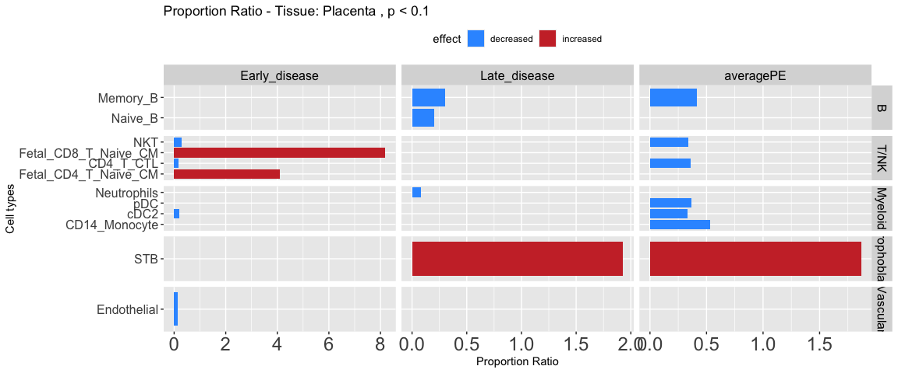
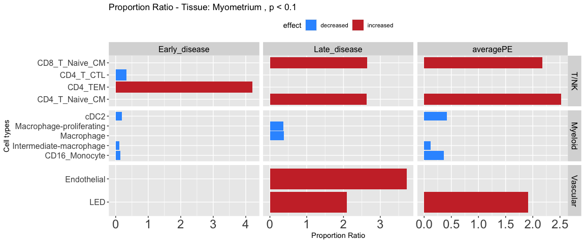
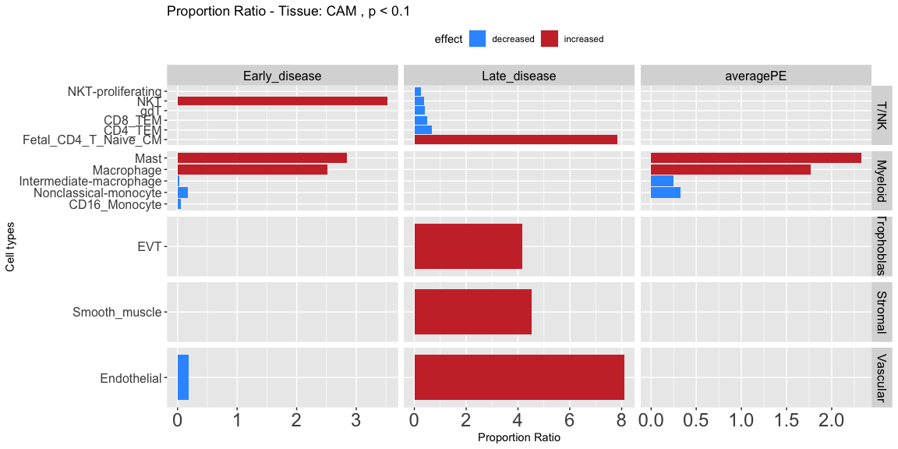
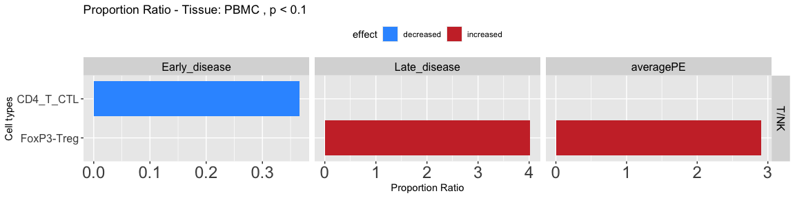

Propeller results - analysis of proportions - plot PropRatio
================
Author: Yara E. Sanchez Corrales
May 27, 2025

## Introduction

In this notebook, I plot a visualisation of the results of the cell
proportion analysis using ‘propeller’. The tissue CAM was profiled using
both single-cell and single-nuclei, so I adjusted the modelling to add
Method as a batch. <br>

Cell types that come from one patient or from only one condition in
either early or late are filtered out.

``` r
library(dplyr)
library(ggplot2)
library(patchwork)
library(cowplot)
library(gridGraphics)
```

``` r
# Directory of propeller results
dir <- "/Users/ysanchez/Documents/Projects-analysis/FMI-sc-all/outputs/propeller_results_20240914/"

annotation_level_l3 <- "CellTypeManual.l3"

# thresholds
p_thr <- 0.1
```

# 1) Tissue: Placenta

``` r
tissue = "Placenta" 
results_placenta <- df_results_per_contrast_tissue(tissue)
```

    ## Joining with `by = join_by(CellTypeManual.l3)`
    ## Joining with `by = join_by(CellTypeManual.l3)`
    ## Joining with `by = join_by(CellTypeManual.l3)`

``` r
head(results_placenta)
```

    ##   CellTypeManual.l3 PropRatio Tstatistic    P.Value       FDR    effect   Tissue  contrast   cellgroup
    ## 1         CD4_T_CTL 0.3616117  -2.705505 0.01536674 0.4446188 decreased Placenta averagePE        T/NK
    ## 2          Memory_B 0.4163680  -2.637205 0.01778475 0.4446188 decreased Placenta averagePE           B
    ## 3               NKT 0.3375598  -2.172180 0.04500178 0.4452963 decreased Placenta averagePE        T/NK
    ## 4               STB 1.8667699   2.088582 0.05285898 0.4452963 increased Placenta averagePE Trophoblast
    ## 5              cDC2 0.3326374  -1.985659 0.06404062 0.4452963 decreased Placenta averagePE     Myeloid
    ## 6     CD14_Monocyte 0.5307733  -1.945953 0.06920104 0.4452963 decreased Placenta averagePE     Myeloid

``` r
p3 <- ggplot(results_placenta, aes(x = CellTypeManual.l3, y= PropRatio, fill = effect)) +
    geom_bar(stat ="identity") + scale_fill_manual(values = c("#3399FF", "#CC3333")) + labs( x = "Cell types", y = "Proportion Ratio") + theme(axis.text.x=element_text(size=18), axis.text.y=element_text(size=12)) + 
  # scale_fill_manual(values = c("#3399FF", "#CC3333")) + 
    ggtitle(paste("Proportion Ratio - Tissue: ",tissue, " , p < ",p_thr,sep=""))

p3 <- p3 + coord_flip() + facet_grid(cellgroup ~ contrast, scales = "free") +  theme(legend.position = "top") + theme(strip.text = element_text( size = 12, color = "black"))
```

``` r
p3
```

<!-- -->

# 2) Tissue: Myometrium

``` r
tissue = "Myometrium" 
results_myo <- df_results_per_contrast_tissue(tissue)
```

    ## Joining with `by = join_by(CellTypeManual.l3)`
    ## Joining with `by = join_by(CellTypeManual.l3)`
    ## Joining with `by = join_by(CellTypeManual.l3)`

``` r
p3
```

<!-- -->

# 3) Tissue: CAM

``` r
tissue = "CAM" 
results_cam <- df_results_per_contrast_tissue(tissue)
```

    ## Joining with `by = join_by(CellTypeManual.l3)`
    ## Joining with `by = join_by(CellTypeManual.l3)`
    ## Joining with `by = join_by(CellTypeManual.l3)`

``` r
head(results_cam)
```

    ##         CellTypeManual.l3 PropRatio Tstatistic      P.Value         FDR    effect Tissue     contrast cellgroup
    ## 1   Nonclassical-monocyte 0.3278338  -2.321208 0.0347679126 0.575674064 decreased    CAM    averagePE   Myeloid
    ## 2              Macrophage 1.7634442   2.233274 0.0413971756 0.575674064 increased    CAM    averagePE   Myeloid
    ## 3                    Mast 2.3262438   1.980565 0.0662846625 0.575674064 increased    CAM    averagePE   Myeloid
    ## 4 Intermediate-macrophage 0.2491600  -1.917800 0.0746244157 0.575674064 decreased    CAM    averagePE   Myeloid
    ## 5             Endothelial 8.1049278   5.278693 0.0000966715 0.005220261 increased    CAM Late_disease  Vascular
    ## 6       NKT-proliferating 0.2513019  -2.718150 0.0160078531 0.201230458 decreased    CAM Late_disease      T/NK

``` r
p3
```

<!-- -->

# 4) Tissue: PBMC

``` r
tissue = "PBMC" # "CAM", "PBMC", 
results_pbmc <- df_results_per_contrast_tissue(tissue)
```

    ## Joining with `by = join_by(CellTypeManual.l3)`
    ## Joining with `by = join_by(CellTypeManual.l3)`
    ## Joining with `by = join_by(CellTypeManual.l3)`

``` r
p4
```

<!-- -->

``` r
sessionInfo()
```

    ## R version 4.3.2 (2023-10-31)
    ## Platform: aarch64-apple-darwin20 (64-bit)
    ## Running under: macOS Sonoma 14.3
    ## 
    ## Matrix products: default
    ## BLAS:   /System/Library/Frameworks/Accelerate.framework/Versions/A/Frameworks/vecLib.framework/Versions/A/libBLAS.dylib 
    ## LAPACK: /Library/Frameworks/R.framework/Versions/4.3-arm64/Resources/lib/libRlapack.dylib;  LAPACK version 3.11.0
    ## 
    ## locale:
    ## [1] en_US.UTF-8/en_US.UTF-8/en_US.UTF-8/C/en_US.UTF-8/en_US.UTF-8
    ## 
    ## time zone: Europe/London
    ## tzcode source: internal
    ## 
    ## attached base packages:
    ## [1] grid      stats     graphics  grDevices utils     datasets  methods   base     
    ## 
    ## other attached packages:
    ## [1] gridGraphics_0.5-1 cowplot_1.1.3      patchwork_1.2.0    ggplot2_3.5.2      dplyr_1.1.4       
    ## 
    ## loaded via a namespace (and not attached):
    ##  [1] vctrs_0.6.5       cli_3.6.5         knitr_1.45        rlang_1.1.6       xfun_0.42         highr_0.10        generics_0.1.3    labeling_0.4.3   
    ##  [9] glue_1.7.0        colorspace_2.1-0  htmltools_0.5.7   scales_1.3.0      fansi_1.0.6       rmarkdown_2.25    munsell_0.5.0     evaluate_0.23    
    ## [17] tibble_3.2.1      fastmap_1.1.1     yaml_2.3.8        lifecycle_1.0.4   compiler_4.3.2    pkgconfig_2.0.3   rstudioapi_0.17.1 farver_2.1.1     
    ## [25] digest_0.6.34     R6_2.5.1          tidyselect_1.2.1  utf8_1.2.4        pillar_1.9.0      magrittr_2.0.3    withr_3.0.1       tools_4.3.2      
    ## [33] gtable_0.3.4


