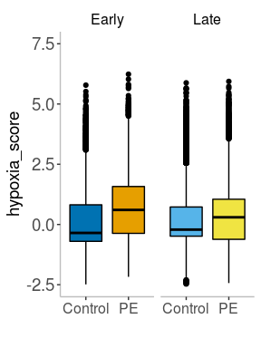
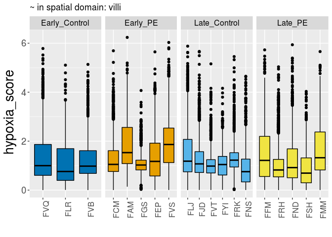

Spatial transcriptomics: Plot hypoxia score per donor in PVBP
================

Author: Yara E. Sanchez Corrales


# Introduction

Here I visualise the hypoxia score calculated per *capture area* for the
tissue PVBP, after normalisation and only for the spatial domain
*villous*. Here the results are integrated into the respective object. <br>

Spatial score calculated using the script:
* source(‘\~/Projects/FMI-all-Spatial-20240312/scripts/spatial\_scores/spatial-hypoxia-score-per-library-20250210.R’)

The hypoxia list is: &gt; hypoxia\_score &lt;- list(c(“HTRA1”, “HTRA4”,
“FSTL3”, “EGLN3”, “TMEM45A”))

``` r
dirsave <- "~/Projects/FMI-all-Spatial-20240312/plots/20250210_Hypoxia_score/"

# results of the score per capture area
dir <- "~/Projects/FMI-all-Spatial-20240312/outputs/Spatial_scores/hypoxia_score/"
```

**Placenta** <br>

``` r
# Add the metadata to the Seurat object
spatial.placenta  <- add_score(seurat_obj = spatial.placenta, file = hypoxia5_placenta, barcode_col = "X", new_metadata_col = "hypoxia1")
spatial.placenta@meta.data$hypoxia5 <- spatial.placenta@meta.data$hypoxia1
spatial.placenta@meta.data$hypoxia_score <- spatial.placenta@meta.data$hypoxia5

#Normalisation
spatial.placenta <- NormalizeData(spatial.placenta, normalization.method = "LogNormalize", scale.factor = 1000000)
```

# Score calculated per capture area

``` r
# hypoxia_score - list of five genes. Save the plot for figure
# call the function
p_villi <- plot_box_plot(spatial.placenta, "villi",hypoxia_score)
p_villi  <- p_villi + ylim(-2.5,7.5)
p_villi
```

<!-- -->

``` r
# call the function - per donor

p2 <- boxplot_gene_donor(spatial.placenta@meta.data, hypoxia_score,colors_conditions2, "villi")
p2
```

<!-- -->

``` r
# Calculate mean score per donor
mean_hypoxia_donor <- spatial.placenta@meta.data %>%
  group_by(donor2) %>%
  summarise(mean_score = mean(hypoxia_score, na.rm = TRUE)) %>%
  ungroup()

# inner_join with the info about condition and gestational age
mean_hypoxia_donor <- mean_hypoxia_donor %>% inner_join(donor.order.condition)

# Print the resulting dataframe
print(mean_hypoxia_donor)
```

    ## # A tibble: 19 × 4
    ##    donor2 mean_score GA_Condition  GA_Cat
    ##    <chr>       <dbl> <chr>         <chr> 
    ##  1 FAM       1.10    Early_PE      Early 
    ##  2 FCM       0.114   Early_PE      Early 
    ##  3 FEP       0.736   Early_PE      Early 
    ##  4 FFM       0.893   Late_PE       Late  
    ##  5 FGS       0.0589  Early_PE      Early 
    ##  6 FJD       0.247   Late_Control  Late  
    ##  7 FLJ       0.425   Late_Control  Late  
    ##  8 FLR       0.237   Early_Control Early 
    ##  9 FMM       1.03    Late_PE       Late  
    ## 10 FND       0.483   Late_PE       Late  
    ## 11 FNS      -0.0475  Late_Control  Late  
    ## 12 FRH       0.169   Late_PE       Late  
    ## 13 FRK      -0.00471 Late_Control  Late  
    ## 14 FSH      -0.194   Late_PE       Late  
    ## 15 FVB       0.0960  Early_Control Early 
    ## 16 FVQ       0.0811  Early_Control Early 
    ## 17 FVS       1.72    Early_PE      Early 
    ## 18 FVT       0.0918  Late_Control  Late  
    ## 19 FYI      -0.125   Late_Control  Late

# Spatial maps for figure

Representative example of hypoxia figures.

``` r
# transparency of the HE image
alpha <- 0.8

# point-size-factor
spotsize <- 1.3
feature_to_plot <- c('hypoxia_score')

# width and lentght for plots
w = 7
h = 7 
  
# limits
l <- c(-2,4)

# Define consistent colors for regions
region_colors <- c(
  "villi" = "#E69F00", # Orange
  "decidua" = "#44AA99", # Teal Green
  "vasculature_intermediate_villi" = "#56B4E9", # Sky Blue
  "fibrin" = "#F0E442", # Yellow
  "muscle" = "#0072B2", # Blue
  "chorion" = "#D55E00", # Red
  "stromal_layer" = "#56B4E9", # Sky Blue
  "background" = "#000000" # Black
)
```

``` r
for (i in 1:length(donors_to_plot)) {
  # print(plots1[[i]])
}
```

``` r
# Export the legend 
p1 <- plots1[[1]] + theme(legend.key.width=unit(3,"cm"),legend.key.height = unit(1.5,"cm"),legend.title=element_text(size=20), legend.text=element_text(size=20) )  #+ theme(legend.title=element_text(size=20), legend.text=element_text(size=20)) + guides(guide_legend(title="IFN-I score"))

# Extract the legend. Returns a gtable
leg <- get_legend(p1)

# Convert to a ggplot and print - ggpubr 
legend <- as_ggplot(leg)
# legend

# ggsave(paste0(dirsave,tissue,"_scale_hypoxia_score_20250320.png"), legend, width=9,height=2, bg = "white",  units = 'in', dpi = 300)
```

``` r
sessionInfo()
```

    ## R version 4.1.1 (2021-08-10)
    ## Platform: x86_64-pc-linux-gnu (64-bit)
    ## Running under: Red Hat Enterprise Linux Server 7.6 (Maipo)
    ## 
    ## Matrix products: default
    ## BLAS:   /apps/R/4.1.1/lib64/R/lib/libRblas.so
    ## LAPACK: /apps/R/4.1.1/lib64/R/lib/libRlapack.so
    ## 
    ## locale:
    ##  [1] LC_CTYPE=en_US.UTF-8       LC_NUMERIC=C               LC_TIME=en_US.UTF-8        LC_COLLATE=en_US.UTF-8    
    ##  [5] LC_MONETARY=en_US.UTF-8    LC_MESSAGES=en_US.UTF-8    LC_PAPER=en_US.UTF-8       LC_NAME=C                 
    ##  [9] LC_ADDRESS=C               LC_TELEPHONE=C             LC_MEASUREMENT=en_US.UTF-8 LC_IDENTIFICATION=C       
    ## 
    ## attached base packages:
    ## [1] stats     graphics  grDevices utils     datasets  methods   base     
    ## 
    ## other attached packages:
    ##  [1] ggpubr_0.4.0       cowplot_1.1.1      paletteer_1.6.0    magrittr_2.0.1     forcats_0.5.1      purrr_1.0.2       
    ##  [7] readr_2.1.1        tidyr_1.1.4        tibble_3.1.6       tidyverse_1.3.1    stringr_1.4.0      ggplot2_3.3.5     
    ## [13] knitr_1.45         patchwork_1.1.1    SeuratObject_4.1.3 Seurat_4.2.1       dplyr_1.0.7       
    ## 
    ## loaded via a namespace (and not attached):
    ##   [1] readxl_1.3.1           backports_1.4.1        plyr_1.8.6             igraph_1.2.11         
    ##   [5] lazyeval_0.2.2         sp_1.5-1               splines_4.1.1          listenv_0.8.0         
    ##   [9] scattermore_0.7        digest_0.6.29          htmltools_0.5.8.1      fansi_1.0.2           
    ##  [13] tensor_1.5             cluster_2.1.2          ROCR_1.0-11            tzdb_0.2.0            
    ##  [17] globals_0.14.0         modelr_0.1.8           matrixStats_0.61.0     spatstat.sparse_3.0-0 
    ##  [21] colorspace_2.0-2       rvest_1.0.2            ggrepel_0.9.1          haven_2.4.3           
    ##  [25] xfun_0.41              prismatic_1.1.2        crayon_1.4.2           jsonlite_1.7.3        
    ##  [29] progressr_0.10.0       spatstat.data_3.0-0    survival_3.2-13        zoo_1.8-9             
    ##  [33] glue_1.6.1             polyclip_1.10-0        gtable_0.3.0           leiden_0.3.9          
    ##  [37] car_3.0-12             future.apply_1.8.1     abind_1.4-5            scales_1.1.1          
    ##  [41] DBI_1.1.2              rstatix_0.7.0          spatstat.random_3.0-1  miniUI_0.1.1.1        
    ##  [45] Rcpp_1.0.8             viridisLite_0.4.0      xtable_1.8-4           reticulate_1.24       
    ##  [49] htmlwidgets_1.5.4      httr_1.4.2             RColorBrewer_1.1-2     ellipsis_0.3.2        
    ##  [53] ica_1.0-2              farver_2.1.0           pkgconfig_2.0.3        uwot_0.1.14           
    ##  [57] dbplyr_2.1.1           deldir_1.0-6           utf8_1.2.2             labeling_0.4.2        
    ##  [61] tidyselect_1.1.1       rlang_1.1.1            reshape2_1.4.4         later_1.3.0           
    ##  [65] munsell_0.5.0          cellranger_1.1.0       tools_4.1.1            cli_3.6.1             
    ##  [69] generics_0.1.1         broom_0.7.11           ggridges_0.5.3         evaluate_0.23         
    ##  [73] fastmap_1.1.1          yaml_2.2.2             goftest_1.2-3          rematch2_2.1.2        
    ##  [77] fs_1.5.2               fitdistrplus_1.1-6     RANN_2.6.1             pbapply_1.5-0         
    ##  [81] future_1.23.0          nlme_3.1-155           mime_0.12              xml2_1.3.3            
    ##  [85] compiler_4.1.1         rstudioapi_0.13        plotly_4.10.0          png_0.1-7             
    ##  [89] ggsignif_0.6.3         spatstat.utils_3.0-1   reprex_2.0.1           stringi_1.7.6         
    ##  [93] highr_0.9              lattice_0.20-45        Matrix_1.5-4.1         vctrs_0.6.5           
    ##  [97] pillar_1.6.5           lifecycle_1.0.4        spatstat.geom_3.0-3    lmtest_0.9-39         
    ## [101] RcppAnnoy_0.0.19       data.table_1.14.2      irlba_2.3.5            httpuv_1.6.5          
    ## [105] R6_2.5.1               promises_1.2.0.1       KernSmooth_2.23-20     gridExtra_2.3         
    ## [109] parallelly_1.30.0      codetools_0.2-18       MASS_7.3-55            assertthat_0.2.1      
    ## [113] withr_2.5.0            sctransform_0.3.5      parallel_4.1.1         hms_1.1.1             
    ## [117] grid_4.1.1             rmarkdown_2.25         carData_3.0-5          Rtsne_0.15            
    ## [121] spatstat.explore_3.0-5 shiny_1.7.1            lubridate_1.8.0
