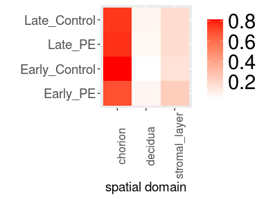
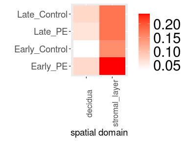

Spatial transcriptomics: SC-CTB nearest neighbours
================

Author: Yara E. Sanchez Corrales 

# Introduction

It looks like the the spots with high value of SC-CTB are neighbouring
the spatial domain “stromal\_layer” rather than the decidua in CAMs.
Here I do a nearest neighbour quantification.

``` r
dirsave <- "~/Projects/FMI-all-Spatial-20240312/plots/20250110_Tropho_decidua_parietalis/"
```

``` r
# Create a list of files to append - the order of the samples is very important.

# Samples LR, PYI and NS got no decidua
list <- c("Visium-F1676VQ-Sp-CD-2",
          "Visium-F1836LR-Sp-CD","Visium-F1836LR-Sp-CD-2",
          "Visium-F1828VB-Sp-CD",

          "Visium-F1678CM-CD-Sp-4-GEX",
          "Visium-F1918AM-CD-sp",
          "Visium-F1686GS-Sp-CD",
          "Visium-F1906EP-CD-sp",
          "Visium-F1756VS-Sp-CD",
        
           "Visium-F1758LJ-Sp-CD",
           "Visium-F1844JD-CD-sp",
           "Visium-F1892VT-Sp-CD",
           "Visium-F1950PYI-CD-sp",
           "Visium-F1958NS-CD-sp",
          "Visium-F1668RK-CD-Sp-4-GEX",
          
          "Visium-F1888FM-Sp-CD",
          "Visium-F1682RH-CD-Sp-4-GEX",
           "Visium-F1974SH-CD-sp",
          "Visium-F1788ND-Sp-CD",
          "Visium-F2026MM-CD-sp")

nsamples <- length(list)

nsamples
```

    ## [1] 20

``` r
# read the object
spatial.1 <- readRDS(file = "~/Projects/FMI-all-Spatial-20240312/objects/FMI-CAM-Spatial-20241120.rds")
# create a new metadata column
spatial.1@meta.data$donor2 <- paste0("F", str_sub(spatial.1@meta.data$donor, start= -2))
# create a composite column with the condition
spatial.1@meta.data$donor.Condition2 <- paste0(spatial.1@meta.data$Condition,"_",spatial.1@meta.data$donor2)

# subset - removing the background
spatial.1 <- subset(spatial.1, subset = regions %in% c("background"), invert = TRUE)
spatial.1
```

    ## An object of class Seurat 
    ## 36601 features across 38151 samples within 1 assay 
    ## Active assay: Spatial (36601 features, 0 variable features)
    ##  19 images present: FVQ.CAM, FLR.CAM, FVB.CAM, FCM.CAM, FAM.CAM, FGS.CAM, FEP.CAM, FVS.CAM, FLJ.CAM, FJD.CAM, FVT.CAM, FYI.CAM, FNS.CAM, FRK.CAM, FFM.CAM, FRH.CAM, FSH.CAM, FND.CAM, FMM.CAM

``` r
# Create a column taking the max abundance of SC-CTB as deconvolved by cell2loc 
c2loc <- spatial.1@meta.data[, grepl("^c2loc_", colnames(spatial.1@meta.data))]

# This is a dataframe with a new column called 'max_celltype' the deconvoluted celltype that holds the maximum value (i.e more abundant)
max_celltype <-  c2loc %>%
  mutate(max_celltype = names(.)[max.col(.)]) %>% select(max_celltype)

# Make a column in called "Barcode"
max_celltype$Barcode <- rownames(max_celltype)
max_celltype <- max_celltype %>% relocate(Barcode)

# Add it as a metadata to the main object
spatial.1 <- AddMetaData(spatial.1, max_celltype)

# Make another column, selecting where SC.CTB is the maximum
# spatial.1@meta.data$SC.CTB_Abundance <- ifelse(spatial.1@meta.data$max_celltype == "c2loc_SC.CTB", "SC.CTB","Other")

 spatial.1@meta.data$SC.CTB_Abundance <- ifelse(spatial.1@meta.data$c2loc_SC.CTB > 3, "SC.CTB","Other")
```

``` r
# How many spots containt SC.CTB as maximium cell type
table(spatial.1@meta.data$SC.CTB_Abundance)
```

    ## 
    ##  Other SC.CTB 
    ##  35362   2789

``` r
# Check where in the object are the coordinates x,y
head(spatial.1@images$FVQ.CAM@coordinates)
```

    ##                    tissue row col imagerow imagecol
    ## AAACAAGTATCTCCCA-1      1  50 102    19631    23084
    ## AAACACCAATAACTGC-1      1  59  19    22644     7340
    ## AAACAGAGCGACTCCT-1      1  14  94     7747    21534
    ## AAACATTTCCCGGATT-1      1  61  97    23266    22144
    ## AAACCCGAACGAAATC-1      1  45 115    17973    25547
    ## AAACCGGAAATGTTAA-1      1  54 124    20941    27263

``` r
# For every cell, return the row indices of its nearest two neighbours. The data[,1:2] corresponds to the CellX and CellY cell coordinates.
nebs = nn2(spatial.1@images$FVQ.CAM@coordinates[,2:3],k=2)[[1]]
# discard column 1 (these will almost always be the cell itself)
nebs = nebs[,2]
head(nebs)
```

    ## [1] 1663 1304 1584  521 1869  328

``` r
# supply these row indices to the dataset to return the phenotypes of the neighbours stored in the column called "cluster"
data <- spatial.1@meta.data %>% filter(Image_name %in% "FVQ.CAM")
nebs = data[nebs,"regions"]

# Add it to the data 
data$nearest_neighbour <- nebs
head(nebs)
```

    ## [1] "chorion"       "chorion"       "stromal_layer" "chorion"       "decidua"       "stromal_layer"

``` r
# filter by the spots that have a max SC.CTB
data <- data %>% filter(SC.CTB_Abundance %in% "SC.CTB")
# subset the nebs by the sport that have max SC.CTB
nebs <- data$nearest_neighbour

nebs = as.matrix(table(data$regions, nebs))
head(nebs)
```

    ##          nebs
    ##           chorion decidua stromal_layer
    ##   chorion      99       7            26

``` r
table(data$regions)
```

    ## 
    ## chorion 
    ##     132

``` r
# Loop through images applying the function nebs_per_image above and append the result into a dataframe

samples <- names(spatial.1@images)
nsamples <- length(samples)

neighbours <- data.frame()
  
for (i in 1:nsamples) {

temp <- nebs_per_image(spatial.1, samples[i])

neighbours <- rbind(neighbours,temp)

}

# it has to be spots: 38151
# head(neighbours)
```

``` r
# Add it as a metadata to the main object
spatial.1 <- AddMetaData(spatial.1, neighbours)

table(spatial.1@meta.data$nearest_neighbour_region)
```

    ## 
    ##       chorion       decidua stromal_layer 
    ##         14838         14258          9055

``` r
# subset by the region = chorion. This is because we are only interested to know the nearest neighbour region of the spots that belong to the chorion
spatial.1 <- subset(spatial.1, subset = regions %in% c("chorion"))

table(spatial.1@meta.data$nearest_neighbour_region)
```

    ## 
    ##       chorion       decidua stromal_layer 
    ##         11447          1299          1814

``` r
# Calculate the proportion of neighbours regions per condition
early_pe_neigh <- neigh_matrix(spatial.1, "Early_PE")
early_pe_neigh <- early_pe_neigh/rowSums(early_pe_neigh) # convert to proportion

early_co_neigh <- neigh_matrix(spatial.1, "Early_Control")
early_co_neigh <- early_co_neigh/rowSums(early_co_neigh) # convert to proportion

late_pe_neigh <- neigh_matrix(spatial.1, "Late_PE")
late_pe_neigh <- late_pe_neigh/rowSums(late_pe_neigh) # convert to proportion

late_co_neigh <- neigh_matrix(spatial.1, "Late_Control")
late_co_neigh <- late_co_neigh/rowSums(late_co_neigh) # convert to proportion

head(early_pe_neigh)
```

    ##          nebs
    ##              chorion    decidua stromal_layer
    ##   chorion 0.69095477 0.07286432    0.23618090

``` r
  # blank out the middle diagonal (since most cells will neighbour themselves - this information is not informative)
# diag(early_pe_neigh) = NA
# diag(early_co_neigh) = NA
# diag(late_pe_neigh) = NA
# diag(late_co_neigh) = NA
# subset the matrix by only the chorion
# nebs <- nebs[1,]

# table
rownames(early_pe_neigh) <- "Early_PE"
rownames(early_co_neigh) <- "Early_Control"

rownames(late_pe_neigh) <- "Late_PE"
rownames(late_co_neigh) <- "Late_Control"


 head(early_pe_neigh)
```

    ##           nebs
    ##               chorion    decidua stromal_layer
    ##   Early_PE 0.69095477 0.07286432    0.23618090

``` r
all_neigh <- rbind(early_pe_neigh,early_co_neigh,late_pe_neigh, late_co_neigh)
all_neigh <- as.table(all_neigh)
all_neigh
```

    ##                  chorion    decidua stromal_layer
    ## Early_PE      0.69095477 0.07286432    0.23618090
    ## Early_Control 0.81557377 0.03278689    0.15163934
    ## Late_PE       0.76385542 0.06265060    0.17349398
    ## Late_Control  0.75123558 0.07413509    0.17462932

``` r
melt(all_neigh)
```

    ##             Var1          Var2      value
    ## 1       Early_PE       chorion 0.69095477
    ## 2  Early_Control       chorion 0.81557377
    ## 3        Late_PE       chorion 0.76385542
    ## 4   Late_Control       chorion 0.75123558
    ## 5       Early_PE       decidua 0.07286432
    ## 6  Early_Control       decidua 0.03278689
    ## 7        Late_PE       decidua 0.06265060
    ## 8   Late_Control       decidua 0.07413509
    ## 9       Early_PE stromal_layer 0.23618090
    ## 10 Early_Control stromal_layer 0.15163934
    ## 11       Late_PE stromal_layer 0.17349398
    ## 12  Late_Control stromal_layer 0.17462932

``` r
plot_nn <-  ggplot(melt(all_neigh)) +
     geom_tile(aes(Var2, Var1,fill=value)) +
     scale_fill_gradient(low="white",high="red") + theme(
      axis.text.x = element_text(angle = 90, size = 12),
      axis.text.y = element_text(size = 14),
      axis.title.x = element_text(size = 14),
      axis.title.y = element_text(size = 14),
      strip.text = element_text(size = 12, color = "black"),
      legend.position = "right",
      legend.text = element_text(size = 22),
      legend.title= element_blank()) +
    labs(x= "spatial domain", y = "")

 plot_nn
```

<!-- -->

``` r
 # ggsave(paste0(dirsave, "all_neighbour_spatial_domain_per_spot_high_SC.CTB_20250122.png"), plot_nn, width=4,height=3, bg = "white",  units = 'in', dpi = 300)
```

``` r
all_neigh2 <- all_neigh[,2:3]

plot_nn2 <-  ggplot(melt(all_neigh2)) +
     geom_tile(aes(Var2, Var1,fill=value)) +
     scale_fill_gradient(low="white",high="red") + theme(
      axis.text.x = element_text(angle = 90, size = 12),
      axis.text.y = element_text(size = 14),
      axis.title.x = element_text(size = 14),
      axis.title.y = element_text(size = 14),
      strip.text = element_text(size = 12, color = "black"),
      legend.position = "right",
      legend.text = element_text(size = 22),
      legend.title= element_blank()) +
    labs(x= "spatial domain", y = "")

 plot_nn2
```

<!-- -->

``` r
 # ggsave(paste0(dirsave, "neighbour_spatial_domain_per_spot_high_SC.CTB_20250122.png"), plot_nn2, width=4,height=3, bg = "white",  units = 'in', dpi = 300)
```

``` r
# now we can melt and plot per condition. There is no difference.

plot_nn_e_co <-  ggplot(melt(early_co_neigh)) +
    geom_tile(aes(Var1,nebs,fill=value)) +
    scale_fill_gradient(low="white",high="red") 

plot_nn_e_pe <-  ggplot(melt(early_pe_neigh)) +
    geom_tile(aes(Var1,nebs,fill=value)) +
    scale_fill_gradient(low="white",high="red") 


plot_nn_l_co <-  ggplot(melt(late_co_neigh)) +
    geom_tile(aes(Var1,nebs,fill=value)) +
    scale_fill_gradient(low="white",high="red") 

plot_nn_l_pe <-  ggplot(melt(late_pe_neigh)) +
    geom_tile(aes(Var1,nebs,fill=value)) +
    scale_fill_gradient(low="white",high="red") 

# plot_nn_e_co + plot_nn_e_pe + plot_nn_l_co + plot_nn_l_pe + plot_layout(ncol = 4)
```

``` r
sessionInfo()
```

    ## R version 4.1.1 (2021-08-10)
    ## Platform: x86_64-pc-linux-gnu (64-bit)
    ## Running under: Red Hat Enterprise Linux Server 7.6 (Maipo)
    ## 
    ## Matrix products: default
    ## BLAS:   /apps/R/4.1.1/lib64/R/lib/libRblas.so
    ## LAPACK: /apps/R/4.1.1/lib64/R/lib/libRlapack.so
    ## 
    ## locale:
    ##  [1] LC_CTYPE=en_US.UTF-8       LC_NUMERIC=C               LC_TIME=en_US.UTF-8        LC_COLLATE=en_US.UTF-8     LC_MONETARY=en_US.UTF-8   
    ##  [6] LC_MESSAGES=en_US.UTF-8    LC_PAPER=en_US.UTF-8       LC_NAME=C                  LC_ADDRESS=C               LC_TELEPHONE=C            
    ## [11] LC_MEASUREMENT=en_US.UTF-8 LC_IDENTIFICATION=C       
    ## 
    ## attached base packages:
    ## [1] stats     graphics  grDevices utils     datasets  methods   base     
    ## 
    ## other attached packages:
    ##  [1] reshape2_1.4.4     RANN_2.6.1         ggExtra_0.10.0     lmerTest_3.1-3     lme4_1.1-27.1      Matrix_1.5-4.1     ggsignif_0.6.3    
    ##  [8] ggpubr_0.4.0       cowplot_1.1.1      paletteer_1.6.0    magrittr_2.0.1     forcats_0.5.1      purrr_1.0.2        readr_2.1.1       
    ## [15] tidyr_1.1.4        tibble_3.1.6       tidyverse_1.3.1    stringr_1.4.0      ggplot2_3.3.5      knitr_1.45         patchwork_1.1.1   
    ## [22] SeuratObject_4.1.3 Seurat_4.2.1       dplyr_1.0.7       
    ## 
    ## loaded via a namespace (and not attached):
    ##   [1] readxl_1.3.1           backports_1.4.1        plyr_1.8.6             igraph_1.2.11          lazyeval_0.2.2         sp_1.5-1              
    ##   [7] splines_4.1.1          listenv_0.8.0          scattermore_0.7        digest_0.6.29          htmltools_0.5.8.1      fansi_1.0.2           
    ##  [13] tensor_1.5             cluster_2.1.2          ROCR_1.0-11            tzdb_0.2.0             globals_0.14.0         modelr_0.1.8          
    ##  [19] matrixStats_0.61.0     spatstat.sparse_3.0-0  colorspace_2.0-2       rvest_1.0.2            ggrepel_0.9.1          haven_2.4.3           
    ##  [25] xfun_0.41              prismatic_1.1.2        crayon_1.4.2           jsonlite_1.7.3         progressr_0.10.0       spatstat.data_3.0-0   
    ##  [31] survival_3.2-13        zoo_1.8-9              glue_1.6.1             polyclip_1.10-0        gtable_0.3.0           leiden_0.3.9          
    ##  [37] car_3.0-12             future.apply_1.8.1     abind_1.4-5            scales_1.1.1           DBI_1.1.2              rstatix_0.7.0         
    ##  [43] spatstat.random_3.0-1  miniUI_0.1.1.1         Rcpp_1.0.8             viridisLite_0.4.0      xtable_1.8-4           reticulate_1.24       
    ##  [49] htmlwidgets_1.5.4      httr_1.4.2             RColorBrewer_1.1-2     ellipsis_0.3.2         ica_1.0-2              farver_2.1.0          
    ##  [55] pkgconfig_2.0.3        uwot_0.1.14            dbplyr_2.1.1           deldir_1.0-6           utf8_1.2.2             labeling_0.4.2        
    ##  [61] tidyselect_1.1.1       rlang_1.1.1            later_1.3.0            munsell_0.5.0          cellranger_1.1.0       tools_4.1.1           
    ##  [67] cli_3.6.1              generics_0.1.1         broom_0.7.11           ggridges_0.5.3         evaluate_0.23          fastmap_1.1.1         
    ##  [73] yaml_2.2.2             goftest_1.2-3          rematch2_2.1.2         fs_1.5.2               fitdistrplus_1.1-6     pbapply_1.5-0         
    ##  [79] future_1.23.0          nlme_3.1-155           mime_0.12              xml2_1.3.3             compiler_4.1.1         rstudioapi_0.13       
    ##  [85] plotly_4.10.0          png_0.1-7              spatstat.utils_3.0-1   reprex_2.0.1           stringi_1.7.6          highr_0.9             
    ##  [91] lattice_0.20-45        nloptr_1.2.2.3         vctrs_0.6.5            pillar_1.6.5           lifecycle_1.0.4        spatstat.geom_3.0-3   
    ##  [97] lmtest_0.9-39          RcppAnnoy_0.0.19       data.table_1.14.2      irlba_2.3.5            httpuv_1.6.5           R6_2.5.1              
    ## [103] promises_1.2.0.1       KernSmooth_2.23-20     gridExtra_2.3          parallelly_1.30.0      codetools_0.2-18       boot_1.3-28           
    ## [109] MASS_7.3-55            assertthat_0.2.1       withr_2.5.0            sctransform_0.3.5      parallel_4.1.1         hms_1.1.1             
    ## [115] grid_4.1.1             minqa_1.2.4            rmarkdown_2.25         carData_3.0-5          Rtsne_0.15             spatstat.explore_3.0-5
    ## [121] numDeriv_2016.8-1.1    shiny_1.7.1            lubridate_1.8.0

``` r
# rmarkdown::render("/home/ssd/ysanchez/Projects/FMI-all-Spatial-20240312/scripts/cell2loc-results/spatial-cell2loc-CAM-NN-SC-CTB.Rmd", output_file= paste('/home/ssd/ysanchez/Projects/FMI-all-Spatial-20240312/notebooks-html/spatial-cell2loc-CAM-NN-SC-CTB.',Sys.Date(),'.html', sep=''))

# rmarkdown::render(
#   input = "/home/ssd/ysanchez/Projects/FMI-all-Spatial-20240312/scripts/github_repository/12_neighbourhoods_spatial_domains/01_spatial-cell2loc-CAM-NN-SC-CTB.Rmd",
#   output_format = "github_document",
# # output_dir = "home/ssd/ysanchez/Projects/FMI-all-Spatial-20240312/scripts/github_repository/09_spatial_score/",
# output_file = paste0("/home/ssd/ysanchez/Projects/FMI-all-Spatial-20240312/scripts/github_repository//12_neighbourhoods_spatial_domains/01_spatial-cell2loc-CAM-NN-SC-CTB-", Sys.Date(), ".md"),
# )
```
